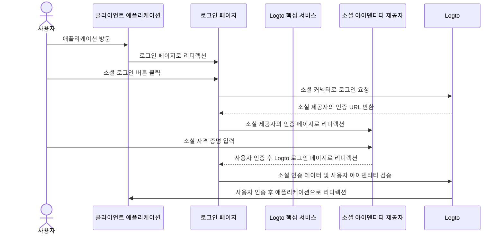
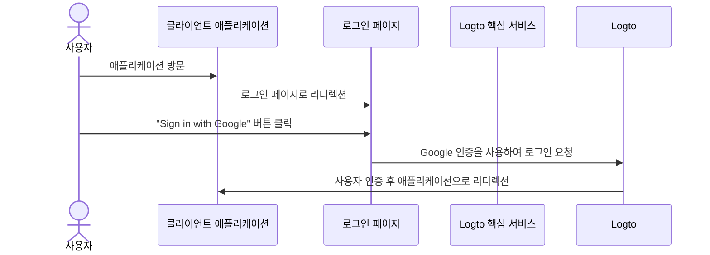

import signInSocialLinkingImage from '@site/docs/end-user-flows/sign-up-and-sign-in/assets/sign-in-social-linking.png';
import socialSignInEnableGoogleOneTabImage from '@site/docs/end-user-flows/sign-up-and-sign-in/assets/social-sign-in-enable-google-one-tab.png';

# 소셜 로그인

소셜 로그인은 사용자가 Google, Facebook, Twitter, LinkedIn과 같은 기존 소셜 미디어 계정을 사용하여 로그인하고 가입할 수 있게 하는 널리 사용되는 인증 (Authentication) 방법입니다.

소셜 로그인 혜택:

- **간소화된 온보딩 과정**: 소셜 로그인을 통해 사용자는 새 계정을 만들거나 다른 비밀번호를 기억할 필요 없이 한 번의 클릭으로 가입하거나 로그인할 수 있습니다. 이는 마찰을 줄이고 사용자 참여를 높입니다.
- **신뢰와 보안 증가**: Google이나 Facebook과 같은 신뢰할 수 있는 플랫폼을 활용함으로써 사용자는 애플리케이션에 더 많은 신뢰를 느낍니다.
- **사용자 데이터 강화**: 소셜 로그인을 통해 소셜 플랫폼에서 이름, 이메일 주소, 프로필 사진 등 추가 프로필 정보를 수집할 수 있습니다.

## 소셜 로그인 구현 \{#implement-social-sign-in}

1. **소셜 커넥터 구성**:<br/>
   <CloudLink to="/connectors/social">Console > Connectors > Social connectors</CloudLink>로
   이동합니다. "Add Social Connector" 버튼을 클릭하고 추가하려는 소셜 커넥터 (예: Google, Github)를
   찾습니다. [소셜 커넥터](/connectors/social-connectors/) 추가에 대한 자세한 지침은 문서를
   참조하세요.
2. **소셜 로그인 버튼 추가**:<br/>
   기본적으로 새로 추가된 소셜 커넥터는 최종 사용자 로그인 페이지에 표시되지 않습니다. 로그인 페이지에 소셜 로그인 버튼을 추가하려면 로그인 경험 설정에서 소셜 커넥터를 활성화해야 합니다.

   <CloudLink to="/sign-in-experience/sign-up-and-sign-in">
     Console > Sign-in experience > Sign-up and sign-in
   </CloudLink>
   으로 이동합니다. "Add social connector" 버튼을 클릭하여 가입 및 로그인 페이지에 소셜 로그인
   버튼을 통합합니다. 드래그 앤 드롭을 사용하여 UI에서 순서를 조정하세요.

3. **계정 연결 옵션 설정**:<br/>
   [소셜 아이덴티티](/user-management/user-data#social-identities)로 가입하는 신규 사용자에게 Logto는 소셜 계정을 Logto 시스템 내의 기존 이메일 또는 전화번호 계정에 연결할 수 있도록 합니다. 기본적으로, 소셜 가입 중 사용자에게 관련 [계정 연결](#account-linking) 페이지가 표시되어 소셜 계정을 기존 계정에 연결하거나 새 계정을 만들 수 있습니다.

   이 과정을 간소화하려면 로그인 경험 설정에서 **자동 계정 연결** 옵션을 활성화할 수 있습니다. 이메일 또는 전화번호가 일치하면 소셜 계정이 자동으로 기존 계정에 연결됩니다.

4. **변경 사항 저장**: <br/>
   변경 사항을 주의 깊게 검토하고 구성을 적용하기 위해 저장합니다.

## 소셜 로그인 사용자 경험 \{#user-experience-of-social-sign-in}

소셜 로그인을 통해 Logto의 가입 및 로그인 과정이 사용자에게 간소화됩니다.



1. **소셜로 로그인**: 사용자가 로그인 페이지에 표시된 소셜 로그인 버튼을 클릭합니다.
2. **리디렉션**: 사용자가 소셜 아이덴티티 제공자의 인증 페이지로 리디렉션됩니다.
3. **소셜 인증**: 사용자가 소셜 자격 증명을 입력하고 소셜 제공자와 인증합니다. 사용자가 이미 소셜 제공자에 로그인되어 있는 경우 자동으로 인증될 수 있습니다. 여러 로그인 세션이 감지되면 사용자는 올바른 계정을 선택하라는 메시지를 받을 수 있습니다 (예: 여러 Google 계정).
   :::note
   Google "prompt" 매개변수는 Google 커넥터에서 설정할 수 있으며, Google 로그인에 대한 계정 선택 및 동의 화면 사용자 경험을 사용자 정의할 수 있습니다.
   :::
4. **Logto로 돌아가기**: 인증이 성공하면 소셜 제공자가 인증 데이터를 가지고 사용자를 Logto 로그인 페이지로 리디렉션합니다.
5. **소셜 아이덴티티 검증**: Logto는 소셜 인증 데이터 및 사용자 아이덴티티를 검증합니다. 소셜 아이덴티티와 관련된 사용자 계정이 없는 경우 새 계정이 생성됩니다.
6. **사용자 인증**: Logto는 사용자를 인증하고 클라이언트 애플리케이션으로 리디렉션하여 인증 과정을 완료합니다.

### Google One-tap \{#google-one-tap}

Logto는 Google 커넥터에 대해 [Google One-tap](https://developers.google.com/identity/gsi/web/guides/features) 로그인 방법도 지원하여 사용자가 한 번의 클릭으로 로그인할 수 있도록 합니다. 이 기능은 사용자가 Google 인증 페이지로 리디렉션될 필요 없이 로그인 과정을 더욱 간소화합니다.

Google One-tap 로그인을 활성화하려면 [Google 커넥터](/integrations/google) 설정의 지침을 따르세요. 활성화되면 사용자가 로그인 페이지에 도착할 때 "Sign in with Google" 팝업이 표시됩니다. 사용자가 이를 클릭하면 Google 계정으로 자동 인증되고 애플리케이션으로 리디렉션됩니다.




## 계정 연결 \{#account-linking}

앞서 언급했듯이, Logto는 사용자가 소셜 계정을 Logto 시스템 내의 기존 이메일 또는 전화번호 계정에 연결할 수 있도록 합니다. 이 과정은 다양한 인증 (Authentication) 방법 및 아이덴티티 제공자 간에 통합된 사용자 계정을 유지하는 데 필수적입니다.

- **새 계정 생성**:
  사용자가 Logto 시스템에 존재하지 않는 [소셜 아이덴티티](/user-management/user-data#social-identities)로 로그인하고 제공된 이메일 또는 전화번호가 기존 사용자 계정과 일치하지 않는 경우, Logto에 새 계정이 직접 생성됩니다.
- **기존 계정 연결**:
  소셜 아이덴티티가 제공한 이메일 또는 전화번호가 이미 Logto의 기존 계정과 연결되어 있는 경우, 유연한 계정 연결 과정을 제공합니다.

  - **자동 계정 연결**: <CloudLink to="/sign-in-experience/sign-up-and-sign-in">Sign-in experience</CloudLink> 설정에서 "자동 계정 연결" 옵션이 활성화된 경우, Logto는 일치하는 이메일 또는 전화번호를 기반으로 소셜 계정을 기존 계정에 자동으로 연결합니다. 사용자는 계정을 연결하라는 메시지를 받지 않으며 즉시 기존 계정에 로그인됩니다. 소셜 계정이 연결되어 사용자가 이후에 두 가지 방법 중 하나를 사용하여 로그인할 수 있습니다.
  - **수동 계정 연결**: "자동 계정 연결" 옵션이 비활성화된 경우, 사용자는 로그인 과정에서 소셜 계정을 기존 계정에 연결하라는 메시지를 받습니다. 사용자는 계정을 연결하거나 새 계정을 만들 수 있습니다.

    

    ```mermaid
    flowchart TD
    A[소셜 아이덴티티로 인증] --> B{{Logto에 소셜 아이덴티티가 존재합니까?}}
    B -- 예 --> C[기존 계정으로 로그인]
    B -- 아니오 --> D{{이메일/전화번호가 기존 계정과 일치합니까?}}
    D -- 예 --> E{{자동 계정 연결이 활성화되어 있습니까?}}
    E -- 예 --> G[소셜 아이덴티티를 기존 계정에 연결]
    G --> C
    D -- 아니오 --> H[새 계정 생성 및 로그인]
    E -- 아니오 --> I{{소셜 계정을 연결합니까?}}
    I -- 예 --> G
    I -- 아니오 --> H
    ```

:::note
소셜 가입 과정에서 이메일 또는 전화번호가 기존 계정과 일치하는 관련 계정이 발견되고 사용자가 계정을 연결하지 않기로 선택한 경우, 이메일 또는 전화번호는 Logto의 새 계정에 동기화되지 않습니다. 이는 모든 사용자 계정에서 이메일과 전화번호가 고유하게 유지되도록 보장합니다.

이메일 또는 전화번호가 필수 가입 식별자인 경우, 사용자는 가입 과정에서 다른 이메일 또는 전화번호를 제공하라는 메시지를 받게 됩니다. 자세한 내용은 [추가 사용자 프로필 수집](#collect-additional-user-profile-data)을 참조하세요.
:::

## 추가 사용자 프로필 데이터 수집 \{#collect-additional-user-profile-data}

소셜 가입 과정에서, 설정한 필수 가입 식별자 (**이메일 주소**, **전화번호** 및 **사용자 이름**)에 따라 사용자는 소셜 제공자와 인증을 받은 후 가입 또는 가입 과정을 완료하기 위해 추가로 검증된 정보를 제공하라는 메시지를 받을 수 있습니다.

예를 들어, **이메일 주소**가 가입 식별자로 설정된 경우:

1. **검증된 이메일 주소를 제공하는 소셜 아이덴티티로 가입**

   소셜 아이덴티티가 검증된 이메일 주소를 제공하는 경우, 사용자는 소셜 아이덴티티로 자동 가입되며 이메일 주소는 사용자 프로필에 동기화됩니다.

2. **검증된 이메일 주소를 제공하지 않는 소셜 아이덴티티로 가입**

   소셜 아이덴티티가 검증된 이메일 주소를 제공하지 않는 경우, 사용자는 가입 과정에서 이메일 주소를 제공하라는 메시지를 받습니다. 사용자는 제공된 이메일 주소로 전송된 인증 코드를 입력하여 이메일 주소를 검증해야 합니다.

   ```mermaid
   flowchart TD
      A[소셜 아이덴티티로 인증] --> B{{이메일 주소가 필요하고 누락되었습니까?}}
      B -- 예 --> C[이메일 주소 입력]
      C --> D[인증 코드 입력]
      D --> E[가입 성공]
      B -- 아니오 --> E
   ```

3. **등록된 이메일 주소를 제공하는 소셜 아이덴티티로 가입**

   소셜 아이덴티티가 Logto 시스템에 이미 등록된 이메일 주소를 제공하는 경우, 사용자는 소셜 계정을 기존 계정에 연결하거나 새 계정을 만들라는 메시지를 받습니다. 사용자가 새 계정을 만들기로 선택하면 새 이메일 주소를 제공하고 이를 검증하라는 메시지를 받습니다.

   ```mermaid
      flowchart TD
       A[소셜 아이덴티티로 인증] --> B{{이메일 주소가 기존 계정과 일치합니까?}}
       B -- 예 --> C{{소셜 계정을 연결합니까?}}
       C -- 예 --> D[소셜 아이덴티티를 기존 계정에 연결]
       D --> E[로그인 성공]
       C -- 아니오 --> F[새 이메일 주소 입력]
       F --> G[인증 코드 입력]
       G --> E
       B -- 아니오 --> E
   ```

## 자주 묻는 질문 \{#faqs}

<details>
  <summary>

### 내 웹사이트에 소셜 로그인 버튼을 추가하고 소셜로 직접 로그인하려면 어떻게 해야 하나요? \{#how-to-add-social-login-buttons-and-directly-sign-in-with-social-on-my-website}

</summary>

Logto는 웹사이트에 소셜 로그인 버튼을 추가하고 기본 로그인 양식을 표시하지 않고 소셜 로그인 과정을 직접 시작할 수 있도록 합니다. 자세한 지침은 [직접 로그인](/end-user-flows/authentication-parameters/direct-sign-in/) 가이드를 확인하세요.

</details>

<details>
  <summary>

### 소셜로 가입한 후 이메일이나 전화번호가 채워지지 않는 이유는 무엇인가요? \{#why-my-emails-or-phone-numbers-are-not-populated-after-signing-up-with-social}

</summary>

Logto에서는 이메일 주소와 전화번호를 사용자 고유 식별자로 사용할 수 있습니다. 인증된 이메일 주소와 전화번호만 식별자로 허용됩니다. 소셜 아이덴티티가 `email_verified` 또는 `phone_number_verified` 클레임을 제공하지 않는 경우, 이메일 주소나 전화번호는 사용자 프로필에 동기화되지 않습니다. 여전히 사용자 프로필의 소셜 아이덴티티 데이터에서 이를 찾을 수 있습니다.

인증되지 않은 이메일 또는 전화번호를 사용자 프로필로 지원하는 기능은 곧 제공될 예정입니다.

</details>

## 관련 리소스 \{#related-resources}

<Url href="https://www.youtube.com/watch?v=sv60N9eW8Ew">소셜 로그인 경험</Url>

<Url href="https://blog.logto.io/maximize-google-sign-in-conversions">
  6가지 설정으로 Google 로그인 전환 최대화
</Url>
