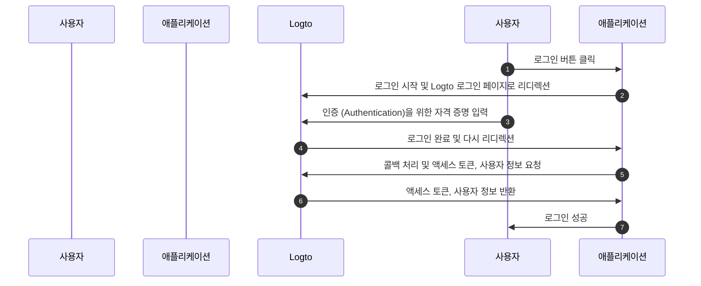
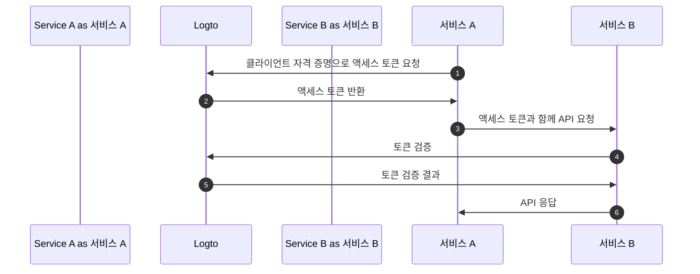
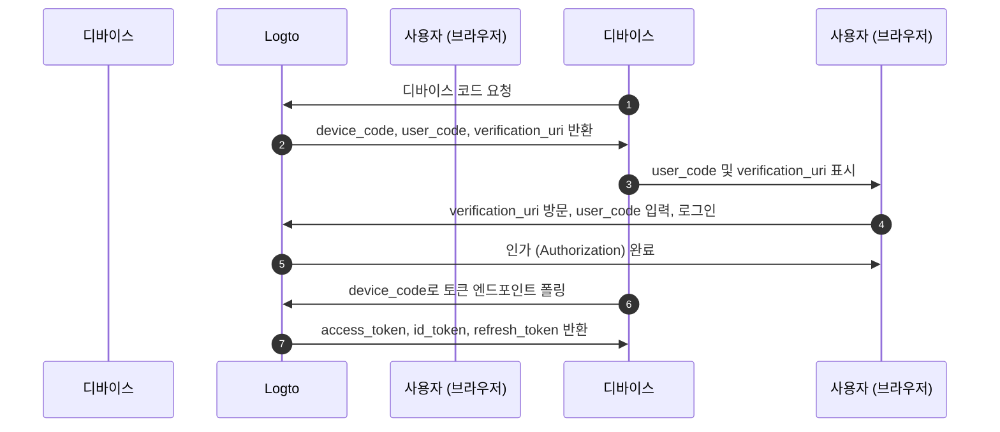
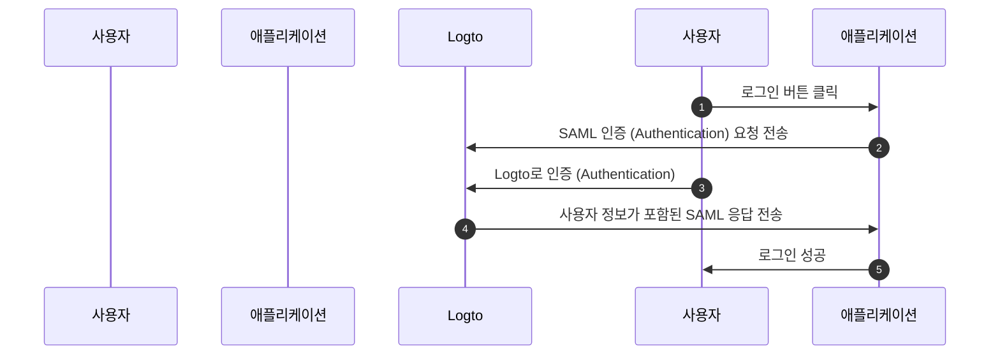

# OIDC 인증 (Authentication) 플로우 이해하기

Logto는 [OAuth 2.0](https://auth.wiki/oauth-2.0) 및 [OpenID Connect (OIDC)](https://auth.wiki/openid-connect) 표준을 기반으로 구축되었습니다. 이러한 인증 (Authentication) 표준을 이해하면 통합 과정이 더 원활하고 직관적으로 진행됩니다.

### 사용자 인증 (Authentication) 플로우 \{#user-authentication-flow}

사용자가 Logto로 로그인할 때 다음과 같은 과정이 진행됩니다:

```mermaid
sequenceDiagram
    autonumber
    participant User as 사용자
    participant Application as 애플리케이션
    participant Logto

    사용자->>애플리케이션: 로그인 버튼 클릭
    애플리케이션->>Logto: 로그인 시작 및 Logto 로그인 페이지로 리디렉션
    사용자->>Logto: 인증 (Authentication)을 위한 자격 증명 입력
    Logto->>애플리케이션: 로그인 완료 및 다시 리디렉션
    애플리케이션->>Logto: 콜백 처리 및 액세스 토큰, 사용자 정보 요청
    Logto->>애플리케이션: 액세스 토큰, 사용자 정보 반환
    애플리케이션->>사용자: 로그인 성공
```

이 플로우에서 통합 과정에 필수적인 몇 가지 핵심 개념이 있습니다:

- `애플리케이션`: Logto에서 귀하의 앱을 의미합니다. 실제 애플리케이션과 Logto 서비스를 연결하기 위해 Logto 콘솔에서 애플리케이션 구성을 생성해야 합니다. 자세한 내용은 [애플리케이션](/integrate-logto/application-data-structure/#introduction)을 참고하세요.
- `Redirect URI`: 사용자가 Logto 로그인 페이지에서 인증 (Authentication)을 완료하면, Logto는 이 URI를 통해 사용자를 다시 애플리케이션으로 리디렉션합니다. 애플리케이션 설정에서 Redirect URI를 구성해야 합니다. 자세한 내용은 [Redirect URIs](/integrate-logto/application-data-structure/#redirect-uris)를 참고하세요.
- `로그인 콜백 처리`: Logto가 사용자를 다시 애플리케이션으로 리디렉션할 때, 애플리케이션은 인증 (Authentication) 데이터를 처리하고 액세스 토큰 및 사용자 정보를 요청해야 합니다. 걱정하지 마세요 - Logto SDK가 이를 자동으로 처리합니다.

이 개요는 빠른 통합을 위한 필수 사항을 다룹니다. 더 깊이 이해하고 싶다면 [로그인 경험 설명](/concepts/sign-in-experience/) 가이드를 참고하세요.

### 기계 간 (M2M) 인증 (Authentication) 플로우 \{#machine-to-machine-authentication-flow}

Logto는 [기계 간 (M2M) 애플리케이션](/quick-starts/m2m) 유형을 제공하여, [OAuth 2.0 클라이언트 자격 증명 플로우](https://auth.wiki/client-credentials-flow)를 기반으로 서비스 간 직접 인증 (Authentication)을 가능하게 합니다:

```mermaid
sequenceDiagram
    autonumber
    participant Service A as 서비스 A
    participant Logto
    participant Service B as 서비스 B

    서비스 A->>Logto: 클라이언트 자격 증명으로 액세스 토큰 요청
    Logto->>서비스 A: 액세스 토큰 반환
    서비스 A->>서비스 B: 액세스 토큰과 함께 API 요청
    서비스 B->>Logto: 토큰 검증
    Logto->>서비스 B: 토큰 검증 결과
    서비스 B->>서비스 A: API 응답
```

이 기계 간 (M2M) 인증 (Authentication) 플로우는 사용자 상호작용 없이 리소스와 직접 통신해야 하는 애플리케이션(따라서 UI가 없음)에 적합합니다. 예를 들어, Logto에서 사용자 데이터를 업데이트하는 API 서비스나 일일 주문을 가져오는 통계 서비스 등이 있습니다.

이 플로우에서 서비스는 클라이언트 자격 증명, 즉 [애플리케이션 ID](/integrate-logto/application-data-structure/#application-id)와 [애플리케이션 시크릿](/integrate-logto/application-data-structure/#application-secret)의 조합을 사용하여 고유하게 식별 및 인증 (Authentication)됩니다. 이 자격 증명은 Logto에서 [액세스 토큰](https://auth.wiki/access-token)을 요청할 때 서비스의 아이덴티티 역할을 합니다.

### 디바이스 플로우 (입력 제한 디바이스) \{#device-flow}

입력 기능이 제한된 디바이스(예: 스마트 TV, 게임 콘솔, CLI 도구, IoT 디바이스)를 위해 Logto는 [OAuth 2.0 디바이스 인증 (Authentication) 그랜트](https://auth.wiki/device-flow)를 지원합니다. 디바이스는 코드와 URL을 표시하고, 사용자는 별도의 브라우저가 있는 디바이스에서 인증 (Authentication)을 완료합니다:

```mermaid
sequenceDiagram
    autonumber
    participant Device as 디바이스
    participant Logto
    participant User as 사용자 (브라우저)

    디바이스->>Logto: 디바이스 코드 요청
    Logto->>디바이스: device_code, user_code, verification_uri 반환
    디바이스->>사용자 (브라우저): user_code 및 verification_uri 표시
    사용자 (브라우저)->>Logto: verification_uri 방문, user_code 입력, 로그인
    Logto->>사용자 (브라우저): 인가 (Authorization) 완료
    디바이스->>Logto: device_code로 토큰 엔드포인트 폴링
    Logto->>디바이스: access_token, id_token, refresh_token 반환
```

이 플로우에서:

- 디바이스는 Logto에 디바이스 코드를 요청하고, 짧은 `user_code`와 `verification_uri`를 받습니다.
- 사용자는 다른 디바이스(휴대폰, 노트북 등)에서 인증 (Authentication) URL에 접속하여 코드를 입력하고 로그인합니다.
- 디바이스는 사용자가 인가 (Authorization)를 완료할 때까지 토큰 엔드포인트를 폴링하고, 완료되면 토큰을 받습니다.

표준 사용자 플로우와 달리, 디바이스 플로우는 디바이스 자체에 Redirect URI나 브라우저 기능이 필요하지 않습니다. 자세한 내용은 [디바이스 플로우 빠른 시작](/quick-starts/device-flow)을 참고하세요.

### SAML 인증 (Authentication) 플로우 \{#saml-authentication-flow}

OAuth 2.0 및 OIDC 외에도, Logto는 SAML (Security Assertion Markup Language) 인증 (Authentication)도 지원하여, 아이덴티티 제공자 (IdP)로서 엔터프라이즈 애플리케이션과의 통합을 가능하게 합니다. 현재 Logto는 SP-initiated 인증 (Authentication) 플로우를 지원합니다:

#### SP-initiated 플로우 \{#saml-authentication-flow-sp-init}

SP-initiated 플로우에서는 인증 (Authentication) 과정이 서비스 제공자(귀하의 애플리케이션)에서 시작됩니다:

```mermaid
sequenceDiagram
    autonumber
    participant User as 사용자
    participant Application as 애플리케이션
    participant Logto

    사용자->>애플리케이션: 로그인 버튼 클릭
    애플리케이션->>Logto: SAML 인증 (Authentication) 요청 전송
    사용자->>Logto: Logto로 인증 (Authentication)
    Logto->>애플리케이션: 사용자 정보가 포함된 SAML 응답 전송
    애플리케이션->>사용자: 로그인 성공
```

이 플로우에서:

- 사용자가 귀하의 애플리케이션(서비스 제공자)에서 인증 (Authentication) 과정을 시작합니다.
- 애플리케이션이 SAML 요청을 생성하여 사용자를 Logto(아이덴티티 제공자)로 리디렉션합니다.
- Logto에서 인증 (Authentication)이 성공하면, SAML 응답이 다시 애플리케이션으로 전송됩니다.
- 애플리케이션이 SAML 응답을 처리하여 인증 (Authentication)을 완료합니다.

#### IdP-initiated 플로우 \{#saml-authentication-flow-idp-init}

Logto는 향후 릴리즈에서 IdP-initiated 플로우를 지원할 예정이며, 사용자가 Logto 포털에서 직접 인증 (Authentication) 과정을 시작할 수 있게 됩니다. 이 기능에 대한 업데이트를 기대해 주세요.

이 SAML 통합을 통해 엔터프라이즈 애플리케이션은 Logto를 아이덴티티 제공자 (IdP)로 활용할 수 있으며, 최신 및 레거시 SAML 기반 서비스 제공자를 모두 지원합니다.

## 관련 리소스 \{#related-resources}

<Url href="https://blog.logto.io/secure-cloud-apps-with-oauth-and-openid-connect">
  블로그: OAuth 2.0 및 OpenID Connect로 클라우드 기반 애플리케이션 보호하기
</Url>

<Url href="https://blog.logto.io/sso-is-better">
  여러 애플리케이션을 위한 싱글 사인온 (SSO)이 더 나은 이유
</Url>

<Url href="https://blog.logto.io/centralized-identity-system">
  다중 앱 비즈니스를 위한 중앙 집중식 아이덴티티 시스템이 필요한 이유
</Url>
