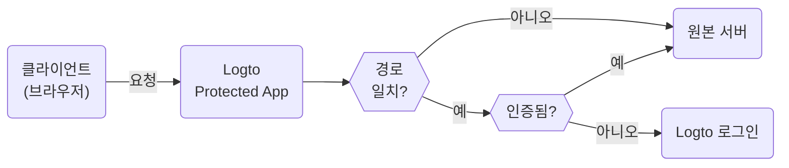

# Protected App — Non-SDK 인증 (Authentication) 통합

Protected App은 [인증 (Authentication)](https://auth.wiki/authentication) 레이어를 애플리케이션에서 분리하여 [SDK 통합](/quick-starts)의 복잡성을 제거하도록 설계되었습니다. 우리는 인증을 처리하여 여러분이 핵심 기능에 집중할 수 있도록 합니다. 사용자가 인증되면, Protected App은 서버에서 콘텐츠를 제공합니다.

## Protected App의 작동 방식 \{#how-protected-app-works}

Cloudflare로 구동되는 Protected App은 전 세계 엣지 네트워크에서 작동하여 애플리케이션에 낮은 대기 시간과 높은 가용성을 보장합니다.

Protected App은 세션 상태와 사용자 정보를 유지합니다. 사용자가 인증되지 않은 경우, Protected App은 로그인 페이지로 리디렉션합니다. 인증이 완료되면, Protected App은 사용자의 요청을 인증 및 사용자 정보와 함께 래핑하여 원본 서버로 전달합니다.

이 과정은 다음 흐름도에서 시각화됩니다:



## 원본 서버 보호 \{#protect-your-origin-server}

원본 서버는 Logto의 Protected App이 소유하지 않은 물리적 또는 가상 장치일 수 있으며, 애플리케이션 콘텐츠가 위치하는 곳입니다. 콘텐츠 전송 네트워크 (CDN) 서버와 유사하게, Protected App은 인증 프로세스를 관리하고 원본 서버에서 콘텐츠를 가져옵니다. 따라서 사용자가 원본 서버에 직접 접근할 수 있게 되면, 인증을 우회할 수 있으며 애플리케이션이 더 이상 보호되지 않습니다.

따라서 원본 연결을 보호하는 것이 중요하며, 이는 공격자가 인증 없이 원본 서버를 발견하고 접근하는 것을 방지합니다. 이를 수행하는 방법은 여러 가지가 있습니다:

1. HTTP 헤더 검증
2. JSON Web Tokens (JWT) 검증

### HTTP 헤더 검증 \{#http-header-validation}

원본 서버를 보호하는 방법 중 하나는 [HTTP Basic Authentication](https://developer.mozilla.org/en-US/docs/Web/HTTP/Authentication#basic_authentication_scheme)을 사용하는 것입니다.

Protected App에서의 각 요청에는 다음 헤더가 포함됩니다:

```
Authorization: Basic base64(appId:appSecret)
```

이 헤더를 검증함으로써 요청이 Protected App에서 온 것임을 확인하고 이 헤더가 포함되지 않은 요청을 거부할 수 있습니다.

Nginx 또는 Apache를 사용하는 경우, 원본 서버에서 HTTP Basic Authentication을 구현하는 방법에 대한 다음 가이드를 참조할 수 있습니다:

1. Nginx: [HTTP Basic Authentication 구성](https://docs.nginx.com/nginx/admin-guide/security-controls/configuring-http-basic-authentication/)
2. Apache: [인증 및 인가](https://httpd.apache.org/docs/2.4/howto/auth.html)

애플리케이션 내에서 헤더를 확인하려면, Cloudflare에서 제공하는 [HTTP Basic Authentication 예제](https://developers.cloudflare.com/workers/examples/basic-auth/)를 참조하여 HTTP Basic 스키마를 사용하여 접근을 제한하는 방법을 배우세요.

### JSON Web Tokens (JWT) 검증 \{#json-web-tokens-jwt-validation}

원본 서버를 보호하는 또 다른 방법은 JSON Web Tokens (JWT)를 사용하는 것입니다.

Protected App에서의 각 인증된 요청에는 다음 헤더가 포함됩니다:

```
Logto-ID-Token: <JWT>
```

JWT는 Logto에 의해 서명된 [ID 토큰](https://auth.wiki/id-token)으로 사용자 정보를 포함합니다. 이 JWT를 검증함으로써 요청이 Protected App에서 온 것임을 확인하고 이 헤더가 포함되지 않은 요청을 거부할 수 있습니다.

토큰은 [JWS](https://auth.wiki/jws) 토큰으로 암호화되고 서명됩니다.

검증 단계:

1. [JWT 검증](https://datatracker.ietf.org/doc/html/rfc7519#section-7.2)
2. [JWS 서명 검증](https://datatracker.ietf.org/doc/html/rfc7515#section-5.2)
3. 토큰의 발급자는 `https://<your-logto-domain>/oidc` (여러분의 Logto 인증 서버에 의해 발급됨)

```js
const express = require('express');
const jwksClient = require('jwks-rsa');
const jwt = require('jsonwebtoken');

const ISSUER = 'https://<your-logto-domain>/oidc';
const CERTS_URL = 'https://<your-logto-domain>/oidc/jwks';

const client = jwksClient({
  jwksUri: CERTS_URL,
});

const getKey = (header, callback) => {
  client.getSigningKey(header.kid, function (err, key) {
    callback(err, key?.getPublicKey());
  });
};

const verifyToken = (req, res, next) => {
  const token = req.headers['Logto-ID-Token'];

  // 들어오는 요청에 토큰 헤더가 있는지 확인
  if (!token) {
    return res
      .status(403)
      .send({ status: false, message: '필수 Logto-ID-Token 헤더가 누락되었습니다' });
  }

  jwt.verify(token, getKey, { issuer: ISSUER }, (err, decoded) => {
    if (err) {
      return res.status(403).send({ status: false, message: '유효하지 않은 ID 토큰' });
    }

    req.user = decoded;
    next();
  });
};

const app = express();

app.use(verifyToken);

app.get('/', (req, res) => {
  res.send('Hello World!');
});

app.listen(3000);
```

## 인증 상태 및 사용자 정보 가져오기 \{#get-authentication-state-and-user-information}

애플리케이션에 대한 인증 및 사용자 정보를 가져와야 하는 경우, `Logto-ID-Token` 헤더를 사용할 수 있습니다.

토큰을 디코딩하기만 원한다면, 다음 코드를 사용할 수 있습니다:

```js
const express = require('express');

const decodeIdToken = (req, res, next) => {
  const token = req.headers['Logto-ID-Token'];

  if (!token) {
    return res.status(403).send({
      status: false,
      message: '필수 Logto-ID-Token 헤더가 누락되었습니다',
    });
  }

  const parts = token.split('.');
  if (parts.length !== 3) {
    throw new Error('유효하지 않은 ID 토큰');
  }

  const payload = parts[1];
  const decodedPayload = atob(payload.replace(/-/g, '+').replace(/_/g, '/'));
  const claims = JSON.parse(decodedPayload);

  req.user = claims;
  next();
};

const app = express();

app.use(decodeIdToken);

app.get('/', (req, res) => {
  res.json(req.user);
});

app.listen(3000);
```

## 원본 호스트 가져오기 \{#get-the-original-host}

클라이언트가 요청한 원본 호스트를 가져와야 하는 경우, `Logto-Host` 또는 `x-forwarded-host` 헤더를 사용할 수 있습니다.

## 인증 규칙 사용자 정의 \{#customize-authentication-rules}

기본적으로, Protected App은 모든 경로를 보호합니다. 인증 규칙을 사용자 정의해야 하는 경우, Console에서 "Custom authentication rules" 필드를 설정할 수 있습니다.

정규 표현식을 지원하며, 다음은 두 가지 사례 시나리오입니다:

1. `/admin` 및 `/privacy` 경로만 인증으로 보호하려면: `^/(admin|privacy)/.*`
2. JPG 이미지를 인증에서 제외하려면: `^(?!.*\.jpg$).*$`

## 로컬 개발 \{#local-development}

Protected App은 원본 서버와 함께 작동하도록 설계되었습니다. 그러나 원본 서버가 공개적으로 접근할 수 없는 경우, [ngrok](https://ngrok.com/) 또는 [Cloudflare Tunnels](https://developers.cloudflare.com/pages/how-to/preview-with-cloudflare-tunnel/)과 같은 도구를 사용하여 로컬 서버를 인터넷에 노출할 수 있습니다.

## SDK 통합으로 전환 \{#transition-to-sdk-integration}

Protected App은 인증 프로세스를 단순화하도록 설계되었습니다. 그러나 더 나은 제어 및 사용자 정의를 위해 SDK 통합으로 전환하기로 결정한 경우, Logto에서 [새 애플리케이션을 생성](/integrate-logto/integrate-logto-into-your-application)하고 [SDK 통합](/quick-starts)을 구성할 수 있습니다. 원활한 전환을 위해 Protected App의 애플리케이션 구성을 재사용할 수 있습니다. Protected App은 실제로 Logto에서 "전통적인 웹 앱"이며, 애플리케이션 설정에서 "[AppId](/integrate-logto/application-data-structure#application-id)" 및 "[AppSecret](/integrate-logto/application-data-structure#application-secret)"을 찾을 수 있습니다. 전환이 완료되면 애플리케이션에서 Protected App을 제거할 수 있습니다.

## 관련 리소스 \{#related-resources}

<Url href="https://www.youtube.com/watch?v=ZBrXW3iZyKY">
  Protected App: 클릭 몇 번으로 앱의 인증을 구축하세요. 코드가 필요하지 않습니다.
</Url>

<Url href="https://blog.logto.io/protected-app">Protected App의 동기</Url>

<Url href="https://blog.logto.io/fastest-way-to-build-auth-system">
  인증 시스템을 구축하는 가장 빠른 방법
</Url>
