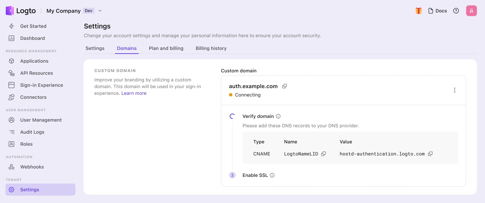

# 사용자 지정 도메인

Logto 테넌트는 기본 무료 도메인 `{{tenant-id}}.app.logto`를 제공합니다. 그러나 `auth.example.com`과 같은 사용자 지정 도메인을 사용하여 사용자 경험과 브랜드 인식을 향상시킬 수 있습니다.

사용자 지정 도메인은 여러 기능에 사용됩니다:

- [로그인 및 등록 페이지](/end-user-flows/sign-up-and-sign-in) URL
- [패스키](/end-user-flows/mfa/webauthn) 연결 URL (사용자가 패스키를 연결한 후 도메인을 변경하면 인증이 차단될 수 있습니다).
- [소셜 커넥터](/connectors/social-connectors) 또는 [엔터프라이즈 SSO 커넥터](/connectors/enterprise-connectors)의 콜백 URI.
- 애플리케이션과 Logto를 통합하기 위한 [SDK 엔드포인트](/integrate-logto/application-data-structure#openid-provider-configuration-endpoint).

:::note
서비스를 배포한 후 도메인을 변경하면 애플리케이션 코드와 통합이 여전히 이전 도메인을 참조할 수 있으므로 문제가 발생할 수 있습니다. 원활한 전환을 위해 **프로덕션 테넌트를 생성할 때 사용자 지정 도메인을 처음부터 설정**하세요.
:::

## 콘솔에서 사용자 지정 도메인 구성하기 \{#configure-custom-domain-in-console}

Logto 콘솔에서 새 사용자 지정 도메인을 추가하려면 다음 단계를 따르세요:

1. <CloudLink to="/tenant-settings/domains">콘솔 > 설정 > 도메인</CloudLink>으로 이동합니다.
2. "사용자 지정 도메인" 섹션에서 도메인 이름을 입력하고 "도메인 추가"를 클릭합니다.

   

3. 표에서 CNAME 값을 복사하고, 도메인의 DNS 제공자로 가서 레코드를 추가합니다.

   

4. 인증 및 SSL 프로세스를 기다립니다.
   1. 사용자 지정 도메인이 추가될 때까지 10초마다 자동으로 레코드를 인증합니다. 입력한 도메인 이름이나 DNS 레코드가 정확한지 확인하세요.
   2. 인증은 일반적으로 몇 분이 걸리지만, DNS 제공자에 따라 최대 24시간이 걸릴 수 있습니다. 프로세스 중에 다른 곳으로 이동해도 괜찮습니다.

## 문제 해결 \{#troubleshooting}

<details>
<summary>

### SSL 인증서 문제 \{#ssl-certificate-issues}

</summary>

사용자 지정 도메인을 설정할 때 SSL 인증서 문제가 발생하면, 이는 DNS 구성의 CAA 레코드와 관련이 있을 수 있습니다. CAA 레코드는 도메인에 대한 인증서를 발급할 수 있는 인증 기관 (CA)을 지정합니다.

CAA 레코드와 관련된 SSL 인증서 문제를 해결하려면 [Cloudflare의 문서](https://developers.cloudflare.com/ssl/edge-certificates/caa-records/)를 참조하세요.

</details>

<details>
<summary>

### "호스트 이름이 보류 중인 영역과 연결되어 있습니다" 오류 \{#the-hostname-is-associated-with-a-held-zone-error}

</summary>

사용자 지정 도메인을 추가할 때 "호스트 이름이 보류 중인 영역과 연결되어 있습니다. 소유자에게 연락하여 보류를 해제하십시오"라는 오류 메시지가 나타나면, 해당 도메인이 이미 Cloudflare 영역에 있으며 "Zone Hold" 상태로 설정되어 있음을 의미합니다. 자세한 내용은 [Cloudflare 문서](https://developers.cloudflare.com/fundamentals/setup/account/account-security/zone-holds/)를 참조하세요.

이 문제를 해결하려면 영역 보류를 해제해야 합니다. Cloudflare에서 영역 보류를 해제하는 방법에 대한 지침은 위의 링크를 참조하세요.

</details>

## 사용자 지정 도메인 사용하기 \{#use-custom-domain}

설정을 완료하면 사용자 지정 도메인 이름과 기본 Logto 도메인 이름이 테넌트에 대해 모두 사용 가능해집니다. 그러나 사용자 지정 도메인 이름을 활성화하려면 특정 구성이 필요합니다.

:::note
이 문서에서는 사용자 지정 도메인이 `auth.example.com`이라고 가정합니다.


:::

### 애플리케이션을 위한 SDK 엔드포인트 업데이트하기 \{#updating-the-sdk-endpoint-for-applications}

Logto SDK의 초기화 코드를 수정하여 엔드포인트의 도메인 이름을 변경하세요.

```typescript
const client = new LogtoClient({
  ...,// 다른 옵션
  endpoint: 'https://auth.example.com',
});
```

### 다른 애플리케이션을 위한 인증 엔드포인트 수정하기 \{#modifying-auth-endpoints-for-other-applications}

Logto SDK를 사용하지 않는 애플리케이션이 있는 경우, 해당 애플리케이션의 인증 엔드포인트를 업데이트해야 합니다.

인증 엔드포인트는 다음의 잘 알려진 URL에서 찾을 수 있습니다:

```
https://auth.example.com/oidc/.well-known/openid-configuration
```

### 소셜 커넥터의 콜백 URI 업데이트하기 \{#updating-the-social-connectors-callback-uri}

사용자가 사용자 지정 도메인을 사용하는 경우, 소셜 커넥터의 콜백 URI는 자동으로 업데이트됩니다. 소셜 제공자의 개발자 콘솔로 이동하여 콜백 URI를 업데이트해야 합니다.

사용자가 사용자 지정 도메인을 사용하는 경우, 소셜 커넥터의 콜백 URI는 새로운 도메인을 사용하게 됩니다. 따라서 소셜 제공자의 개발자 콘솔로 이동하여 콜백 URI를 수동으로 업데이트해야 합니다.
