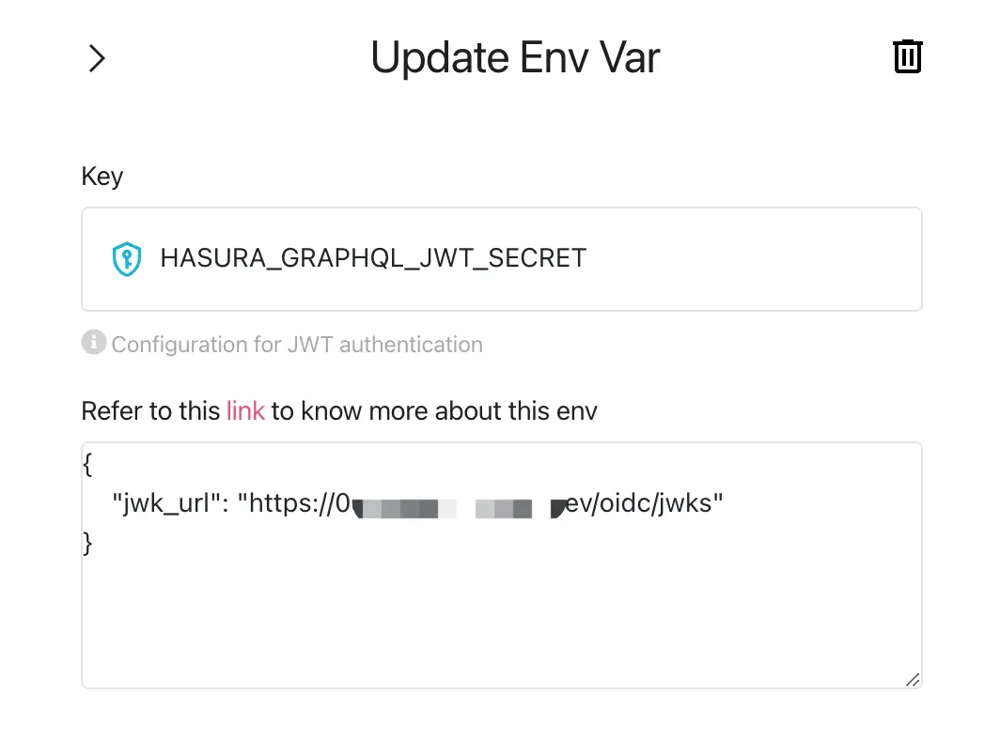

# Hasura 애플리케이션에 인증 (Authentication)을 추가하세요

[Hasura](https://hasura.io/)는 데이터에 맞는 GraphQL 및 REST API 를 빠르게 제공할 수 있는 도구입니다. 데이터 보안을 고려하여, Hasura 는 각기 다른 API 에 대한 접근 제어를 세밀하게 조정할 수 있는 기능도 제공합니다.

보통 Hasura 사용자들은 Logto 와 같은 다른 아이덴티티 관리 및 인증 서비스를 활용합니다. Logto 는 그 중에서도 매우 인기 있는 서비스입니다.

이 블로그 게시물에서는 이미 Hasura 서비스를 사용하고 있다고 가정하고, Hasura 와 Logto 를 통합하여 데이터의 보안을 극대화하는 방법을 소개하겠습니다. Logto 계정이 없다면, 지금 가입하여 사용을 시작하세요!

## 배경 \{#background}

Hasura 는 [역할 기반 접근 관리](https://hasura.io/docs/latest/auth/overview/)를 사용하고, Logto 는 표준 [역할 기반 접근 제어 (RBAC)](/authorization/role-based-access-control)를 사용합니다.

Logto 의 모델과 RBAC 에 대한 모범 사례에서는 `스코프`를 권한의 가장 세밀한 단위로 사용하고, `역할`을 여러 `스코프`의 묶음으로 사용하여 편리한 일괄 작업을 수행하며, 궁극적으로 `스코프`를 확인하여 사용자가 특정 작업을 수행할 수 있는지를 검증할 것을 권장합니다.

Hasura 에서는 `역할`이 권한의 가장 세밀한 단위에 해당하며, 권한 검사는 `역할`에 대해 수행됩니다. 따라서 Logto 설정 시, 하나의 `역할`을 정확히 하나의 `스코프`에 매핑하는 것을 권장합니다. 이 접근 방식은 Logto 와 Hasura 의 권한을 연결하여 혼동과 오용을 방지할 수 있습니다.

Hasura 는 Webhook 또는 JWT 를 사용하여 접근 제어를 지원할 수 있습니다. 이전 [블로그 게시물](https://blog.logto.io/logto-x-hasura)에서는 Webhook 을 사용하는 방법을 소개했으며, 다음 섹션에서는 Hasura 의 JWT 모드 접근 제어를 활용하는 방법을 설명하겠습니다.

## 시작하기 \{#get-started}

간단한 예제로 시작해 봅시다. 사용자가 이미 Hasura 에서 `GET /user` 및 `PATCH /user`라는 두 개의 API 를 가지고 있으며, 각각 `user:reader` 및 `user:maintainer`라는 두 개의 역할에 해당한다고 가정합니다.

### 1. Logto 에서 Hasura API 리소스 생성하기 \{#1-create-hasura-api-resource-in-logto}

Logto 에서 Hasura API 리소스를 생성하세요.


### 2. Logto 에서 Hasura 설정에 따라 역할 생성하기 \{#2-create-roles-according-to-hasura-setup-in-logto}

1단계에서 언급한 Hasura API 리소스를 위해 두 개의 `스코프`를 생성해야 합니다. 즉, `read:user` 및 `maintain:user`을 생성하고, 두 개의 역할을 생성합니다: `user:reader` ( `read:user` 스코프 포함) 및 `user:maintainer` ( `maintain:user` 스코프 포함) 역할을 생성하여 Hasura 의 역할과 일대일로 대응시킵니다. 그리고 필요에 따라 Logto 사용자에게 이러한 역할을 할당합니다.


### 3. Hasura 환경 변수 `HASURA_GRAPHQL_JWT_SECRET`을 구성하여 JWT 모드 활성화하기 \{#3-configure-hasura-environment-variable-hasura_graphql_jwt_secret-to-enable-jwt-mode}

[Hasura JWT 구성 옵션](https://hasura.io/docs/latest/auth/authentication/jwt/#hasura-jwt-configuration-options)을 살펴보면, JWT 를 사용하여 접근 제어를 하기 전에 환경 변수 `HASURA_GRAPHQL_JWT_SECRET`을 추가하고 구성해야 합니다.

구성할 수 있는 다양한 옵션이 있지만, 여기서는 가장 간단한 경우를 소개합니다: `jwk_url`만 구성하면 됩니다. 이 값은 Logto 의 OpenID 구성 엔드포인트 (https://your.logto.domain/oidc/.well-known/openid-configuration)에서 얻을 수 있습니다.



### 4. 사용자 액세스 토큰 추가 클레임 사용자 정의하기 \{#4-customize-user-access-token-extra-claims}

Logto 의 사용자 정의 토큰 클레임 기능을 사용하여 사용자 액세스 토큰에 추가 클레임을 추가하는 로직을 사용자 정의하세요.


`getCustomJwtClaims` 메서드를 사용자 정의하여 Hasura 가 접근 제어를 구현하는 데 의존하는 JWT 에 데이터를 추가하세요. 여기에는 해당 인스턴스 동안 인가된 사용자와 관련된 데이터가 포함될 수 있으며, `context`를 통해 접근할 수 있는 `역할`이 포함될 수 있습니다.

또한, 하드코딩을 피하기 위해 환경 변수 `USER_DEFAULT_ROLE_NAMES`를 정의했습니다.

### 5. Logto SDK 통합하기 \{#5-integrate-logto-sdk}

Logto 와 Hasura 를 구성한 후, Logto SDK 를 애플리케이션에 통합하세요. 여기서는 사용자가 로그인한 후 Logto 에서 발급한 사용자 액세스 토큰을 미리 보기 위해 React 예제를 사용합니다.


먼저, 이전에 생성한 `user:reader` 및 `user:maintainer` 역할을 사용자에게 할당한 후, 해당 사용자로 로그인합니다.

```tsx
const config: LogtoConfig = {
  endpoint: 'http://localhost:3001',
  appId: '<your-application-id>',
  appSecret: '<your-application-secret>',
  scopes: [
    ...// 기존 스코프
    'read:user',
    'maintain:user',
  ],
  resources: [
    ...// 기존 리소스
    'https://*.hasura.app/api',
  ],
};
```

사용자 액세스 토큰을 얻고 Hasura API 를 요청하세요:

```tsx
const accessToken = await logto.getAccessToken('https://*.hasura.app/api');

// Hasura 에 요청을 보내기 전에
request.headers.set('Authorization', `Bearer ${accessToken}`);
request.headers.set('x-Hasura-Role', '<required-role-for-the-endpoint>');
```

## 결론 \{#conclusion}

이 기사에서는 Hasura 가 지원하는 Webhook 외에 JWT 기반 접근 제어의 또 다른 방법을 제공했습니다.

Hasura 의 [Webhook](https://hasura.io/docs/latest/auth/authentication/webhook/) 및 [JWT](https://hasura.io/docs/latest/auth/authentication/jwt/) 접근 제어 프로세스를 비교해 보면, Webhook 접근 방식은 Hasura 요청마다 Logto 에 Webhook 을 보내고 응답을 기다리는 반면, JWT 기반 접근 방식은 JWT 가 만료될 때까지 지속적으로 사용할 수 있습니다.

JWT 접근 방식은 네트워크 부하를 줄이고 Webhook 이 가져오는 네트워크 지연을 제거할 수 있으며, Webhook 접근 방식은 사용자 권한의 변경 사항을 실시간으로 동기화할 수 있습니다.

사용자는 이러한 결론을 바탕으로 실제 비즈니스 요구와 결합하여 적절한 접근 방식을 선택할 수 있습니다.
