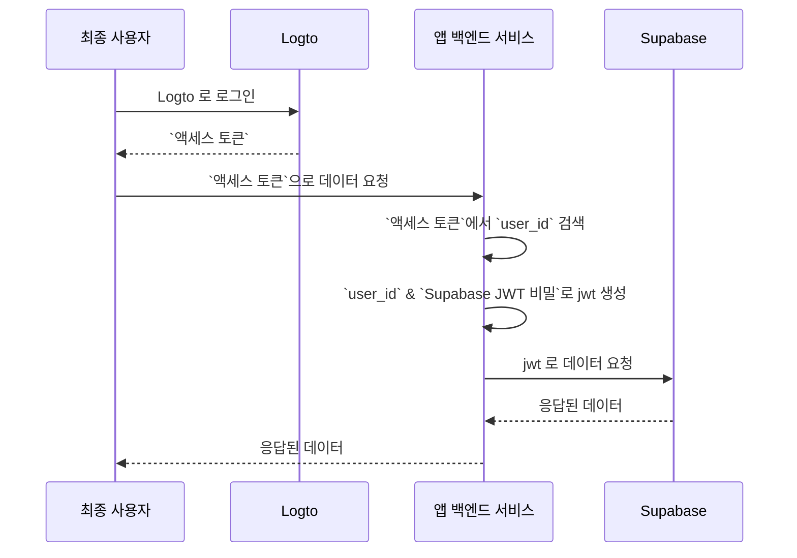

import createGetUserIdFunctionImage from '@site/docs/quick-starts/database/supabase/create-get-user-id-function.webp';
import createRlsPolicyImage from '@site/docs/quick-starts/database/supabase/create-rls-policy.webp';
import postsTableImage from '@site/docs/quick-starts/database/supabase/posts-table.webp';
import serviceRoleSecretImage from '@site/docs/quick-starts/database/supabase/service-role-secret.webp';
import supabaseApiSettingsImage from '@site/docs/quick-starts/database/supabase/supabase-api-settings.webp';

# Supabase 애플리케이션에 인증 (Authentication)을 추가하세요

## Supabase 기본 사항 \{#supabase-basics}

Supabase 는 데이터 접근 권한을 제어하기 위해 [Postgres의 Row-Level Security](https://www.postgresql.org/docs/current/ddl-rowsecurity.html)를 활용합니다. 간단히 말해, 데이터베이스의 테이블에 대한 Row Level Security 정책을 생성함으로써, 누가 테이블의 데이터를 읽고, 쓰고, 업데이트할 수 있는지를 제한하고 관리할 수 있습니다.

데이터베이스에 "posts"라는 테이블이 있다고 가정해 봅시다. 이 테이블의 내용은 다음과 같습니다:


테이블의 `user_id` 필드는 각 게시물 데이터가 속한 사용자를 나타냅니다. 각 사용자가 자신의 게시물 데이터에만 접근할 수 있도록 `user_id` 필드를 기반으로 제한할 수 있습니다.

그러나 이를 구현하기 전에, Supabase 는 데이터베이스에 접근하는 현재 사용자를 식별할 수 있어야 합니다.

### Supabase 요청에 사용자 데이터 추가하기 \{#add-user-data-to-the-supabase-requests}

Supabase 의 JWT 지원 덕분에, 애플리케이션이 Supabase 와 상호작용할 때 Supabase 에서 제공하는 JWT 비밀을 사용하여 사용자 데이터를 포함한 JWT 를 생성할 수 있습니다. 그런 다음 이 JWT 를 요청 시 인증 헤더로 사용합니다. 요청을 수신하면 Supabase 는 JWT 의 유효성을 자동으로 검증하고 이후의 프로세스에서 포함된 데이터에 접근할 수 있도록 허용합니다.

먼저, Supabase 대시보드의 "Project Settings"에서 Supabase 가 제공하는 JWT 비밀을 얻을 수 있습니다:


그런 다음, Supabase SDK 를 사용하여 Supabase 에 요청할 때 이 비밀을 사용하여 JWT 를 생성하고 이를 요청의 인증 헤더로 첨부합니다. (이 과정은 애플리케이션의 백엔드 서비스 내에서 발생하며, JWT 비밀은 제3자에게 노출되어서는 안 됩니다).

```jsx
import { createClient } from '@supabase/supabase-js';
import { sign } from 'jsonwebtoken';

/
 * 참고:
 * SUPABASE_URL, SUPABASE_ANON_KEY 는 JWT 비밀을 찾은 곳에서 찾을 수 있습니다.
 */
const SUPABASE_URL = process.env.SUPABASE_URL;
const SUPABASE_ANON_KEY = process.env.SUPABASE_ANON_KEY;

const SUPABASE_JWT_SECRET = process.env.SUPABASE_JWT_SECRET;

export const getSupabaseClient = (userId) => {
  const jwtPayload = {
    userId,
  };

  const jwt = sign(jwtPayload, SUPABASE_JWT_SECRET, {
    expiresIn: '1h', // 단지 예시를 위한 것임
  });

  const client = createClient(SUPABASE_URL, SUPABASE_ANON_KEY, {
    global: {
      headers: {
        Authorization: `Bearer ${jwt}`,
      },
    },
  });

  return client;
};
```

다음으로, Supabase 대시보드의 SQL Editor 로 이동하여 요청에 포함된 userId 를 검색하는 함수를 생성합니다:


이미지에서 사용된 코드는 다음과 같습니다:

```sql
create or replace function auth.user_id() returns text as $$
  select nullif(current_setting('request.jwt.claims', true)::json->>'userId', '')::text;
$$ language sql stable;
```

코드에서 보듯이, Supabase 에서는 `request.jwt.claims`를 호출하여 우리가 생성한 JWT 의 페이로드를 검색할 수 있습니다. 페이로드 내부의 `userId` 필드는 우리가 설정한 값입니다.

이 함수로 Supabase 는 현재 데이터베이스에 접근하는 사용자를 결정할 수 있습니다.

### Row-Level Security 정책 생성하기 \{#create-row-level-security-policy}

다음으로, posts 테이블의 `user_id` 필드를 기반으로 각 사용자가 자신의 게시물 데이터에만 접근할 수 있도록 Row-Level Security 정책을 생성할 수 있습니다.

1. Supabase 대시보드의 Table Editor 페이지로 이동하여 posts 테이블을 선택합니다.
2. 테이블 상단에서 "Add RLS Policy"를 클릭합니다.
3. 표시된 창에서 "Create policy"를 클릭합니다.
4. 정책 이름을 입력하고 SELECT 정책 명령을 선택합니다.
5. 아래 코드의 `using` 블록에 다음을 입력합니다:

```sql
auth.user_id() = user_id
```


이러한 정책을 활용하여 Supabase 내에서 데이터 접근 제어가 이루어집니다.

실제 애플리케이션에서는 데이터 삽입 및 수정과 같은 사용자 작업을 제한하기 위해 다양한 정책을 생성합니다. 그러나 이는 이 기사 범위를 벗어납니다. Row-Level Security (RLS)에 대한 자세한 내용은 [Postgres Row Level Security 를 사용하여 데이터를 보호하세요](https://supabase.com/docs/guides/database/postgres/row-level-security)를 참조하세요.

### Logto 와의 기본 통합 프로세스 \{#basic-integration-process-with-logto}

앞서 언급했듯이, Supabase 는 접근 제어를 위해 RLS 를 사용하므로, Logto (또는 다른 인증 서비스)와의 통합의 핵심은 인가된 사용자의 user id 를 얻고 이를 Supabase 에 보내는 것입니다. 전체 프로세스는 아래 다이어그램에 설명되어 있습니다:



다음으로, 이 프로세스 다이어그램을 기반으로 Logto 를 Supabase 와 통합하는 방법을 설명하겠습니다.

## Logto 통합 \{#logto-integration}

Logto 는 다양한 프레임워크 및 프로그래밍 언어에 대한 통합 가이드를 제공합니다.

일반적으로, 이러한 프레임워크와 언어로 구축된 앱은 네이티브 앱, SPA (싱글 페이지 앱), 전통적인 웹 앱, M2M (기계 간) 앱과 같은 카테고리로 나뉩니다. 사용 중인 기술 스택에 따라 Logto 를 애플리케이션에 통합하려면 [Logto 빠른 시작](/quick-starts) 페이지를 방문하세요. 그런 다음, 애플리케이션 유형에 따라 프로젝트에 Logto 를 통합하는 방법을 따르세요.

### 네이티브 앱 또는 SPA \{#native-app-or-spa}

네이티브 앱과 SPA 는 모두 기기에서 실행되며, 로그인 후 얻은 자격 증명 (액세스 토큰)은 기기에 로컬로 저장됩니다.

따라서, 애플리케이션을 Supabase 와 통합할 때, 각 사용자의 기기에 민감한 정보를 노출할 수 없으므로 백엔드 서비스를 통해 Supabase 와 상호작용해야 합니다.

React 와 Express 를 사용하여 SPA 를 구축한다고 가정해 봅시다. [Logto React SDK 가이드](/quick-starts/react)를 따라 애플리케이션에 Logto 를 성공적으로 통합했습니다 (코드는 [react 샘플](https://github.com/logto-io/js/tree/master/packages/react-sample)을 참조할 수 있습니다). 또한, [Node (Express)에서 API 보호하기](/authorization/api-resources/node-express) 문서에 따라 백엔드 서버에 Logto 액세스 토큰 유효성 검사를 추가했습니다.

다음으로, Logto 에서 얻은 액세스 토큰을 사용하여 백엔드 서버에서 사용자 데이터를 요청합니다:

```jsx
import { useLogto } from '@logto/react';
import { useState, useEffect } from 'react';
import PostList from './PostList';

const endpoint = '<https://www.mysite.com/api/posts>';
const resource = '<https://www.mysite.com/api>';

function PostPage() {
  const { isAuthenticated, getAccessToken } = useLogto();
  const [posts, setPosts] = useState();

  useEffect(() => {
    const fetchPosts = async () => {
      const response = await fetch(endpoint, {
        headers: {
          Authorization: `Bearer ${await getAccessToken(resource)}`,
        },
      });
      setPosts(response.json());
    };

    if (isAuthenticated) {
      void fetchPosts();
    }
  }, [isAuthenticated, getAccessToken]);

  return <PostList posts={posts} />;
}

export default PostPage;
```

백엔드 서버에서는 미들웨어를 사용하여 액세스 토큰에서 로그인한 사용자의 id 를 이미 추출했습니다:

```jsx
// auth-middleware.ts
import { createRemoteJWKSet, jwtVerify } from 'jose';

//...

export const verifyAuthFromRequest = async (ctx, next) => {
  // 토큰 추출
  const token = extractBearerTokenFromHeaders(ctx.request.headers);

  const { payload } = await jwtVerify(
    token, // 요청 헤더에서 추출한 원시 Bearer Token
    createRemoteJWKSet(new URL('https://<your-logto-domain>/oidc/jwks')), // Logto 서버에서 조회한 jwks_uri 를 사용하여 jwks 생성
    {
      // 토큰의 예상 발급자, Logto 서버에서 발급되어야 함
      issuer: 'https://<your-logto-domain>/oidc',
      // 예상 대상 토큰, 현재 API 의 리소스 지표여야 함
      audience: '<your request listener resource indicator>',
    }
  );

  // RBAC 를 사용하는 경우
  assert(payload.scope.includes('some_scope'));

  // 사용자 정의 페이로드 로직
  ctx.auth = {
    userId: payload.sub,
  };

  return next();
};
```

이제, 위에서 설명한 `getSupabaseClient`를 사용하여 Supabase 에 대한 후속 요청에 사용되는 JWT 에 `userId`를 첨부할 수 있습니다. 또는 Supabase 와 상호작용해야 하는 요청에 대해 Supabase 클라이언트를 생성하는 미들웨어를 만들 수 있습니다:

```jsx
export const withSupabaseClient = async (ctx, next) => {
  ctx.supabase = getSupabaseClient(ctx.auth.userId);

  return next();
};
```

후속 처리 흐름에서는 `ctx.supabase`를 직접 호출하여 Supabase 와 상호작용할 수 있습니다:

```jsx
const fetchPosts = async (ctx) => {
	cosnt { data } = await ctx.supabase.from('posts').select('*');

	return data;
}
```

이 코드에서는 Supabase 가 이전에 설정한 정책을 기반으로 현재 사용자에게 속한 게시물 데이터만 반환합니다.

### 전통적인 웹 앱 \{#traditional-web-app}

전통적인 웹 앱과 네이티브 앱 또는 SPA 의 주요 차이점은 전통적인 웹 앱이 웹 서버에서만 페이지를 렌더링하고 업데이트한다는 것입니다. 따라서 사용자 자격 증명은 웹 서버에서 직접 관리되며, 네이티브 앱과 SPA 에서는 사용자 기기에 존재합니다.

Supabase 에서 전통적인 웹 앱과 Logto 를 통합할 때, 백엔드에서 로그인한 사용자의 id 를 직접 검색할 수 있습니다.

Next.js 프로젝트를 예로 들어, [Next.js SDK 가이드](/quick-starts/next-app-router)를 따라 프로젝트에 Logto 를 통합한 후, Logto SDK 를 사용하여 사용자 정보를 검색하고 Supabase 와 상호작용하기 위한 해당 JWT 를 구성할 수 있습니다.

```jsx
import { getLogtoContext } from '@logto/next-server-actions';
import { logtoConfig } from '@/logto';
import { getSupabaseClient } from '@/utils';
import PostList from './PostList';

export default async function PostPage() {
  const { cliams } = await getLogtoContext(logtoConfig);

  // `cliams`의 `sub` 값은 사용자 id 입니다.
  const supabase = getSupabaseClient(cliams.sub);

  const { data: posts } = await supabase.from('posts').select('*');

  return <PostList posts={posts} />;
}
```

### 기계 간 앱 \{#machine-to-machine-app}

기계 간 (M2M)은 앱이 리소스 서버와 직접 통신해야 할 때 자주 사용됩니다. 예를 들어, 매일 게시물을 가져오는 정적 서비스 등이 있습니다.

기계 간 앱 인증을 위해 [기계 간: Logto 로 인증하기](/quick-starts/m2m) 가이드를 사용할 수 있습니다. Supabase 와 기계 간 앱 간의 통합은 네이티브 앱 및 SPA 와 유사합니다 (["네이티브 앱 또는 SPA"](#native-app-or-spa) 섹션 참조). Logto 에서 액세스 토큰을 얻은 후 보호된 백엔드 API 를 통해 이를 검증하는 과정을 포함합니다.

그러나 네이티브 앱과 SPA 는 일반적으로 최종 사용자를 위해 설계되므로 얻은 사용자 id 는 사용자 자체를 나타냅니다. 그러나 기계 간 앱의 액세스 토큰은 애플리케이션 자체를 나타내며, 액세스 토큰 페이로드의 `sub` 필드는 특정 사용자가 아닌 M2M 앱의 클라이언트 id 입니다. 따라서 개발 중에는 어떤 데이터가 M2M 앱을 위한 것인지 구별하는 것이 중요합니다.

더 나아가, 특정 M2M 앱이 전체 서비스를 대신하여 Supabase 에 접근하여 RLS 제한을 우회하도록 하려면 Supabase 의 `service_role` 비밀을 사용하여 Supabase 클라이언트를 생성할 수 있습니다. 이는 개별 사용자에 대해 설정된 Row-Level Security 정책에 의해 제한되지 않고 모든 데이터에 접근해야 하는 일부 관리 또는 자동화 작업을 수행하려는 경우에 유용합니다.

`service_role` 비밀은 JWT 비밀과 동일한 페이지에서 찾을 수 있습니다:


Supabase 클라이언트를 생성할 때 `service_role` 비밀을 사용하면 이 클라이언트는 데이터베이스의 모든 데이터에 접근할 수 있습니다:

```jsx
import { createClient } from '@supabase/supabase-js';

// ...
const SUPABASE_SERVICE_ROLE_SCRET = process.env.SUPABASE_SERVICE_ROLE_SCRET;

const client = createClient(SUPABASE_URL, SUPABASE_SERVICE_ROLE_SCRET, {
  // ...options
});
```
