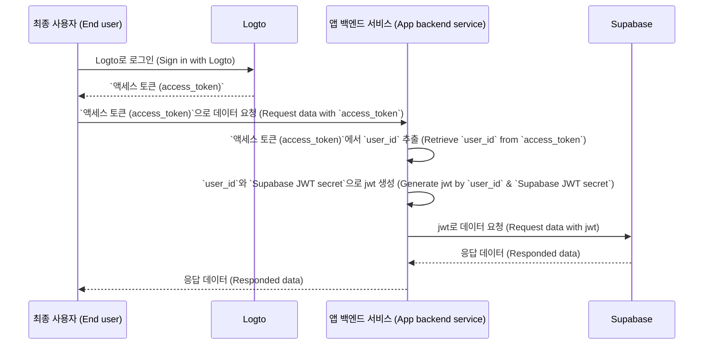

# Supabase 애플리케이션에 인증 (Authentication)을 추가하세요

## Supabase 기본 개념 \{#supabase-basics}

Supabase는 [Postgres의 Row-Level Security](https://www.postgresql.org/docs/current/ddl-rowsecurity.html)를 활용하여 데이터 접근 권한을 제어합니다. 간단히 말해, 데이터베이스의 테이블에 Row Level Security 정책을 생성함으로써, 테이블의 데이터를 누가 읽고, 쓰고, 수정할 수 있는지 제한하고 관리할 수 있습니다.

예를 들어, 데이터베이스에 "posts"라는 테이블이 있다고 가정해봅시다. 테이블의 내용은 다음과 같습니다:


테이블의 `user_id` 필드는 각 게시글 데이터가 어떤 사용자에게 속하는지를 나타냅니다. `user_id` 필드를 기반으로 각 사용자가 자신의 게시글 데이터만 접근할 수 있도록 제한할 수 있습니다.

하지만, 이를 구현하기 전에 Supabase는 데이터베이스에 접근하는 현재 사용자를 식별할 수 있어야 합니다.

### Supabase 요청에 사용자 데이터 추가하기 \{#add-user-data-to-the-supabase-requests}

Supabase가 JWT를 지원하기 때문에, 애플리케이션이 Supabase와 상호작용할 때 Supabase에서 제공하는 JWT 시크릿을 사용하여 사용자 데이터가 포함된 JWT를 생성할 수 있습니다. 이 JWT를 인증 (Authentication) 헤더로 사용하여 요청을 보냅니다. Supabase는 요청을 받으면 JWT의 유효성을 자동으로 검증하고, 이후 프로세스에서 해당 JWT에 포함된 데이터에 접근할 수 있도록 허용합니다.

먼저, Supabase 대시보드의 “Project Settings”에서 Supabase가 제공하는 JWT 시크릿을 얻을 수 있습니다:


그 다음, Supabase SDK를 사용하여 Supabase에 요청을 보낼 때 이 시크릿을 사용해 JWT를 생성하고, 인증 (Authentication) 헤더에 첨부합니다. (이 과정은 반드시 애플리케이션의 백엔드 서비스 내에서 이루어져야 하며, JWT 시크릿은 절대 외부에 노출되어서는 안 됩니다).

```jsx
import { createClient } from '@supabase/supabase-js';
import { sign } from 'jsonwebtoken';

/
 * 참고:
 * SUPABASE_URL, SUPABASE_ANON_KEY는 JWT Secret을 찾는 곳과 동일한 위치에서 확인할 수 있습니다.
 */
const SUPABASE_URL = process.env.SUPABASE_URL;
const SUPABASE_ANON_KEY = process.env.SUPABASE_ANON_KEY;

const SUPABASE_JWT_SECRET = process.env.SUPABASE_JWT_SECRET;

export const getSupabaseClient = (userId) => {
  const jwtPayload = {
    userId,
  };

  const jwt = sign(jwtPayload, SUPABASE_JWT_SECRET, {
    expiresIn: '1h', // 데모용 예시
  });

  const client = createClient(SUPABASE_URL, SUPABASE_ANON_KEY, {
    global: {
      headers: {
        Authorization: `Bearer ${jwt}`,
      },
    },
  });

  return client;
};
```

다음으로, Supabase 대시보드의 SQL Editor로 이동하여 요청에 담긴 userId를 추출하는 함수를 생성합니다:


이미지에서 사용된 코드는 다음과 같습니다:

```sql
create or replace function auth.user_id() returns text as $$
  select nullif(current_setting('request.jwt.claims', true)::json->>'userId', '')::text;
$$ language sql stable;
```

코드에서 볼 수 있듯이, Supabase에서는 `request.jwt.claims`를 호출하여 우리가 생성한 JWT의 payload를 가져올 수 있습니다. payload 내부의 `userId` 필드는 우리가 설정한 값입니다.

이 함수로 Supabase는 현재 데이터베이스에 접근 중인 사용자를 식별할 수 있습니다.

### Row-Level Security 정책 생성하기 \{#create-row-level-security-policy}

이제 posts 테이블의 `user_id` 필드를 기반으로 각 사용자가 자신의 게시글 데이터만 접근할 수 있도록 Row-Level Security 정책을 생성할 수 있습니다.

1. Supabase 대시보드의 Table Editor 페이지로 이동하여 posts 테이블을 선택합니다.
2. 테이블 상단의 "Add RLS Policy"를 클릭합니다.
3. 나타나는 창에서 "Create policy"를 클릭합니다.
4. Policy Name을 입력하고 SELECT Policy 명령을 선택합니다.
5. 아래 코드의 `using` 블록에 다음을 입력합니다:

```sql
auth.user_id() = user_id
```


이와 같은 정책을 활용하면 Supabase 내에서 데이터 접근 제어가 가능합니다.

실제 애플리케이션에서는 데이터 삽입, 수정 등 다양한 사용자 행동을 제한하는 여러 정책을 생성하게 됩니다. 하지만 이는 본 문서의 범위를 벗어납니다. Row-Level Security (RLS)에 대한 자세한 내용은 [Postgres Row Level Security로 데이터 보호하기](https://supabase.com/docs/guides/database/postgres/row-level-security)를 참고하세요.

### Logto와의 기본 통합 프로세스 \{#basic-integration-process-with-logto}

앞서 언급했듯이, Supabase는 접근 제어에 RLS를 사용하므로 Logto (또는 다른 인증 (Authentication) 서비스)와의 통합의 핵심은 인가된 사용자의 user id를 얻어 Supabase로 전달하는 것입니다. 전체 프로세스는 아래 다이어그램과 같습니다:



다음으로, 이 프로세스 다이어그램을 기반으로 Logto와 Supabase를 통합하는 방법을 설명합니다.

## Logto 통합 \{#logto-integration}

Logto는 다양한 프레임워크 및 프로그래밍 언어에 대한 통합 가이드를 제공합니다.

일반적으로 이러한 프레임워크와 언어로 구축된 앱은 네이티브 앱, SPA (싱글 페이지 앱), 전통적인 웹 앱, 기계 간 (M2M) 앱 등으로 분류됩니다. 사용 중인 기술 스택에 따라 [Logto 빠른 시작](/quick-starts) 페이지를 방문하여 애플리케이션에 Logto를 통합할 수 있습니다. 이후, 애플리케이션 유형에 따라 아래 지침을 따라 Logto를 프로젝트에 통합하세요.

### 네이티브 앱 또는 SPA \{#native-app-or-spa}

네이티브 앱과 SPA 모두 사용자의 디바이스에서 실행되며, 로그인 후 획득한 자격 증명 (액세스 토큰)은 로컬에 저장됩니다.

따라서, 앱을 Supabase와 통합할 때는 각 사용자의 디바이스에 민감한 정보 (예: Supabase JWT 시크릿)를 노출할 수 없으므로 반드시 백엔드 서비스를 통해 Supabase와 상호작용해야 합니다.

React와 Express로 SPA를 구축한다고 가정해봅시다. [Logto React SDK 가이드](/quick-starts/react)를 따라 애플리케이션에 Logto를 성공적으로 통합했다면 ([react 샘플 코드](https://github.com/logto-io/js/tree/master/packages/react-sample) 참고), 백엔드 서버에도 [액세스 토큰 검증](/authorization/validate-access-tokens) 가이드에 따라 Logto 액세스 토큰 검증을 추가했다고 가정합니다.

이제 Logto에서 획득한 액세스 토큰을 사용하여 백엔드 서버에 사용자 데이터를 요청할 수 있습니다:

```jsx
import { useLogto } from '@logto/react';
import { useState, useEffect } from 'react';
import PostList from './PostList';

const endpoint = '<https://www.mysite.com/api/posts>';
const resource = '<https://www.mysite.com/api>';

function PostPage() {
  const { isAuthenticated, getAccessToken } = useLogto();
  const [posts, setPosts] = useState();

  useEffect(() => {
    const fetchPosts = async () => {
      const response = await fetch(endpoint, {
        headers: {
          Authorization: `Bearer ${await getAccessToken(resource)}`,
        },
      });
      setPosts(response.json());
    };

    if (isAuthenticated) {
      void fetchPosts();
    }
  }, [isAuthenticated, getAccessToken]);

  return <PostList posts={posts} />;
}

export default PostPage;
```

백엔드 서버에서는 미들웨어를 통해 액세스 토큰에서 로그인한 사용자의 id를 추출합니다:

```jsx
// auth-middleware.ts
import { createRemoteJWKSet, jwtVerify } from 'jose';

//...

export const verifyAuthFromRequest = async (ctx, next) => {
  // 토큰 추출
  const token = extractBearerTokenFromHeaders(ctx.request.headers);

  const { payload } = await jwtVerify(
    token, // 요청 헤더에서 추출한 원본 Bearer Token
    createRemoteJWKSet(new URL('https://<your-logto-domain>/oidc/jwks')), // Logto 서버에서 조회한 jwks_uri로 jwks 생성
    {
      // 토큰의 예상 발급자, Logto 서버여야 함
      issuer: 'https://<your-logto-domain>/oidc',
      // 예상 audience 토큰, 현재 API의 리소스 지표여야 함
      audience: '<your request listener resource indicator>',
    }
  );

  // RBAC을 사용하는 경우
  assert(payload.scope.includes('some_scope'));

  // 커스텀 payload 로직
  ctx.auth = {
    userId: payload.sub,
  };

  return next();
};
```

이제 위에서 설명한 `getSupabaseClient`를 사용하여 이후 Supabase 요청에 사용할 JWT에 `userId`를 첨부할 수 있습니다. 또는 Supabase와 상호작용이 필요한 요청에 대해 Supabase 클라이언트를 생성하는 미들웨어를 만들 수도 있습니다:

```jsx
export const withSupabaseClient = async (ctx, next) => {
  ctx.supabase = getSupabaseClient(ctx.auth.userId);

  return next();
};
```

이후 처리 흐름에서는 `ctx.supabase`를 직접 호출하여 Supabase와 상호작용할 수 있습니다:

```jsx
const fetchPosts = async (ctx) => {
  const { data } = await ctx.supabase.from('posts').select('*');

  return data;
};
```

이 코드에서 Supabase는 미리 설정한 정책에 따라 현재 사용자에게 속한 게시글 데이터만 반환합니다.

### 전통적인 웹 앱 \{#traditional-web-app}

전통적인 웹 앱과 네이티브 앱 또는 SPA의 주요 차이점은, 전통적인 웹 앱은 웹 서버에서만 페이지를 렌더링하고 갱신한다는 점입니다. 따라서 사용자 자격 증명은 웹 서버에서 직접 관리되며, 네이티브 앱 및 SPA에서는 사용자의 디바이스에 저장됩니다.

Supabase에서 전통적인 웹 앱과 Logto를 통합할 때는 백엔드에서 로그인한 사용자의 id를 직접 가져올 수 있습니다.

Next.js 프로젝트를 예로 들면, [Next.js SDK 가이드](/quick-starts/next-app-router)를 따라 프로젝트에 Logto를 통합한 후, Logto SDK를 사용하여 사용자 정보를 조회하고 Supabase와 상호작용할 JWT를 생성할 수 있습니다.

```jsx
import { getLogtoContext } from '@logto/next-server-actions';
import { logtoConfig } from '@/logto';
import { getSupabaseClient } from '@/utils';
import PostList from './PostList';

export default async function PostPage() {
  const { cliams } = await getLogtoContext(logtoConfig);

  // `cliams`의 `sub` 값이 user id입니다.
  const supabase = getSupabaseClient(cliams.sub);

  const { data: posts } = await supabase.from('posts').select('*');

  return <PostList posts={posts} />;
}
```

### 기계 간 (M2M) 앱 \{#machine-to-machine-app}

기계 간 (M2M)은 앱이 리소스 서버와 직접 통신해야 할 때 자주 사용됩니다. 예를 들어, 정적 서비스가 매일 게시글을 가져오는 경우 등입니다.

기계 간 앱 인증 (Authentication)에는 [기계 간: Logto로 인증 (Authentication)](/quick-starts/m2m) 가이드를 참고하세요. Supabase와 기계 간 앱의 통합 방식은 네이티브 앱 및 SPA와 유사합니다 ("[네이티브 앱 또는 SPA](#native-app-or-spa)" 섹션 참고). Logto에서 액세스 토큰을 획득한 후, 보호된 백엔드 API를 통해 검증하는 방식입니다.

단, 네이티브 앱과 SPA는 일반적으로 최종 사용자를 위한 것이므로 획득한 user id가 실제 사용자를 의미합니다. 반면, 기계 간 앱의 액세스 토큰은 애플리케이션 자체를 나타내며, 액세스 토큰 payload의 `sub` 필드는 특정 사용자가 아니라 M2M 앱의 client id입니다. 따라서 개발 시 어떤 데이터가 M2M 앱을 위한 것인지 구분하는 것이 중요합니다.

또한, 특정 M2M 앱이 전체 서비스의 대표로 Supabase에 접근하여 RLS 제한을 우회해야 하는 경우, Supabase의 `service_role` 시크릿을 사용하여 Supabase 클라이언트를 생성할 수 있습니다. 이는 개별 사용자에 대한 Row-Level Security 정책에 구애받지 않고 모든 데이터에 접근해야 하는 관리 작업이나 자동화 작업에 유용합니다.

`service_role` 시크릿은 JWT 시크릿과 동일한 페이지에서 확인할 수 있습니다:


Supabase 클라이언트를 생성할 때 `service_role` 시크릿을 사용하면, 이 클라이언트는 데이터베이스의 모든 데이터에 접근할 수 있습니다:

```jsx
import { createClient } from '@supabase/supabase-js';

// ...
const SUPABASE_SERVICE_ROLE_SCRET = process.env.SUPABASE_SERVICE_ROLE_SCRET;

const client = createClient(SUPABASE_URL, SUPABASE_SERVICE_ROLE_SCRET, {
  // ...options
});
```
