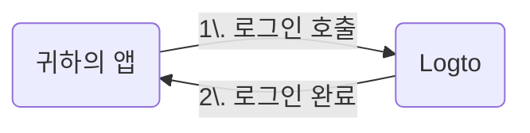

import RegardingRedirectBasedSignIn from './_regarding-redirect-based-sign-in.mdx';

자세한 내용을 살펴보기 전에, 최종 사용자 경험에 대한 간단한 개요를 소개합니다. 로그인 과정은 다음과 같이 단순화할 수 있습니다:

1. 귀하의 앱이 로그인 메서드를 호출합니다.
2. 사용자는 Logto 로그인 페이지로 리디렉션됩니다. 네이티브 앱의 경우, 시스템 브라우저가 열립니다.
3. 사용자가 로그인하면, 다시 귀하의 앱(리디렉션 URI로 설정됨)으로 리디렉션됩니다.

<RegardingRedirectBasedSignIn />

---
