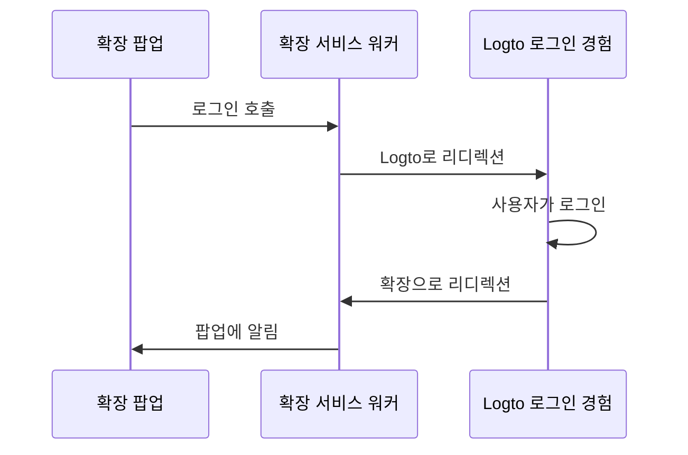

import extensionPopupImage from '@site/docs/quick-starts/framework/chrome-extension/extension-popup.webp';

import RegardingRedirectBasedSignIn from '../../fragments/_regarding-redirect-based-sign-in.mdx';

### 인증 흐름 \{#the-authentication-flow}

Chrome 확장의 팝업에 "로그인" 버튼을 넣었다고 가정하면, 인증 흐름은 다음과 같습니다:



확장의 다른 상호작용 페이지에 대해서는 `확장 팝업` 참가자를 페이지 이름으로 교체하면 됩니다. 이 튜토리얼에서는 팝업 페이지에 집중할 것입니다.

<RegardingRedirectBasedSignIn />

### `manifest.json` 업데이트 \{#update-the-manifestjson}

Logto SDK는 `manifest.json`에서 다음 권한이 필요합니다:

```json title="manifest.json"
{
  "permissions": ["identity", "storage"],
  "host_permissions": ["https://*.logto.app/*"]
}
```

- `permissions.identity`: 로그인 및 로그아웃에 사용되는 Chrome Identity API에 필요합니다.
- `permissions.storage`: 사용자의 세션을 저장하는 데 필요합니다.
- `host_permissions`: Logto SDK가 Logto API와 통신하는 데 필요합니다.

:::note
Logto Cloud에서 사용자 지정 도메인을 사용하는 경우, `host_permissions`를 도메인에 맞게 업데이트해야 합니다.
:::

### 백그라운드 스크립트 (서비스 워커) 설정 \{#set-up-a-background-script-service-worker}

Chrome 확장의 백그라운드 스크립트에서 Logto SDK를 초기화하세요:

```js title="service-worker.js"
import LogtoClient from '@logto/chrome-extension';

export const logtoClient = new LogtoClient({
  endpoint: '<your-logto-endpoint>'
  appId: '<your-logto-app-id>',
});
```

`<your-logto-endpoint>` 및 `<your-logto-app-id>`를 실제 값으로 교체하세요. 이 값들은 Logto Console에서 방금 생성한 애플리케이션 페이지에서 찾을 수 있습니다.

백그라운드 스크립트가 없는 경우, [공식 가이드](https://developer.chrome.com/docs/extensions/develop/concepts/service-workers/basics)를 따라 하나를 생성할 수 있습니다.

:::info
**왜 백그라운드 스크립트가 필요한가요?**

팝업이나 옵션 페이지와 같은 일반 확장 페이지는 백그라운드에서 실행될 수 없으며, 인증 과정 중에 닫힐 가능성이 있습니다. 백그라운드 스크립트는 인증 과정을 적절히 처리할 수 있도록 보장합니다.
:::

그런 다음, 다른 확장 페이지로부터 메시지를 듣고 인증 과정을 처리해야 합니다:

```js title="service-worker.js"
chrome.runtime.onMessage.addListener((message, sender, sendResponse) => {
  // 아래 코드에서는 각 작업에 대해 `true`를 반환하므로, `sendResponse`를 호출하여
  // 발신자에게 알림을 보내야 합니다. 여기서 오류를 처리하거나 다른 방법으로 발신자에게 알릴 수도 있습니다.

  if (message.action === 'signIn') {
    const redirectUri = chrome.identity.getRedirectURL('/callback');
    logtoClient.signIn(redirectUri).finally(sendResponse);
    return true;
  }

  if (message.action === 'signOut') {
    const redirectUri = chrome.identity.getRedirectURL();
    logtoClient.signOut(redirectUri).finally(sendResponse);
    return true;
  }

  return false;
});
```

위 코드에서 두 개의 리디렉션 URI가 사용된 것을 알 수 있습니다. 이들은 모두 `chrome.identity.getRedirectURL`에 의해 생성되며, 이는 인증 흐름을 위한 리디렉션 URL을 생성하는 [Chrome 내장 API](https://developer.chrome.com/docs/extensions/reference/api/identity#method-getRedirectURL)입니다. 두 URI는 다음과 같습니다:

- 로그인용 `https://<extension-id>.chromiumapp.org/callback`.
- 로그아웃용 `https://<extension-id>.chromiumapp.org/`.

이 URI들은 접근할 수 없으며, Chrome이 인증 과정의 특정 작업을 트리거하기 위해 사용됩니다.

### Logto 애플리케이션 설정 업데이트 \{#update-logto-application-settings}

이제 방금 생성한 리디렉션 URI를 허용하도록 Logto 애플리케이션 설정을 업데이트해야 합니다.

1. Logto Console에서 애플리케이션 페이지로 이동합니다.
2. "리디렉션 URI" 섹션에서 URI를 추가합니다: `https://<extension-id>.chromiumapp.org/callback`.
3. "로그아웃 후 리디렉션 URI" 섹션에서 URI를 추가합니다: `https://<extension-id>.chromiumapp.org/`.
4. "CORS 허용 원본" 섹션에서 URI를 추가합니다: `chrome-extension://<extension-id>`. Chrome 확장에서 SDK는 이 원본을 사용하여 Logto API와 통신합니다.
5. **변경 사항 저장**을 클릭합니다.

`<extension-id>`를 실제 확장 ID로 교체하는 것을 잊지 마세요. 확장 ID는 `chrome://extensions` 페이지에서 찾을 수 있습니다.

### 팝업에 로그인 및 로그아웃 버튼 추가 \{#add-sign-in-and-sign-out-buttons-to-the-popup}

거의 다 왔습니다! 팝업 페이지에 로그인 및 로그아웃 버튼과 기타 필요한 로직을 추가해 봅시다.

`popup.html` 파일에서:

```html title="popup.html"
<button id="sign-in">로그인</button> <button id="sign-out">로그아웃</button>
```

`popup.js` 파일에서 (`popup.js`가 `popup.html`에 포함되어 있다고 가정):

```js title="popup.js"
document.getElementById('sign-in').addEventListener('click', async () => {
  await chrome.runtime.sendMessage({ action: 'signIn' });
  // 로그인 완료 (또는 실패), 여기서 UI를 업데이트할 수 있습니다.
});

document.getElementById('sign-out').addEventListener('click', async () => {
  await chrome.runtime.sendMessage({ action: 'signOut' });
  // 로그아웃 완료 (또는 실패), 여기서 UI를 업데이트할 수 있습니다.
});
```

### 체크포인트: 인증 흐름 테스트 \{#checkpoint-test-the-authentication-flow}

이제 Chrome 확장에서 인증 흐름을 테스트할 수 있습니다:

1. 확장 팝업을 엽니다.
2. "로그인" 버튼을 클릭합니다.
3. Logto 로그인 페이지로 리디렉션됩니다.
4. Logto 계정으로 로그인합니다.
5. Chrome으로 다시 리디렉션됩니다.

### 인증 상태 확인 \{#check-authentication-state}

Chrome은 통합된 저장소 API를 제공하므로, 로그인 및 로그아웃 흐름 외에도 모든 Logto SDK 메서드를 팝업 페이지에서 직접 사용할 수 있습니다.

`popup.js`에서, 백그라운드 스크립트에서 생성한 `LogtoClient` 인스턴스를 재사용하거나 동일한 구성으로 새로 생성할 수 있습니다:

```js title="popup.js"
import LogtoClient from '@logto/chrome-extension';

const logtoClient = new LogtoClient({
  endpoint: '<your-logto-endpoint>'
  appId: '<your-logto-app-id>',
});

// 또는 백그라운드 스크립트에서 생성한 logtoClient 인스턴스를 재사용
import { logtoClient } from './service-worker.js';
```

그런 다음 인증 상태와 사용자의 프로필을 로드하는 함수를 생성할 수 있습니다:

```js title="popup.js"
const loadAuthenticationState = async () => {
  const isAuthenticated = await logtoClient.isAuthenticated();
  // 인증 상태에 따라 UI를 업데이트합니다.

  if (isAuthenticated) {
    const user = await logtoClient.getIdTokenClaims(); // { sub: '...', email: '...', ... }
    // 사용자의 프로필로 UI를 업데이트합니다.
  }
};
```

`loadAuthenticationState` 함수를 로그인 및 로그아웃 로직과 결합할 수도 있습니다:

```js title="popup.js"
document.getElementById('sign-in').addEventListener('click', async () => {
  await chrome.runtime.sendMessage({ action: 'signIn' });
  await loadAuthenticationState();
});

document.getElementById('sign-out').addEventListener('click', async () => {
  await chrome.runtime.sendMessage({ action: 'signOut' });
  await loadAuthenticationState();
});
```

다음은 인증 상태가 포함된 팝업 페이지의 예입니다:


### 기타 고려 사항 \{#other-considerations}

- **서비스 워커 번들링**: Webpack이나 Rollup과 같은 번들러를 사용하는 경우, Node.js 모듈의 불필요한 번들링을 피하기 위해 명시적으로 `browser` 또는 유사한 대상으로 설정해야 합니다.
- **모듈 해상도**: Logto Chrome 확장 SDK는 ESM 전용 모듈입니다.

TypeScript, Rollup 및 기타 구성과 함께 완전한 예제를 보려면 [샘플 프로젝트](https://github.com/logto-io/js/tree/HEAD/packages/chrome-extension-sample)를 참조하세요.
