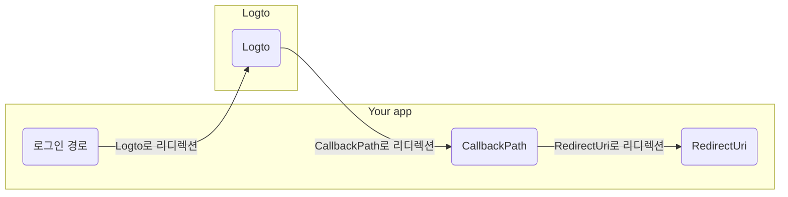

import RegardingRedirectBasedSignIn from '../../fragments/_regarding-redirect-based-sign-in.mdx';

진행하기 전에, .NET Core 인증 미들웨어에서 혼란스러운 두 가지 용어를 명확히 할 필요가 있습니다:

1. **CallbackPath**: 사용자가 로그인한 후 Logto가 사용자를 다시 리디렉션할 URI (Logto의 "리디렉션 URI")
2. **RedirectUri**: Logto 인증 미들웨어에서 필요한 작업이 완료된 후 리디렉션될 URI.

로그인 과정은 다음과 같이 설명할 수 있습니다:

 

유사하게, .NET Core에는 로그아웃 흐름을 위한 **SignedOutCallbackPath**와 **RedirectUri**도 있습니다.

명확성을 위해, 우리는 다음과 같이 용어를 사용할 것입니다:

| 우리가 사용하는 용어           | .NET Core 용어        |
| ------------------------------ | --------------------- |
| Logto 리디렉션 URI             | CallbackPath          |
| Logto 로그아웃 후 리디렉션 URI | SignedOutCallbackPath |
| 애플리케이션 리디렉션 URI      | RedirectUri           |

<RegardingRedirectBasedSignIn />
