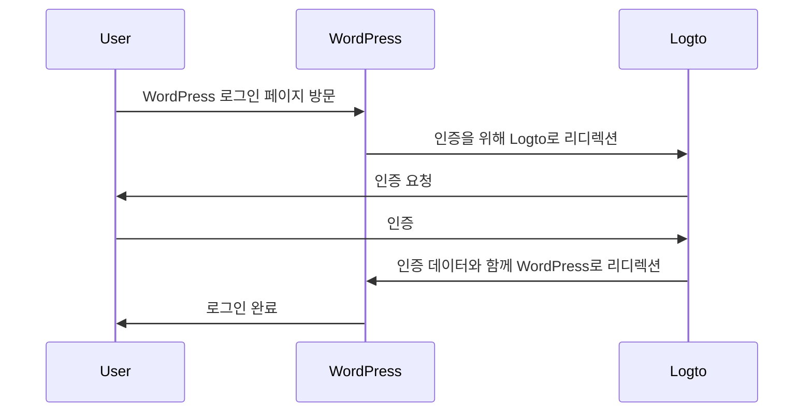
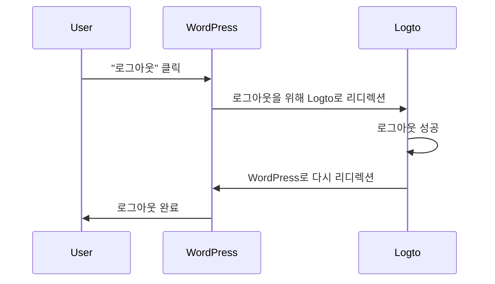

import TabItem from '@theme/TabItem';
import Tabs from '@theme/Tabs';

import FurtherReadings from '../../fragments/_further-readings.md';

# Logto 플러그인으로 WordPress 웹사이트에 인증 (Authentication) 추가하세요

이 튜토리얼에서는 공식 WordPress 플러그인을 사용하여 [Wordpress](https://wordpress.org) 웹사이트에 Logto를 통합하는 방법을 보여드립니다.

## 사전 준비 사항 \{#prerequisites}

- [Logto Cloud](https://cloud.logto.io) 계정 또는 [자체 호스팅 Logto](/introduction/set-up-logto-oss).
- Logto 전통적인 애플리케이션 생성.
- WordPress 프로젝트: 공식 [Wordpress 설치 가이드](https://wordpress.org/support/article/how-to-install-wordpress/)를 따라 WordPress 웹사이트를 설정하세요.

## 통합 \{#integration}

### 플러그인 설치 \{#install-the-plugin}

:::info
현재, 우리의 플러그인은 검토 중이며 WordPress 플러그인 디렉토리에서 사용할 수 없습니다. 사용 가능해지면 이 페이지를 업데이트하겠습니다.
:::

<Tabs>

{/* Uncomment the following block when plugin is available in the WordPress plugin directory */}
{/* <TabItem value="admin-panel" label="From WordPress admin panel"> */}

{/* 1. **플러그인** > **새로 추가**로 이동하세요. */}
{/* 2. "Logto"를 검색하세요. */}
{/* 3. **지금 설치**를 클릭하세요. */}
{/* 4. **활성화**를 클릭하세요. */}

{/* </TabItem> */}

<TabItem value="upload" label="업로드에서">

1. 다음 링크 중 하나에서 Logto WordPress 플러그인을 다운로드하세요:
   - [최신 릴리스](https://github.com/logto-io/wordpress/releases): `logto-plugin-<version>.zip` 형식의 파일을 다운로드하세요.
     {/* Uncomment the following line when plugin is available in the WordPress plugin directory */}
     {/* - [WordPress 플러그인 디렉토리](https://wordpress.org/plugins)에서 "Logto"를 검색하세요. */}
2. 플러그인 ZIP 파일을 다운로드하세요.
3. WordPress 관리자 패널에서 **플러그인** > **새로 추가**로 이동하세요.
4. **플러그인 업로드**를 클릭하세요.
5. 다운로드한 ZIP 파일을 선택하고 **지금 설치**를 클릭하세요.
6. **활성화**를 클릭하세요.

</TabItem>

</Tabs>

### 플러그인 구성 \{#configure-the-plugin}

이제 WordPress 관리자 패널 사이드바에서 Logto 메뉴를 볼 수 있습니다. **Logto** > **설정**을 클릭하여 플러그인을 구성하세요.

:::note
플러그인을 구성하기 전에 Logto Console에서 **전통적인 웹** 애플리케이션을 생성해야 합니다. 아직 생성하지 않았다면, [애플리케이션에 Logto 통합하기](/integrate-logto/integrate-logto-into-your-application)를 참조하세요.
:::

플러그인을 시작하기 위한 최소 구성은 다음과 같습니다:

- Logto 엔드포인트: Logto 테넌트의 엔드포인트.
- 앱 ID: Logto 애플리케이션의 앱 ID.
- 앱 비밀: Logto 애플리케이션의 유효한 앱 비밀 중 하나.

모든 값은 Logto Console의 애플리케이션 세부 정보 페이지에서 찾을 수 있습니다.

값을 입력한 후, **변경 사항 저장**을 클릭하세요 (버튼을 찾을 수 없다면 페이지 하단으로 스크롤하세요).

### 리디렉션 URI 구성 \{#configure-redirect-uri}

리디렉션 URI는 사용자가 인증된 후 Logto가 리디렉션할 URL입니다. 로그아웃 후 리디렉션 URI는 사용자가 로그아웃한 후 Logto가 리디렉션할 URL입니다.

다음은 로그인 흐름을 설명하는 비규범적 시퀀스 다이어그램입니다:

다음은 로그아웃 흐름을 설명하는 비규범적 시퀀스 다이어그램입니다:

리디렉션이 필요한 이유에 대해 더 알고 싶다면, [로그인 경험 설명](/concepts/sign-in-experience)을 참조하세요.

우리의 경우, Logto Console에서 두 리디렉션 URI를 구성해야 합니다. 리디렉션 URI를 찾으려면 WordPress 관리자 패널에서 **Logto** > **설정** 페이지로 이동하세요. **리디렉션 URI** 및 **로그아웃 후 리디렉션 URI** 필드를 볼 수 있습니다.

1. **리디렉션 URI** 및 **로그아웃 후 리디렉션 URI** 값을 복사하여 Logto Console의 **리디렉션 URI** 및 **로그아웃 후 리디렉션 URI** 필드에 붙여넣으세요.
2. Logto Console에서 **변경 사항 저장**을 클릭하세요.

### 체크포인트: WordPress 웹사이트 테스트 \{#checkpoint-test-your-website}

이제 WordPress 웹사이트에서 Logto 통합을 테스트할 수 있습니다:

1. 필요하다면 시크릿 모드 브라우저 창을 엽니다.
2. WordPress 웹사이트를 방문하고 **로그인** 링크를 클릭하거나 로그인 페이지 (예: `https://example.com/wp-login.php`)로 직접 이동하세요.
3. 페이지가 Logto 로그인 페이지로 리디렉션되어야 합니다.
4. 로그인 또는 가입 과정을 완료하세요.
5. 인증이 성공하면 WordPress 웹사이트로 다시 리디렉션되어 자동으로 로그인됩니다.
6. **로그아웃** 링크를 클릭하여 WordPress 웹사이트에서 로그아웃하세요.
7. Logto 로그아웃 페이지로 리디렉션된 후 WordPress 웹사이트로 다시 리디렉션되어야 합니다.
8. WordPress 웹사이트에서 로그아웃되어야 합니다.

## 인증 설정 \{#authentication-settings}

플러그인은 기본적으로 작동하지만, Logto 플러그인 설정 페이지에서 인증 설정을 사용자 정의하여 필요에 맞게 조정할 수 있습니다.

### 스코프 \{#scopes}

Logto는 스코프를 사용하여 애플리케이션과 공유되는 정보를 제어합니다. Logto WordPress 플러그인은 [Logto PHP SDK](https://github.com/logto-io/php)를 사용하여 인증 과정을 처리하며, 기본적으로 다음 스코프를 포함합니다:

- `openid`: OpenID Connect에 필요한 기본 스코프.
- `profile`: 사용자의 기본 프로필 정보를 얻기 위해.
- `offline_access`: 오프라인 액세스를 위한 리프레시 토큰을 얻기 위해.

스코프에 대한 자세한 내용은 [스코프 및 클레임](/quick-starts/php#scopes-and-claims)을 참조하세요.

플러그인은 기본적으로 두 개의 추가 스코프를 추가합니다:

- `email`: 사용자의 이메일 주소를 얻기 위해.
- `roles`: Logto에서 사용자의 역할을 얻기 위해.

이 두 스코프는 Logto 이메일 및 역할을 WordPress 이메일 및 역할에 매핑하는 데 사용됩니다. 플러그인 설정의 **스코프** 필드를 편집하여 스코프를 사용자 정의할 수 있습니다.

:::warning
`email` 또는 `roles` 스코프를 제거하면 플러그인의 일부 기능이 제대로 작동하지 않을 수 있습니다.
:::

### 추가 매개변수 \{#extra-params}

인증 요청에 몇 가지 추가 매개변수를 추가하여 인증 과정을 사용자 정의할 수 있습니다. 예를 들어, `first_screen` 매개변수를 추가하여 인증 과정에서 처음 표시할 화면을 결정할 수 있습니다.

추가 매개변수에 대한 자세한 내용은 [인증 매개변수](/end-user-flows/authentication-parameters)를 참조하세요.

### 인증된 이메일 요구 \{#require-verified-email}

기본적으로 플러그인은 사용자가 WordPress 웹사이트에 로그인하기 위해 Logto에서 인증된 이메일 주소를 가지고 있어야 합니다. 사용자가 인증된 이메일 주소 없이 로그인하려고 하면 플러그인은 오류를 발생시킵니다.

플러그인 설정에서 **인증된 이메일 요구** 옵션을 선택 해제하여 이 기능을 비활성화할 수 있습니다.

### 조직 ID 요구 \{#require-organization-id}

사용자가 WordPress 웹사이트에 로그인하기 위해 Logto에서 특정 조직 멤버십을 가지고 있어야 합니다. 조직 ID가 지정되면 플러그인은 사용자의 ID 토큰에 지정된 조직 ID가 있는지 확인합니다. 그렇지 않으면 오류가 발생합니다.

조직에 대한 자세한 내용은 [조직](/organizations)을 참조하세요.

## 인가 설정 \{#authorization-settings}

인증 외에도 Logto는 [역할 기반 접근 제어 (RBAC)](/authorization/role-based-access-control)와 같은 인가 기능을 제공합니다. 자체 애플리케이션을 개발하는 경우 RBAC를 구현하려면 일부 사용자 정의 코드가 필요하지만, Logto WordPress 플러그인은 Logto 역할을 [WordPress 역할](https://wordpress.org/documentation/article/roles-and-capabilities/)에 매핑하는 내장 방법을 제공합니다.

### 역할 매핑 \{#role-mapping}

Logto WordPress 플러그인은 Logto 역할을 WordPress 역할에 매핑할 수 있습니다. 이는 Logto에서 사용자에게 다른 역할을 할당할 수 있으며, 사용자가 로그인할 때 플러그인이 해당 사용자에게 자동으로 해당 WordPress 역할을 할당한다는 것을 의미합니다.

역할을 매핑하려면 **역할 매핑** 섹션에서 **추가**를 클릭하여 새 역할 매핑을 추가하세요. 예를 들어, Logto에서 `group:editors` 역할을 WordPress의 `Editor` 역할에 매핑하려면 다음 값을 사용하여 새 역할 매핑을 추가할 수 있습니다:

- Logto 역할: `group:editors`
- WordPress 역할: `editor` (WordPress의 `Editor` 역할의 역할 슬러그)

모든 WordPress 역할의 역할 슬러그는 [Roles and Capabilities](https://wordpress.org/documentation/article/roles-and-capabilities/) 문서에서 찾을 수 있습니다.

:::note
역할 슬러그는 대소문자를 구분합니다. `editor` 대신 `Editor`와 같이 역할 이름을 입력하면 역할 매핑이 작동하지 않습니다.
:::

이제 Logto Console로 이동하여 왼쪽 사이드바에서 **Roles**를 클릭하세요. `group:editors`라는 새 역할을 생성하고 사용자에게 할당하세요. 그런 다음 해당 사용자로 WordPress 웹사이트에 로그인하세요. 사용자가 WordPress에서 `Editor` 역할로 할당된 것을 볼 수 있어야 합니다.

:::note
사용자가 WordPress 웹사이트에 로그인한 경우, 사용자가 로그아웃하고 다시 로그인할 때까지 역할 매핑이 적용되지 않습니다.
:::

여러 Logto 역할을 WordPress 역할에 매핑하기 위해 여러 역할 매핑을 추가할 수도 있습니다. 현재 플러그인은 우선 순위 순서로 역할을 매핑하려고 합니다. 예를 들어, 다음과 같은 역할 매핑이 있는 경우:

- Logto 역할: `group:editors`, WordPress 역할: `editor`
- Logto 역할: `group:authors`, WordPress 역할: `author`
- Logto 역할: `group:subscribers`, WordPress 역할: `subscriber`

그리고 사용자가 Logto에서 `group:editors` 및 `group:authors` 역할을 모두 가지고 있는 경우, 사용자는 WordPress에서 `Editor` 역할로 할당됩니다.

## 고급 설정 \{#advanced-settings}

### 세션 기억하기 \{#remember-session}

기본적으로 플러그인은 사용자의 세션을 2주 동안 기억합니다. 이는 사용자가 WordPress 웹사이트에 로그인하면 2주 동안 다시 로그인하라는 메시지가 표시되지 않는다는 것을 의미합니다. 플러그인 설정에서 **세션 기억하기** 옵션을 선택 해제하여 이 시간을 2일로 줄일 수 있습니다.

### 프로필 동기화 \{#sync-profile}

기본적으로 플러그인은 매 로그인 시 사용자의 프로필을 동기화합니다. 이는 사용자가 WordPress 웹사이트에 로그인하면 Logto에서 최신 정보로 프로필이 업데이트된다는 것을 의미합니다. 플러그인 설정에서 **프로필 동기화** 옵션을 선택 해제하여 이 기능을 비활성화할 수 있습니다.

:::warning
이 기능을 비활성화하면 사용자가 처음 로그인할 때만 역할 매핑이 적용됩니다.
:::

### WordPress 폼 로그인 \{#wordpress-form-login}

기본적으로 WordPress 로그인 URL에 `?form=1`을 추가하여 WordPress 폼 로그인을 사용할 수 있습니다. 이는 테스트 목적으로 유용하지만, 사용자가 WordPress 폼으로 로그인하는 것을 허용하지 않으려면 이 기능을 비활성화할 수 있습니다.

### 사용자 이름 전략 \{#username-strategy}

WordPress에서 사용자의 사용자 이름을 생성하는 여러 가지 방법이 있습니다. 사용자의 고유 식별자로 이메일을 사용하는 경우 기본 전략을 사용하는 것이 안전합니다.

## 문제 해결 \{#troubleshooting}

### 콜백 URL이 404를 표시합니다 \{#callback-url-shows-404}

콜백 URL이 404 오류를 표시하는 경우, WordPress 재작성 규칙이 오래되어 수동으로 새로 고쳐야 할 가능성이 큽니다. 이를 위해 WordPress 관리자 패널에서 **설정** > **고유주소**로 이동하거나 `/wp-admin/options-permalink.php`를 직접 방문하여 **변경 사항 저장**을 클릭하세요.

## 자주 묻는 질문 \{#frequently-asked-questions}

### 비밀번호 찾기 흐름을 어떻게 트리거할 수 있나요? \{#how-can-i-trigger-the-forgot-password-flow}

비밀번호 찾기 흐름을 트리거하는 두 가지 방법이 있습니다:

1. Logto 로그인 페이지에서 비밀번호 찾기 링크를 클릭하세요.
2. WordPress 로그인 URL에 `?action=lostpassword`를 추가하세요. 예를 들어, `https://example.com/wp-login.php?action=lostpassword`.
   이는 Logto 비밀번호 찾기 페이지로 리디렉션합니다.

### WordPress 폼 로그인을 어떻게 사용할 수 있나요? \{#how-can-i-use-the-wordpress-form-login}

기본적으로 WordPress 로그인 URL에 `?form=1`을 추가하여 WordPress 폼 로그인을 사용할 수 있습니다. 예를 들어, `https://example.com/wp-login.php?form=1`.

이 기능을 비활성화하려면 플러그인 설정에서 **WordPress 폼 로그인** 옵션을 선택 해제할 수 있습니다.

## 추가 읽을거리 \{#further-readings}

<FurtherReadings />
