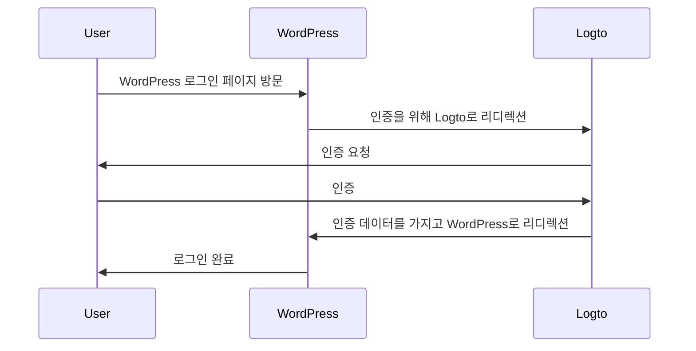
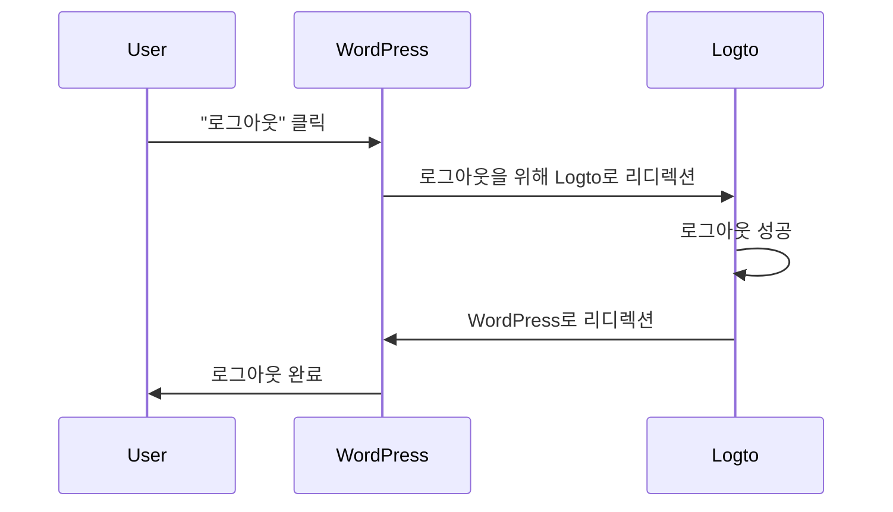

import TabItem from '@theme/TabItem';
import Tabs from '@theme/Tabs';

### 플러그인 설치 \{#install-the-plugin}

:::info
현재, 우리의 플러그인은 검토 중이며 WordPress 플러그인 디렉토리에서 사용할 수 없습니다. 사용 가능해지면 이 페이지를 업데이트하겠습니다.
:::

<Tabs>

{/* 플러그인이 WordPress 플러그인 디렉토리에서 사용 가능해지면 다음 블록의 주석을 해제하세요 */}
{/* <TabItem value="admin-panel" label="WordPress 관리자 패널에서"> */}

{/* 1. **플러그인** > **새로 추가**로 이동하세요. */}
{/* 2. "Logto"를 검색하세요. */}
{/* 3. **지금 설치**를 클릭하세요. */}
{/* 4. **활성화**를 클릭하세요. */}

{/* </TabItem> */}

<TabItem value="upload" label="업로드에서">

1. 다음 링크 중 하나에서 Logto WordPress 플러그인을 다운로드하세요:
   - [최신 릴리스](https://github.com/logto-io/wordpress/releases): `logto-plugin-<version>.zip` 형식의 파일을 다운로드하세요.
     {/* 플러그인이 WordPress 플러그인 디렉토리에서 사용 가능해지면 다음 줄의 주석을 해제하세요 */}
     {/* - [WordPress 플러그인 디렉토리](https://wordpress.org/plugins)에서 "Logto"를 검색하세요. */}
2. 플러그인 ZIP 파일을 다운로드하세요.
3. WordPress 관리자 패널에서 **플러그인** > **새로 추가**로 이동하세요.
4. **플러그인 업로드**를 클릭하세요.
5. 다운로드한 ZIP 파일을 선택하고 **지금 설치**를 클릭하세요.
6. **활성화**를 클릭하세요.

</TabItem>

</Tabs>

### 플러그인 구성 \{#configure-the-plugin}

이제 WordPress 관리자 패널 사이드바에서 Logto 메뉴를 볼 수 있습니다. **Logto** > **설정**을 클릭하여 플러그인을 구성하세요.

:::note
플러그인을 구성하기 전에 Logto Console에서 **전통적인 웹** 애플리케이션을 생성해야 합니다. 아직 생성하지 않았다면, [애플리케이션에 Logto 통합하기](/integrate-logto/integrate-logto-into-your-application)를 참조하세요.
:::

플러그인을 시작하기 위한 최소 구성은 다음과 같습니다:

- Logto 엔드포인트: Logto 테넌트의 엔드포인트.
- 앱 ID: Logto 애플리케이션의 앱 ID.
- 앱 비밀: Logto 애플리케이션의 유효한 앱 비밀 중 하나.

모든 값은 Logto Console의 애플리케이션 세부 정보 페이지에서 찾을 수 있습니다.

값을 입력한 후, **변경 사항 저장**을 클릭하세요 (버튼을 찾을 수 없다면 페이지 하단으로 스크롤하세요).

### 리디렉션 URI 구성 \{#configure-redirect-uri}

리디렉션 URI는 사용자가 인증된 후 Logto가 리디렉션할 URL이며, 로그아웃 후 리디렉션 URI는 사용자가 로그아웃한 후 Logto가 리디렉션할 URL입니다.

다음은 로그인 흐름을 설명하는 비규범적 시퀀스 다이어그램입니다:

다음은 로그아웃 흐름을 설명하는 비규범적 시퀀스 다이어그램입니다:

리디렉션이 필요한 이유에 대해 더 알고 싶다면, [로그인 경험 설명](/concepts/sign-in-experience)을 참조하세요.

우리의 경우, Logto Console에서 두 리디렉션 URI를 구성해야 합니다. 리디렉션 URI를 찾으려면 WordPress 관리자 패널에서 **Logto** > **설정** 페이지로 이동하세요. **리디렉션 URI** 및 **로그아웃 후 리디렉션 URI** 필드를 볼 수 있습니다.

1. **리디렉션 URI** 및 **로그아웃 후 리디렉션 URI** 값을 복사하여 Logto Console의 **리디렉션 URI** 및 **로그아웃 후 리디렉션 URI** 필드에 붙여넣으세요.
2. Logto Console에서 **변경 사항 저장**을 클릭하세요.

### 체크포인트: WordPress 웹사이트 테스트 \{#checkpoint-test-your-website}

이제 WordPress 웹사이트에서 Logto 통합을 테스트할 수 있습니다:

1. 필요하다면 시크릿 모드 브라우저 창을 엽니다.
2. WordPress 웹사이트를 방문하고 **로그인** 링크를 클릭하거나, 직접 로그인 페이지 (예: `https://example.com/wp-login.php`)로 이동합니다.
3. 페이지가 Logto 로그인 페이지로 리디렉션되어야 합니다.
4. 로그인 또는 가입 과정을 완료하세요.
5. 인증이 성공하면, WordPress 웹사이트로 다시 리디렉션되어 자동으로 로그인됩니다.
6. **로그아웃** 링크를 클릭하여 WordPress 웹사이트에서 로그아웃하세요.
7. Logto 로그아웃 페이지로 리디렉션된 후, 다시 WordPress 웹사이트로 리디렉션되어야 합니다.
8. WordPress 웹사이트에서 로그아웃되어야 합니다.
