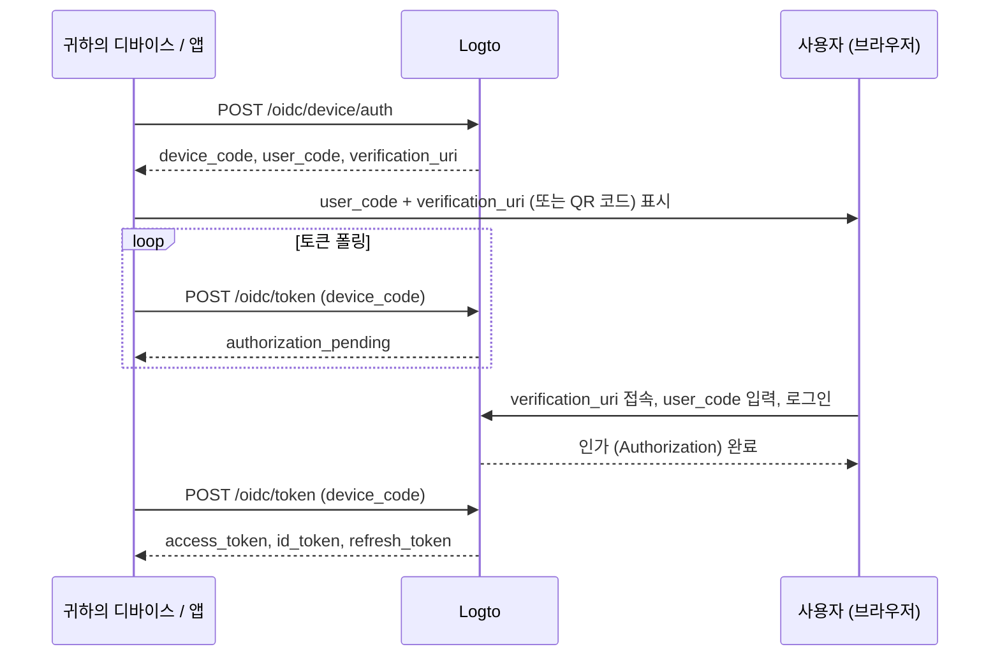

import ApiResourcesDescription from '../../fragments/_api-resources-description.md';
import FurtherReadings from '../../fragments/_further-readings.md';
import ScopeClaimList from '../../fragments/_scope-claim-list.md';
import ScopesAndClaimsIntroduction from '../../fragments/_scopes-claims-introduction.md';

# Device flow: Logto로 인증 (Authentication)하기

:::note
이 가이드는 Logto 콘솔에서 "네이티브" 유형의 애플리케이션을 생성하고, 인가 플로우로 device flow를 선택했다고 가정합니다.
:::

## 소개 (Introduction) \{#introduction}

[OAuth 2.0 디바이스 인가 그랜트](https://auth.wiki/device-flow) (device flow)는 스마트 TV, 게임 콘솔, CLI 도구, IoT 기기 등 입력 기능이 제한된 디바이스를 위해 설계되었습니다. 사용자는 디바이스에서 로그인 과정을 시작하지만, 브라우저가 있는 별도의 기기(예: 휴대폰, 노트북)에서 인증 (Authentication)을 완료할 수 있습니다.

디바이스 자체에서 브라우저 기반 로그인 플로우를 처리할 수 없으므로, 디바이스는 짧은 코드와 URL을 표시합니다. 사용자는 다른 기기에서 해당 URL에 접속해 코드를 입력하고 로그인합니다. 그동안 원래의 디바이스는 인가가 완료될 때까지 Logto에 폴링합니다.



## 애플리케이션 자격 증명 얻기 \{#get-application-credentials}

Logto 콘솔에서 애플리케이션 상세 페이지로 이동하여 다음 자격 증명을 확인하세요:

- **App ID**: 애플리케이션의 고유 식별자 (`client_id`라고도 함).
- **Logto endpoint**: Logto 인가 서버 엔드포인트. Logto 콘솔의 "Application details"에서 확인할 수 있습니다.

Logto Cloud의 경우 엔드포인트는 `https://{your-tenant-id}.logto.app` 입니다.

:::note
Device flow 앱은 공개 클라이언트이므로 App Secret이 필요하지 않습니다.
:::

## 디바이스 코드 요청하기 \{#request-a-device-code}

디바이스 인가 플로우를 시작하려면 device authorization 엔드포인트에 `POST` 요청을 보냅니다:

```bash
curl --request POST 'https://your.logto.endpoint/oidc/device/auth' \
  --header 'Content-Type: application/x-www-form-urlencoded' \
  --data-urlencode 'client_id=your-application-id' \
  --data-urlencode 'scope=openid offline_access profile'
```

응답에는 다음이 포함됩니다:

| 필드                        | 설명                                                                                                                                                         |
| --------------------------- | ------------------------------------------------------------------------------------------------------------------------------------------------------------ |
| `device_code`               | 토큰 엔드포인트 폴링 시 앱에서 사용할 고유 코드입니다.                                                                                                       |
| `user_code`                 | 사용자가 브라우저에 입력할 짧은 코드입니다.                                                                                                                  |
| `verification_uri`          | 사용자가 `user_code`를 입력할 URL입니다.                                                                                                                     |
| `verification_uri_complete` | `user_code`가 미리 입력된 URL입니다. 사용자는 이 URL에 바로 접속해 수동 코드 입력을 건너뛸 수 있습니다. QR 코드, 클릭 가능한 링크 등으로 제공할 수 있습니다. |
| `expires_in`                | `device_code` 및 `user_code`의 유효 시간(초)입니다. 만료 후에는 폴링을 중단해야 합니다.                                                                      |

## 사용자에게 인증 URL 표시하기 \{#display-verification-url}

디바이스 화면에 `user_code`와 `verification_uri`를 표시하세요.

또는 코드가 미리 입력된 `verification_uri_complete`를 사용할 수도 있습니다. 사용자는 확인만 하면 됩니다. QR 코드, 클릭 가능한 링크 등 원하는 방식으로 제공할 수 있습니다.

## 토큰 폴링하기 \{#poll-for-tokens}

사용자가 브라우저에서 인증 (Authentication)을 완료하는 동안, 디바이스는 토큰 엔드포인트를 폴링해야 합니다. 앱은 폴링 요청 사이에 최소 **5초** 이상 대기해야 합니다:

```bash
curl --request POST 'https://your.logto.endpoint/oidc/token' \
  --header 'Content-Type: application/x-www-form-urlencoded' \
  --data-urlencode 'client_id=your-application-id' \
  --data-urlencode 'grant_type=urn:ietf:params:oauth:grant-type:device_code' \
  --data-urlencode 'device_code=DEVICE_CODE'
```

`DEVICE_CODE`를 device authorization 응답에서 받은 `device_code` 값으로 교체하세요.

**폴링을 중단**해야 하는 경우:

- 토큰 응답을 성공적으로 받은 경우
- device code 응답의 `expires_in` 시간이 경과한 경우
- `expired_token` 또는 `access_denied`와 같은 재시도 불가 오류를 받은 경우

### 토큰 응답 \{#token-response}

사용자가 승인을 완료하면 응답에는 다음이 포함됩니다:

| 필드            | 설명                                                                                                                                     |
| --------------- | ---------------------------------------------------------------------------------------------------------------------------------------- |
| `access_token`  | 액세스 토큰 (Access token). 기본적으로 불투명 토큰 (Opaque token)이며, `resource`를 요청하면 해당 리소스 URI가 `aud`로 설정된 JWT입니다. |
| `id_token`      | 사용자 아이덴티티 클레임 (Claim)이 포함된 ID 토큰 (ID token). `openid` 스코프를 요청한 경우에만 제공됩니다.                              |
| `refresh_token` | 재인증 없이 새 토큰을 얻을 때 사용합니다. `offline_access` 스코프를 요청한 경우에만 제공됩니다.                                          |
| `token_type`    | 항상 `Bearer`입니다.                                                                                                                     |
| `expires_in`    | 토큰의 유효 시간(초)입니다.                                                                                                              |
| `scope`         | 인가 서버가 부여한 스코프 (Scope)입니다.                                                                                                 |

## 체크포인트: 디바이스 플로우 테스트하기 \{#checkpoint}

이제 디바이스 플로우 연동을 테스트하세요:

1. 앱을 실행하고 device flow를 트리거하여 `device_code`와 `user_code`를 받으세요.
2. 브라우저에서 `verification_uri`를 열고 `user_code`를 입력하거나, `verification_uri_complete`로 수동 입력을 건너뛰세요.
3. 브라우저에서 로그인 과정을 완료하세요.
4. 앱이 폴링 후 토큰을 정상적으로 받는지 확인하세요.

## 사용자 정보 얻기 \{#get-user-information}

### ID 토큰 클레임 (Claim) 디코딩하기 \{#decode-id-token-claims}

토큰 응답에서 반환된 `id_token`은 표준 [JSON Web Token (JWT)](https://auth.wiki/jwt)입니다. Base64URL로 인코딩된 페이로드(마침표로 구분된 두 번째 부분)를 디코딩하면 추가 네트워크 요청 없이 기본 사용자 클레임 (Claim)에 접근할 수 있습니다.

디코딩된 페이로드에는 요청한 스코프 (Scope)에 따라 `sub`(사용자 ID), `name`, `email` 등 클레임 (Claim)이 포함됩니다.

:::tip
운영 환경에서는 JWT 서명을 검증한 후 클레임 (Claim)을 신뢰해야 합니다. Logto 엔드포인트의 JWKS (`https://your.logto.endpoint/oidc/jwks`)를 사용해 토큰을 검증하세요.
:::

### userinfo 엔드포인트에서 가져오기 \{#fetch-from-userinfo-endpoint}

ID 토큰에는 요청한 스코프 (Scope)에 따라 기본 클레임 (Claim)만 포함됩니다. 일부 확장 클레임 (예: `custom_data`, `identities`)은 [OIDC UserInfo 엔드포인트](https://openid.net/specs/openid-connect-core-1_0.html#UserInfo)에서만 확인할 수 있습니다:

```bash
curl --request GET 'https://your.logto.endpoint/oidc/me' \
  --header 'Authorization: Bearer ACCESS_TOKEN'
```

`ACCESS_TOKEN`을 토큰 응답에서 받은 불투명 액세스 토큰 (Opaque token) (JWT 리소스 토큰이 아님)으로 교체하세요. 응답은 부여된 스코프 (Scope)에 따라 사용자의 클레임 (Claim)이 포함된 JSON 객체입니다.

### 추가 클레임 (Claim) 요청하기 \{#request-additional-claims}

ID 토큰에 일부 사용자 정보가 누락된 경우가 있습니다. 이는 OAuth 2.0 및 OpenID Connect (OIDC)가 최소 권한 원칙(PoLP)을 따르도록 설계되었고, Logto도 이를 기반으로 하기 때문입니다.

<ScopesAndClaimsIntroduction />

추가 스코프 (Scope)를 요청하려면 device authorization 요청의 `scope` 파라미터에 포함하세요. 예를 들어, 사용자의 이메일과 전화번호를 요청하려면:

```bash
curl --request POST 'https://your.logto.endpoint/oidc/device/auth' \
  --header 'Content-Type: application/x-www-form-urlencoded' \
  --data-urlencode 'client_id=your-application-id' \
  --data-urlencode 'scope=openid offline_access profile email phone'
```

### 스코프 (Scope)와 클레임 (Claim) \{#scopes-and-claims}

<ScopeClaimList />

## API 리소스와 조직 \{#api-resources-and-organizations}

<ApiResourcesDescription />

### API 리소스 접근 요청하기 \{#request-access-for-api-resources}

특정 API 리소스에 접근하려면 device authorization 요청에 `resource` 파라미터를 포함하세요:

```bash
curl --request POST 'https://your.logto.endpoint/oidc/device/auth' \
  --header 'Content-Type: application/x-www-form-urlencoded' \
  --data-urlencode 'client_id=your-application-id' \
  --data-urlencode 'scope=openid offline_access' \
  --data-urlencode 'resource=https://your-api-resource-indicator'
```

사용자가 인가 (Authorization)를 완료하고 refresh token을 받으면, 해당 API 리소스용 JWT 액세스 토큰 (Access token)을 가져올 수 있습니다:

```bash
curl --request POST 'https://your.logto.endpoint/oidc/token' \
  --header 'Content-Type: application/x-www-form-urlencoded' \
  --data-urlencode 'client_id=your-application-id' \
  --data-urlencode 'grant_type=refresh_token' \
  --data-urlencode 'refresh_token=REFRESH_TOKEN' \
  --data-urlencode 'resource=https://your-api-resource-indicator'
```

응답에는 API 리소스 인디케이터가 `aud`로 설정된 JWT `access_token`이 포함됩니다.

:::note
`refresh_token`은 최초 device authorization 요청에 `offline_access` 스코프 (Scope)가 포함된 경우에만 제공됩니다. Logto는 토큰 로테이션을 사용하므로 항상 최신 `refresh_token`을 저장하고 사용하세요.
:::

### 조직 토큰 (Organization token) 가져오기 \{#fetch-organization-tokens}

[조직](/organizations)이 처음이라면, [🏢 조직 (다중 테넌시)](/organizations)를 먼저 읽어보세요.

조직 관련 정보를 요청하려면 device authorization 요청에 `urn:logto:scope:organizations` 스코프 (Scope)를 추가하세요:

```bash
curl --request POST 'https://your.logto.endpoint/oidc/device/auth' \
  --header 'Content-Type: application/x-www-form-urlencoded' \
  --data-urlencode 'client_id=your-application-id' \
  --data-urlencode 'scope=openid offline_access urn:logto:scope:organizations' \
  --data-urlencode 'resource=urn:logto:resource:organizations'
```

사용자가 로그인하면 refresh token을 사용해 조직 토큰 (Organization token)을 가져올 수 있습니다:

```bash
curl --request POST 'https://your.logto.endpoint/oidc/token' \
  --header 'Content-Type: application/x-www-form-urlencoded' \
  --data-urlencode 'client_id=your-application-id' \
  --data-urlencode 'grant_type=refresh_token' \
  --data-urlencode 'refresh_token=REFRESH_TOKEN' \
  --data-urlencode 'organization_id=your-organization-id'
```

응답에는 지정한 조직에 범위가 지정된 액세스 토큰 (Access token)이 포함됩니다.

#### 조직 API 리소스 \{#organization-api-resources}

조직 내 API 리소스용 액세스 토큰을 가져오려면 `resource`와 `organization_id` 파라미터를 모두 포함하세요:

```bash
curl --request POST 'https://your.logto.endpoint/oidc/token' \
  --header 'Content-Type: application/x-www-form-urlencoded' \
  --data-urlencode 'client_id=your-application-id' \
  --data-urlencode 'grant_type=refresh_token' \
  --data-urlencode 'refresh_token=REFRESH_TOKEN' \
  --data-urlencode 'organization_id=your-organization-id' \
  --data-urlencode 'resource=https://your-api-resource-indicator'
```

## 추가 자료 \{#further-readings}

<FurtherReadings />
