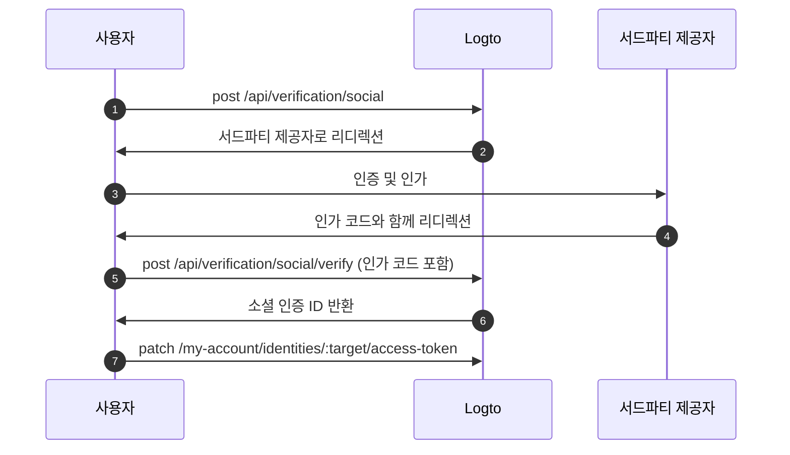

import Availability from '@components/Availability';

<Availability cloud oss={{ major: 1, minor: 31 }} />

연동 토큰 세트 (Federated token set)는 Logto의 Secret Vault에 저장되는 비밀 유형으로, 연동된 서드파티 아이덴티티 제공자가 발급한 액세스 토큰 (Access token) 및 리프레시 토큰 (Refresh token)을 안전하게 관리하는 데 사용됩니다. 사용자가 소셜 또는 엔터프라이즈 싱글 사인온 (SSO) 커넥터를 통해 인증 (Authentication)할 때, Logto는 발급된 토큰을 금고에 저장합니다. 이러한 토큰은 이후 재인증 없이 사용자를 대신하여 서드파티 API에 접근하기 위해 조회할 수 있습니다.

## 연동 토큰 저장 활성화 \{#enable-federated-token-storage}

### 소셜 커넥터 \{#social-connectors}

:::Info
이 기능은 토큰 저장을 지원하는 커넥터에서만 사용할 수 있습니다. 현재 지원되는 커넥터는 다음과 같습니다: [GitHub](/integrations/github), [Google](/integrations/google), [Facebook](/integrations/facebook), [Standard OAuth 2.0](/integrations/oauth2), [Standard OIDC](/integrations/oidc). 추가 커넥터 지원은 점진적으로 제공될 예정입니다.
:::

1. <CloudLink to="/connectors/social">콘솔 > 커넥터 > 소셜 커넥터</CloudLink>로 이동하세요.
2. 연동 토큰 저장을 활성화하려는 소셜 커넥터를 선택하세요.
3. "설정" 페이지에서 **지속적인 API 접근을 위한 토큰 저장** 옵션을 활성화하세요.

### 엔터프라이즈 SSO 커넥터 \{#enterprise-sso-connectors}

:::Info
토큰 저장은 모든 OIDC 엔터프라이즈 커넥터에서 사용할 수 있습니다.
:::

1. <CloudLink to="/enterprise-sso">콘솔 > 엔터프라이즈 SSO</CloudLink>로 이동하세요.
2. 연동 토큰 저장을 활성화하려는 엔터프라이즈 SSO 커넥터를 선택하세요.
3. "SSO 경험" 탭에서 **지속적인 API 접근을 위한 토큰 저장** 옵션을 활성화하세요.

변경 사항을 반드시 저장하세요.

## 토큰 저장 \{#token-storage}

연동 토큰 저장이 활성화되면, 사용자가 소셜 또는 엔터프라이즈 SSO 커넥터를 통해 인증할 때마다 Logto는 연동된 아이덴티티 제공자가 발급한 액세스 토큰 (Access token) 및 리프레시 토큰 (Refresh token)을 자동으로 저장합니다. 여기에는 다음이 포함됩니다:

- [소셜 로그인 및 회원가입](/end-user-flows/sign-up-and-sign-in/social-sign-in)
- [엔터프라이즈 SSO 로그인 및 회원가입](/end-user-flows/enterprise-sso)
- [Account API를 통한 소셜 계정 연결](/end-user-flows/account-settings/by-account-api#link-a-new-social-connection)

저장된 토큰은 사용자의 소셜 또는 엔터프라이즈 SSO 아이덴티티에 연결되어, 재인증 없이 나중에 API 접근을 위해 토큰을 조회할 수 있습니다.

### 토큰 저장 상태 확인 \{#checking-token-storage-status}

Logto 콘솔에서 사용자의 연동 토큰 저장 상태를 확인할 수 있습니다:

1. <CloudLink to="/users">콘솔 > 사용자</CloudLink>로 이동하세요.
2. 확인하려는 사용자를 클릭하세요. 해당 사용자의 상세 페이지로 이동합니다.
3. **연결** 섹션까지 스크롤하세요. 이 영역에는 사용자와 연결된 모든 소셜 및 엔터프라이즈 SSO 연결이 나열됩니다.
4. 각 연결 항목에는 해당 연결에 대해 토큰이 저장되어 있는지 표시하는 토큰 상태 레이블이 있습니다.
5. 연결 항목을 클릭하면 저장된 액세스 토큰 (Access token) 메타데이터 및 리프레시 토큰 (Refresh token) 사용 가능 여부(가능한 경우)를 포함한 자세한 정보를 볼 수 있습니다.

또한 관리 API를 통해 사용자 서드파티 아이덴티티 및 토큰 저장 상태를 확인할 수 있습니다:

- `GET /api/users/{userId}/identities/{target}?includeTokenSecret=true`: 지정한 커넥터 타겟(예: `github`, `google` 등)으로 연결된 사용자의 소셜 아이덴티티 및 토큰 저장 상태를 조회합니다.
- `GET /api/users/{userId}/sso-identities/{ssoConnectorId}?includeTokenSecret=true`: 지정한 SSO 커넥터 ID로 연결된 사용자의 엔터프라이즈 SSO 아이덴티티 및 토큰 저장 상태를 조회합니다.

### 토큰 저장 상태 \{#token-storage-status}

- **활성(Active)**: 액세스 토큰 (Access token)이 저장되어 있고 활성 상태입니다.
- **만료(Expired)**: 액세스 토큰 (Access token)이 저장되어 있지만 만료되었습니다. 리프레시 토큰 (Refresh token)이 있으면 새 액세스 토큰을 얻는 데 사용할 수 있습니다.
- **비활성(Inactive)**: 이 연결에 대해 저장된 액세스 토큰 (Access token)이 없습니다. 사용자가 이 연결을 통해 인증하지 않았거나 토큰 저장이 삭제된 경우 발생할 수 있습니다.
- **해당 없음(Not applicable)**: 해당 커넥터가 토큰 저장을 지원하지 않습니다.

### 토큰 메타데이터 \{#token-metadata}

데이터 무결성과 보안을 위해, 모든 토큰은 Secret Vault에 저장되기 전에 암호화됩니다. 실제 토큰 값은 적절한 인가 (Authorization)를 받은 최종 사용자만 접근할 수 있습니다. 개발자는 민감한 내용을 노출하지 않고 저장된 토큰의 상태를 파악하기 위해 토큰 세트 메타데이터만 조회할 수 있습니다.

- `createdAt`: 연결이 처음 생성되고 토큰 세트가 Secret Vault에 최초로 저장된 시각입니다.
- `updatedAt`: 토큰 세트가 마지막으로 업데이트된 시각입니다.
  - 리프레시 토큰 (Refresh token)이 없으면 이 값은 **createdAt**과 동일합니다.
  - 리프레시 토큰이 있으면, 이 값은 액세스 토큰이 가장 최근에 갱신된 시각을 반영합니다.
- `hasRefreshToken`: 리프레시 토큰 (Refresh token) 사용 가능 여부를 나타냅니다.
  커넥터가 오프라인 접근을 지원하고 인가 요청이 적절히 구성된 경우, Logto는 아이덴티티 제공자가 액세스 토큰과 함께 리프레시 토큰을 발급할 때 이를 저장합니다.
  액세스 토큰이 만료되고 유효한 리프레시 토큰이 존재하면, 사용자가 연결된 제공자에 접근을 요청할 때마다 Logto는 저장된 리프레시 토큰을 사용해 자동으로 새 액세스 토큰을 얻으려고 시도합니다.
- `expiresAt`: 액세스 토큰 (Access token)의 예상 만료 시각(초 단위)입니다.
  이는 아이덴티티 제공자의 토큰 엔드포인트에서 반환된 `expires_in` 값을 기반으로 계산됩니다. (이 필드는 제공자가 토큰 응답에 `expires_in`을 포함할 때만 제공됩니다.)
- `scope`: 액세스 토큰 (Access token)의 스코프로, 아이덴티티 제공자가 부여한 권한 (Permission)을 나타냅니다.
  저장된 액세스 토큰으로 어떤 작업을 수행할 수 있는지 이해하는 데 유용합니다. (이 필드는 제공자가 토큰 응답에 `scope`를 포함할 때만 제공됩니다.)
- `tokenType`: 액세스 토큰 (Access token)의 유형으로, 일반적으로 "Bearer"입니다.
  (이 필드는 제공자가 토큰 응답에 `token_type`을 포함할 때만 제공됩니다.)

## 토큰 조회 \{#token-retrieval}

토큰 저장이 활성화되고 토큰이 Logto의 Secret Vault에 안전하게 저장되면, 최종 사용자는 Logto의 [User Account API](/end-user-flows/account-settings/by-account-api)를 통합하여 클라이언트 애플리케이션에서 서드파티 액세스 토큰을 조회할 수 있습니다.

- `GET /my-account/identities/:target/access-token`: 커넥터 타겟(예: github, google)을 지정하여 소셜 아이덴티티의 액세스 토큰을 조회합니다.

- `GET /my-account/sso-identities/:connectorId/access-token`: 커넥터 ID를 지정하여 엔터프라이즈 SSO 아이덴티티의 액세스 토큰을 조회합니다.

:::info
Logto에서 발급한 액세스 토큰 (Access token)을 사용하여 [Account API 활성화](/end-user-flows/account-settings/by-account-api#how-to-enable-account-api) 및 [Account API 접근](/end-user-flows/account-settings/by-account-api#access-account-api-using-access-token) 방법을 알아보세요.
:::

### 토큰 회전(Token rotation) \{#token-rotation}

토큰 조회 엔드포인트는 다음과 같이 응답합니다:

- `200` OK: 액세스 토큰 (Access token)이 성공적으로 조회되었고 여전히 유효한 경우.
- `404` Not Found: 지정한 타겟 또는 커넥터 ID와 연결된 소셜 또는 엔터프라이즈 SSO 아이덴티티가 없거나, 액세스 토큰이 저장되어 있지 않은 경우.
- `401` Unauthorized: 액세스 토큰 (Access token)이 만료된 경우.

액세스 토큰이 만료되었고 리프레시 토큰 (Refresh token)이 있는 경우, Logto는 자동으로 액세스 토큰을 갱신하여 응답에 새 액세스 토큰을 반환합니다. Secret Vault의 토큰 저장소도 새 액세스 토큰과 메타데이터로 업데이트됩니다.

## 토큰 저장 삭제 \{#token-storage-deletion}

연동 토큰 저장은 각 사용자의 소셜 또는 엔터프라이즈 SSO 연결과 직접적으로 연결되어 있습니다. 즉, 다음과 같은 경우 저장된 토큰 세트가 자동으로 삭제됩니다:

- 연결된 소셜 또는 엔터프라이즈 SSO 아이덴티티가 사용자 계정에서 제거된 경우.
- 사용자 계정이 테넌트에서 삭제된 경우.
- 소셜 또는 엔터프라이즈 SSO 커넥터가 테넌트에서 삭제된 경우.

### 토큰 폐기(Revoking tokens) \{#revoking-tokens}

사용자의 서드파티 토큰 세트를 수동으로 삭제하여 접근을 폐기할 수도 있습니다:

- 콘솔에서:
  사용자 아이덴티티 상세 페이지로 이동하세요. **액세스 토큰 (Access token)** 섹션(토큰 저장이 가능한 경우)까지 스크롤한 후, 섹션 끝에 있는 **토큰 삭제** 버튼을 클릭하세요.
- 관리 API를 통해:
  - `DELETE /api/secret/:id`: 사용자 아이덴티티 상세 정보에서 얻을 수 있는 ID로 특정 비밀을 삭제합니다.

토큰 세트를 폐기하면 사용자는 서드파티 API에 다시 접근하기 전에 서드파티 제공자와 재인증해야 새 액세스 토큰을 얻을 수 있습니다.

## 재인증 및 토큰 갱신 \{#reauthentication-and-token-renewal}

저장된 액세스 토큰이 만료되었거나 애플리케이션에서 추가 API 스코프를 요청해야 하는 경우, 최종 사용자는 서드파티 제공자와 재인증하여 새로운 액세스 토큰을 얻을 수 있습니다—Logto에 다시 로그인할 필요 없이 가능합니다.
이는 Logto의 [Social Verification API](https://openapi.logto.io/operation/operation-createverificationbysocial)를 통해 구현할 수 있으며, 사용자가 연동 소셜 인가 플로우를 재시작하고 저장된 토큰 세트를 업데이트할 수 있습니다.

:::note
연동 인가 재시작은 현재 소셜 커넥터에 한정되어 있습니다.
엔터프라이즈 SSO 커넥터의 경우, 재인증 및 토큰 갱신을 위해 사용자가 Logto 인증 (Authentication) 플로우 전체를 다시 시작해야 하며, 로그인 이후 엔터프라이즈 SSO 제공자와의 직접 재인가 (Reauthorization)는 현재 지원되지 않습니다.
:::



1. 사용자가 `POST /api/verification/social` 엔드포인트를 호출하여 소셜 인증 요청을 시작합니다. 사용자는 서드파티 제공자로부터 추가 권한 (Permission)을 요청하기 위해 커스텀 스코프를 지정할 수 있습니다.

   ```sh
   curl -X POST https://<your-logto-domain>/api/verification/social \
     -H "Authorization: Bearer <access_token>" \
     -H "Content-Type: application/json" \
     -d '{
       "state": "<state>",
       "connectorId": "<logto_connectorId>",
       "redirectUri": "<redirect_uri>",
       "scope": "<custom_scope>"
     }'
   ```

   - **authorization header**: Logto에서 발급한 사용자의 액세스 토큰 (Access token).
   - **connectorId**: Logto의 소셜 커넥터 ID.
   - **redirectUri**: 인증 후 사용자를 애플리케이션으로 리디렉션할 URI. 이 URI를 제공자의 애플리케이션 설정에 등록해야 합니다.
   - **scope**: (선택 사항) 서드파티 제공자로부터 추가 권한 (Permission)을 요청할 커스텀 스코프. 지정하지 않으면 커넥터에 구성된 기본 스코프가 사용됩니다.

2. Logto는 새로운 소셜 인증 레코드를 생성하고, 인증을 위해 사용자를 서드파티 제공자로 리디렉션할 인가 URL과 함께 소셜 인증 ID를 반환합니다.

   응답 예시는 다음과 같습니다:

   ```json
   {
     "verificationRecordId": "<social_verification_id>",
     "authorizationUri": "<authorization_url>",
     "expiresAt": "<expiration_time>"
   }
   ```

3. 사용자를 인가 URL로 리디렉션하세요. 사용자는 서드파티 제공자와 인증 및 권한 부여를 진행합니다.

4. 서드파티 제공자는 인가 코드를 포함하여 사용자를 클라이언트 애플리케이션으로 리디렉션합니다.

5. 인가 콜백을 처리하여 인가 코드를 Logto의 인증 엔드포인트로 전달하세요:

   ```sh
   curl -X POST https://<your-logto-domain>/api/verification/social/verify \
     -H "Authorization: Bearer <access_token>" \
     -d '{
       "verificationRecordId": "<social_verification_id>",
       "connectorData": {
         "code": "<authorization_code>",
         "state": "<state>",
         "redirectUri": "<redirect_uri>"
       }
     }'
   ```

   - **authorization header**: Logto에서 발급한 사용자의 액세스 토큰 (Access token).
   - **verificationRecordId**: 이전 단계에서 반환된 소셜 인증 ID.
   - **connectorData**: 콜백 시 서드파티 제공자가 반환한 인가 코드 및 기타 데이터.

   :::note
   CSRF 공격을 방지하기 위해 반드시 `state` 파라미터를 검증하세요.
   :::

6. Logto는 인가 코드를 검증하고, 서드파티 제공자로부터 새 액세스 토큰 (Access token) 및 리프레시 토큰 (Refresh token)을 교환한 후, 응답에 소셜 인증 ID를 반환합니다.

7. 마지막으로, 소셜 인증 ID를 사용하여 `PATCH /my-account/identities/:target/access-token` 엔드포인트를 호출해 사용자의 토큰 저장소를 업데이트하세요:

   ```sh
   curl -X PATCH https://<your-logto-domain>/my-account/identities/<target>/access-token \
     -H "Authorization: Bearer <access_token>" \
     -H "Content-Type: application/json" \
     -d '{
       "socialVerificationId": "<social_verification_id>"
     }'
   ```

   - **authorization header**: Logto에서 발급한 사용자의 액세스 토큰 (Access token).
   - **socialVerificationId**: 이전 단계에서 반환된 소셜 인증 레코드 ID.

   이 과정을 통해 Logto의 Secret Vault에 사용자의 토큰 세트가 새 액세스 토큰 및 리프레시 토큰으로 업데이트되어, 사용자는 Logto에 다시 로그인하지 않고도 서드파티 API에 접근할 수 있습니다.

   업데이트된 액세스 토큰이 반환됩니다.
