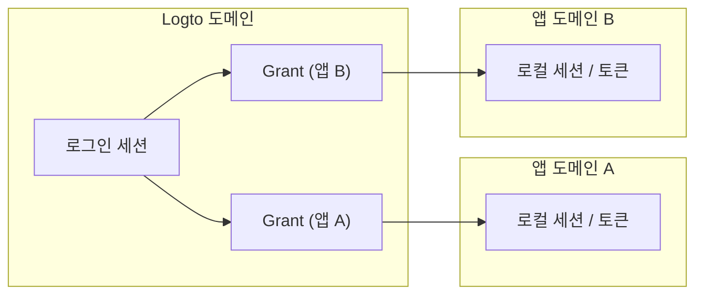
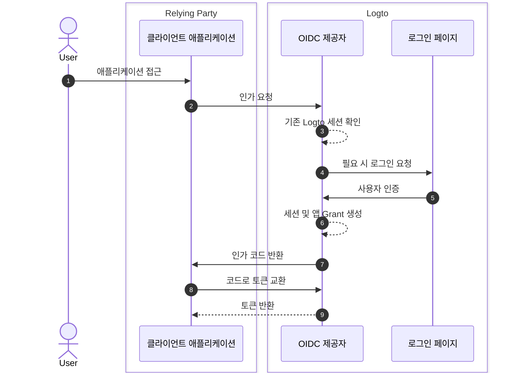
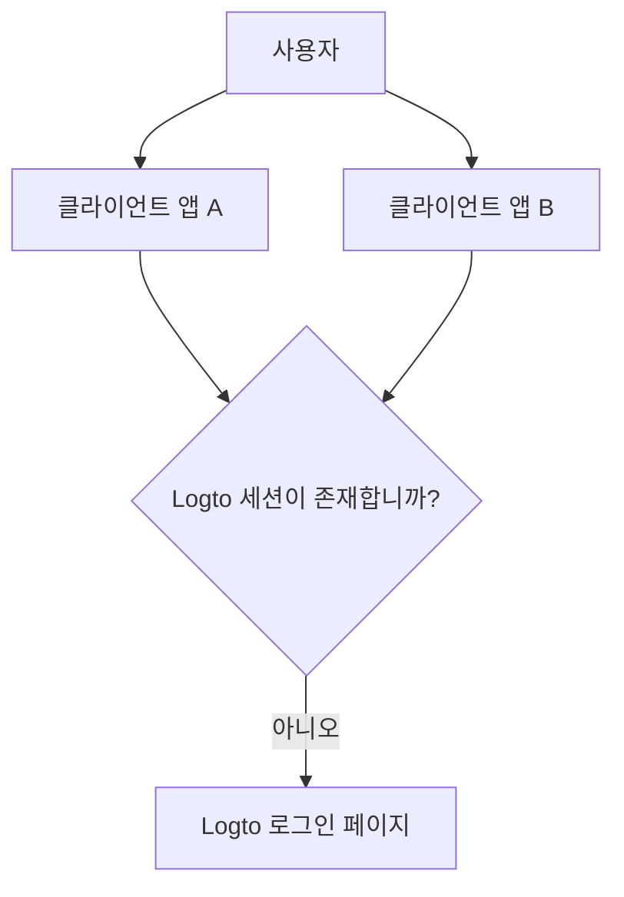

# 세션

Logto에서 세션은 인증 상태가 앱, 브라우저, 장치 간에 어떻게 생성, 공유, 갱신, 취소되는지를 정의합니다.

실제로 사용자는 "로그인됨"이라는 하나의 상태를 경험하지만, 시스템 상태는 여러 계층으로 나뉩니다. 이러한 계층을 이해하는 것이 예측 가능한 싱글 사인온 (SSO), 토큰 갱신, 로그아웃 동작을 설계하는 열쇠입니다.

## Logto의 세션 모델 \{#session-model-in-logto}

- **Logto 로그인 세션**: Logto 도메인 쿠키로 저장된 중앙 집중식 로그인 상태입니다. 이는 현재 브라우저 컨텍스트에서 SSO 사용 가능성을 제어합니다.
- **Grant**: `사용자 + 클라이언트 앱`에 대한 앱별 인가 상태입니다. Grant는 중앙 집중식 로그인과 앱 토큰 발급 간의 다리 역할을 합니다.
- **앱 로컬 세션/토큰**: 각 앱의 로컬 인증 상태 (ID / 액세스 / 리프레시 토큰, 앱 세션 쿠키 등)입니다.

## 핵심 개념 \{#core-concepts}

### Logto 세션이란 무엇인가요? \{#what-is-a-logto-session}

Logto 세션은 성공적인 로그인 후 생성되는 중앙 집중식 인증 상태입니다. 여전히 유효하다면, Logto는 동일한 테넌트 내의 다른 앱에 대해 사용자를 조용히 인증할 수 있습니다. 존재하지 않는 경우, 사용자는 다시 로그인해야 합니다.

### Grant란 무엇인가요? \{#what-are-grants}

Grant는 특정 사용자와 클라이언트 앱에 연결된 앱 수준의 인가 상태입니다.

- 하나의 Logto 세션은 여러 앱에 대한 Grant를 가질 수 있습니다.
- 앱에 대한 토큰은 해당 앱의 Grant 하에 발급됩니다.
- Grant를 취소하면 해당 앱의 토큰 기반 접근 능력에 영향을 미칩니다.

### 세션, Grant, 앱 인증 상태의 관계 \{#how-session-grants-and-app-auth-state-relate}

- **세션**은 "이 브라우저가 지금 Logto와 SSO를 할 수 있는가?"에 답합니다.
- **Grant**는 "이 사용자가 이 클라이언트 앱에 대해 인가되었는가?"에 답합니다.
- **앱 로컬 세션**은 "이 앱이 현재 사용자를 로그인된 상태로 취급하는가?"에 답합니다.

## 로그인 및 세션 생성 \{#sign-in-and-session-creation}

## 앱 및 장치 간의 세션 토폴로지 \{#session-topology-across-apps-and-devices}

### 동일한 브라우저: 공유된 Logto 세션 \{#same-browser-shared-logto-session}

동일한 브라우저의 앱은 중앙 집중식 Logto 세션 상태를 공유할 수 있으므로, 반복적인 자격 증명 입력 없이 SSO가 가능합니다.

### 다른 브라우저 또는 장치: 분리된 Logto 세션 \{#different-browsers-or-devices-isolated-logto-sessions}

각 브라우저 / 장치는 별도의 쿠키 저장소를 가집니다. 장치 A에서 유효한 세션이 장치 B에서 유효한 세션을 의미하지는 않습니다.

## 세션 수명 주기 \{#session-lifecycle}

### 1. 생성 \{#1-create}

사용자 인증 후, Logto는 중앙 집중식 세션과 앱별 Grant를 생성합니다.

### 2. 재사용 (SSO) \{#2-reuse-sso}

동일한 브라우저에서 세션 쿠키가 유효한 한, 새로운 인가 요청은 종종 조용히 완료될 수 있습니다.

### 3. 토큰 갱신 \{#3-renew-tokens}

앱 접근은 일반적으로 토큰 갱신 흐름을 통해 계속됩니다 (활성화된 경우). 이는 중앙 집중식 Logto 세션이 여전히 존재하는지 여부와는 별개로 앱 수준의 연속성입니다.

### 4. 취소 / 만료 \{#4-revokeexpire}

취소는 다양한 계층에서 발생할 수 있습니다:

- 로컬 앱 로그아웃은 앱 로컬 토큰 / 세션을 제거합니다.
- 세션 종료는 중앙 집중식 Logto 세션을 제거합니다.
- Grant 취소는 앱 수준의 인가 연속성을 제거합니다.

## 설계 권장 사항 \{#design-recommendations}

- 앱 로컬 세션 처리를 앱 코드에서 명시적으로 유지하세요.
- Logto 세션, Grant, 앱 로컬 세션을 별도의 계층으로 취급하세요.
- 로그아웃이 앱 로컬만인지 글로벌인지 선택하세요.
- 여러 앱의 일관성을 요구할 때 [백채널 로그아웃](/end-user-flows/sign-out#federated-sign-out-back-channel-logout)을 사용하세요.
- 로그아웃 동작 및 구현 세부 사항은 [로그아웃](/end-user-flows/sign-out)을 참조하세요.

## 접근 취소를 위한 모범 사례 \{#best-practices-for-revoking-access}

목표에 따라 다른 취소 전략을 사용하세요:

- **자사 앱에서 접근 취소**:
  `revokeGrantsTarget=firstParty`로 대상 세션을 취소하세요.
  이는 해당 세션과 연결된 자사 앱 전반에서 사용자를 로그아웃시켜 일관된 로그아웃 경험을 만듭니다.
  동시에, `offline_access`가 부여된 타사 앱에 대한 Grant는 계속 사용할 수 있습니다.
  세션 취소 세부 사항은 [사용자 세션 관리](/sessions/manage-user-sessions)를 참조하세요.

- **타사 앱에 대한 접근 취소**:
  다음 중 하나를 선택하세요:

  - `revokeGrantsTarget=all`로 세션을 취소하여 해당 세션과 연결된 모든 Grant를 취소합니다.
  - Grant 관리 API를 통해 특정 Grant를 직접 취소하여 전체 세션 로그아웃을 강제하지 않고 타사 앱 인가를 제거합니다.
    Grant별 취소 전략은 [사용자 인가 앱 (Grant) 관리](/sessions/grants-management)를 참조하세요.

- **Logto 콘솔 사용 시**:
  사용자 세부 정보 페이지에서 Logto는 기본적으로 세션 관리 및 인가된 타사 앱 관리를 제공합니다.
  - 세션을 취소하면 자사 앱 Grant도 취소되어 자사 로그아웃 동작이 일관되게 유지됩니다.
  - 타사 앱 인가를 취소하면 해당 타사 앱에 대한 Grant가 취소되며, 원래 세션 상태는 변경되지 않습니다.

## 관련 리소스 \{#related-resources}

<Url href="/sessions/manage-user-sessions">사용자 세션 관리</Url>
<Url href="/sessions/grants-management">사용자 인가 앱 (Grant) 관리</Url>
<Url href="/sessions/session-configs">세션 구성</Url>
<Url href="/end-user-flows/sign-out">로그아웃</Url>
<Url href="/end-user-flows/sign-up-and-sign-in">회원가입 및 로그인</Url>
<Url href="/integrate-logto/integrate-logto-into-your-application/understand-authentication-flow">
  인증 흐름 이해하기
</Url>
