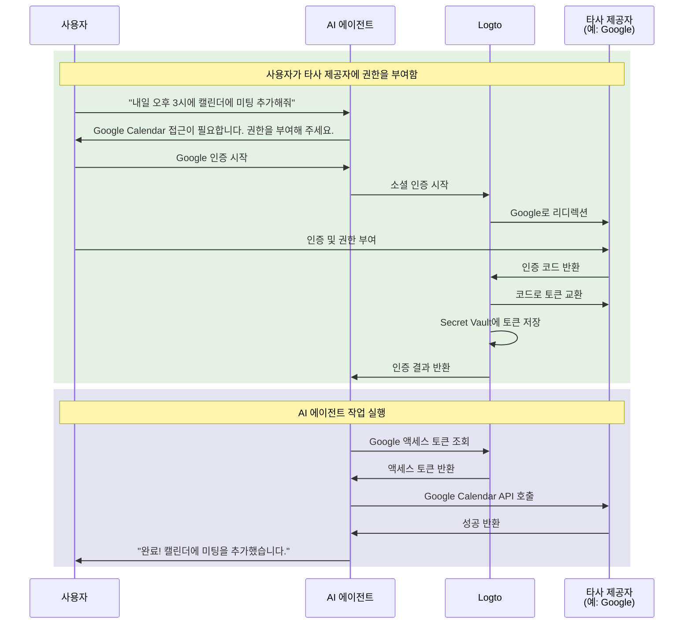

# AI 에이전트를 타사 API에 연결하세요

이 가이드는 AI 에이전트가 사용자를 대신하여 타사 API(예: Google Calendar, GitHub 등)에 접근할 수 있도록 설정하는 방법을 안내합니다. Logto의 소셜 커넥터와 Secret Vault를 활용하면 액세스 토큰을 안전하게 저장 및 관리할 수 있어, 사용자가 반복적으로 다시 인증하지 않아도 에이전트가 자동화된 작업을 수행할 수 있습니다.

다음 내용을 학습할 수 있습니다:

- 타사 토큰 저장이 가능한 소셜 커넥터 구성하기
- 최초 로그인 시 최소 권한만 요청하기
- 필요에 따라 점진적으로 추가 권한 요청하기
- 저장된 토큰을 조회하여 타사 API에 접근하기

## AI 에이전트가 타사 API 접근이 필요한 이유 \{#why-your-ai-agent-needs-third-party-api-access}

AI 에이전트는 외부 서비스와 상호작용이 필요한 작업을 자동화하는 데 점점 더 많이 사용되고 있습니다. 예를 들어:

- **📅 캘린더 관리**: AI 에이전트가 Google Calendar에 자동으로 미팅을 예약하거나, 이벤트를 추가하거나, 일정을 조정할 수 있습니다.
- **📧 이메일 자동화**: Gmail API를 사용해 후속 이메일을 보내거나, 받은 편지함을 정리하거나, 답장을 초안 작성할 수 있습니다.
- **💻 코드 관리**: GitHub 이슈 생성, 풀 리퀘스트 리뷰, 저장소 관리 등.
- **📁 파일 관리**: Google Drive 또는 Dropbox에 파일 업로드, 정리, 공유 등.

이러한 작업을 수행하려면, AI 에이전트가 사용자로부터 권한을 받은 타사 API에 안전하게 접근해야 하며, 이를 위해 OAuth 토큰을 올바르고 안전하게 다루는 것이 중요합니다.

## 작동 방식 \{#how-it-works}

흐름을 간단히 살펴보면 다음과 같습니다:



1. **사용자가 작업 요청**: 사용자가 AI 에이전트에게 타사 API 접근이 필요한 작업(예: 캘린더 이벤트 추가)을 요청합니다.
2. **권한 요청**: 에이전트가 타사 접근 필요성을 감지하고 사용자에게 권한 부여를 요청합니다.
3. **토큰 저장**: 사용자가 권한을 부여하면 Logto가 액세스 토큰과 리프레시 토큰을 Secret Vault에 안전하게 저장합니다.
4. **작업 실행**: 에이전트가 저장된 토큰을 조회하여 타사 API를 호출해 작업을 완료합니다.

한 번 권한을 부여하면 사용자는 재인증 없이 여러 작업을 수행할 수 있습니다. Logto는 토큰을 안전하게 저장하고, 필요 시 자동으로 갱신하여 AI 에이전트와의 지속적인 상호작용에 원활한 경험을 제공합니다.

## 사전 준비 사항 \{#prerequisites}

시작하기 전에 다음을 준비하세요:

- [Logto Cloud](https://cloud.logto.io) (또는 자체 호스팅 Logto v1.31+) 테넌트
- API 접근 권한이 있는 타사 제공자 계정 (예: [Google Cloud Console](https://console.cloud.google.com))
- Logto SDK와 연동된 AI 에이전트 애플리케이션 (사용자가 AI 에이전트에 로그인할 수 있어야 함)

## 토큰 저장이 가능한 소셜 커넥터 설정하기 \{#set-up-social-connector-with-token-storage}

AI 에이전트가 타사 API에 접근할 수 있도록, 토큰 저장이 활성화된 소셜 커넥터를 구성해야 합니다. 이를 통해 사용자가 AI 에이전트와 상호작용 중 타사 서비스에 권한을 부여할 때 Logto가 액세스 토큰을 저장 및 관리할 수 있습니다.

Google을 예시로 들어보겠습니다:

1. <CloudLink to="/connectors/social">콘솔 > 커넥터 > 소셜 커넥터</CloudLink>로 이동하세요.
2. **소셜 커넥터 추가**를 클릭하고 **Google**을 선택하세요.
3. [Google 커넥터 설정 가이드](/integrations/google)를 참고하여 OAuth 클라이언트 자격 증명을 구성하세요.
4. 커넥터 설정에서:
   - **지속적인 API 접근을 위한 토큰 저장**을 활성화하여 Secret Vault에 토큰을 저장하세요.
   - **프롬프트**에 `consent`를 포함하여 사용자가 권한 요청을 명확히 볼 수 있도록 하세요.
   - **오프라인 접근**을 활성화하여 장기 API 접근을 위한 리프레시 토큰을 받으세요.
5. 변경 사항을 저장하세요.

:::info
이 커넥터를 로그인 경험에 추가할 필요는 없습니다. 이 커넥터는 사용자가 로그인할 때가 아니라, AI 에이전트가 타사 API 접근이 필요할 때 온디맨드로 사용됩니다.
:::

## 권한 요청 및 타사 API 접근하기 \{#request-authorization-and-access-third-party-apis}

AI 에이전트가 타사 API(예: Google Calendar)에 접근해야 할 때, 먼저 사용자가 이미 권한을 부여했는지 확인해야 합니다. 권한이 없다면 사용자에게 권한 부여를 요청하세요.

:::info Account API 활성화
진행하기 전에 <CloudLink to="/sign-in-experience/account-center">콘솔 > 로그인 경험 > 계정 센터</CloudLink>에서 Account API를 활성화하세요. [Account API 활성화 방법](/end-user-flows/account-settings/by-account-api#how-to-enable-account-api)도 참고하세요.
:::

### 1단계: 기존 권한 확인하기 \{#step-1-check-for-existing-authorization}

먼저 저장된 액세스 토큰을 조회하여 사용자가 이미 권한을 부여했는지 확인하세요:

```tsx
async function getGoogleAccessToken(userAccessToken: string) {
  const response = await fetch(
    'https://[tenant-id].logto.app/my-account/identities/google/access-token',
    {
      headers: {
        Authorization: `Bearer ${userAccessToken}`,
      },
    }
  );

  return response.json();
}
```

### 2단계: 필요 시 권한 요청하기 \{#step-2-request-authorization-if-needed}

토큰이 없거나, 만료되었거나, 더 넓은 스코프가 필요하다면 Logto의 [소셜 인증 API](/secret-vault/federated-token-set#reauthentication-and-token-renewal)를 사용해 인증 플로우를 시작하세요:

```tsx
async function requestGoogleAuthorization(userAccessToken: string, scopes: string) {
  // CSRF 방지를 위한 랜덤 state 생성
  const state = crypto.randomUUID();
  sessionStorage.setItem('oauth_state', state);

  // 소셜 인증 시작
  const response = await fetch('https://[tenant-id].logto.app/api/verification/social', {
    method: 'POST',
    headers: {
      Authorization: `Bearer ${userAccessToken}`,
      'Content-Type': 'application/json',
    },
    body: JSON.stringify({
      connectorId: '<google_connector_id>',
      state,
      redirectUri: 'https://your-ai-agent.com/callback',
      scope: scopes,
    }),
  });

  const { verificationRecordId, authorizationUri } = await response.json();

  // verificationRecordId를 나중에 사용할 수 있도록 저장
  sessionStorage.setItem('verificationRecordId', verificationRecordId);

  // 사용자를 Google로 리디렉션하여 권한 요청
  window.location.href = authorizationUri;
}
```

### 3단계: 인증 콜백 처리하기 \{#step-3-handle-the-authorization-callback}

사용자가 권한을 부여하면 Google이 앱으로 리디렉션합니다. 인증을 완료하고 토큰을 저장하세요:

```tsx
async function handleAuthorizationCallback(
  userAccessToken: string,
  callbackParams: URLSearchParams
) {
  const verificationRecordId = sessionStorage.getItem('verificationRecordId');
  const storedState = sessionStorage.getItem('oauth_state');
  const code = callbackParams.get('code');
  const state = callbackParams.get('state');

  // CSRF 공격 방지를 위해 state 검증
  if (state !== storedState) {
    throw new Error('Invalid state parameter');
  }

  // 인증 검증
  await fetch('https://[tenant-id].logto.app/api/verification/social/verify', {
    method: 'POST',
    headers: {
      Authorization: `Bearer ${userAccessToken}`,
      'Content-Type': 'application/json',
    },
    body: JSON.stringify({
      verificationRecordId,
      connectorData: {
        code,
        state,
        redirectUri: 'https://your-ai-agent.com/callback',
      },
    }),
  });

  // Logto의 Secret Vault에 토큰 저장
  await fetch('https://[tenant-id].logto.app/my-account/identities/google/access-token', {
    method: 'PUT',
    headers: {
      Authorization: `Bearer ${userAccessToken}`,
      'Content-Type': 'application/json',
    },
    body: JSON.stringify({
      verificationRecordId,
    }),
  });

  // 정리
  sessionStorage.removeItem('verificationRecordId');
  sessionStorage.removeItem('oauth_state');
}
```

### 4단계: 타사 API 호출하기 \{#step-4-call-the-third-party-api}

이제 AI 에이전트가 토큰을 조회하여 API를 호출할 수 있습니다:

```tsx
async function addCalendarEvent(userAccessToken: string, eventDetails: EventDetails) {
  // 저장된 Google 액세스 토큰 조회
  const tokenData = await getGoogleAccessToken(userAccessToken);

  if (!tokenData) {
    // 사용자가 권한을 부여하지 않았다면, calendar scope로 권한 요청
    await requestGoogleAuthorization(
      userAccessToken,
      'https://www.googleapis.com/auth/calendar.events'
    );
    return; // 리디렉션 후 계속 진행
  }

  // Google Calendar API 호출
  const response = await fetch('https://www.googleapis.com/calendar/v3/calendars/primary/events', {
    method: 'POST',
    headers: {
      Authorization: `Bearer ${tokenData.accessToken}`,
      'Content-Type': 'application/json',
    },
    body: JSON.stringify(eventDetails),
  });

  return response.json();
}
```

Logto는 토큰 갱신을 자동으로 처리합니다. 액세스 토큰이 만료되었지만 리프레시 토큰이 존재하면, 조회 엔드포인트를 호출할 때 Logto가 새 액세스 토큰을 투명하게 발급합니다.

## 추가 권한 요청하기 \{#request-additional-permissions}

AI 에이전트가 더 많은 작업을 수행하게 되면, 추가 권한이 필요할 수 있습니다. 예를 들어, 사용자가 처음에는 읽기 전용 캘린더 접근만 허용했지만, 이제 이벤트 생성을 원한다면 쓰기 권한이 필요합니다.

### 왜 점진적 권한 요청이 중요한가요? \{#why-incremental-authorization}

- **더 나은 사용자 경험**: 사용자는 맥락에 맞게 권한이 필요한 이유를 이해할 때 더 쉽게 권한을 부여합니다.
- **높은 전환율**: 처음부터 많은 권한을 요청하지 않으면 마찰이 줄어듭니다.
- **신뢰 구축**: 필요한 권한만 요청하는 애플리케이션이 더 신뢰를 얻습니다.

### 예시: 읽기에서 쓰기 권한으로 업그레이드하기 \{#example-upgrading-from-read-to-write-access}

```tsx
async function createCalendarEvent(userAccessToken: string, eventDetails: EventDetails) {
  const tokenData = await getGoogleAccessToken(userAccessToken);

  if (!tokenData) {
    // 아직 권한이 없다면, 캘린더 쓰기 권한을 바로 요청
    await requestGoogleAuthorization(userAccessToken, 'https://www.googleapis.com/auth/calendar');
    return;
  }

  // 이벤트 생성 시도
  const response = await fetch('https://www.googleapis.com/calendar/v3/calendars/primary/events', {
    method: 'POST',
    headers: {
      Authorization: `Bearer ${tokenData.accessToken}`,
      'Content-Type': 'application/json',
    },
    body: JSON.stringify(eventDetails),
  });

  if (response.status === 403) {
    // 권한 부족 시, 추가 scope 요청
    await requestGoogleAuthorization(
      userAccessToken,
      'https://www.googleapis.com/auth/calendar' // 전체 캘린더 접근
    );
    return;
  }

  return response.json();
}
```

:::tip
추가 scope를 요청할 때, 사용자는 새로 요청되는 권한만 동의 화면에서 확인하게 됩니다. 기존 권한은 그대로 유지됩니다.
:::

## 토큰 상태 관리하기 \{#manage-token-status}

Logto 콘솔에서는 사용자별 토큰 상태를 확인할 수 있습니다:

1. <CloudLink to="/users">콘솔 > 사용자 관리</CloudLink>로 이동하세요.
2. 사용자를 클릭하여 상세 정보를 확인하세요.
3. **연결** 섹션에서 모든 연동된 소셜 계정을 확인할 수 있습니다.
4. 각 연결별로 토큰 상태가 표시됩니다:
   - **활성**: 액세스 토큰이 유효하며 바로 사용할 수 있습니다.
   - **만료됨**: 액세스 토큰이 만료되었습니다. 리프레시 토큰이 있으면 다음 조회 시 자동으로 갱신됩니다.
   - **비활성**: 이 연결에 저장된 토큰이 없습니다.

## 보안 모범 사례 \{#security-best-practices}

AI 에이전트가 타사 API에 접근할 때 다음 보안 수칙을 지키세요:

- **최소 scope만 요청**: 에이전트가 실제로 필요한 권한만 요청하세요.
- **점진적 권한 요청 사용**: 모든 권한을 한 번에 요청하지 말고, 맥락에 맞게 추가 권한을 요청하세요.
- **토큰 만료를 우아하게 처리**: 토큰이 만료되거나 취소된 경우를 항상 처리하세요.
- **사용자 액세스 토큰을 안전하게 보호**: 사용자의 Logto 액세스 토큰은 타사 토큰 조회의 열쇠입니다. 반드시 안전하게 보호하세요.
- **API 접근 감사**: AI 에이전트가 타사 API에 접근할 때 로그를 남겨 문제 해결 및 컴플라이언스에 대비하세요.

## 관련 리소스 \{#related-resources}

<Url href="/secret-vault/federated-token-set">타사 토큰 저장</Url>
<Url href="/connectors/social-connectors">소셜 커넥터</Url>
<Url href="/end-user-flows/sign-up-and-sign-in/social-sign-in">소셜 로그인</Url>
<Url href="/end-user-flows/account-settings/by-account-api">Account API</Url>
