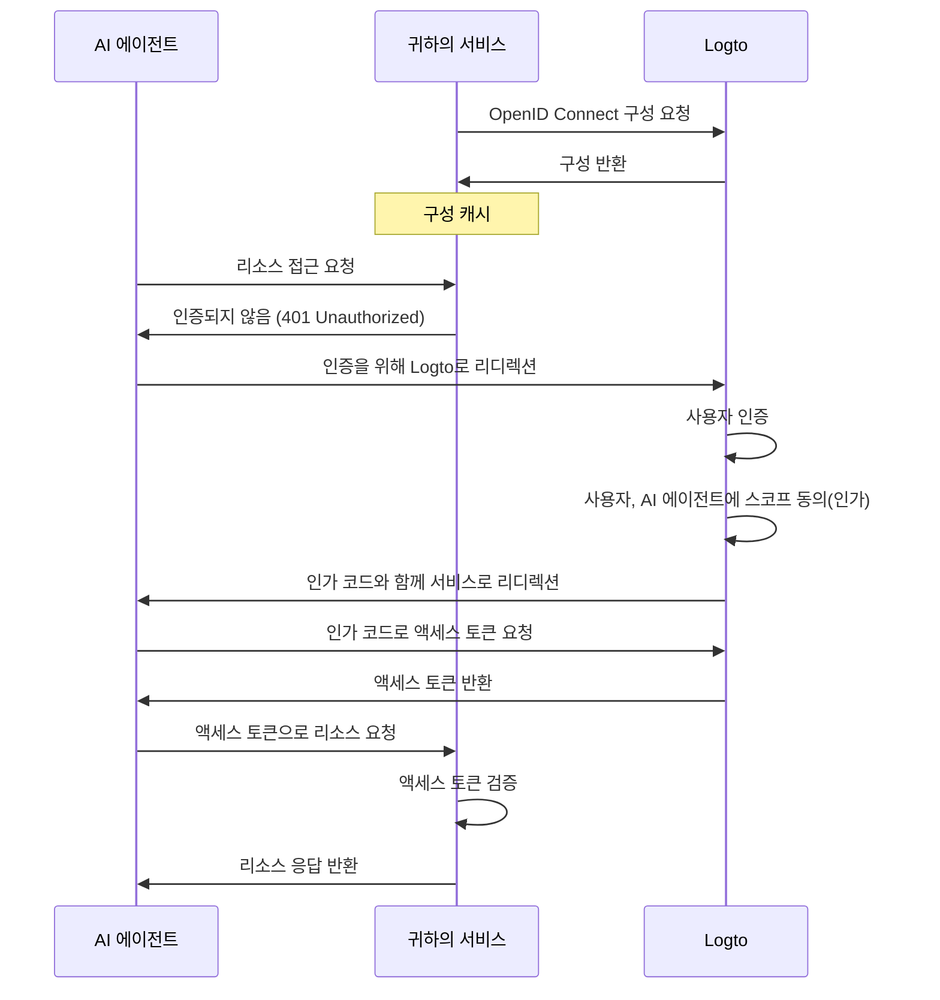

import ConfigureThirdPartyAiAgent from './fragments/_configure-third-party-ai-agent.mdx';

# 서드파티 AI 에이전트가 앱에 접근할 수 있도록 허용하세요

이 가이드는 Logto를 귀하의 서비스와 통합하고 AI 에이전트가 해당 서비스에 접근할 수 있도록 설정하는 과정을 안내합니다.

다음 내용을 학습할 수 있습니다:

- 귀하의 서비스에 대해 Logto를 인가 (Authorization) 서버로 구성하는 방법
- AI 에이전트가 귀하의 서비스에 접근할 수 있도록 액세스 토큰 (Access token)을 얻는 방법
- AI 에이전트로 플로우를 테스트하는 방법

## 서드파티 AI 에이전트와 자체 AI 에이전트(또는 앱)의 차이점 \{#difference-between-third-party-ai-agent-and-your-own-ai-agent-or-app}

예시를 살펴보겠습니다. 여러분이 날씨 데이터를 제공하는 서비스를 운영하는 개발자라고 가정해봅시다.

**공식 날씨 앱 (자체 AI 에이전트 / 앱)**

- 사용자가 날씨를 확인할 수 있도록 공식 날씨 앱을 제공합니다.
- 동작 방식: 공식 날씨 앱은 Logto를 사용하여 사용자를 인증 (Authentication)하며 귀하의 서비스에 연결합니다. Alice가 로그인하면, 신뢰할 수 있는 앱이기 때문에 별도의 동의 화면 없이 자동으로 날씨 데이터에 접근할 수 있습니다.

**서드파티 AI 에이전트**

- 귀하의 서비스 생태계를 확장하기 위해, 다른 개발자가 "WeatherBot"(날씨 업데이트와 예보를 제공하는 AI 어시스턴트)을 만들어 서드파티 AI 에이전트로 통합합니다.
- 동작 방식: WeatherBot(서드파티 AI 에이전트)은 귀하의 서비스를 통해 사용자 날씨 데이터에 접근하고자 합니다. Alice가 자신의 계정으로 WeatherBot에 로그인하면:
  - WeatherBot이 그녀의 날씨 데이터에 접근할 수 있도록 동의 화면이 표시됩니다.
  - Alice는 이 접근을 허용하거나 거부할 수 있습니다.
  - 그녀가 동의한 데이터만 WeatherBot과 공유되며, 명시적인 재동의 없이는 추가 데이터에 접근할 수 없습니다.

이러한 접근(권한) 제어는 사용자 데이터의 안전을 보장합니다. 귀하의 서비스가 모든 데이터를 관리하더라도, WeatherBot과 같은 서드파티 AI 에이전트는 사용자가 명시적으로 허용한 데이터에만 접근할 수 있습니다. 이 과정은 귀하의 서비스 내 접근 제어 구현에 의해 강제되므로, 우회할 수 없습니다.

**요약**

| 클라이언트 유형      | 예시                  | 동의 필요? | 누가 제어?   |
| -------------------- | --------------------- | ---------- | ------------ |
| 공식 날씨 앱         | 자체 날씨 앱          | 아니오     | 귀하(개발자) |
| 서드파티 AI 에이전트 | WeatherBot 어시스턴트 | 예         | 다른 개발자  |

:::note
자체 AI 에이전트 또는 앱과 귀하의 서비스를 통합하고 싶다면, [빠른 시작 가이드](/quick-starts)를 참고하세요.
:::

## 사전 준비 사항 \{#prerequisites}

- [Logto Cloud](https://cloud.logto.io) (또는 자체 호스팅) 테넌트
- AI 에이전트가 접근할 수 있도록 API 엔드포인트를 제공하는 서비스

### 플로우 이해하기 \{#understanding-the-flow}

- **서비스**: AI 에이전트에 노출하고자 하는 서비스
- **AI 에이전트**: 귀하의 서비스에 접근할 AI 에이전트
- **Logto**: OpenID Connect 제공자(인가 (Authorization) 서버) 역할을 하며 사용자 아이덴티티를 관리

비공식 시퀀스 다이어그램은 전체 프로세스의 흐름을 보여줍니다:

## 서드파티 AI 에이전트 설정 \{#set-up-third-party-ai-agent}

서드파티 AI 에이전트가 귀하의 서비스에 접근할 수 있도록 하려면 다음 단계를 따라야 합니다:

1. **Logto에 AI 에이전트 등록**: Logto에 AI 에이전트를 나타내는 애플리케이션을 생성하세요.
2. **AI 에이전트 구성**: AI 에이전트가 귀하의 서비스에 요청을 보내고 401 Unauthorized 응답을 처리할 수 있도록 하세요.
3. **인가 플로우 구현**: AI 에이전트가 Logto에서 액세스 토큰을 얻기 위해 OAuth 2.0 인가 플로우를 처리할 수 있어야 합니다.
4. **통합 테스트**: AI 에이전트를 사용하여 귀하의 서비스에 접근하고, 인증 (Authentication) 및 인가 (Authorization) 요청이 성공적으로 처리되는지 확인하세요.

<ConfigureThirdPartyAiAgent />

## 서비스에서 인가 (Authorization) 설정 \{#set-up-authorization-in-your-service}

서비스에서 접근 제어를 활성화하려면 다음을 구현해야 합니다:

1. **Logto에서 API 리소스 정의**: AI 에이전트가 접근할 엔드포인트를 나타내는 API 리소스를 Logto에 생성하세요.
2. **접근 제어 로직 구현**: 서비스에서 AI 에이전트로부터 받은 액세스 토큰을 검증하고, 사용자가 요청한 리소스에 접근할 권한이 있는지 확인하는 로직을 구현하세요.
3. **AI 에이전트에 응답**: 액세스 토큰이 유효하고 사용자가 권한이 있다면 요청한 리소스를 반환하세요. 그렇지 않으면 401 Unauthorized 응답을 반환하세요.

서비스에서 접근 제어를 구현하는 방법에 대해 더 알고 싶다면 [인가 (Authorization) 가이드](/authorization)를 참고하세요.

## 통합 테스트 \{#test-the-integration}

1. 서비스를 시작하세요.
2. AI 에이전트를 시작하세요.
3. AI 에이전트에서 귀하의 서비스에 접근하는 API 엔드포인트를 호출하세요.
4. AI 에이전트는 401 Unauthorized 응답을 처리하고 사용자를 Logto로 인증 (Authentication)하러 리디렉션해야 합니다.
5. 인증이 성공하면, AI 에이전트는 액세스 토큰을 받아 이를 사용해 귀하의 서비스에 요청을 보냅니다.
6. AI 에이전트는 액세스 토큰을 사용하여 귀하의 서비스에서 리소스를 받아올 수 있어야 합니다.
