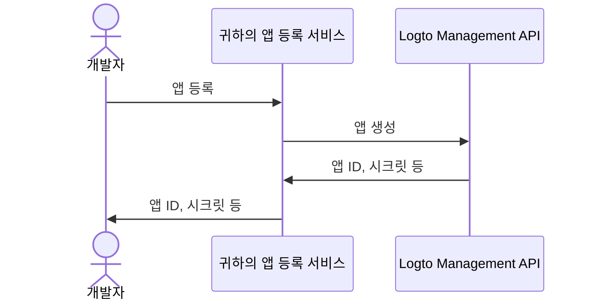

import QuickStartsReference from '../../../quick-starts/third-party/oidc/_quick-starts-reference.md';
import thirdPartyAppPermissions from '../assets/third-party-app-permissions.png';

## Logto에서 서드파티 AI 에이전트 구성하기 \{#configure-third-party-ai-agent-in-logto}

서드파티 AI 에이전트가 {props.serviceName ?? '귀하의 서비스'}에 접근할 수 있도록 하려면, Logto에서 **서드파티 앱**을 설정해야 합니다. 이 앱은 AI 에이전트를 대표하며, 인증 (Authentication) 및 인가 (Authorization)에 필요한 자격 증명을 획득하는 데 사용됩니다.

### 개발자가 Logto에서 서드파티 앱을 생성할 수 있도록 허용하기 \{#allow-developers-to-create-third-party-apps-in-logto}

마켓플레이스를 구축하거나 개발자가 Logto에서 서드파티 앱을 생성할 수 있도록 하려면, [Logto Management API](/integrate-logto/interact-with-management-api)를 활용하여 프로그래밍 방식으로 서드파티 앱을 생성할 수 있습니다. 이를 통해 개발자는 자신의 애플리케이션을 등록하고 인증 (Authentication)에 필요한 자격 증명을 얻을 수 있습니다.

클라이언트 등록 프로세스를 처리할 자체 서비스를 호스팅해야 합니다. 이 서비스는 Logto Management API와 상호작용하여 개발자를 대신해 서드파티 앱을 생성합니다.

또는, Logto Console에서 직접 서드파티 앱을 수동으로 생성하여 프로세스를 익힐 수도 있습니다.

### Logto에서 서드파티 앱을 수동으로 생성하기 \{#manually-create-a-third-party-app-in-logto}

테스트 목적이나 임시 통합을 위해 Logto Console에서 서드파티 앱을 수동으로 생성할 수 있습니다. 전체 클라이언트 등록 플로우를 구현하지 않고도 통합을 빠르게 테스트하고 싶을 때 유용합니다.

1. Logto Console에 로그인하세요.
2. <CloudLink to="/applications">**애플리케이션**</CloudLink> → **애플리케이션 생성** → **서드파티
   앱** -> **OIDC**로 이동하세요.
3. 앱 이름 및 기타 필수 항목을 입력한 후 **애플리케이션 생성**을 클릭하세요.
4. **권한** 탭을 클릭한 후, **사용자** 섹션에서 "추가"를 클릭하세요.
5. 열린 대화상자에서 -> **사용자 데이터** -> **`profile`**, **`email`** 권한을 선택한 후 **저장**을 클릭하세요.
6. 서드파티 앱에서 `openid profile email` 권한(스코프)을 요청하도록 스코프를 구성하세요.

   **참고**: OIDC를 위해서는 `openid`가 필수이며, `profile`과 `email`은 이전 단계에서 추가한 권한입니다.

7. 서드파티 애플리케이션의 **redirect URI**를 적절히 구성하세요. Logto에서도 redirect URI를 반드시 업데이트해야 합니다.

---

<QuickStartsReference />
