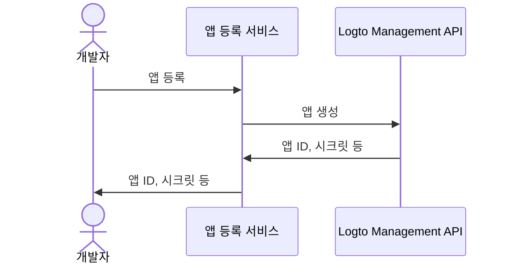

import QuickStartsReference from '../../../quick-starts/third-party/oidc/_quick-starts-reference.md';

## Logto에서 서드파티 AI 에이전트 구성하기 \{#configure-third-party-ai-agent-in-logto}

서드파티 AI 에이전트가 {props.serviceName ?? '귀하의 서비스'}에 접근할 수 있도록 하려면, Logto에서 **서드파티 앱**을 설정해야 합니다. 이 앱은 AI 에이전트를 대표하며, 인증 (Authentication) 및 인가 (Authorization)에 필요한 자격 증명을 얻는 데 사용됩니다.

:::info[서드파티 앱이란?]
**서드파티 앱**은 외부 개발자(리소스 소유자가 아님)가 생성한 애플리케이션으로, 보호된 리소스에 접근하기 위해 사용자 동의가 필요합니다. 퍼스트파티 앱(자체 애플리케이션)과 달리, 서드파티 앱은 사용자의 데이터에 접근하기 전에 특정 권한을 승인하도록 요청하는 동의 화면을 표시합니다. 이를 통해 사용자는 외부 서비스와 어떤 데이터를 공유할지 직접 제어할 수 있습니다.

자세한 내용은 [서드파티 애플리케이션](/integrate-logto/third-party-applications)을 참고하세요.
:::

### 개발자가 Logto에서 서드파티 앱을 생성할 수 있도록 허용하기 \{#allow-developers-to-create-third-party-apps-in-logto}

마켓플레이스를 구축하거나 개발자가 Logto에서 서드파티 앱을 생성할 수 있도록 하려면, [Logto Management API](/integrate-logto/interact-with-management-api)를 활용하여 프로그래밍 방식으로 서드파티 앱을 생성할 수 있습니다. 이를 통해 개발자는 자신의 애플리케이션을 등록하고 인증 (Authentication)에 필요한 자격 증명을 얻을 수 있습니다.

클라이언트 등록 프로세스를 처리할 자체 서비스를 호스팅해야 합니다. 이 서비스는 Logto Management API와 상호작용하여 개발자를 대신해 서드파티 앱을 생성합니다.

```mermaid
sequenceDiagram
  actor 개발자
  participant Server as 앱 등록 서비스
  participant Logto as Logto Management API
  개발자->>Server: 앱 등록
  Server->>Logto: 앱 생성
  Logto->>Server: 앱 ID, 시크릿 등
  Server->>개발자: 앱 ID, 시크릿 등
```

또는, Logto 콘솔에서 직접 서드파티 앱을 수동으로 생성하여 프로세스를 익힐 수도 있습니다.

### Logto에서 서드파티 앱을 수동으로 생성하기 \{#manually-create-a-third-party-app-in-logto}

테스트 목적이나 임시 통합을 위해 Logto 콘솔에서 서드파티 앱을 수동으로 생성할 수 있습니다. 전체 클라이언트 등록 플로우를 구현하지 않고도 통합을 빠르게 테스트하고 싶을 때 유용합니다.

1. Logto 콘솔에 로그인하세요.
2. <CloudLink to="/applications">**애플리케이션**</CloudLink> → **애플리케이션 생성** → **서드파티
   앱** -> **OIDC**로 이동하세요.
3. 앱 이름 및 기타 필수 항목을 입력한 후 **애플리케이션 생성**을 클릭하세요.
4. **권한** 탭을 클릭하고, **사용자** 섹션에서 "추가"를 클릭하세요.
5. 열린 대화상자에서 -> **사용자 데이터** -> **`profile`**, **`email`** 권한을 선택한 후 **저장**을 클릭하세요.
6. 서드파티 앱에서 `openid profile email` 권한(스코프)을 요청하도록 스코프를 구성하세요.

   **참고**: `openid`는 OIDC에 필수이며, `profile`과 `email`은 이전 단계에서 추가한 권한입니다.

7. 서드파티 애플리케이션의 **리디렉션 URI**를 적절히 구성하세요. Logto에서도 리디렉션 URI를 반드시 업데이트해야 합니다.

---

<QuickStartsReference />
