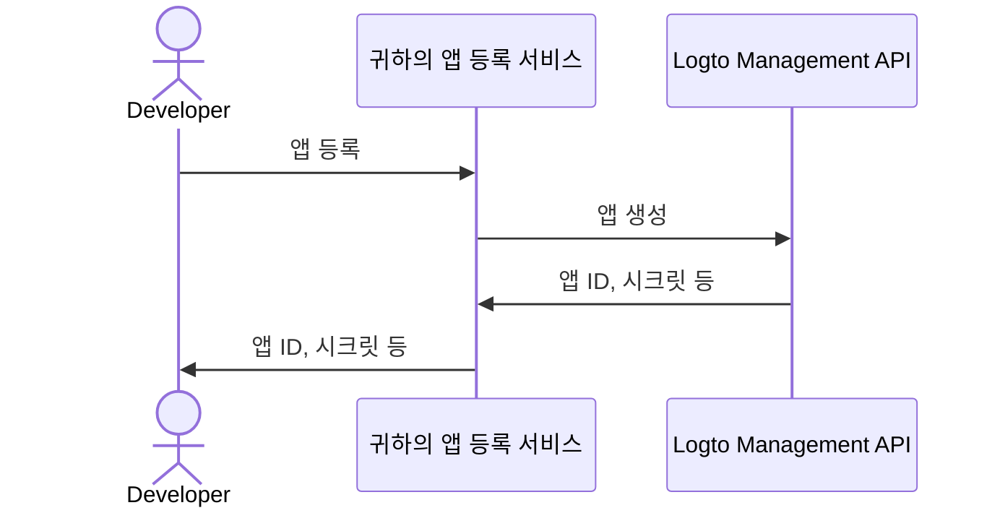
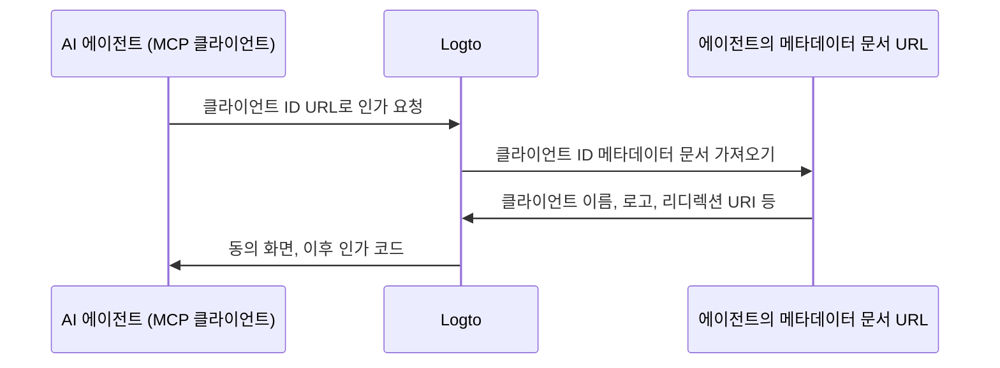

import QuickStartsReference from '../../../quick-starts/third-party/oidc/_quick-starts-reference.md';

## Logto에서 서드파티 AI 에이전트 구성하기 \{#configure-third-party-ai-agent-in-logto}

서드파티 AI 에이전트가 {props.serviceName ?? '귀하의 서비스'}에 접근할 수 있도록 하려면, Logto에서 **서드파티 앱**을 설정해야 합니다. 이 앱은 AI 에이전트를 대표하며, 인증 (Authentication) 및 인가 (Authorization)에 필요한 자격 증명을 획득하는 데 사용됩니다.

:::info[서드파티 앱이란?]
**서드파티 앱**은 외부 개발자(리소스 소유자가 아님)가 만든 애플리케이션으로, 보호된 리소스에 접근하기 위해 사용자 동의가 필요합니다. 퍼스트파티 앱(자체 애플리케이션)과 달리, 서드파티 앱은 사용자의 데이터에 접근하기 전에 특정 권한을 승인하도록 요청하는 동의 화면을 표시합니다. 이를 통해 사용자는 외부 서비스와 어떤 데이터를 공유할지 직접 제어할 수 있습니다.

자세한 내용은 [서드파티 애플리케이션](/integrate-logto/third-party-applications)을 참고하세요.
:::

AI 에이전트를 온보딩하는 방법은 세 가지가 있습니다:

- [콘솔에서 수동으로 앱 생성](#manually-create-a-third-party-app-in-logto): 테스트 또는 소수의 알려진 에이전트용.
- [Management API로 등록 서비스 구축](#allow-developers-to-create-third-party-apps-in-logto): 자격 증명 발급 대상을 직접 제어하고 싶을 때.
- [동적 앱 활성화](#let-any-ai-agent-connect-without-pre-registration): 사전 등록 없이 어떤 에이전트든 연결할 수 있도록 할 때.

### 개발자가 Logto에서 서드파티 앱을 생성할 수 있도록 허용하기 \{#allow-developers-to-create-third-party-apps-in-logto}

마켓플레이스를 구축하거나 개발자가 Logto에서 서드파티 앱을 생성할 수 있도록 하려면, [Logto Management API](/integrate-logto/interact-with-management-api)를 활용하여 프로그래밍 방식으로 서드파티 앱을 생성할 수 있습니다. 이를 통해 개발자는 자신의 애플리케이션을 등록하고 인증 (Authentication)에 필요한 자격 증명을 획득할 수 있습니다.

클라이언트 등록 프로세스를 처리할 자체 서비스를 호스팅해야 합니다. 이 서비스는 Logto Management API와 상호작용하여 개발자를 대신해 서드파티 앱을 생성합니다.

```mermaid
sequenceDiagram
  actor Developer
  participant Server as 귀하의 앱 등록 서비스
  participant Logto as Logto Management API
  Developer->>Server: 앱 등록
  Server->>Logto: 앱 생성
  Logto->>Server: 앱 ID, 시크릿 등
  Server->>Developer: 앱 ID, 시크릿 등
```

또는, Logto 콘솔에서 직접 서드파티 앱을 수동으로 생성하여 프로세스를 익힐 수도 있습니다.

### 사전 등록 없이 어떤 AI 에이전트든 연결 허용하기 \{#let-any-ai-agent-connect-without-pre-registration}

오픈 MCP 생태계에서는 사전에 에이전트를 알 수 없는 경우가 많습니다. [동적 앱](/integrate-logto/third-party-applications/dynamic-apps)은 등록 단계를 제거합니다: 에이전트는 자신의 클라이언트 메타데이터 문서를 제공하는 공개 HTTPS URL을 `client_id`로 사용하고, Logto는 인가 (Authorization) 요청이 도착하면 이를 해석합니다.

```mermaid
sequenceDiagram
  participant Agent as AI 에이전트 (MCP 클라이언트)
  participant Logto
  participant Metadata as 에이전트의 메타데이터 문서 URL
  Agent->>Logto: 클라이언트 ID URL로 인가 요청
  Logto->>Metadata: 클라이언트 ID 메타데이터 문서 가져오기
  Metadata->>Logto: 클라이언트 이름, 로고, 리디렉션 URI 등
  Logto->>Agent: 동의 화면, 이후 인가 코드
```

여전히 동적 앱에 부여된 권한을 통해 에이전트가 요청할 수 있는 범위를 제어할 수 있으며, 모든 인가 (Authorization)는 사용자 동의 화면을 거칩니다.

### Logto에서 서드파티 앱을 수동으로 생성하기 \{#manually-create-a-third-party-app-in-logto}

테스트 목적이나 임시 통합을 위해 Logto 콘솔에서 서드파티 앱을 수동으로 생성할 수 있습니다. 전체 클라이언트 등록 플로우를 구현하지 않고 빠르게 통합을 테스트하고 싶을 때 유용합니다.

1. Logto 콘솔에 로그인하세요.
2. <CloudLink to="/applications">**애플리케이션**</CloudLink> → **애플리케이션 생성** → **서드파티
   앱** -> **OIDC**를 선택하세요.
3. 앱 이름 및 기타 필수 항목을 입력한 후 **애플리케이션 생성**을 클릭하세요.
4. **권한** 탭을 클릭하여 앱에 [권한](/integrate-logto/third-party-applications/permission-management)을 부여하세요:

   - **사용자** 섹션: **`profile`**, **`email`** 등 기본 아이덴티티 클레임을 위한 사용자 데이터 권한.
   - **API 리소스** 섹션: Logto에서 정의한 [API 리소스](/authorization/global-api-resources)의 권한(스코프), 예: 귀하의 {props.serviceName ?? '서비스'}를 대표하는 API 리소스.
   - **조직** 섹션: Logto 조직을 사용하는 경우 조직 권한.

5. 서드파티 앱에서 요청할 권한(스코프)을 설정하세요. 예: `openid profile email` 및 API 리소스 스코프.

   **참고**: OIDC를 위해서는 `openid`가 필수입니다. API 리소스에 바인딩된 액세스 토큰 (Access token)을 받으려면, 인가 (Authorization) 요청에 `resource` 파라미터도 포함해야 합니다. 최신 MCP 사양을 따르는 MCP 클라이언트는 보호된 리소스 메타데이터에 따라 이를 자동으로 처리합니다.

6. 서드파티 애플리케이션의 **리디렉션 URI**를 적절히 설정하세요. Logto에서도 리디렉션 URI를 반드시 업데이트해야 합니다.

---

<QuickStartsReference />
