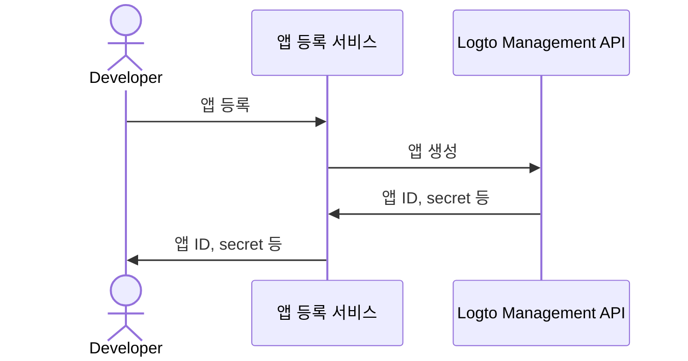

import QuickStartsReference from '../../quick-starts/third-party/oidc/_quick-starts-reference.md';

import thirdPartyAppPermissions from './assets/third-party-app-permissions.png';
import Prerequisites from './fragments/_mcp-prerequisites.mdx';
import SampleCode from './fragments/_mcp-sample-code.mdx';
import SetUpServer from './fragments/_mcp-set-up-server.mdx';

# 타사 AI 에이전트가 MCP 서버에 접근할 수 있도록 허용하세요

이 가이드는 [mcp-auth](https://mcp-auth.dev)를 사용하여 Logto와 MCP 서버를 통합하는 방법을 안내합니다. 이를 통해 표준 OpenID Connect 플로우를 사용하여 사용자를 인증하고, 안전하게 아이덴티티 정보를 조회할 수 있습니다.

다음 내용을 학습할 수 있습니다:

- MCP 서버의 인가 (Authorization) 서버로 Logto를 구성하는 방법
- MCP 서버에 "whoami" 도구를 설정하여 현재 사용자의 아이덴티티 클레임 (Claims)을 반환하는 방법
- 타사 AI 에이전트 (MCP 클라이언트)로 플로우를 테스트하는 방법

이 튜토리얼을 완료하면 MCP 서버는 다음과 같이 동작합니다:

- Logto 테넌트에서 사용자를 인증 (Authentication)합니다.
- "whoami" 도구 호출 시 아이덴티티 클레임 (`sub`, `username`, `name`, `email` 등)을 반환합니다.

## 타사 AI 에이전트 (MCP 클라이언트)와 자체 MCP 클라이언트의 차이점 \{#difference-between-third-party-ai-agent-mcp-client-and-your-own-mcp-client}

예시를 통해 살펴보겠습니다. 당신이 이메일 접근 및 자동화를 관리하는 MCP 서버를 운영하는 개발자라고 가정해봅시다.

**공식 이메일 앱 (자체 MCP 클라이언트)**

- 사용자가 이메일을 읽고 관리할 수 있도록 공식 이메일 앱을 제공합니다.
- 동작 방식: 공식 이메일 앱은 Logto를 통해 MCP 서버에 연결하여 사용자를 인증 (Authentication)합니다. Alice가 로그인하면, 신뢰된 앱이기 때문에 별도의 권한 동의 화면 없이 자동으로 자신의 이메일에 접근할 수 있습니다.

**타사 AI 에이전트 (타사 MCP 클라이언트)**

- MCP 서버를 중심으로 생태계를 구축하고자 하여, 다른 개발자가 "SmartMail AI" (이메일 요약 및 미팅 자동 예약이 가능한 AI 어시스턴트)를 타사 클라이언트로 통합합니다.
- 동작 방식: SmartMail AI (타사 MCP 클라이언트)는 MCP 서버를 통해 사용자 이메일에 접근하고자 합니다. Alice가 자신의 계정으로 SmartMail AI에 로그인하면:
  - SmartMail AI가 이메일 및 캘린더 접근 권한을 요청하는 동의 화면이 표시됩니다.
  - Alice는 이 접근을 허용하거나 거부할 수 있습니다.
  - Alice가 동의한 데이터만 SmartMail AI에 공유되며, 추가 데이터는 명시적 재동의 없이는 접근할 수 없습니다.

이러한 접근 (권한) 제어는 사용자 데이터의 안전을 보장합니다. MCP 서버가 모든 데이터를 관리하더라도, SmartMail AI와 같은 타사 앱은 사용자가 명시적으로 허용한 데이터에만 접근할 수 있습니다. 이 과정은 MCP 서버의 접근 제어 구현에 의해 강제되므로 우회할 수 없습니다.

**요약**

| 클라이언트 유형  | 예시                     | 동의 필요 여부 | 제어 주체     |
| ---------------- | ------------------------ | -------------- | ------------- |
| 공식 이메일 앱   | 자체 이메일 애플리케이션 | 아니오         | 당신 (개발자) |
| 타사 AI 에이전트 | SmartMail AI 어시스턴트  | 예             | 다른 개발자   |

:::note
자체 AI 에이전트나 앱과 MCP 서버를 통합하고 싶다면, [Logto로 MCP 기반 앱에 인증 (Authentication) 활성화하기](./mcp-server-add-auth) 가이드를 참고하세요.
:::

<Prerequisites isThirdParty />

## 타사 AI 에이전트 설정하기 \{#set-up-third-party-ai-agent}

타사 AI 에이전트가 MCP 서버에 접근할 수 있도록 하려면 다음을 설정해야 합니다:

1. 클라이언트가 MCP 서버에서 노출한 도구를 호출하는 MCP 요청을 할 수 있어야 합니다.
2. 클라이언트가 401 Unauthorized 응답을 처리할 수 있어야 합니다. 자세한 내용은 [Authorization Flow Steps](https://modelcontextprotocol.io/specification/2025-03-26/basic/authorization#2-5-authorization-flow-steps) 를 참고하세요.
3. 인증 (Authentication)에 성공한 후, Logto에서 발급받은 액세스 토큰 (Access token)으로 MCP 서버에 요청을 보낼 수 있어야 합니다.

## Logto에서 AI 에이전트 설정하기 \{#set-up-ai-agent-in-logto}

타사 AI 에이전트가 MCP 서버에 접근할 수 있도록 하려면 Logto에 **타사 앱**을 설정해야 합니다. 이 앱은 AI 에이전트를 대표하며, 인증 (Authentication) 및 인가 (Authorization)에 필요한 자격 증명을 획득하는 데 사용됩니다.

### Logto에서 개발자가 타사 앱을 생성할 수 있도록 허용하기 \{#allow-developers-to-create-third-party-apps-in-logto}

마켓플레이스를 구축하거나 개발자가 Logto에서 타사 앱을 생성할 수 있도록 하려면, [Logto Management API](/integrate-logto/interact-with-management-api)를 활용하여 타사 앱을 프로그래밍 방식으로 생성할 수 있습니다. 이를 통해 개발자는 자신의 애플리케이션을 등록하고 인증에 필요한 자격 증명을 획득할 수 있습니다.

클라이언트 등록 프로세스를 처리할 자체 서비스를 호스팅해야 합니다. 이 서비스는 Logto Management API와 상호작용하여 개발자를 대신해 타사 앱을 생성합니다.

또는, Logto Console에서 직접 타사 앱을 수동으로 생성하여 프로세스를 익힐 수도 있습니다.

### Logto에서 타사 앱을 수동으로 생성하기 \{#manually-create-a-third-party-app-in-logto}

테스트 목적이나 임시 통합을 위해 Logto Console에서 타사 앱을 수동으로 생성할 수 있습니다. 클라이언트 등록 플로우를 구현하지 않고도 빠르게 통합을 테스트할 때 유용합니다.

1. Logto Console에 로그인하세요.
2. <CloudLink to="/applications">**애플리케이션**</CloudLink> → **애플리케이션 생성** → **타사 앱**
   -> **OIDC**로 이동하세요.
3. 앱 이름 및 기타 필수 항목을 입력한 후 **애플리케이션 생성**을 클릭하세요.
4. **권한** 탭을 클릭하고, **사용자** 섹션에서 "추가"를 클릭하세요.
5. 열린 대화상자에서 -> **사용자 데이터** -> **`profile`**, **`email`** 권한을 선택한 후 **저장**을 클릭하세요.
6. 타사 앱에서 `openid profile email` 권한을 요청하도록 스코프를 설정하세요.
7. 타사 애플리케이션의 **redirect URI**를 적절히 구성하세요. Logto에서도 redirect URI를 업데이트해야 합니다.

---

<QuickStartsReference />

<SetUpServer />

## 통합 테스트하기 \{#test-the-integration}

1. MCP 서버를 시작하세요.
2. AI 에이전트를 시작하세요.
3. 클라이언트에서 `whoami` 도구를 호출하여 현재 사용자의 아이덴티티 클레임을 조회하세요.
4. 클라이언트는 401 Unauthorized 응답을 처리하고 사용자를 Logto로 리디렉션하여 인증 (Authentication)해야 합니다.
5. 인증 (Authentication)에 성공하면, 클라이언트는 액세스 토큰 (Access token)을 받아 MCP 서버에 요청을 보냅니다.
6. 클라이언트는 MCP 서버에서 액세스 토큰 (Access token)을 사용하여 아이덴티티 클레임을 조회할 수 있어야 합니다.

<SampleCode />
