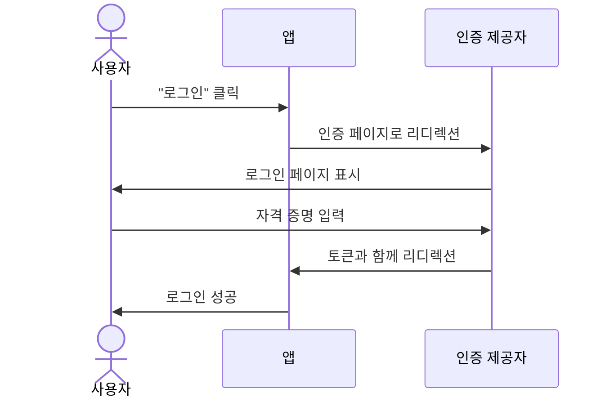
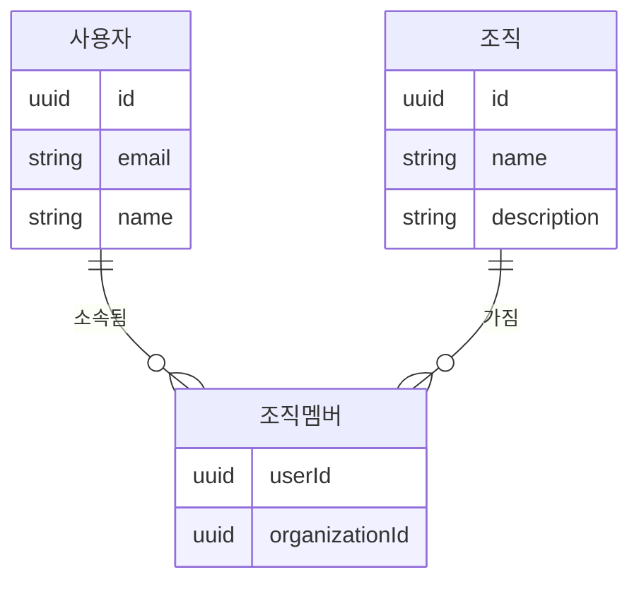
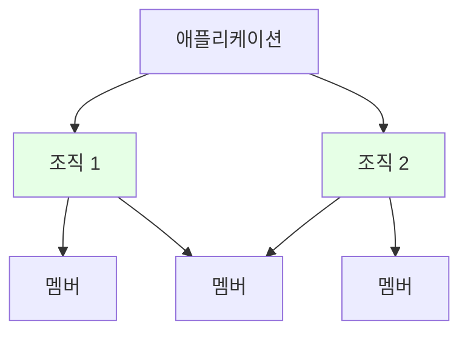
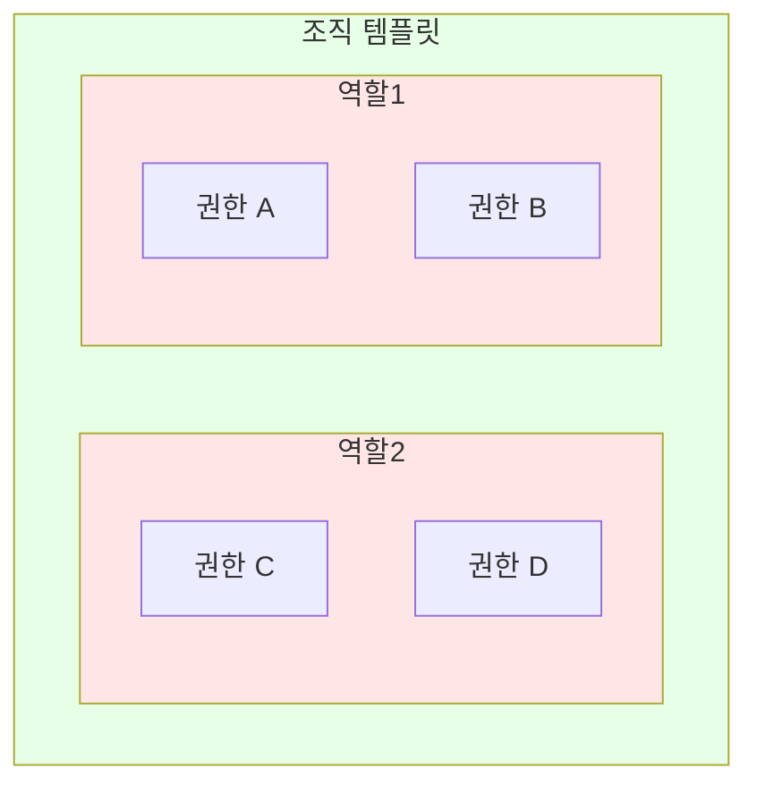
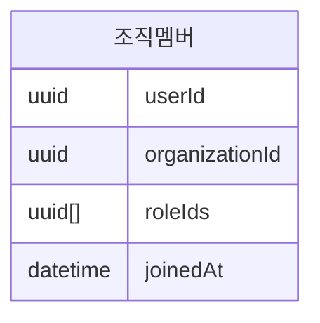
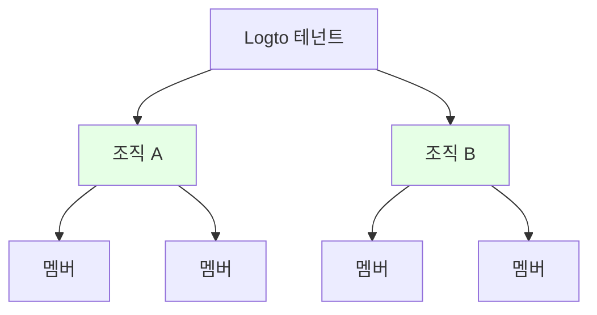
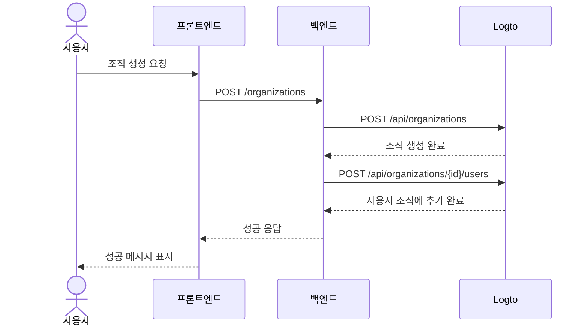

<head>
  <link rel="canonical" href="https://blog.logto.io/build-multi-tenant-saas-application" />
</head>

<style>
  {`
    .twoColumn {
      display: grid;
      grid-template-columns: 1fr 1fr;
      gap: 24px;
    }
    .twoColumn + .twoColumn {
      margin-top: 24px;
    }
  `}
</style>

# 멀티 테넌트 SaaS 애플리케이션 구축: 설계부터 구현까지 완벽 가이드

Notion, Slack, Figma 같은 앱은 어떻게 만들어졌을까요? 이런 멀티 테넌트 SaaS 애플리케이션은 사용하기엔 간단해 보이지만, 직접 만들려고 하면 이야기가 달라집니다.

저도 처음에 이런 복잡한 시스템을 만들 생각을 했을 때 머리가 터질 것 같았습니다:

- 사용자는 여러 로그인 옵션이 필요함 (이메일, Google, GitHub)
- 각 사용자는 여러 조직을 생성하고 소속될 수 있음
- 각 조직 내에서 다른 권한 레벨 필요
- 특정 이메일 도메인에 대해 자동 가입이 필요한 엔터프라이즈 조직
- 민감한 작업을 위한 MFA 요구 사항
- 기타 등등...

"팀장님, 2주 뒤에 제품 설계 얘기합시다. 지금은 진흙탕에 빠졌어요."

하지만 실제로 작업을 시작해보니, **생각보다 그렇게 어렵지 않다는 걸 알게 됐습니다.**

저는 **이 모든 기능을 아주 적은 노력으로 갖춘 시스템을 만들었습니다!**


<div className="twoColumn">
  
  
</div>

이제 이런 시스템을 처음부터 어떻게 설계하고 구현하는지 정확히 보여드릴게요. 2025년의 최신 도구와 올바른 아키텍처 접근법만 있으면 정말 얼마나 간단한지 놀라실 겁니다.

> **전체 소스 코드는 이 [Github 저장소](https://github.com/logto-io/multi-tenant-saas-sample)에서 확인할 수 있습니다. 바로 시작해봅시다!**

우리는 DocuMind라는 AI 문서화 SaaS 제품으로 시작합니다.

DocuMind는 멀티 테넌트 모델로 설계된 AI 문서화 SaaS 제품으로, 개인 사용자, 소규모 비즈니스, 엔터프라이즈를 지원합니다.

이 플랫폼은 조직 내에서 자동 요약 생성, 핵심 포인트 추출, 지능형 콘텐츠 추천 등 강력한 AI 기반 문서 관리 기능을 제공합니다.

## SaaS 인증 (Authentication) 및 인가 (Authorization)에 필요한 기능은 무엇인가요? \{#what-features-are-required-for-saas-authentication-and-authorization}

먼저, 필요한 요구 사항을 살펴봅시다. 어떤 기능이 필요할까요?

### 멀티 테넌트 아키텍처 \{#multi-tenant-architecture}

멀티 테넌트 아키텍처를 구현하려면 **조직 (Organization)**이라는 엔티티 계층이 필요합니다. 하나의 사용자 풀에서 여러 워크스페이스에 접근할 수 있다고 상상해보세요. 각 조직은 하나의 워크스페이스를 의미하며, 사용자는 단일 아이덴티티로 여러 워크스페이스(조직)에 역할에 따라 접근할 수 있습니다.


이것은 인증 (Authentication) 제공자에서 널리 사용되는 기능입니다. 아이덴티티 관리 시스템의 조직은 SaaS 앱의 워크스페이스, 프로젝트, 테넌트에 해당합니다.


### 멤버십 \{#membership}

멤버는 조직 내에서 아이덴티티의 멤버십 상태를 나타내는 임시 개념입니다.

예를 들어, Sarah가 이메일 **sarah@gmail.com**로 앱에 가입했다고 합시다. 그녀는 여러 워크스페이스에 소속될 수 있습니다. Sarah가 **워크스페이스 A**에는 속하지만 **워크스페이스 B**에는 속하지 않는다면, 그녀는 **워크스페이스 A**의 멤버이고 **워크스페이스 B**의 멤버는 아닙니다.

### 역할 및 권한 설계 \{#role-and-permission-design}

멀티 테넌트 아키텍처에서는 사용자가 테넌트 리소스에 접근하기 위해 특정 **역할 (Role)**과 **권한 (Permission)**이 필요합니다.
권한 (Permission)은 `read: order` 또는 `write: order`처럼 특정 리소스에 대해 어떤 작업을 할 수 있는지 정의하는 세부적인 접근 제어입니다.

역할 (Role)은 멀티 테넌트 환경에서 멤버에게 할당되는 권한 (Permission) 집합입니다.

이 역할과 권한을 정의하고, 사용자를 역할에 할당해야 하며, 때로는 자동화된 프로세스가 필요할 수 있습니다. 예를 들어:

1. 조직에 가입한 사용자는 자동으로 **멤버** 역할을 받습니다.
2. 워크스페이스를 처음 생성한 사용자는 자동으로 **관리자 (Admin)** 역할을 받습니다.

### 회원가입 및 로그인 플로우 \{#sign-up-and-login-flow}

사용자 친화적이고 안전한 회원가입 및 인증 (Authentication) 프로세스를 보장하세요. 기본 로그인 및 회원가입 옵션은 다음과 같습니다:

1. **이메일 및 비밀번호 로그인**: 이메일과 비밀번호를 사용하는 전통적인 로그인 방식
2. **패스워드리스 로그인**: 이메일 인증 코드로 간편하고 안전하게 접근
3. **계정 관리**: 사용자가 이메일, 비밀번호 등 정보를 업데이트할 수 있는 계정 센터
4. **소셜 로그인**: Google, GitHub 등으로 빠른 로그인
5. **다단계 인증 (MFA)**: Duo와 같은 인증 앱을 통한 로그인으로 보안 강화

### 테넌트 생성 및 초대 \{#tenant-creation-and-invitation}

멀티 테넌트 SaaS 앱에서는 사용자 플로우에서 테넌트 생성과 멤버 초대가 필요합니다. 이 과정은 제품 활성화와 성장에 중요한 역할을 하므로 신중한 기획과 실행이 필요합니다.

다음은 고려해야 할 전형적인 사용자 플로우입니다:

| 사용자 유형                       | 진입 경로                                    |
| --------------------------------- | -------------------------------------------- |
| 신규 계정                         | 로그인 및 회원가입 페이지에서 새 테넌트 생성 |
| 기존 계정                         | 제품 내에서 또 다른 테넌트 생성              |
| 기존 계정이 새 테넌트 초대를 받음 | 로그인 및 회원가입 페이지에서 진입           |
| 기존 계정이 새 테넌트 초대를 받음 | 초대 이메일에서 진입                         |
| 신규 계정이 새 테넌트 초대를 받음 | 로그인 및 회원가입 페이지에서 진입           |
| 신규 계정이 새 테넌트 초대를 받음 | 초대 이메일에서 진입                         |

거의 모든 SaaS 앱에서 볼 수 있는 일반적인 시나리오입니다. 제품 및 디자인 팀에 영감을 주는 참고 자료로 활용하고, 필요에 따라 자체 플로우를 자유롭게 만드세요.

<div className="twoColumn">
  
  
</div>

<div className="twoColumn">
  
  
</div>

<div className="twoColumn">
  
  
</div>

## 기술 아키텍처 및 시스템 설계 \{#technical-architecture-and-system-design}

모든 제품 요구 사항을 이해했다면, 이제 구현 단계로 넘어가 봅시다.

### 인증 (Authentication) 전략 정의 \{#define-authentication-strategy}

인증 (Authentication)은 어렵게 느껴질 수 있습니다. 사용자는 다음이 필요합니다:

- 이메일 & 비밀번호 회원가입/로그인
- Google/Github 원클릭 로그인
- 비밀번호 분실 시 재설정
- 엔터프라이즈 고객을 위한 팀 전체 로그인
- ...

이런 기본 기능만 구현해도 몇 주가 걸릴 수 있습니다.

하지만 이제, **이 모든 것을 직접 만들 필요가 없습니다!**

최신 인증 (Authentication) 제공자(이번에는 [Logto](https://logto.io/)를 선택합니다)가 이 모든 기능을 패키지로 제공합니다. 인증 플로우는 매우 간단합니다:



**몇 주 걸릴 개발이 15분 만에 끝납니다!** Logto가 모든 복잡한 플로우를 처리해줍니다. 통합 단계는 뒤에서 다루겠습니다. 이제 DocuMind의 핵심 기능 개발에 집중할 수 있습니다!

### 멀티 테넌트 아키텍처 구축 \{#establish-multi-tenant-architecture}

조직 시스템을 통해 사용자는 여러 조직을 생성하고 참여할 수 있습니다. 핵심 관계를 이해해봅시다:



이 시스템에서 각 사용자는 여러 조직에 소속될 수 있고, 각 조직은 여러 멤버를 가질 수 있습니다.



### 멀티 테넌트 앱에서 접근 제어 활성화 \{#enable-access-control-in-multi-tenant-app}

역할 기반 접근 제어 (RBAC)는 멀티 테넌트 SaaS 애플리케이션의 보안과 확장성을 보장하는 데 중요합니다.

멀티 테넌트 앱에서는 권한 (Permission)과 역할 (Role) 설계가 제품 설계에서 비롯되어 일관된 경우가 많습니다. 예를 들어, 여러 워크스페이스에는 보통 관리자와 멤버 역할이 있습니다. Logto는 다음과 같은 조직 수준 역할 기반 접근 제어 (RBAC) 설계를 제공합니다:

1. **통합 권한 정의**: 권한 (Permission)은 시스템 레벨에서 정의되어 모든 조직에 일관되게 적용되어 유지 관리가 쉽고 일관성 있는 권한 관리가 가능합니다.
2. **조직 템플릿**: 미리 정의된 역할 (Role)과 권한 (Permission) 조합을 조직 템플릿으로 제공하여 조직 초기화를 간소화합니다.

권한 관계는 다음과 같습니다:



각 사용자는 각 조직 내에서 자신의 역할이 필요하므로, 역할과 조직 간의 관계는 각 사용자에게 할당된 역할을 반영해야 합니다:



이제 조직 시스템과 접근 제어 시스템을 설계했으니, 제품 개발을 시작할 수 있습니다!

## 기술 스택 \{#tech-stack}

초보자도 쉽게 접근할 수 있는 포터블 스택을 선택했습니다:

1. **프론트엔드**: React (Vue/Angular/Svelte로도 쉽게 이전 가능)
2. **백엔드**: Express (간단하고 직관적인 API)

프론트엔드와 백엔드를 분리한 이유는? 명확한 아키텍처로 배우기 쉽고 스택 전환이 간단하기 때문입니다. 인증 (Authentication) 제공자는 예시로 Logto를 사용합니다.

그리고 아래 가이드의 패턴은 **어떤 프론트엔드, 어떤 백엔드, 어떤 인증 시스템에도 적용됩니다.**

## 앱에 기본 인증 (Authentication) 플로우 추가하기 \{#add-basic-authentication-flow-to-your-app}

가장 쉬운 단계입니다. Logto를 프로젝트에 통합하기만 하면 됩니다. 이후 Logto 콘솔에서 필요에 따라 사용자 로그인/회원가입 방식을 설정할 수 있습니다.

### 앱에 Logto 설치하기 \{#install-logto-to-your-app}

먼저 [Logto Cloud](https://cloud.logto.io/)에 로그인하세요. 계정이 없다면 무료로 가입할 수 있습니다. 테스트용 개발 테넌트를 생성하세요.

테넌트 콘솔에서 왼쪽의 "애플리케이션" 버튼을 클릭하세요. React를 선택해 애플리케이션을 시작합니다.

페이지의 안내를 따라 진행하세요. 약 5분 만에 Logto 통합을 완료할 수 있습니다!

아래는 제 통합 코드입니다:

```jsx
const config: LogtoConfig = {
  endpoint: "<YOUR_LOGTO_ENDPOINT>",
  appId: "<YOUR_LOGTO_APP_ID>",
};

function App() {
  return (
    <LogtoProvider config={config}>
      <div className="min-h-screen bg-gradient-to-b from-gray-50 to-gray-100">
        <Routes>
          {/* Logto에서 로그인 리디렉션을 처리하는 콜백 */}
          <Route path="/callback" element={<Callback />} />
          <Route path="/*" element={<AppContent />} />
        </Routes>
      </div>
    </LogtoProvider>
  );
}

function AppContent() {
  const { isAuthenticated } = useLogto();

  if (!isAuthenticated) {
    // 인증되지 않은 사용자를 위한 랜딩 페이지
    return <Landing />;
  }

  // 인증된 사용자를 위한 메인 앱
  return (
    <Routes>
      {/* 대시보드에서 모든 조직을 보여줌 */}
      <Route path="/" element={<Dashboard />} />

      {/* 대시보드에서 조직 클릭 시 조직 페이지로 이동 */}
      <Route path="/:orgId" element={<Organization />} />
    </Routes>
  );
}
```


꿀팁: 로그인 페이지에는 Sign in과 Register 버튼이 모두 있습니다. Register 버튼은 Logto의 회원가입 페이지로 바로 이동합니다. 이는 Logto의 [first screen](/end-user-flows/authentication-parameters/first-screen) 기능을 통해 동작합니다. 사용자가 인증 플로우에서 처음 보게 될 단계를 결정합니다.

신규 사용자가 많을 것으로 예상된다면 회원가입 페이지를 기본값으로 설정할 수 있습니다.

```jsx
function LandingPage() {
  const { signIn } = useLogto();

  return (
    <div className="landing-container">
      <div className="auth-buttons">
        <button
          className="sign-in-button"
          onClick={() => {
            signIn({
              redirectUri: '<YOUR_APP_CALLBACK_URL>',
            });
          }}
        >
          Sign In
        </button>

        <button
          className="register-button"
          onClick={() => {
            signIn({
              redirectUri: '<YOUR_APP_CALLBACK_URL>',
              firstScreen: 'register',
            });
          }}
        >
          Register
        </button>
      </div>
    </div>
  );
}
```

로그인 버튼을 클릭하면 Logto 로그인 페이지로 이동합니다. 로그인(또는 회원가입)에 성공하면 축하합니다! 앱에 첫 번째 사용자가 생겼습니다(바로 당신!).

사용자를 로그아웃시키고 싶을 때는 `useLogto` 훅의 `signOut` 함수를 호출하세요.

```jsx
function SignOutButton() {
  const { signOut } = useLogto();

  return <button onClick={() => signOut('<YOUR_POST_LOGOUT_REDIRECT_URL>')}>Sign Out</button>;
}
```

### 로그인 및 회원가입 방식 커스터마이즈 \{#customize-sign-in-and-sign-up-methods}

Logto 콘솔에서 왼쪽 메뉴의 "로그인 경험"을 클릭하세요. "회원가입 및 로그인" 탭을 클릭합니다.
이 페이지에서 안내에 따라 Logto의 로그인/회원가입 방식을 설정할 수 있습니다.


로그인 플로우는 다음과 같이 보입니다:


### 다단계 인증 (MFA) 활성화 \{#enable-multi-factor-authentication}

Logto에서는 MFA 활성화가 간단합니다. Logto 콘솔에서 "다단계 인증" 버튼을 클릭한 후, 다단계 인증 페이지에서 활성화하세요.


MFA 플로우는 다음과 같이 보입니다:

<div className="twoColumn">
  
  
</div>

모든 것이 정말 간단합니다! 몇 분 만에 복잡한 사용자 인증 시스템을 구축했습니다!

## 멀티 테넌트 조직 경험 추가하기 \{#adding-multi-tenant-organization-experience}

이제 첫 번째 사용자가 생겼습니다! 하지만 이 사용자는 아직 어떤 조직에도 속해 있지 않고, 조직도 생성하지 않았습니다.

Logto는 멀티 테넌시를 기본적으로 지원합니다. Logto에서 원하는 만큼 조직을 생성할 수 있습니다. 각 조직에는 여러 멤버가 소속될 수 있습니다.



각 사용자는 Logto에서 자신의 조직 정보를 얻을 수 있습니다. 이를 통해 멀티 테넌시 지원이 가능합니다.

### 사용자의 조직 정보 가져오기 \{#get-a-user-s-organization-information}

Logto에서 사용자의 조직 정보를 가져오려면 두 단계를 따르세요:

Logto Config에서 조직 정보 접근을 선언합니다. 적절한 `scopes`와 `resources`를 설정하면 됩니다.

```jsx
import { UserScope, ReservedResource } from "@logto/react";
const config: LogtoConfig = {
  endpoint: "<YOUR_LOGTO_ENDPOINT>",
  appId: "<YOUR_LOGTO_APP_ID>",
  scopes: [UserScope.Organizations], // 값: "urn:logto:scope:organizations"
  resources: [ReservedResource.Organization], // 값: "urn:logto:resource:organizations"
};

```

Logto의 `fetchUserInfo` 메서드를 사용해 사용자 정보(조직 데이터 포함)를 가져옵니다.

```jsx
function Dashboard() {
  // 사용자 정보 가져오기
  const { fetchUserInfo } = useLogto();
  const [organizations, setOrganizations] = useState<OrganizationData[]>([]);
  const [loading, setLoading] = useState(false);

  useEffect(() => {
    const loadOrganizations = async () => {
      try {
        setLoading(true);
        // 사용자 정보 가져오기
        const userInfo = await fetchUserInfo();
        // 사용자의 조직 정보 가져오기
        const organizationData = userInfo?.organization_data || [];
        setOrganizations(organizationData);
      } catch (error) {
        console.error('조직 정보 가져오기 실패:', error);
      } finally {
        setLoading(false);
      }
    };

    loadOrganizations();
  }, [fetchUserInfo]);

  if (loading) {
    return <div>로딩 중...</div>;
  }

  if (organizations.length === 0) {
    return <div>아직 어떤 조직에도 소속되어 있지 않습니다</div>;
  }

  return <div>조직: {organizations.map(org => org.name).join(', ')}</div>;
}

```

이 단계를 완료한 후에는 로그아웃 후 다시 로그인해야 합니다. 요청하는 scope와 resource를 변경했기 때문입니다.

아직 조직을 생성하지 않았으므로, 사용자는 어떤 조직에도 소속되어 있지 않습니다. 대시보드에는 "아직 어떤 조직도 없습니다"가 표시됩니다.


이제 사용자를 위한 조직을 생성하고, 사용자를 조직에 추가해봅시다.

Logto 덕분에 복잡한 조직 관계를 직접 구축할 필요가 없습니다. Logto에서 조직을 생성하고 사용자를 추가하기만 하면 됩니다. Logto가 모든 복잡성을 대신 처리해줍니다. 조직을 생성하는 방법은 두 가지입니다:

1. Logto 콘솔에서 수동으로 조직 생성
2. Logto Management API를 사용해 조직 생성(특히 사용자가 직접 조직(워크스페이스)을 생성하는 SaaS 플로우 설계 시)

### Logto 콘솔에서 조직 생성하기 \{#create-organization-in-logto-console}

Logto 콘솔 왼쪽의 "조직" 메뉴 버튼을 클릭하세요. 조직을 생성합니다.

이제 첫 번째 조직이 생겼습니다.


다음으로, 사용자를 이 조직에 추가해봅시다.

조직 상세 페이지로 이동하세요. 멤버 탭으로 전환합니다. "+ 멤버 추가" 버튼을 클릭하세요. 왼쪽 목록에서 로그인한 사용자를 선택합니다. 오른쪽 하단의 "멤버 추가" 버튼을 클릭하세요. 이제 사용자가 조직에 성공적으로 추가되었습니다.


앱 페이지를 새로고침하세요. 사용자가 이제 조직에 소속된 것을 볼 수 있습니다!


## 셀프 서비스 조직 생성 경험 구현하기 \{#implement-self-serve-organization-creation-experience}

콘솔에서 조직을 생성하는 것만으로는 충분하지 않습니다. SaaS 앱에는 최종 사용자가 직접 워크스페이스를 쉽게 생성하고 관리할 수 있는 플로우가 필요합니다. 이 기능을 구현하려면 Logto Management API를 사용하세요.

가이드가 필요하다면 [Management API와 상호작용하기](/integrate-logto/interact-with-management-api) 문서를 참고해 Logto와의 API 통신을 설정하세요.

### 조직 인증 상호작용 플로우 이해하기 \{#understand-organization-auth-interaction-flow}

조직 생성 플로우를 예로 들어보겠습니다. 조직 생성 과정은 다음과 같이 동작합니다:



이 플로우에는 두 가지 주요 인증 요구 사항이 있습니다:

1. **백엔드 서비스 API 보호**:
   - 프론트엔드에서 백엔드 서비스 API 접근 시 인증 필요
   - API 엔드포인트는 사용자의 Logto 액세스 토큰(Access token) 검증으로 보호
   - 인증된 사용자만 서비스에 접근 가능
2. **Logto Management API 접근**:
   - 백엔드 서비스가 Logto Management API를 안전하게 호출해야 함
   - [Management API와 상호작용하기](/integrate-logto/interact-with-management-api) 가이드에 따라 설정
   - 기계 간 (Machine-to-Machine) 인증으로 접근 자격 획득

### 백엔드 API 보호하기 \{#protect-your-backend-api}

먼저, 백엔드 서비스에 조직 생성을 위한 API 엔드포인트를 만듭니다.

```jsx
app.post('/organizations', async (req, res) => {
  // Logto Management API를 사용한 구현
  // ...
});
```

백엔드 서비스 API는 인증된 사용자만 허용합니다. Logto로 API를 보호해야 하며, 현재 사용자 정보(예: user ID)도 알아야 합니다.

Logto의 개념(및 OAuth 2.0)에서 백엔드 서비스는 리소스 서버 역할을 합니다. 사용자는 프론트엔드에서 받은 액세스 토큰(Access token)으로 DocuMind 리소스 서버에 접근합니다. 리소스 서버는 이 토큰을 검증하고, 유효하면 요청한 리소스를 반환합니다.

백엔드 서비스를 대표하는 API 리소스를 Logto 콘솔에서 생성해봅시다.

1. Logto 콘솔에서 "API 리소스" 버튼을 클릭하세요.
2. "API 리소스 생성"을 클릭하고, 팝업에서 Express를 선택하세요.
3. API 이름은 "DocuMind API", API 식별자는 "[https://api.documind.com](https://api.documind.com/)"로 입력하세요.
4. 생성 버튼을 클릭하세요.

이 API 식별자 URL은 Logto 내에서 API를 고유하게 식별하는 용도일 뿐, 실제 백엔드 서비스 URL과는 무관합니다.

API 리소스 사용 튜토리얼이 표시됩니다. 해당 튜토리얼이나 아래 단계를 따라 진행하세요.

POST /organizations 엔드포인트를 보호하는 requireAuth 미들웨어를 만들어봅시다.

```jsx
const { createRemoteJWKSet, jwtVerify } = require('jose');

const getTokenFromHeader = (headers) => {
  const { authorization } = headers;
  const bearerTokenIdentifier = 'Bearer';

  if (!authorization) {
    throw new Error('Authorization header missing');
  }

  if (!authorization.startsWith(bearerTokenIdentifier)) {
    throw new Error('Authorization token type not supported');
  }

  return authorization.slice(bearerTokenIdentifier.length + 1);
};

const requireAuth = (resource) => {
  if (!resource) {
    throw new Error('Resource parameter is required for authentication');
  }

  return async (req, res, next) => {
    try {
      // 토큰 추출
      const token = getTokenFromHeader(req.headers);

      const { payload } = await jwtVerify(
        token,
        createRemoteJWKSet(new URL(process.env.LOGTO_JWKS_URL)),
        {
          issuer: process.env.LOGTO_ISSUER,
          audience: resource,
        }
      );

      // 사용자 정보 요청에 추가
      req.user = {
        id: payload.sub,
      };

      next();
    } catch (error) {
      console.error('Auth error:', error);
      res.status(401).json({ error: 'Unauthorized' });
    }
  };
};

module.exports = {
  requireAuth,
};
```

이 미들웨어를 사용하려면 다음 환경 변수가 필요합니다:

- LOGTO_JWKS_URL
- LOGTO_ISSUER

이 변수들은 Logto 테넌트의 OpenID Configuration 엔드포인트에서 얻을 수 있습니다. `https://<your-tenant-id>.logto.app/oidc/.well-known/openid-configuration`에 접속하면 반환된 JSON에서 필요한 정보를 찾을 수 있습니다:

```json
{
  "jwks_uri": "<https://tenant-id.logto.app/oidc/jwks>",
  "issuer": "<https://tenant-id.logto.app/oidc>"
}
```

이제 requireAuth 미들웨어를 POST /organizations 엔드포인트에 적용하세요.

```jsx
app.post('/organizations', requireAuth('<https://api.documind.com>'), async (req, res) => {
  // 조직 생성 로직 처리
  // ...
});
```

이렇게 하면 POST /organizations 엔드포인트가 보호됩니다. 유효한 Logto 액세스 토큰을 가진 사용자만 접근할 수 있습니다.

이제 프론트엔드에서 Logto로부터 토큰을 받아올 수 있습니다. 사용자는 이 토큰으로 백엔드 서비스 API를 통해 조직을 생성할 수 있습니다. 미들웨어는 user ID도 제공합니다. 이는 사용자를 조직에 추가할 때 유용합니다.

프론트엔드 코드에서 Logto config의 resources 배열에 이 API 리소스 식별자를 추가하세요.

```jsx
const config: LogtoConfig = {
  endpoint: "<YOUR_LOGTO_ENDPOINT>",
  appId: "<YOUR_LOGTO_APP_ID>",
  scopes: [UserScope.Organizations],
  resources: [ReservedResource.Organization, "<https://api.documind.com>"], // 새로 생성한 API 리소스 식별자
};

```

마찬가지로 Logto config를 업데이트한 후에는 사용자가 다시 로그인해야 합니다.

Dashboard에서 조직 생성 시 Logto 액세스 토큰을 받아와서 이 토큰으로 백엔드 서비스 API에 접근하세요.

```jsx
// "DocuMind API"용 액세스 토큰 가져오기
const token = await getAccessToken('<https://api.documind.com>');

// 토큰으로 백엔드 서비스 API 접근
const response = await fetch('<http://localhost:3000/organizations>', {
  method: 'POST',
  headers: {
    'Content-Type': 'application/json',
    Authorization: `Bearer ${token}`,
  },
  body: JSON.stringify({
    name: 'Organization A',
    description: 'Organization A description',
  }),
});
```

이제 DocuMind 백엔드 서비스 API에 정상적으로 접근할 수 있습니다.

### Logto Management API 호출하기 \{#calling-logto-management-api}

Logto Management API를 사용해 조직 생성을 구현해봅시다.

프론트엔드에서 백엔드 서비스로 요청하는 것과 마찬가지로, 백엔드 서비스에서 Logto로 요청할 때도 액세스 토큰이 필요합니다.

Logto에서는 기계 간 (Machine-to-Machine) 인증으로 액세스 토큰을 발급받습니다. 자세한 내용은 [Management API와 상호작용하기](/integrate-logto/interact-with-management-api)를 참고하세요.

Logto 콘솔의 애플리케이션 페이지로 이동해 Machine-to-Machine 애플리케이션을 생성하세요. "Logto Management API access" 역할을 할당하세요. Token endpoint, App ID, App Secret을 복사해두세요. 액세스 토큰 발급에 사용됩니다.


이제 이 M2M 애플리케이션으로 Logto Management API 액세스 토큰을 받을 수 있습니다.

```jsx
async function fetchLogtoManagementApiAccessToken() {
  const response = await fetch(process.env.LOGTO_MANAGEMENT_API_TOKEN_ENDPOINT, {
    method: 'POST',
    headers: {
      'Content-Type': 'application/x-www-form-urlencoded',
      Authorization: `Basic ${Buffer.from(
        `${process.env.LOGTO_MANAGEMENT_API_APPLICATION_ID}:${process.env.LOGTO_MANAGEMENT_API_APPLICATION_SECRET}`
      ).toString('base64')}`,
    },
    body: new URLSearchParams({
      grant_type: 'client_credentials',
      resource: process.env.LOGTO_MANAGEMENT_API_RESOURCE,
      scope: 'all',
    }).toString(),
  });
  const data = await response.json();
  return data.access_token;
}
```

이 액세스 토큰으로 Logto Management API를 호출할 수 있습니다.

아래 Management API를 사용할 것입니다:

- `POST /api/organizations`: 조직 생성 ([조직 생성 API 레퍼런스](https://openapi.logto.io/operation/operation-createorganization) 참고)
- `POST /api/organizations/{id}/users`: 조직에 사용자 추가 ([조직에 사용자 추가 API 레퍼런스](https://openapi.logto.io/operation/operation-addusers) 참고)

```jsx
app.post('/organizations', requireAuth('<https://api.documind.com>'), async (req, res) => {
  const accessToken = await fetchLogtoManagementApiAccessToken();
  // Logto에서 조직 생성 및 사용자 추가
  const response = await fetch(`${process.env.LOGTO_ENDPOINT}/api/organizations`, {
    method: 'POST',
    headers: {
      'Content-Type': 'application/json',
      Authorization: `Bearer ${accessToken}`,
    },
    body: JSON.stringify({
      name: req.body.name,
      description: req.body.description,
    }),
  });

  const createdOrganization = await response.json();

  await fetch(`${process.env.LOGTO_ENDPOINT}/api/organizations/${createdOrganization.id}/users`, {
    method: 'POST',
    headers: {
      'Content-Type': 'application/json',
      Authorization: `Bearer ${accessToken}`,
    },
    body: JSON.stringify({
      userIds: [req.user.id],
    }),
  });

  res.json({ data: createdOrganization });
});
```

이제 Logto Management API를 통한 조직 생성과 사용자 추가를 구현했습니다.

Dashboard에서 이 기능을 테스트해봅시다.


"조직 생성"을 클릭하세요.


생성 성공!

다음 단계는 조직에 사용자 초대 기능입니다. 이 튜토리얼에서는 구현하지 않지만, 이미 Management API 사용법을 익혔으니 [**테넌트 생성 및 초대**](#tenant-creation-and-invitation) 섹션을 참고하거나, 이 블로그 글: [멀티 테넌트 앱에서 사용자 협업 구현하기](https://blog.logto.io/implement-user-collaboration-in-your-app)를 따라 쉽게 구현할 수 있습니다.

## 멀티 테넌트 앱에 접근 제어 구현하기 \{#implement-access-control-to-your-multi-tenant-app}

이제 조직 접근 제어로 넘어가봅시다.

우리가 달성하고자 하는 것은:

- 사용자는 자신이 소속된 조직의 리소스만 접근 가능: Logto의 `조직 토큰 (Organization token)`으로 구현
- 사용자는 조직 내에서 특정 역할 (Role)을 가지고, 역할에 따라 권한 (Permission)이 다름: Logto의 조직 템플릿 기능으로 구현

이 기능들을 어떻게 구현하는지 살펴봅시다.

### Logto 조직 토큰 사용하기 \{#using-logto-organization-token}

앞서 언급한 Logto 액세스 토큰과 유사하게, Logto는 특정 리소스에 대응하는 액세스 토큰을 발급하며, 사용자는 이 토큰으로 백엔드 서비스의 보호된 리소스에 접근합니다. 마찬가지로, Logto는 특정 조직에 대응하는 조직 토큰을 발급하며, 사용자는 이 토큰으로 백엔드 서비스의 보호된 조직 리소스에 접근합니다.

프론트엔드 애플리케이션에서는 Logto의 `getOrganizationToken` 메서드로 특정 조직에 접근할 토큰을 얻을 수 있습니다.

```jsx
const { getOrganizationToken } = useLogto();
const organizationToken = await getOrganizationToken(organizationId);
```

여기서 `organizationId`는 사용자가 소속된 조직의 id입니다.

`getOrganization` 또는 조직 관련 기능을 사용하기 전에 Logto config에 `urn:logto:scope:organizations` 스코프와 `urn:logto:resource:organization` 리소스가 포함되어야 합니다. 이미 선언했으니 반복하지 않겠습니다.

조직 페이지에서는 조직 토큰으로 조직 내 문서를 가져옵니다.

```jsx
function OrganizationPage() {
  const { organizationId } = useParams();
  const navigate = useNavigate();
  const { signOut, getOrganizationToken } = useLogto();
  const [error, setError] = useState<Error | null>(null);
  const [documents, setDocuments] = useState([]);

  const fetchDocuments = useCallback(async () => {
    if (!organizationId) return;

    try {
      const organizationToken = await getOrganizationToken(organizationId);
      const response = await fetch(`http://localhost:3000/documents`, {
          headers: {
          'Content-Type': 'application/json',
          Authorization: `Bearer ${organizationToken}`,
        },
      });
      const documents = await response.json();
      setDocuments(documents);
    } catch (error: unknown) {
      if (error instanceof Error) {
        setError(error);
      } else {
        setError(new Error(String(error)));
      }
    }
  },[getOrganizationToken, organizationId]);

  useEffect(() => {
    void fetchDocuments();
  }, [fetchDocuments]);

  if (error) {
    return <div>오류: {error.message}</div>;
  }

  return <div>
    <h1>조직 문서</h1>
    <ul>
      {documents.map((document) => (
        <li key={document.id}>{document.name}</li>
      ))}
    </ul>
  </div>
}

```

이 구현에서 주의할 점 두 가지:

1. `getOrganizationToken`에 전달된 `organizationId`가 현재 사용자가 소속된 조직 id가 아니면, 토큰을 받을 수 없습니다. 즉, 사용자는 자신의 조직에만 접근할 수 있습니다.
2. 조직 리소스 요청 시 액세스 토큰이 아닌 조직 토큰을 사용합니다. 조직에 속한 리소스는 사용자 권한이 아니라 조직 권한으로 접근 제어를 하기 때문입니다(이후 `GET /documents` API 구현에서 더 잘 이해할 수 있습니다).

다음으로, 백엔드 서비스에 `GET /documents` API를 만듭니다. POST /organizations API를 API 리소스로 보호한 것과 마찬가지로, 조직별 리소스 지표로 `GET /documents` API를 보호합니다.

먼저, Organization 리소스를 보호하는 requireOrganizationAccess 미들웨어를 만듭니다.

```jsx
const getTokenFromHeader = (headers) => {
  const { authorization } = headers;
  const bearerTokenIdentifier = 'Bearer';

  if (!authorization) {
    throw new Error('Authorization header missing');
  }

  if (!authorization.startsWith(bearerTokenIdentifier)) {
    throw new Error('Authorization token type not supported');
  }

  return authorization.slice(bearerTokenIdentifier.length + 1);
};

const extractOrganizationId = (aud) => {
  if (!aud || typeof aud !== 'string' || !aud.startsWith('urn:logto:organization:')) {
    throw new Error('Invalid organization token');
  }
  return aud.replace('urn:logto:organization:', '');
};

const decodeJwtPayload = (token) => {
  try {
    const [, payloadBase64] = token.split('.');
    if (!payloadBase64) {
      throw new Error('Invalid token format');
    }
    const payloadJson = Buffer.from(payloadBase64, 'base64').toString('utf-8');
    return JSON.parse(payloadJson);
  } catch (error) {
    throw new Error('Failed to decode token payload');
  }
};

const requireOrganizationAccess = () => {
  return async (req, res, next) => {
    try {
      // 토큰 추출
      const token = getTokenFromHeader(req.headers);

      // 토큰에서 audience 동적으로 추출
      const { aud } = decodeJwtPayload(token);
      if (!aud) {
        throw new Error('Missing audience in token');
      }

      // audience로 토큰 검증
      const { payload } = await jwtVerify(
        token,
        createRemoteJWKSet(new URL(process.env.LOGTO_JWKS_URL)),
        {
          issuer: process.env.LOGTO_ISSUER,
          audience: aud,
        }
      );

      // audience claim에서 조직 ID 추출
      const organizationId = extractOrganizationId(payload.aud);

      // 요청에 조직 정보 추가
      req.user = {
        id: payload.sub,
        organizationId,
      };

      next();
    } catch (error) {
      console.error('Organization auth error:', error);
      res.status(401).json({ error: 'Unauthorized - Invalid organization access' });
    }
  };
};
```

이제 requireOrganizationAccess 미들웨어로 `GET /documents` API를 보호하세요.

```jsx
app.get('/documents', requireOrganizationAccess(), async (req, res) => {
  // req.user에서 현재 사용자 id와 organizationId를 얻을 수 있습니다
  console.log('userId', req.user.id);
  console.log('organizationId', req.user.organizationId);

  // organizationId로 데이터베이스에서 문서 가져오기
  // ....
  const documents = await getDocumentsByOrganizationId(req.user.organizationId);

  res.json(documents);
});
```

이렇게 하면 조직 토큰으로 조직 리소스에 접근할 수 있습니다. 백엔드 서비스에서는 조직 id로 데이터베이스에서 해당 리소스를 조회하면 됩니다.

조직 간 데이터 격리가 필요한 소프트웨어의 경우, 더 자세한 논의와 구현은 블로그 글: [PostgreSQL로 멀티 테넌시 구현: 실전 예제로 배우기](https://blog.logto.io/implement-multi-tenancy)를 참고하세요.

### 조직 수준 역할 기반 접근 제어 (RBAC) 설계 구현 \{#implement-organization-level-role-based-access-control-design}

조직 토큰으로 조직 리소스에 접근하는 것은 구현했습니다. 이제 RBAC로 조직 내 사용자 권한 제어를 구현해봅시다.

DocuMind에는 Admin과 Collaborator 두 가지 역할이 있다고 가정합시다.

Admin은 문서를 생성하고 접근할 수 있고, Collaborator는 문서 접근만 가능합니다.

따라서 조직에는 Admin과 Collaborator 두 역할이 필요합니다.

Admin은 `read:documents`와 `create:documents` 권한을 모두 가지며, Collaborator는 `read:documents` 권한만 가집니다.

- Admin
  - `read:documents`
  - `create:documents`
- Collaborator
  - `read:documents`

여기서 Logto의 조직 템플릿 기능이 등장합니다.

조직 템플릿은 모든 조직에 적용되는 접근 제어 모델의 청사진입니다: 조직에 적용할 역할과 권한을 정의합니다.

> 왜 조직 템플릿인가요?
>
> SaaS 제품에서 확장성은 매우 중요한 요구 사항입니다. 즉, 한 고객에게 적용되는 모델이 모든 고객에게도 적용되어야 합니다.

Logto 콘솔 > 조직 템플릿 > 조직 권한에서 `read:documents`와 `create:documents` 두 권한을 생성하세요.


그런 다음 조직 역할 탭에서 Admin과 Collaborator 두 사용자 역할을 만들고, 각 역할에 해당 권한을 할당하세요.


이렇게 각 조직에 대한 RBAC 권한 모델을 만들었습니다.

다음으로, 조직 상세 페이지에서 멤버에게 적절한 역할을 할당하세요.


이제 조직 사용자에게 역할이 부여되었습니다!
이 단계는 Logto Management API로도 수행할 수 있습니다:

```jsx
// 조직 생성자에게 'Admin' 역할 할당
app.post('/organizations', requireAuth('https://api.documind.com'), async (req, res) => {
  const accessToken = await fetchLogtoManagementApiAccessToken();
  // Logto에서 조직 생성
  // 기존 코드...

  // Logto에서 조직에 사용자 추가
  await fetch(`${process.env.LOGTO_ENDPOINT}/api/organizations/${createdOrganization.id}/users`, {
    method: 'POST',
    headers: {
      'Content-Type': 'application/json',
      Authorization: `Bearer ${accessToken}`,
    },
    body: JSON.stringify({
      userIds: [req.user.id],
    }),
  });

  // 첫 번째 사용자에게 `Admin` 역할 할당
  const rolesResponse = await fetch(`${process.env.LOGTO_ENDPOINT}/api/organization-roles`, {
    method: 'GET',
    headers: {
      'Content-Type': 'application/json',
      Authorization: `Bearer ${accessToken}`,
    },
  });

  const roles = await rolesResponse.json();

  // `Admin` 역할 찾기
  const adminRole = roles.find((role) => role.name === 'Admin');

  // 첫 번째 사용자에게 `Admin` 역할 할당
  await fetch(
    `${process.env.LOGTO_ENDPOINT}/api/organizations/${createdOrganization.id}/users/${req.user.id}/roles`,
    {
      method: 'POST',
      headers: {
        'Content-Type': 'application/json',
        Authorization: `Bearer ${accessToken}`,
      },
      body: JSON.stringify({
        organizationRoleIds: [adminRole.id],
      }),
    }
  );

  // 기존 코드...
});
```

이제 사용자 권한을 확인하여 권한 제어를 구현할 수 있습니다.

코드에서는 사용자의 조직 토큰에 권한 정보를 담고, 백엔드에서 이 권한을 검증해야 합니다.

프론트엔드 코드의 Logto config에서 조직 내에서 요청할 권한을 선언해야 합니다. `scopes`에 `read:documents`와 `create:documents` 권한을 추가하세요.

```jsx
const config: LogtoConfig = {
  endpoint: "<YOUR_LOGTO_ENDPOINT>",
  appId: "<YOUR_LOGTO_APP_ID>",
  scopes: [UserScope.Organizations, "read:documents", "create:documents"],
  resources: [ReservedResource.Organization, "<https://api.documind.com>"], // 새로 생성한 API 리소스 식별자
};

```

항상 그렇듯, 이 설정을 적용하려면 다시 로그인하세요.

그런 다음 백엔드의 requireOrganizationAccess 미들웨어에서 사용자 권한 검증을 추가합니다.

```jsx
const hasRequiredScopes = (tokenScopes, requiredScopes) => {
  if (!requiredScopes || requiredScopes.length === 0) {
    return true;
  }
  const scopeSet = new Set(tokenScopes);
  return requiredScopes.every((scope) => scopeSet.has(scope));
};

const requireOrganizationAccess = ({ requiredScopes = [] } = {}) => {
  return async (req, res, next) => {
    try {
      //...

      // audience로 토큰 검증
      const { payload } = await jwtVerify(
        token,
        createRemoteJWKSet(new URL(process.env.LOGTO_JWKS_URL)),
        {
          issuer: process.env.LOGTO_ISSUER,
          audience: aud,
        }
      );

      //...

      // 토큰에서 스코프 추출
      const scopes = payload.scope?.split(' ') || [];

      // 필수 스코프 검증
      if (!hasRequiredScopes(scopes, requiredScopes)) {
        throw new Error('Insufficient permissions');
      }

      //...

      next();
    } catch (error) {
      //...
    }
  };
};
```

이제 POST /documents API를 만들고, requireOrganizationAccess 미들웨어에 requiredScopes 옵션을 설정해 이 API와 기존 `GET /documents` API를 보호하세요.

```jsx
// 문서 생성 API
app.post(
  '/documents',
  requireOrganizationAccess({ requiredScopes: ['create:documents'] }),
  async (req, res) => {
    //...
  }
);

// 문서 조회 API
app.get(
  '/documents',
  requireOrganizationAccess({ requiredScopes: ['read:documents'] }),
  async (req, res) => {
    //...
  }
);
```

이렇게 사용자 권한을 확인하여 권한 제어를 구현했습니다.

프론트엔드에서는 조직 토큰을 디코딩하거나 Logto의 `getOrganizationTokenClaims` 메서드를 호출해 사용자 권한 정보를 얻을 수 있습니다.

```jsx
const [scopes, setScopes] = useState([]);
const { getOrganizationTokenClaims } = useLogto();

const loadScopes = async () => {
  const claims = await getOrganizationTokenClaims(organizationId);
  setScopes(claims.scope.split(' '));
};

// ...
```

claims의 scopes를 확인해 사용자 권한에 따라 페이지 요소를 제어하세요.

## 멀티 테넌트 앱 기능 더 추가하기 \{#add-more-multi-tenant-app-features}

지금까지 멀티 테넌트 SaaS 시스템의 기본 사용자 및 조직 기능을 구현했습니다! 하지만 각 조직별 로그인 페이지 브랜딩, 특정 도메인 이메일 사용자를 자동으로 조직에 추가, 엔터프라이즈급 SSO 통합 등 아직 다루지 않은 기능도 있습니다.

이 모든 기능은 바로 사용할 수 있으며, 자세한 내용은 Logto 문서에서 확인할 수 있습니다:

- [엔터프라이즈 SSO 통합](/end-user-flows/enterprise-sso)
- [Just-in-Time (JIT) 프로비저닝](/organizations/just-in-time-provisioning)
- [조직별 브랜딩](/customization/match-your-brand#organization-specific-branding)
- [조직별 다단계 인증 (MFA)](/organizations/organization-management#require-mfa-for-organization-members)
- [조직별 관리](/end-user-flows/organization-experience/organization-management)

## 요약 \{#summary}

처음엔 얼마나 막막했는지 기억나시나요? 사용자, 조직, 권한, 엔터프라이즈 기능... 끝없는 산처럼 느껴졌을 겁니다.

하지만 우리가 해낸 일을 보세요:

- 다양한 로그인 옵션과 MFA 지원이 포함된 완전한 인증 (Authentication) 시스템
- 여러 멤버십을 지원하는 유연한 조직 시스템
- 조직 내 역할 기반 접근 제어 (RBAC)

그리고 가장 좋은 점은? 바퀴를 다시 만들 필요가 없었다는 것입니다. Logto 같은 최신 도구를 활용해 몇 달 걸릴 개발을 단 몇 분 만에 끝냈습니다.

이 튜토리얼의 전체 소스 코드는: [멀티 테넌트 SaaS 샘플](https://github.com/logto-io/multi-tenant-saas-sample)에서 확인할 수 있습니다.

이것이 2025년 현대 개발의 힘입니다. 인프라와 씨름하는 대신, 고유한 제품 기능 개발에 집중할 수 있습니다. 이제 여러분 차례입니다. 멋진 것을 만들어보세요!

Logto Cloud부터 Logto OSS까지 Logto의 모든 기능을 [Logto 웹사이트](https://logto.io/)에서 확인하거나, 오늘 바로 [Logto cloud](https://cloud.logto.io/?sign_up)에 가입해보세요.
