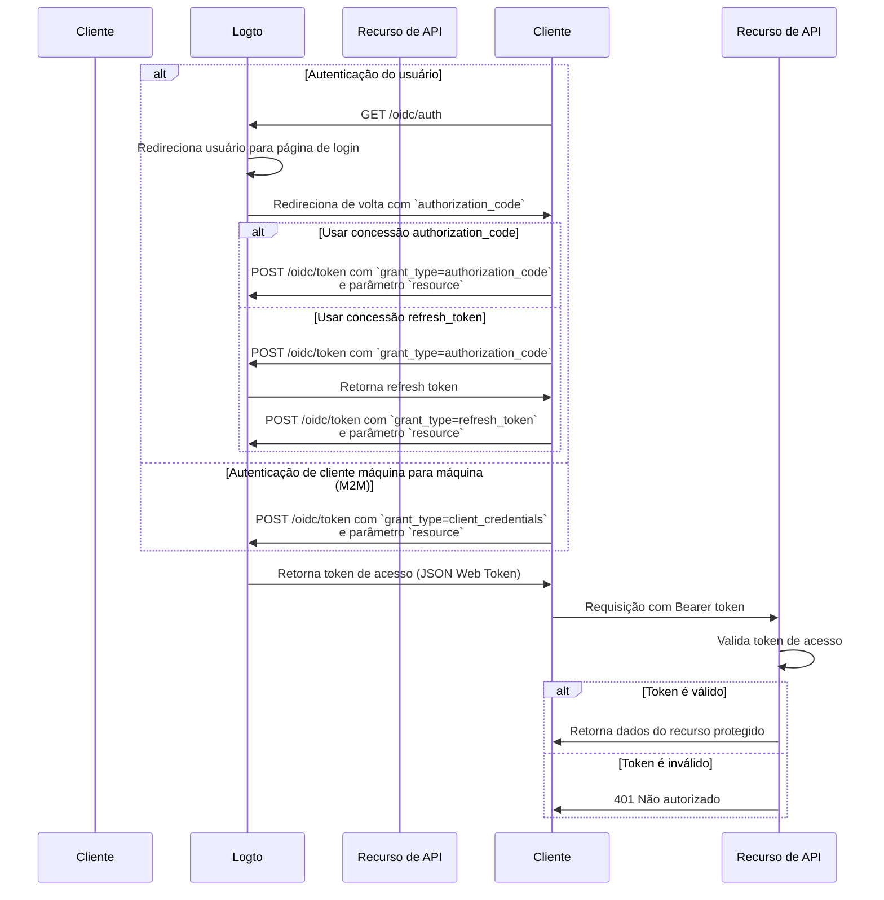

import illustration from '@site/docs/authorization/assets/rbac-global-api-resources.png';
import AuthorizationRequestExample from '@site/docs/authorization/fragments/AuthorizationRequestExample';
import ClientCredentialsRequestExample from '@site/docs/authorization/fragments/ClientCredentialsRequestExample';
import TokenRequestExample from '@site/docs/authorization/fragments/TokenRequestExample';
import HandleUserPermissionChange from '@site/docs/authorization/fragments/_handle-user-permission-change.mdx';
import TabItem from '@theme/TabItem';
import Tabs from '@theme/Tabs';

# Proteger recursos globais de API

export const resource = 'https://api.your-app.com';

Proteja APIs de todo o produto usando controle de acesso baseado em papel (RBAC) no Logto. Atribua papéis globais e permissões para controlar o acesso de todos os usuários e clientes em todo o seu aplicativo.

## O que são recursos globais de API? \{#what-are-global-api-resources}

Recursos globais de API são endpoints ou serviços em seu aplicativo que são acessíveis a todos os usuários, independentemente de organização ou locatário. Normalmente, são APIs públicas, serviços centrais do produto ou qualquer endpoint que não esteja vinculado a uma organização específica.

**Casos de uso incluem**

- APIs públicas ou endpoints compartilhados entre sua base de usuários.
- Microsserviços que não estão ligados à multi-tenancy.
- APIs centrais do aplicativo (por exemplo, `/api/users`, `/api/products`) usadas por todos os clientes.

O Logto permite proteger essas APIs usando OAuth 2.1, combinado com controle de acesso flexível baseado em papel.

## Como funciona no Logto \{#how-it-works-in-logto}

- **Recursos de API e permissões são registrados globalmente:** Cada API que você deseja proteger é definida com um indicador de recurso único (URI) com um conjunto de permissões (escopos) que controlam o acesso.
- **O acesso é controlado por papéis globais:** Você pode atribuir permissões a papéis, que então são atribuídos a usuários ou clientes.
- **Separado das permissões em nível de organização:** Recursos globais de API não têm contexto de organização. No entanto, podem ser usados em conjunto com papéis de organização para fornecer uma camada adicional de contexto, se necessário. Para proteger APIs em nível de organização, veja [Proteger recursos de API em nível de organização](/authorization/organization-level-api-resources).


### Visão geral da implementação \{#implementation-overview}

1. **Registre seu recurso de API** e defina suas permissões no Logto.
2. **Defina papéis** com as permissões necessárias para acessar a API.
3. **Atribua papéis** a usuários ou clientes.
4. **Use fluxos de autorização OAuth 2.0** para obter tokens de acesso para a API (o parâmetro resource deve corresponder ao identificador da API registrada).
5. **Valide tokens de acesso** em sua API para aplicar as permissões.

### Entendendo indicadores de recurso \{#understanding-resource-indicators}

O Logto modela recursos de API de acordo com [RFC 8707: Indicadores de Recurso para OAuth 2.0](https://www.rfc-editor.org/rfc/rfc8707.html). Um **indicador de recurso** é um URI que identifica exclusivamente a API ou serviço de destino solicitado.

**Pontos-chave**

- Indicadores de recurso devem ser URIs absolutos (por exemplo, `https://api.example.com`)
- Sem componente de fragmento; evite usar query strings sempre que possível.
- Indicadores de recurso permitem tokens restritos por público e suporte para arquiteturas multi-API.

**Exemplo**

- Management API: `https://my-tenant.logto.app/api`
- API global personalizada: `https://api.yourapp.com`

### Fluxo de autorização: autenticando e protegendo sua API \{#authorization-flow-authenticating-and-securing-your-api}

O fluxo abaixo se aplica tanto à autenticação interativa do usuário (navegador/app) quanto a cenários backend máquina para máquina (M2M).

Observe que o fluxo não inclui detalhes exaustivos sobre os parâmetros ou cabeçalhos necessários, mas foca nas etapas principais envolvidas. Continue lendo para ver como o fluxo funciona na prática.



_Autenticação do usuário = navegador/app. M2M = serviço backend ou script usando credenciais de cliente._

:::note
O parâmetro `resource` deve corresponder exatamente ao identificador da API (indicador de recurso) que você registrou no Logto.
:::

## Etapas de implementação \{#implementation-steps}

### Registre seus recursos de API \{#register-your-api-resources}

1. Vá para <CloudLink to="/api-resources">Console → Recursos de API</CloudLink>.
2. Crie um novo recurso de API (por exemplo, `https://api.yourapp.com/org`) e defina suas permissões (escopos).

Para etapas completas de configuração, veja [Definir recursos de API com permissões](/authorization/role-based-access-control#define-api-resources-with-permissions).

### Configure papéis globais \{#set-up-global-roles}

1. Vá para <CloudLink to="/roles">Console → Papéis</CloudLink>.
2. Crie papéis que correspondam às permissões da sua API (por exemplo, `read:products`, `write:products`).
3. Atribua esses papéis a usuários ou clientes que precisam de acesso à API.

Para etapas completas de configuração, veja [Usar papéis globais](/authorization/role-based-access-control#configure-global-roles).

### Obtenha tokens de acesso para recursos globais de API \{#obtain-access-tokens-for-global-api-resources}

Antes de acessar um recurso global de API, seu cliente deve obter um token de acesso. O Logto emite [JSON Web Tokens (JWTs)](https://auth.wiki/jwt) como tokens de acesso para recursos globais de API. Isso normalmente é feito usando o [fluxo de código de autorização OAuth 2.0](https://auth.wiki/authorization-code-flow), [fluxo de refresh token](https://auth.wiki/refresh-token) ou o [fluxo de client credentials](https://auth.wiki/client-credentials-flow).

#### Fluxo de código de autorização ou refresh token \{#authorization-code-or-refresh-token-flow}

Todos os SDKs oficiais do Logto suportam a obtenção de tokens de acesso para recursos globais de API usando o fluxo de refresh token nativamente. Uma biblioteca padrão de cliente OAuth 2.0 / OIDC também pode ser usada para implementar esse fluxo.

<Tabs groupId="user-client">
<TabItem value="logto-sdk" label="Logto SDK">

Ao inicializar o cliente Logto, adicione o indicador de recurso ao parâmetro `resources` (array), depois adicione as permissões desejadas (escopos) ao parâmetro `scopes`.

Uma vez que o usuário esteja autenticado, passe o indicador de recurso no parâmetro `resource` ou parâmetro de nome semelhante ao solicitar o token de acesso (por exemplo, ao chamar `getAccessToken()`).

Para detalhes sobre cada SDK, veja os [Comece rápido](/quick-starts).

</TabItem>
<TabItem value="oauth-client" label="OAuth 2.0 / OIDC client library">

Ao configurar seu cliente OAuth 2.0 ou inicializar o fluxo de código de autorização, certifique-se de incluir o parâmetro `resource` e os escopos desejados na solicitação de autorização.

Algumas bibliotecas podem não suportar o parâmetro `resource` nativamente, mas geralmente permitem passar parâmetros adicionais na solicitação de autorização. Verifique a documentação da sua biblioteca para detalhes.

Aqui está um exemplo não normativo da solicitação de autorização com os parâmetros `resource` e `scope`:

<AuthorizationRequestExample resource={resource} scope="read:products write:products" />

Uma vez que o usuário esteja autenticado, você receberá um authorization code. Troque esse código por um token de acesso fazendo uma requisição POST para o endpoint `/oidc/token` do Logto, incluindo o parâmetro `resource` no corpo da requisição.

Aqui está um exemplo não normativo da solicitação de token usando o tipo de concessão authorization code:

<TokenRequestExample grantType="authorization_code" resource={resource} />

Você também pode usar o tipo de concessão `refresh_token` para obter um novo token de acesso sem interação do usuário, desde que o parâmetro `resource` seja incluído na requisição.

Aqui está um exemplo não normativo da solicitação de token usando o tipo de concessão refresh token:

<TokenRequestExample grantType="refresh_token" resource={resource} />

</TabItem>
</Tabs>

#### Fluxo de client credentials \{#client-credentials-flow}

Para cenários máquina para máquina (M2M), você pode usar o fluxo de client credentials para obter um token de acesso para seu recurso global de API. Fazendo uma requisição POST para o endpoint `/oidc/token` do Logto, você pode solicitar um token de acesso usando seu client ID e secret.

Há dois parâmetros principais a serem incluídos na requisição:

- `resource`: O URI do indicador de recurso da API que você deseja acessar (por exemplo, `https://api.yourapp.com`).
- `scope`: As permissões que você deseja solicitar para a API (por exemplo, `read:products write:products`).

Aqui está um exemplo não normativo da solicitação de token usando o tipo de concessão client credentials:

<ClientCredentialsRequestExample
  resource="https://api.yourapp.com"
  scope="read:products write:products"
/>

### Validando tokens de acesso JWT em sua API \{#validating-jwt-access-tokens-in-your-api}

Os JWTs emitidos pelo Logto contêm reivindicações que sua API pode usar para aplicar autorização.

Quando sua API recebe uma requisição com um token de acesso emitido pelo Logto, você deve:

- Verificar a assinatura do token (usando os JWKs do Logto).
- Confirmar que o token não está expirado (reivindicação `exp`).
- Verificar se o `iss` (emissor) corresponde ao seu endpoint Logto.
- Garantir que o `aud` (público) corresponde ao identificador do recurso de API que você registrou (por exemplo, `https://api.yourapp.com`).
- Separar a reivindicação `scope` (separada por espaço) e verificar as permissões necessárias.

Para guias passo a passo e específicos de linguagem, veja [Como validar tokens de acesso](/authorization/validate-access-tokens).

<HandleUserPermissionChange type="global" />

## Melhores práticas e dicas de segurança \{#best-practices-and-security-tips}

- **Mantenha as permissões orientadas ao negócio:** Use nomes claros que correspondam a ações reais.
- **Mantenha a expiração do token curta:** Reduz o risco caso um token seja vazado.
- **Limite os escopos concedidos:** Dê aos tokens apenas as permissões realmente necessárias.
- **Use restrição de público:** Sempre verifique a reivindicação `aud` para evitar uso indevido.

## Perguntas frequentes \{#faqs}

<details>
<summary>

### E se meu cliente não suportar o parâmetro resource? \{#what-if-my-client-doesn-t-support-the-resource-parameter}

</summary>

Defina um recurso de API padrão no Console do Logto. Os tokens terão esse público por padrão quando nenhum parâmetro resource for especificado na solicitação de token.

</details>

<details>
<summary>

### Por que recebo 401 Não autorizado da minha API? \{#why-do-i-get-401-unauthorized-from-my-api}

</summary>

Verifique os seguintes problemas comuns:

- **Assinatura do token**: Verifique se seu backend está buscando os JWKs corretos do Logto
- **Expiração do token**: Certifique-se de que o token não expirou (reivindicação `exp`)
- **Público**: Confirme se a reivindicação `aud` corresponde ao indicador de recurso de API registrado
- **Escopos necessários**: Verifique se o token contém as permissões necessárias na reivindicação `scope`

</details>

<details>
<summary>

### Como testar sem um cliente completo? \{#how-do-i-test-without-a-full-client}

</summary>

Use um [token de acesso pessoal](/user-management/personal-access-token) para simular chamadas autenticadas. Isso permite testar seus endpoints de API sem implementar um fluxo OAuth completo em seu aplicativo cliente.

</details>

<details>
<summary>

### Posso usar prefixos de escopo ou versões abreviadas ao solicitar permissões? \{#can-i-use-scope-prefixes-or-shortened-versions}

</summary>

Não. Os nomes dos escopos devem **corresponder exatamente** aos nomes das permissões definidos em seu recurso de API. Prefixos e versões abreviadas não funcionam como curingas.

**Exemplo:**

Se seu recurso de API define:

- `read:elections`
- `write:elections`

Você deve solicitar:

```swift
scopes: ["read:elections", "write:elections"]
```

Isso **NÃO funcionará**:

```swift
scopes: ["read", "write"]  // ❌ Não corresponde aos nomes das permissões
```

</details>

## Leitura adicional \{#further-reading}

<Url href="/authorization/validate-access-tokens">Como validar tokens de acesso</Url>
<Url href="/use-cases/authorization/rbac-in-practice">
  RBAC na prática: Implementando autorização segura para seu aplicativo
</Url>
<Url href="/developers/custom-token-claims">Personalizando reivindicações de token</Url>
<Url href="https://www.rfc-editor.org/rfc/rfc8707.html">RFC 8707: Indicadores de Recurso</Url>
