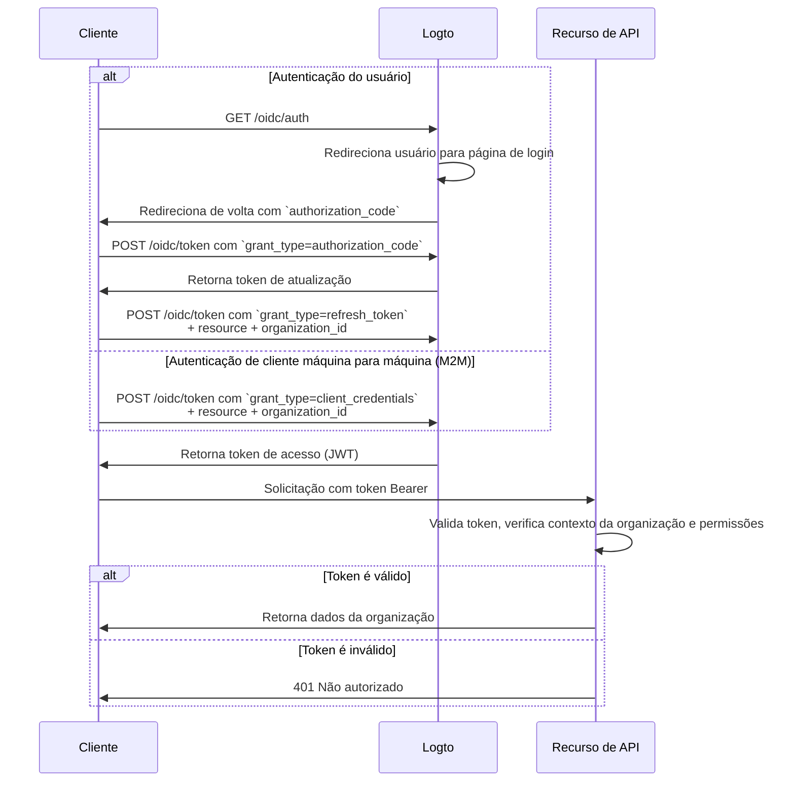

import illustration from '@site/docs/authorization/assets/rbac-organization-level-api-resources.png';
import AuthorizationRequestExample from '@site/docs/authorization/fragments/AuthorizationRequestExample';
import ClientCredentialsRequestExample from '@site/docs/authorization/fragments/ClientCredentialsRequestExample';
import TokenRequestExample from '@site/docs/authorization/fragments/TokenRequestExample';
import TabItem from '@theme/TabItem';
import Tabs from '@theme/Tabs';

import InspectOrganizationClaim from './fragments/_inspect-organization-claim.md';
import OrganizationTokenWarning from './fragments/_organization-token-warning.md';

# Proteger recursos de API em nível de organização

export const resource = 'https://api.your-app.com/organizations';

Combine recursos de API com o template de organização para restringir o acesso a APIs e dados dentro de cada organização, garantindo isolamento em nível de locatário em seu SaaS.

## O que são recursos de API em nível de organização? \{#what-are-organization-level-api-resources}

Recursos de API em nível de organização são endpoints ou serviços em seu aplicativo que são **restritos a uma organização específica**. Essas APIs aplicam autorização e acesso com base no contexto da organização — garantindo que usuários ou clientes acessem apenas dados e ações relevantes para sua organização.

**Casos de uso incluem**

- APIs para gerenciar membros, papéis ou configurações da organização (por exemplo, `/organizations/{organizationId}/members`)
- Dashboards, análises ou relatórios restritos à organização
- Endpoints de cobrança, assinatura ou auditoria vinculados a uma organização
- Qualquer API onde ações e dados são isolados por locatário

O Logto permite proteger essas APIs de organização usando OAuth 2.1 e RBAC, enquanto oferece suporte a arquiteturas SaaS multi-locatário.

Essas permissões são gerenciadas por meio de **papéis da organização** definidos no [template de organização](/authorization/organization-template). Cada organização usa o mesmo template, garantindo um modelo de permissões consistente em todas as organizações.

## Como funciona no Logto \{#how-it-works-in-logto}

- **Recursos de API e permissões são registrados globalmente:** Cada recurso de API é definido com um indicador de recurso (URI) exclusivo e um conjunto de permissões (escopos) no Logto.
- **Papéis em nível de organização:** Papéis de organização são definidos no template de organização. Permissões de recursos de API (escopos) são atribuídas a papéis da organização, que então são atribuídos a usuários ou clientes **dentro de cada organização**.
- **Autorização sensível ao contexto:** Quando um cliente solicita um token de acesso com um recurso de API e um `organization_id`, o Logto emite um token que inclui tanto o contexto da organização quanto o público da API. As permissões (escopos) do token são determinadas pelos papéis da organização do usuário para a organização especificada.
- **Separação de recursos globais:** Recursos de API podem ser acessados com ou sem contexto de organização. O RBAC da organização só é aplicado se um `organization_id` for incluído na solicitação. Para APIs compartilhadas entre todos os usuários, veja [Proteger recursos de API globais](/authorization/global-api-resources).

### Visão geral da implementação \{#implementation-overview}

1. **Registre seu recurso de API** e defina suas permissões (escopos) no Logto.
2. **Defina papéis de organização** no template de organização e atribua as permissões de API relevantes.
3. **Atribua papéis** a usuários ou clientes dentro de cada organização.
4. **Solicite um token de acesso** para a API com um `organization_id` para incluir o contexto da organização.
5. **Valide tokens de acesso** em sua API, aplicando tanto o contexto da organização quanto as permissões.

### Como o Logto aplica o RBAC de organização \{#how-logto-applies-organization-rbac}

- Se você solicitar um token de acesso **sem** um `organization_id`, apenas papéis/permissões globais serão considerados.
- Se você solicitar um token de acesso **com** um `organization_id`, o Logto avalia os papéis da organização do usuário e suas permissões associadas para aquela organização.
- O JWT resultante conterá tanto o público da API (`aud` claim) quanto o contexto da organização (`organization_id` claim), com escopos filtrados para aqueles concedidos pelos papéis da organização do usuário.

### Fluxo de autorização: autenticando e protegendo APIs com contexto de organização \{#authorization-flow-authenticating-and-securing-apis-with-organization-context}

O fluxo a seguir mostra como um cliente (web, mobile ou backend) obtém e usa tokens de organização para acessar recursos de API em nível de organização.

Observe que o fluxo não inclui detalhes exaustivos sobre os parâmetros ou cabeçalhos necessários, mas foca nos principais passos envolvidos. Continue lendo para ver como o fluxo funciona na prática.

_Autenticação do usuário = navegador/app. M2M = serviço backend ou script usando credenciais de cliente + contexto de organização._

## Etapas de implementação \{#implementation-steps}

### Registre seu recurso de API \{#register-your-api-resource}

1. Vá para <CloudLink to="/api-resources">Console → Recursos de API</CloudLink>.
2. Crie um novo recurso de API (por exemplo, `https://api.yourapp.com/org`) e defina suas permissões (escopos).

Para etapas completas de configuração, veja [Definir recursos de API com permissões](/authorization/role-based-access-control#define-api-resources-with-permissions).

### Configure papéis de organização \{#set-up-organization-roles}

1. Vá para <CloudLink to="/organization-template/organization-roles">Console → Template de organização → Papéis da organização</CloudLink>.
2. Crie papéis de organização (por exemplo, `admin`, `member`) e atribua permissões de API a cada papel.
3. Atribua papéis a usuários ou clientes dentro de cada organização. Se ainda não forem membros, convide-os ou adicione-os primeiro.

Para etapas completas de configuração, veja [Usar papéis de organização](/authorization/role-based-access-control#configure-organization-roles).

### Obtenha tokens de organização para recursos de API \{#obtain-organization-tokens-for-api-resources}

Seu cliente/app deve solicitar um token com `resource` e `organization_id` para acessar APIs em nível de organização. O Logto emite tokens de organização como [JSON Web Tokens (JWTs)](https://auth.wiki/jwt). Você pode obtê-los usando o [fluxo de token de atualização](https://auth.wiki/refresh-token) ou o [fluxo de credenciais de cliente](https://auth.wiki/client-credentials-flow).

#### Fluxo de token de atualização \{#refresh-token-flow}

Quase todos os SDKs oficiais do Logto suportam a obtenção de tokens de organização usando o fluxo de token de atualização nativamente. Uma biblioteca padrão de cliente OAuth 2.0 / OIDC também pode ser usada para implementar esse fluxo.

<Tabs groupId="user-client">
<TabItem value="logto-sdk" label="Logto SDK">

Ao inicializar o Logto SDK, adicione o `urn:logto:scope:organizations` e as permissões de organização desejadas (escopos) ao parâmetro `scopes`.

Alguns SDKs do Logto possuem um escopo predefinido para organizações, como `UserScope.Organizations` em SDKs JavaScript.

<InspectOrganizationClaim />

Ao chamar `getAccessToken()`, especifique tanto o recurso de API (`resource`) quanto o ID da organização (`organizationId`) para obter um token de organização.

Para detalhes sobre cada SDK, veja [Inícios rápidos](/quick-starts).

</TabItem>
<TabItem value="oauth-client" label="Biblioteca cliente OAuth 2.0 / OIDC">

Ao configurar seu cliente OAuth 2.0 ou inicializar o fluxo de código de autorização, certifique-se de incluir os seguintes parâmetros:

- `resource`: Defina como o identificador do recurso de API registrado no Logto (por exemplo, `https://api.your-app.com/organizations`).
- `scope`: Inclua o escopo predefinido de organização (`urn:logto:scope:organizations`), `offline_access` (para obter tokens de atualização) e quaisquer permissões de API específicas que você precisar (por exemplo, `manage:members view:analytics`).

Algumas bibliotecas podem não suportar o parâmetro `resource` nativamente, mas geralmente permitem passar parâmetros adicionais na solicitação de autorização. Verifique a documentação da sua biblioteca para detalhes.

Aqui está um exemplo não normativo de como a solicitação de autorização pode ser:

<AuthorizationRequestExample
  resource={resource}
  scope="urn:logto:scope:organizations invite:member manage:billing"
/>

Depois que o usuário for autenticado, você receberá um código de autorização. Use esse código fazendo uma solicitação POST para o endpoint `/oidc/token` do Logto.

Aqui está um exemplo não normativo da solicitação de token:

<TokenRequestExample grantType="authorization_code" />

<OrganizationTokenWarning />

Você receberá um token de atualização que pode ser usado para obter tokens de organização.

<InspectOrganizationClaim />

Por fim, use o token de atualização para obter um token de organização fazendo uma solicitação POST para o endpoint `/oidc/token` do Logto. Lembre-se de incluir:

- O parâmetro `resource` definido como o identificador do recurso de API (por exemplo, `https://api.yourapp.com/org`).
- O parâmetro `organization_id` definido como o ID da organização desejada.
- (Opcional) O parâmetro `scope` para restringir ainda mais as permissões necessárias (por exemplo, `manage:members view:reports`).

Aqui está um exemplo não normativo de como a solicitação de token pode ser:

<TokenRequestExample
  grantType="refresh_token"
  resource={resource}
  organizationId="your-organization-id"
/>

</TabItem>
</Tabs>

#### Fluxo de credenciais de cliente \{#client-credentials-flow}

Para cenários máquina para máquina (M2M), você pode usar o fluxo de credenciais de cliente para obter um token de acesso para permissões de recursos de API em nível de organização. Fazendo uma solicitação POST para o endpoint `/oidc/token` do Logto com parâmetros de organização, você pode solicitar um token de organização usando seu client ID e secret.

Aqui estão os principais parâmetros a serem incluídos na solicitação:

- `resource`: O identificador do recurso de API (por exemplo, `https://api.yourapp.com/org`).
- `organization_id`: O ID da organização para a qual você deseja o token.
- `scope`: As permissões de recursos de API em nível de organização que você deseja solicitar (por exemplo, `invite:member`, `manage:billing`).

Aqui está um exemplo não normativo da solicitação de token usando o tipo de concessão de credenciais de cliente:

<ClientCredentialsRequestExample
  resource="https://api.yourapp.com/org"
  organizationId="your-organization-id"
  scope="invite:member manage:billing"
/>

### Validar tokens de organização \{#validate-organization-tokens}

Tokens de organização emitidos pelo Logto (JWTs) contêm reivindicações que sua API pode usar para aplicar controle de acesso em nível de organização.

Quando seu app receber um token de organização, você deve:

- Verificar a assinatura do token (usando os JWKs do Logto).
- Confirmar que o token não está expirado (`exp` claim).
- Verificar se o `iss` (emissor) corresponde ao seu endpoint Logto.
- Garantir que o `aud` (público) corresponda ao identificador do recurso de API que você registrou (por exemplo, `https://api.yourapp.com/org`).
- Validar a reivindicação `organization_id` para garantir que o token está restrito à organização correta.
- Dividir a reivindicação `scope` (separada por espaço) e verificar as permissões necessárias.
- Se o caminho da sua API incluir o ID da organização (por exemplo, `/organizations/{organizationId}/members`), garantir que a reivindicação `organization_id` corresponda ao parâmetro do caminho.

Para guias passo a passo e específicos de linguagem, veja [Como validar tokens de acesso](/authorization/validate-access-tokens).

## Boas práticas e dicas de segurança \{#best-practices-and-security-tips}

- **Sempre valide o contexto da organização:** Não confie apenas no token; verifique a reivindicação `organization_id` para cada chamada de API restrita à organização.
- **Use restrições de público:** Sempre verifique a reivindicação `aud` para garantir que o token é para a organização pretendida.
- **Mantenha as permissões orientadas ao negócio:** Use nomes claros que correspondam a ações reais; conceda apenas o necessário para cada papel da organização.
- **Separe permissões de API e não-API** sempre que possível (mas ambas podem estar em um único papel).
- **Mantenha a vida útil dos tokens curta:** Reduz o risco caso um token seja vazado.
- **Revise regularmente seu template de organização:** Atualize papéis e permissões conforme seu produto evolui.

## Perguntas frequentes \{#faqs}

### O que acontece se eu não incluir `organization_id` na minha solicitação de token? \{#what-if-i-don-t-include-organization-id-in-my-token-request}

Apenas papéis/permissões globais serão avaliados. O RBAC da organização não será aplicado.

### Posso misturar permissões de organização e não-organização em um único papel? \{#can-i-mix-organization-and-non-organization-permissions-in-a-single-role}

Não, permissões de organização (incluindo permissões de API em nível de organização) são definidas pelo template de organização e não podem ser misturadas com permissões globais de API. No entanto, você pode criar papéis que incluam permissões de organização e permissões de API em nível de organização.

## Leitura adicional \{#further-reading}

<Url href="/authorization/validate-access-tokens">Como validar tokens de acesso</Url>
<Url href="/developers/custom-token-claims">Personalizando reivindicações de token</Url>
<Url href="/use-cases/multi-tenancy/build-multi-tenant-saas-application">
  Caso de uso: Construa um aplicativo SaaS multi-locatário
</Url>
<Url href="https://www.rfc-editor.org/rfc/rfc8707.html">RFC 8707: Indicadores de recurso</Url>
