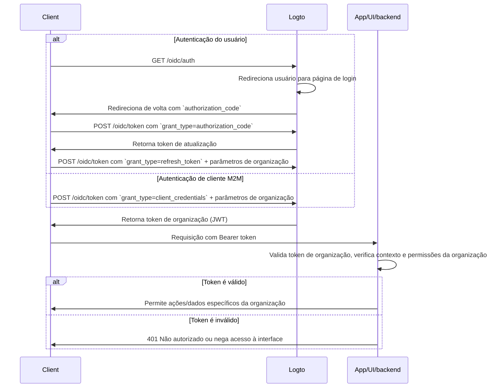

import TabItem from '@theme/TabItem';
import Tabs from '@theme/Tabs';

import illustration from '@site/docs/authorization/assets/rbac-organization-permissions.png';
import AuthorizationRequestExample from '@site/docs/authorization/fragments/AuthorizationRequestExample';
import ClientCredentialsRequestExample from '@site/docs/authorization/fragments/ClientCredentialsRequestExample';
import TokenRequestExample from '@site/docs/authorization/fragments/TokenRequestExample';
import InspectOrganizationClaim from './fragments/_inspect-organization-claim.md';
import OrganizationTokenWarning from './fragments/_organization-token-warning.md';

# Proteger permissões de organização (não-API)

Use o template de organização para gerenciar e aplicar papéis e permissões em nível de organização no Logto, controlando o acesso a funcionalidades e fluxos dentro do contexto de uma organização.

## O que são permissões de organização (não-API)? \{#what-are-organization-non-api-permissions}

As permissões de organização (não-API) controlam o que os usuários podem fazer **dentro do contexto de uma organização**, mas não são **aplicadas no nível da API**. Em vez disso, elas governam o acesso a funcionalidades do aplicativo, elementos da interface, fluxos de trabalho ou ações de negócio, e não a APIs de backend.

**Casos de uso incluem**

- Convidar ou gerenciar membros dentro de uma organização
- Atribuir ou alterar papéis da organização
- Gerenciar cobrança, configurações ou funções administrativas de uma organização
- Acesso a dashboards, análises ou ferramentas internas que não possuem endpoints de API

O Logto permite proteger essas permissões de organização usando OAuth 2.1 e RBAC, além de suportar arquiteturas SaaS multi-tenant.

Essas permissões são gerenciadas através de **papéis de organização** definidos no [template de organização](/authorization/organization-template). Todas as organizações usam o mesmo template, garantindo um modelo de permissões consistente entre todas as organizações.

## Como funciona no Logto \{#how-it-works-in-logto}

- **RBAC em nível de organização:** Papéis e permissões são definidos no template de organização. Quando um usuário entra em uma organização, ele recebe um ou mais papéis, concedendo permissões específicas.
- **Aplicação não-API:** As permissões são verificadas e aplicadas na interface do seu app, fluxo de trabalho ou lógica de backend, não necessariamente por um gateway de API.
- **Separação da proteção de API:** As permissões de organização (não-API) são distintas das permissões de recursos de API. Você pode combinar ambas para cenários avançados.

  

### Visão geral da implementação \{#implementation-overview}

1. **Defina as permissões de organização** no Logto, dentro do template de organização.
2. **Crie papéis de organização** que agrupem as permissões necessárias para ações específicas da organização.
3. **Atribua papéis** a usuários ou clientes dentro de cada organização.
4. **Obtenha um token de organização (JWT)** para a organização atual usando o fluxo de token de atualização ou client credentials.
5. **Valide os tokens de acesso** na interface ou backend do seu app para aplicar as permissões de organização.

### Fluxo de autorização: autenticando e protegendo permissões de organização \{#authorization-flow-authenticating-and-securing-organization-permissions}

O fluxo a seguir mostra como um cliente (web, mobile ou backend) obtém e utiliza tokens de organização para aplicação de permissões não-API.

Observe que o fluxo não inclui detalhes exaustivos sobre os parâmetros ou cabeçalhos necessários, mas foca nos passos principais. Continue lendo para ver como o fluxo funciona na prática.

_Autenticação do usuário = navegador/app. M2M = serviço de backend ou script usando client credentials + contexto de organização._

## Passos de implementação \{#implementation-steps}

### Registrar permissões de organização \{#register-organization-permissions}

1. Acesse <CloudLink to="/organization-template/organization-permissions">Console → Template de organização → Permissões de organização</CloudLink>.
2. Defina as permissões de organização necessárias (ex.: `invite:member`, `manage:billing`, `view:analytics`).

Para o passo a passo completo, veja [Definir permissões de organização](/authorization/role-based-access-control#define-organization-permissions).

### Configurar papéis de organização \{#set-up-organization-roles}

1. Acesse <CloudLink to="/organization-template/organization-roles">Console → Template de organização → Papéis de organização</CloudLink>.
2. Crie papéis que agrupem as permissões de organização definidas anteriormente (ex.: `admin`, `member`, `billing`).
3. Atribua esses papéis a usuários ou clientes dentro de cada organização.

Para o passo a passo completo, veja [Usar papéis de organização](/authorization/role-based-access-control#configure-organization-roles).

### Obter tokens de organização (não-API) \{#obtain-organization-tokens-non-api}

Seu cliente/app deve obter um token de organização (não-API) para acessar permissões de organização. O Logto emite tokens de organização como [JSON Web Tokens (JWTs)](https://auth.wiki/jwt). Você pode obtê-los usando o [fluxo de token de atualização](https://auth.wiki/refresh-token) ou o [fluxo client credentials](https://auth.wiki/client-credentials-flow).

#### Fluxo de token de atualização \{#refresh-token-flow}

Quase todos os SDKs oficiais do Logto suportam a obtenção de tokens de organização usando o fluxo de token de atualização nativamente. Uma biblioteca padrão de cliente OAuth 2.0 / OIDC também pode ser usada para implementar esse fluxo.

<Tabs groupId="user-client">
<TabItem value="logto-sdk" label="Logto SDK">

Ao inicializar o Logto SDK, adicione `urn:logto:scope:organizations` e as permissões de organização desejadas (escopos) ao parâmetro `scopes`.

Alguns SDKs do Logto possuem um escopo pré-definido para organizações, como `UserScope.Organizations` em SDKs JavaScript.

<InspectOrganizationClaim />

Use `getOrganizationToken` ou um método similar (como `getAccessToken` com um ID de organização) para solicitar um token de organização para uma organização específica.

Para detalhes de cada SDK, veja [Inícios rápidos](/quick-starts).

</TabItem>
<TabItem value="oauth-client" label="OAuth 2.0 / OIDC client library">

Ao configurar seu cliente OAuth 2.0 ou inicializar o fluxo de código de autorização, certifique-se de incluir os seguintes parâmetros:

- `resource`: Defina como `urn:logto:resource:organizations` para indicar que deseja um token de organização.
- `scope`: Inclua o escopo pré-definido de organização (`urn:logto:scope:organizations`), `offline_access` (para obter tokens de atualização) e quaisquer permissões de organização específicas necessárias (ex.: `invite:member`, `manage:billing`).

Algumas bibliotecas podem não suportar o parâmetro `resource` nativamente, mas geralmente permitem passar parâmetros adicionais na requisição de autorização. Verifique a documentação da sua biblioteca para detalhes.

Veja um exemplo não normativo de como a requisição de autorização pode ser:

<AuthorizationRequestExample
  scope="urn:logto:scope:organizations invite:member manage:billing"
  resource="urn:logto:resource:organizations"
/>

Após a autenticação do usuário, você receberá um código de autorização. Use esse código fazendo uma requisição POST para o endpoint `/oidc/token` do Logto.

Veja um exemplo não normativo da requisição de token:

<TokenRequestExample grantType="authorization_code" />

<OrganizationTokenWarning />

Você receberá um token de atualização que pode ser usado para obter tokens de organização.

<InspectOrganizationClaim />

Por fim, use o token de atualização para obter um token de organização fazendo uma requisição POST para o endpoint `/oidc/token` do Logto. Lembre-se de incluir:

- O parâmetro `organization_id` definido para o ID da organização desejada.
- (Opcional) O parâmetro `scope` para restringir ainda mais as permissões necessárias (ex.: `manage:members view:reports`).

Veja um exemplo não normativo de como a requisição de token pode ser:

<TokenRequestExample grantType="refresh_token" organizationId="your-organization-id" />

</TabItem>
</Tabs>

#### Fluxo client credentials \{#client-credentials-flow}

Para cenários máquina para máquina (M2M), você pode usar o fluxo client credentials para obter um token de acesso para permissões de organização. Fazendo uma requisição POST para o endpoint `/oidc/token` do Logto com parâmetros de organização, você pode solicitar um token de organização usando seu client ID e secret.

Aqui estão os principais parâmetros a serem incluídos na requisição:

- `organization_id`: O ID da organização para a qual deseja o token.
- `scope`: As permissões de organização que deseja solicitar (ex.: `invite:member`, `manage:billing`).

Veja um exemplo não normativo da requisição de token usando o grant type client credentials:

<ClientCredentialsRequestExample
  organizationId="your-organization-id"
  scope="invite:member manage:billing"
/>

### Validar tokens de organização \{#validate-organization-tokens}

Os tokens de organização emitidos pelo Logto (JWTs) contêm reivindicações que seu app/interface/backend pode usar para aplicar o controle de acesso em nível de organização.

Quando seu app recebe um token de organização, você deve:

- Verificar a assinatura do token (usando os JWKs do Logto).
- Confirmar que o token não está expirado (reivindicação `exp`).
- Checar se o `iss` (emissor) corresponde ao seu endpoint Logto.
- Garantir que o `aud` (público) corresponde ao identificador formatado da organização (ex.: `urn:logto:organization:{organization_id}`).
- Separar a reivindicação `scope` (separada por espaço) e verificar as permissões necessárias.

Para guias passo a passo e específicos de linguagem, veja [Como validar tokens de acesso](/authorization/validate-access-tokens).

## Boas práticas e dicas de segurança \{#best-practices-and-security-tips}

- **Nunca confie apenas na aplicação na interface:** Sempre valide permissões no backend para ações críticas.
- **Use restrições de público:** Sempre verifique a reivindicação `aud` para garantir que o token é para a organização pretendida.
- **Mantenha as permissões orientadas ao negócio:** Use nomes claros que correspondam a ações reais; conceda apenas o necessário para cada papel de organização.
- **Separe permissões de API e não-API** sempre que possível (mas ambas podem estar em um único papel).
- **Revise o template de organização regularmente** conforme seu produto evolui.

## Perguntas frequentes \{#faqs}

### Posso misturar permissões de organização e não-organização em um único papel? \{#can-i-mix-organization-and-non-organization-permissions-in-a-single-role}

Não, as permissões de organização (incluindo permissões de API em nível de organização) são definidas pelo template de organização e não podem ser misturadas com permissões globais de API. No entanto, você pode criar papéis que incluam permissões de organização e permissões de API em nível de organização.

### Onde devo aplicar permissões não-API? \{#where-should-i-enforce-non-api-permissions}

Verifique permissões não-API tanto na interface (para controle de funcionalidades) quanto na lógica do servidor para ações sensíveis.

## Leitura adicional \{#further-reading}

<Url href="/authorization/validate-access-tokens">Como validar tokens de acesso</Url>
<Url href="/developers/custom-token-claims">Personalizando reivindicações de token</Url>
<Url href="/use-cases/multi-tenancy/build-multi-tenant-saas-application">
  Caso de uso: Construir um aplicativo SaaS multi-tenant
</Url>
