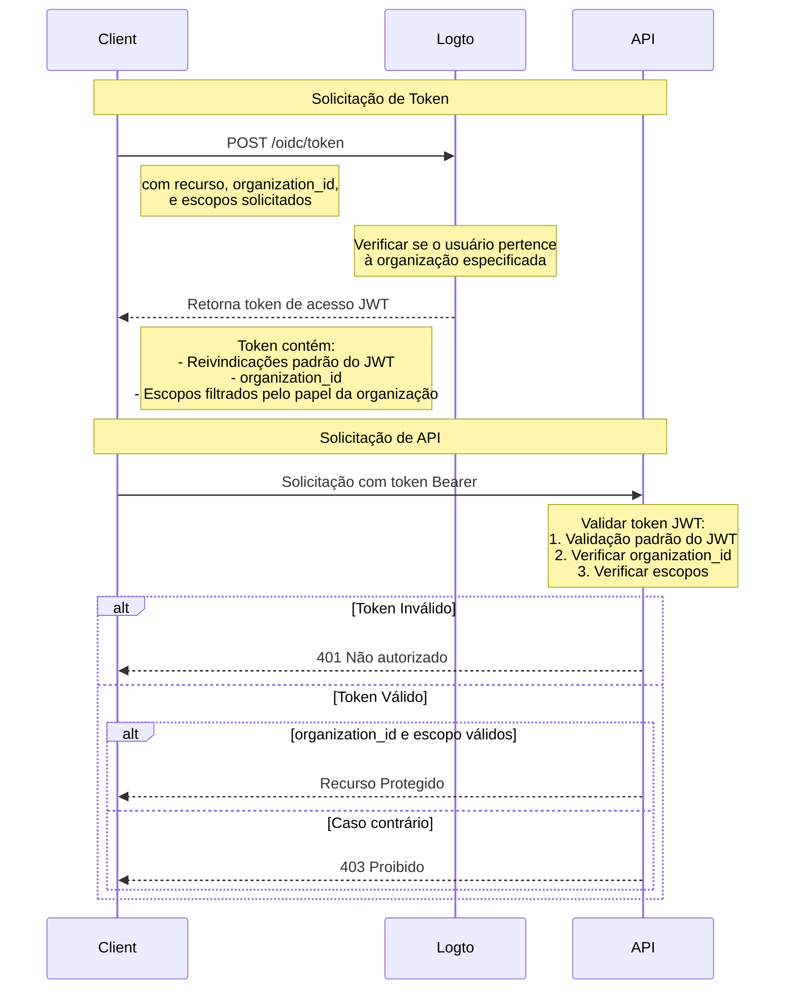

# Proteger recurso de API com modelo de organização

Além de [Proteger sua API](/authorization/api-resources/protect-your-api), que protege recursos garantindo que um JWT válido esteja presente, papéis de organização também podem ser aplicados para filtrar os escopos. Neste artigo, vamos nos concentrar em como o papel da organização afeta a delegação e validação de escopos no seu fluxo de autenticação.



## O parâmetro adicional `organization_id` \{#the-additional-organization_id-parameter}

Além da solicitação normal de concessão de token de acesso, no diagrama adicionamos um parâmetro adicional `organization_id`, isso informa ao Logto para restringir os escopos aos papéis específicos da organização.

## Configuração do cliente \{#client-setup}

Se você estiver usando o SDK do Logto, pode adicionar `organization_id` como o segundo parâmetro do método `getAccessToken`.

```tsx
const accessToken = await logto.getAccessToken('https://my-resource.com/api', 'org_1');

// Ou obtendo reivindicações diretamente
const accessTokenClaims = await logto.getAccessTokenClaims('https://my-resource.com/api', 'org_1');
console.log(accessTokenClaims.organization_id); // 'org_1'
console.log(accessTokenClaims.aud); // 'https://my-resource.com/api'
```

Então, apenas os escopos herdados dos papéis dessa organização serão incluídos no token de acesso, assim como uma reivindicação adicional `organization_id`.

## Validação do servidor de API \{#api-server-validation}

Além da validação normal do token de acesso JWT, você precisará adicionar um nível adicional para verificar se `organization_id` está presente e é válido.
