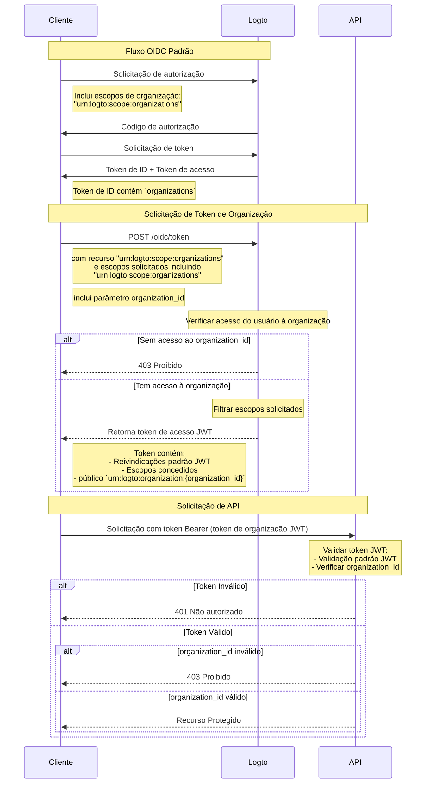

import TabItem from '@theme/TabItem';
import Tabs from '@theme/Tabs';

# Proteger recursos da organização

Além de [Proteger sua API](/authorization/api-resources/protect-your-api), que considera a API como o recurso, a organização também pode ser um recurso, e proteger seu recurso de organização da mesma forma. Neste artigo, vamos nos concentrar em como mudar para proteger seu recurso de organização de maneira semelhante.



## Passo 1: Obter IDs de organização do fluxo OIDC

Logto estende o protocolo padrão [OpenID Connect](https://openid.net/specs/openid-connect-core-1_0.html) para permitir que seu aplicativo obtenha as informações da organização do usuário. Existem duas maneiras de fazer isso:

- Se você estiver usando um Logto SDK com suporte a Organizações, pode adicionar o escopo `urn:logto:scope:organizations` ao parâmetro `scopes` do objeto de configuração. Normalmente, o SDK terá um enum para esse escopo, por exemplo, `UserScope.Organizations` nos [Logto JS SDKs](https://github.com/logto-io/js).

<Tabs groupId="sdk">

  <TabItem value="js" label="JavaScript">

```ts
import { LogtoClient, UserScope } from '@logto/browser'; // ou @logto/node, @logto/client

const logto = new LogtoClient({
  // ...
  scopes: [UserScope.Organizations],
});
```

  </TabItem>
  <TabItem value="react" label="React">

```tsx
import { LogtoProvider, UserScope } from '@logto/react';

const App = () => (
  <LogtoProvider
    config={{
      // ...
      scopes: [UserScope.Organizations],
    }}
  >
    {/* ... */}
  </LogtoProvider>
);
```

  </TabItem>
  <TabItem value="python" label="Python">

```python
from logto import UserInfoScope

client = LogtoClient(
    LogtoConfig(
        # ...
        scopes=[UserInfoScope.organizations],
    )
)
```

  </TabItem>
  <TabItem value="php" label="PHP">

```php
use Logto\Sdk\Constants\UserScope;

$client = new LogtoClient(
  new LogtoConfig(
    // ...
    scopes: [UserScope::organizations],
  )
);
```

  </TabItem>
  <TabItem value="swift" label="Swift">

```swift
import Logto
import LogtoClient

let config = try? LogtoConfig(
    // ...
    scopes: [
        UserScope.organizations.rawValue,
    ],
    // ...
)
let client = LogtoClient(useConfig: config)
```

  </TabItem>
  <TabItem value="others" label="Outros">

```ts
const config = {
  // ...
  scope: 'openid offline_access urn:logto:scope:organizations',
};
```

  </TabItem>

</Tabs>
    
- Para outros casos, você precisa adicionar o escopo `urn:logto:scope:organizations` ao parâmetro `scope` da configuração do SDK (ou solicitação de autenticação).

Uma vez que o usuário conclua o fluxo de autenticação, você pode obter as informações da organização do `idToken`:

```tsx
// Use JavaScript como exemplo
const idToken = await logto.getIdTokenClaims();

console.log(idToken.organizations); // Um array de strings com IDs de organização
```

O campo `organizations` (reivindicação) também será incluído na resposta do [endpoint UserInfo](https://openid.net/specs/openid-connect-core-1_0.html#UserInfo).

### Opcional: Obter papéis da organização

Se você ainda não configurou papéis da organização, consulte [esta seção](/authorization/organization-template/configure-organization-template/#create-organization-role).

Para obter todos os papéis da organização do usuário atual:

- Se você estiver usando um Logto SDK com suporte a Organizações, pode adicionar o escopo `urn:logto:scope:organization_roles` ao parâmetro `scopes` do objeto de configuração. Normalmente, o SDK terá um enum para esse escopo, por exemplo, `UserScope.OrganizationRoles` nos [Logto JS SDKs](https://github.com/logto-io/js).
- Para outros casos, você precisa adicionar o escopo `urn:logto:scope:organization_roles` ao parâmetro `scope` da configuração do SDK (ou solicitação de autenticação).

Então você pode obter os papéis da organização do `idToken`:

```tsx
// Use JavaScript como exemplo
const idToken = await logto.getIdTokenClaims();

console.log(idToken.organization_roles); // Um array de strings com papéis da organização
```

Cada string no array está no formato `organization_id:role_id`, por exemplo, `org_123:admin` significa que o usuário tem o papel `admin` na organização com ID `org_123`.

O campo `organization_roles` (reivindicação) também será incluído na resposta do [endpoint UserInfo](https://openid.net/specs/openid-connect-core-1_0.html#UserInfo).

## Passo 2. Buscar token de organização

Para realizar ações no contexto de uma organização, o usuário precisa receber um token de acesso para essa organização (token de organização). O token de organização é um token JWT que contém o ID da organização e as permissões (escopos) do usuário na organização.

### Adicionar parâmetros à solicitação de autenticação

- Se você estiver usando um Logto SDK com suporte a Organizações, pode adicionar o escopo `urn:logto:scope:organizations` ao parâmetro `scopes` do objeto de configuração, da mesma forma que [Obter IDs de organização do usuário atual](/authorization/organization-template/protect-organization-resources/#step-1-get-organization-ids-from-oidc-flow).
  - O Logto SDK com suporte a Organizações cuidará automaticamente do restante da configuração.
- Para outros casos, você precisa adicionar os escopos `offline_access` e `urn:logto:scope:organizations` ao parâmetro `scope` e o recurso `urn:logto:resource:organizations` ao parâmetro `resource` da configuração do SDK (ou solicitação de autenticação).
  - Nota: `offline_access` é necessário para obter o `refresh_token` que pode ser usado para buscar tokens de organização.

```tsx
// Apenas para outros casos. Para Logto SDKs, veja acima.
const config = {
  // ...
  scope: 'openid offline_access urn:logto:scope:organizations',
  resource: 'urn:logto:resource:organizations',
};
```

:::note

O recurso `urn:logto:resource:organizations` é um recurso especial que representa o modelo de organização.

:::

### Buscar o token de organização

Logto estende o tipo de concessão `refresh_token` padrão para permitir que seu aplicativo busque tokens de organização.

- Se você estiver usando um Logto SDK com suporte a Organizações, pode chamar o método `getOrganizationToken()` (ou o método `getOrganizationTokenClaims()`) do SDK.
- Para outros casos, você precisa chamar o endpoint de token com os seguintes parâmetros:
  - `grant_type`: `refresh_token`.
  - `client_id`: O ID do aplicativo que o usuário usou para autenticar.
  - `refresh_token`: O `refresh_token` que você obteve do fluxo de autenticação.
  - `organization_id`: O ID da organização para a qual você deseja obter o token.
  - `scope` (opcional): Os escopos que você deseja conceder ao usuário na organização. Se não especificado, o servidor de autorização tentará conceder os mesmos escopos do fluxo de autenticação.

<Tabs groupId="sdk">

  <TabItem value="js" label="JavaScript">

```ts
const token = await logto.getOrganizationToken('<organization-id>');
```

  </TabItem>
  <TabItem value="react" label="React">

```tsx
const App = () => {
  const { getOrganizationToken } = useLogto();

  const getToken = async () => {
    const token = await getOrganizationToken('<organization-id>');
  };

  return <button onClick={getToken}>Get organization token</button>;
};
```

  </TabItem>
  <TabItem value="python" label="Python">

```python
token = await client.getOrganizationToken("<organization-id>")
# ou
claims = await client.getOrganizationTokenClaims("<organization-id>")
```

  </TabItem>
  <TabItem value="php" label="PHP">

```php
$token = $client->getOrganizationToken('<organization-id>');
// ou
$claims = $client->getOrganizationTokenClaims('<organization-id>');
```

  </TabItem>
  <TabItem value="swift" label="Swift">

```swift
let token = try await client.getOrganizationToken(forId: "<organization-id>")
```

  </TabItem>
  <TabItem value="others" label="Outros">

```ts
// Use JavaScript como exemplo

const params = new URLSearchParams();

params.append('grant_type', 'refresh_token');
params.append('client_id', 'YOUR_CLIENT_ID');
params.append('refresh_token', 'REFRESH_TOKEN');
params.append('organization_id', 'org_123');

const response = await fetch('https://YOUR_LOGTO_ENDPOINT/oidc/token', {
  method: 'POST',
  headers: {
    'Content-Type': 'application/x-www-form-urlencoded',
  },
  body: params,
});
```

  </TabItem>

</Tabs>

A resposta estará no mesmo formato do [endpoint de token padrão](https://openid.net/specs/openid-connect-core-1_0.html#TokenEndpoint), e o `access_token` é o token de organização no formato JWT.

Além das reivindicações regulares de um token de acesso, o token de organização também contém as seguintes reivindicações:

- `aud`: O público do token de organização é `urn:logto:organization:{organization_id}`.
- `scope`: Os escopos concedidos ao usuário na organização com espaço como delimitador.

### Exemplo

Um bom exemplo pode valer mais que mil palavras. Suponha que nosso modelo de organização tenha a seguinte configuração:

- Permissões: `read:logs`, `write:logs`, `read:users`, `write:users`.
- Papéis: `admin`, `member`.
  - O papel `admin` tem todas as permissões.
  - O papel `member` tem permissões `read:logs` e `read:users`.

E o usuário tem a seguinte configuração:

- IDs de organização: `org_1`, `org_2`.
- Papéis da organização: `org_1:admin`, `org_2:member`.

Na configuração do Logto SDK (ou solicitação de autenticação), configuramos outras coisas corretamente e adicionamos os seguintes escopos:

- `urn:logto:scope:organizations`
- `openid`
- `offline_access`
- `read:logs`
- `write:logs`

Agora, quando o usuário conclui o fluxo de autenticação, podemos obter os IDs de organização do `idToken`:

```tsx
// Use JavaScript como exemplo
const idToken = await logto.getIdTokenClaims();

console.log(idToken.organizations); // ['org_1', 'org_2']
```

Se quisermos obter os tokens de organização:

```tsx
// Use JavaScript como exemplo
const org1Token = await logto.getOrganizationTokenClaims('org_1');
const org2Token = await logto.getOrganizationTokenClaims('org_2');

console.log(org1Token.aud); // 'urn:logto:organization:org_1'
console.log(org1Token.scope); // 'read:logs write:logs'
console.log(org2Token.aud); // 'urn:logto:organization:org_2'
console.log(org2Token.scope); // 'read:logs'

const org3Token = await logto.getOrganizationTokenClaims('org_3'); // Erro: Usuário não é membro da organização
```

Explicação:

- Para `org_1`, o usuário tem o papel `admin`, então o token de organização deve ter todas as permissões disponíveis (escopos).
- Para `org_2`, o usuário tem o papel `member`, então o token de organização deve ter permissões `read:logs` e `read:users` (escopos).

Como solicitamos apenas os escopos `read:logs` e `write:logs` no fluxo de autenticação, os tokens de organização foram "reduzidos" de acordo, resultando na interseção dos escopos solicitados e os escopos disponíveis.

### Buscar token de organização para um aplicativo máquina para máquina

Semelhante a buscar tokens de organização para usuários, você também pode buscar tokens de organização para aplicativos máquina para máquina. A única diferença é que você precisa usar o tipo de concessão `client_credentials` em vez do tipo de concessão `refresh_token`.

Para saber mais sobre aplicativos máquina para máquina, veja [Máquina para máquina: Autenticação com Logto](/quick-starts/m2m/).

## Passo 3. Verificar tokens de organização

Uma vez que o aplicativo obtém um token de organização, ele pode usar o token da mesma forma que um token de acesso regular, por exemplo, chamar as APIs com o token no cabeçalho `Authorization` no formato `Bearer {token}`.

Na sua API, a maneira de verificar o token de organização é bastante semelhante a [Proteger sua API](/authorization/api-resources/protect-your-api/#validate-authorization-tokens-for-api-requests). Principais diferenças:

- Ao contrário dos tokens de acesso para recursos de API, um usuário NÃO PODE obter um token de organização se não for membro da organização.
- O público do token de organização é `urn:logto:organization:{organization_id}`.
- Para certas permissões (escopos), você precisa verificar a reivindicação `scope` do token de organização dividindo a string com espaço como delimitador.
