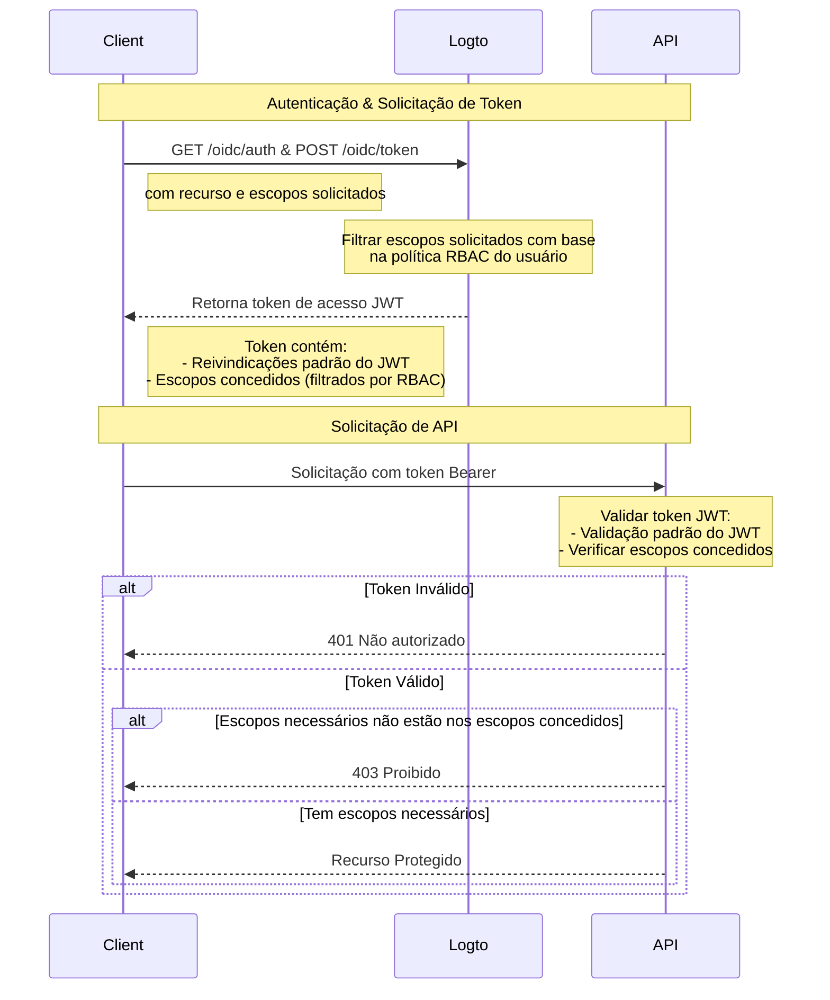

# Proteger recursos de API com RBAC

Além de [Proteger sua API](/authorization/api-resources/protect-your-api), que protege recursos garantindo que um JWT válido esteja presente, o Controle de Acesso Baseado em Papel (RBAC) também pode ser aplicado.

Neste artigo, vamos nos concentrar em como o RBAC afeta a delegação e validação de escopos no seu fluxo de autenticação.

## Diagrama de fluxo de autorização



Como você pode ver no diagrama, a principal diferença em relação à proteção básica de API é o tratamento dos escopos. Em vez de conceder diretamente todos os escopos solicitados, o Logto agora os filtra com base na política RBAC do usuário. O token JWT conterá apenas os escopos que o usuário recebeu através de seus papéis. No lado da API, após validar a autenticidade do token, há uma verificação adicional para garantir que o token contenha os escopos necessários para o recurso solicitado.

## Opcional: Lidar com mudança de permissão do usuário

As permissões do usuário podem ser alteradas durante uma sessão — por exemplo, eles podem receber novos papéis ou ter permissões de papel existentes modificadas. Nesses cenários, detectar essas mudanças e atualizar a interface do usuário do aplicativo pode ser necessário.

O que acontece quando as permissões de um usuário mudam? Existem dois casos.

### Nenhuma nova permissão introduzida no sistema

Os tokens de acesso atuais permanecerão válidos até expirarem, mesmo após as permissões de um usuário serem alteradas. No entanto, novas permissões serão refletidas em tokens de acesso subsequentes, e quaisquer permissões revogadas serão omitidas.

Aqui estão algumas **ações recomendadas**:

**Opção 1: Use tempos curtos de expiração de token de acesso**

Tokens de acesso de curta duração garantem atualizações mais frequentes das permissões do usuário. Configure as configurações de expiração de token nas configurações do [Recurso de API](/authorization/api-resources/#logto-api-resource-schema) do Console. A desvantagem é que isso aumentará o uso de tokens.

**Opção 2: Verifique dinamicamente as permissões**

Chame periodicamente os endpoints do [Logto Management API](/integrate-logto/interact-with-management-api) (por exemplo, SWR) ou use técnicas como WebSocket para implementar conexões de longa duração para buscar dinamicamente as permissões do usuário. Ao detectar mudanças, limpe o token de acesso existente e os tokens recém-emitidos refletirão automaticamente as mudanças de permissão. - API: User-role - API: Role-permission

Quando mudanças de permissão forem detectadas, limpe o token de acesso do armazenamento primeiro e, em seguida, chame o método `getAccessToken()` do SDK para adquirir um novo. O novo token de acesso emitido deve refletir as mudanças de permissão.

### Nova permissão é introduzida no sistema e atribuída a um usuário

Isso acontece quando novas permissões são introduzidas no seu sistema. Nesse caso, você precisará primeiro incluir os novos escopos de permissão introduzidos ao inicializar o cliente Logto. Por exemplo:

```tsx
new LogtoClient({
  appId: 'your-app-id',
  redirectUrl: 'your-redirect-url',
  resources: ['your-api-resource'],
  scopes: [
    // ... seus escopos de permissão existentes,
    'new-scope',
  ],
});
```

Em segundo lugar, cada um dos seus aplicativos cliente precisa re-consentir ou re-login dos usuários para receber a mudança de permissão. Então, o novo escopo de permissão será refletido em novos tokens de acesso.

Exemplo de código para re-consentimento:

```tsx
signIn({ redirectUrl: 'your-redirect-url', prompt: 'consent' });
```

## Recursos relacionados

<Url href="https://blog.logto.io/logto-x-cloudflare-workers">
  Logto x Cloudflare Workers: Como proteger seus workers do acesso público?
</Url>

<Url href="https://blog.logto.io/secure-api-for-machine-to-machine">
  Proteja seus recursos de API para comunicação máquina para máquina
</Url>
