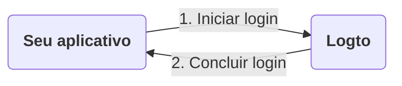
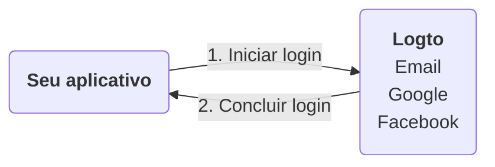
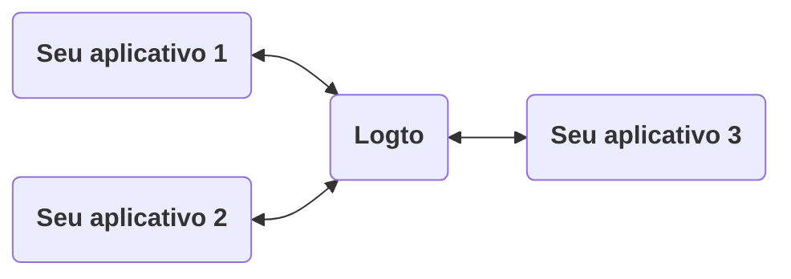
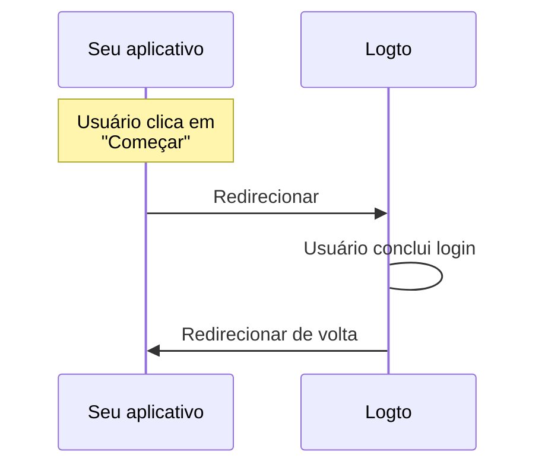
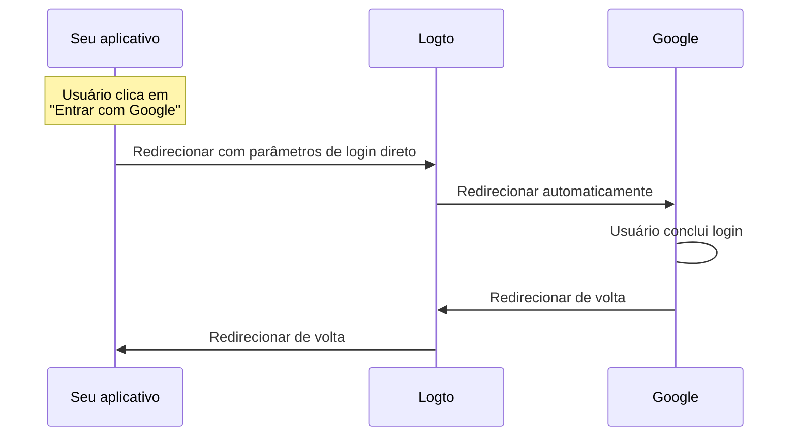

# Experiência de login explicada

Esta página explica a experiência de login no Logto e por que ela é projetada dessa forma.

## Introdução \{#introduction}

A experiência de login é o processo de autenticação do usuário no Logto. O processo pode ser simplificado da seguinte forma:



1. Seu aplicativo inicia o método de login.
2. O usuário é redirecionado para a página de login do Logto. Para aplicativos nativos, o navegador do sistema é aberto.
3. O usuário faz login e é redirecionado de volta para o seu aplicativo (configurado como o "Redirect URI" no Logto).

Embora o processo seja simples, a parte de redirecionamento pode parecer exagerada às vezes. No entanto, pode ser benéfico e seguro de várias maneiras. Explicaremos os motivos nas seções a seguir.

## Por que redirecionar? \{#why-redirect}

### Flexibilidade \{#flexibility}

O redirecionamento permite que você desacople o processo de autenticação do seu aplicativo. À medida que seu negócio cresce, você pode manter o mesmo processo de autenticação sem alterar seu aplicativo. Por exemplo, você pode adicionar autenticação multifatorial (MFA) ou alterar os métodos de login sem tocar no seu aplicativo.



### Suporte a múltiplos aplicativos \{#multi-app-support}

Se você tiver vários aplicativos, seus usuários podem fazer login uma vez e acessar todos os aplicativos sem precisar fazer login novamente. Isso é especialmente útil para empresas SaaS ou empresas com múltiplos serviços.



### Aplicativos nativos \{#native-apps}

Para aplicativos nativos, redirecionar para o navegador do sistema é uma maneira segura de autenticar usuários e tem suporte integrado tanto para iOS quanto para Android.

- **iOS**: A Apple oferece [ASWebAuthenticationSession](https://developer.apple.com/documentation/authenticationservices/aswebauthenticationsession) para autenticação segura.
- **Android**: O Google fornece [Custom Tabs](https://developer.chrome.com/docs/android/custom-tabs) para uma experiência perfeita.

### Segurança \{#security}

Nos bastidores, o Logto é um provedor [OpenID Connect (OIDC)](https://openid.net/specs/openid-connect-core-1_0.html). O OIDC é um padrão amplamente adotado para autenticação de usuários.

O Logto impõe medidas de segurança rigorosas, como [PKCE](https://tools.ietf.org/html/rfc7636), e desativa fluxos inseguros como o fluxo implícito. O redirecionamento é uma maneira segura de autenticar usuários e pode prevenir muitos ataques comuns.

## E se eu precisar mostrar alguns componentes de login no meu aplicativo? \{#what-if-i-need-to-show-some-sign-in-components-in-my-app}

Às vezes, sua equipe pode querer mostrar alguns componentes de login no aplicativo, como um botão "Entrar com Google". Isso pode ser alcançado usando o recurso "Login direto" no Logto.

### Como funciona? \{#how-does-it-work}

Digamos que você tenha dois botões de call-to-action no seu aplicativo: "Começar" e "Entrar com Google". Esses botões são projetados para:

- "Começar": Redirecionar para a página de login normal.
- "Entrar com Google": Redirecionar para a página de login do Google.

Ambas as ações precisam concluir o processo de login e redirecionar de volta para o seu aplicativo.

---

#### Processo de clicar em "Começar" \{#process-of-clicking-get-started}

Neste caso, a experiência de login é a mesma do padrão. O usuário é redirecionado para a página de login do Logto e depois de volta para o seu aplicativo.



:::note
Se você configurou métodos de login social (por exemplo, Google, Facebook) no Logto, o usuário pode ser redirecionado para a página de login correspondente. Na ilustração, mostramos apenas o fluxo geral para simplicidade.
:::

---

#### Processo de clicar em "Entrar com Google" \{#process-of-clicking-sign-in-with-google}

Neste caso, o usuário é redirecionado para a página de login do Google automaticamente, sem interagir com a página de login do Logto. A velocidade desse redirecionamento automático é quase instantânea, de modo que os usuários podem não perceber o redirecionamento.



---

Em resumo, o recurso de login direto é uma maneira de automatizar algumas interações na experiência de login sem alterar o nível de segurança.

### Usar login direto no seu aplicativo \{#use-direct-sign-in-in-your-app}

Para usar o login direto, você precisa passar o parâmetro `direct_sign_in` ao iniciar o método de login. O valor deve ser composto de um formato que o Logto reconheça. Por exemplo, para entrar com o Google, o valor deve ser `social:google`.

Em alguns SDKs oficiais do Logto, há uma opção dedicada para login direto. Aqui está um exemplo de uso de login direto no SDK JavaScript `@logto/client`:

```ts
client.signIn({
  redirectUri: 'https://some-redirect-uri',
  directSignIn: { method: 'social', target: 'google' },
});
```

Para mais detalhes, consulte [Login direto](/end-user-flows/authentication-parameters/direct-sign-in).

:::info
Estamos implementando gradualmente esse recurso em todos os SDKs oficiais do Logto. Se você não o vir no seu SDK, sinta-se à vontade para nos contatar.
:::

## Preciso que meus usuários preencham suas credenciais no meu aplicativo \{#i-need-my-users-to-fill-in-their-credentials-in-my-app}

Se você precisa que seus usuários preencham suas credenciais (como email e senha) diretamente no seu aplicativo, em vez de redirecionar para o Logto, não podemos ajudá-lo com isso no momento. Historicamente, havia uma concessão de "Credenciais de Senha do Proprietário do Recurso", mas agora é considerada insegura e foi [formalmente descontinuada no OAuth 2.1](https://datatracker.ietf.org/doc/html/draft-ietf-oauth-security-topics#name-resource-owner-password-cre).

Para saber mais sobre os riscos de segurança do tipo de concessão ROPC, confira nosso post no blog [Por que você deve descontinuar o tipo de concessão ROPC](https://blog.logto.io/deprecated-ropc-grant-type/).

## Recursos relacionados \{#related-resources}

<Url href="https://blog.logto.io/oauth-2-1/">OAuth 2.1 está aqui: O que você precisa saber</Url>
<Url href="https://blog.logto.io/how-pkce-protects-the-authorization-code-flow-for-native-apps">
  O que é PKCE: dos conceitos básicos ao entendimento profundo
</Url>
