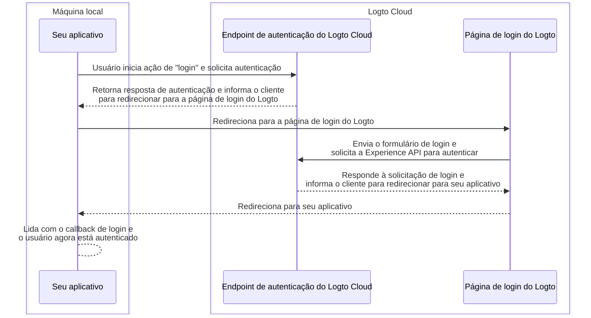
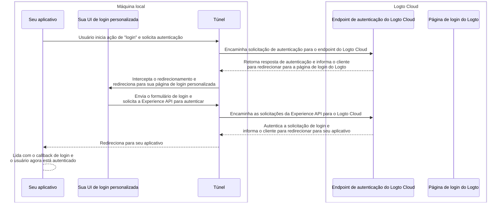

import TabItem from '@theme/TabItem';
import Tabs from '@theme/Tabs';

# Depurar e testar sua UI personalizada localmente

Para usuários do Logto Cloud, facilitamos para que você "Traga sua própria UI" para o Logto. Usuários do Cloud agora podem fazer upload de um arquivo zip contendo os ativos da UI personalizada em <CloudLink to="/sign-in-experience/branding">Console > Experiência de login > Branding > Traga sua UI</CloudLink> (Confira a página [Traga sua UI](/customization/bring-your-ui) para mais detalhes.)

No entanto, ao desenvolver essas páginas de UI personalizadas, os usuários querem testar e depurar o código localmente, antes de fazer o upload para o Logto Cloud. Este comando CLI ajuda você a configurar um túnel local e conectar as seguintes 3 entidades juntas:
seu endpoint de autenticação do Logto Cloud, seu aplicativo e sua UI de login personalizada.

## Por que eu preciso disso?

Por padrão, quando você clica no botão "login" em seu aplicativo, você será direcionado para a página de login configurada no endpoint do Logto. Um fluxo de login bem-sucedido pode ser ilustrado da seguinte forma:



Mas agora, como você está desenvolvendo sua própria UI de login personalizada, você precisa de uma maneira de navegar para as páginas de UI de login personalizadas que estão rodando em sua máquina local.
Isso requer um serviço de túnel local para interceptar as solicitações de saída do seu aplicativo e redirecioná-las para suas páginas de UI de login personalizadas.

Além disso, você precisa interagir com a [Experience API do Logto](https://openapi.logto.io/group/endpoint-experience) para autenticar usuários e gerenciar sessões.
Este serviço também ajudará a encaminhar essas solicitações da Experience API para o Logto Cloud a fim de evitar problemas de CORS.

O diagrama de sequência abaixo ilustra como um fluxo de "login" bem-sucedido funciona com sua UI personalizada e o serviço de túnel em funcionamento:



Com o serviço de túnel em funcionamento, você pode agora desenvolver e testar sua UI de login personalizada localmente, sem precisar fazer upload dos ativos para o Logto Cloud toda vez que fizer uma alteração.

## Instruções

### Passo 1: Execute o comando

Supondo que seu ID de locatário do Cloud seja `foobar`, e você tenha uma página de login personalizada rodando em seu servidor de desenvolvimento local em `http://localhost:4000`, então você pode executar o comando desta forma:

<Tabs groupId="cmd">

  <TabItem value="cli" label="CLI">

```bash
logto-tunnel -p 9000 --experience-uri http://localhost:4000/ --endpoint https://foobar.logto.app/
```

  </TabItem>
  <TabItem value="npx" label="npx">

```bash
npx @logto/tunnel -p 9000 --experience-uri http://localhost:4000/ --endpoint https://foobar.logto.app/
```

  </TabItem>

</Tabs>

Também funciona se você tiver um domínio personalizado configurado no Logto:

<Tabs groupId="cmd">

  <TabItem value="cli" label="CLI">

```bash
logto-tunnel -p 9000 --experience-uri http://localhost:4000/ --endpoint https://your.custom.domain/
```

  </TabItem>
  <TabItem value="npx" label="npx">

```bash
npx @logto/tunnel -p 9000 --experience-uri http://localhost:4000/ --endpoint https://your.custom.domain/
```

  </TabItem>

</Tabs>

Alternativamente, o comando também suporta ativos HTML estáticos sem precisar executá-los primeiro em um servidor de desenvolvimento. Apenas certifique-se de que há um `index.html` no caminho que você especificou.

<Tabs groupId="cmd">

  <TabItem value="cli" label="CLI">

```bash
logto-tunnel -p 9000 --experience-path /path/to/your/static/files --endpoint https://foobar.logto.app/
```

  </TabItem>
  <TabItem value="npx" label="npx">

```bash
npx @logto/tunnel -p 9000 --experience-path /path/to/your/static/files --endpoint https://foobar.logto.app/
```

  </TabItem>

</Tabs>

### Passo 2: Atualize o URI do endpoint em seu aplicativo

Finalmente, execute seu aplicativo e defina seu endpoint do Logto para o endereço do serviço de túnel `http://localhost:9000/`.

Vamos tomar um aplicativo React como exemplo:

```tsx title=App.tsx
import { LogtoProvider, LogtoConfig } from '@logto/react';

const config: LogtoConfig = {
  // endpoint: 'https://foobar.logto.app/', // endpoint original do Logto Cloud
  endpoint: 'http://localhost:9000/', // endereço do serviço de túnel
  appId: '<your-application-id>',
};

const App = () => (
  <LogtoProvider config={config}>
    <YourAppContent />
  </LogtoProvider>
);
```

Se você estiver usando login social, também precisará atualizar o URI de redirecionamento nas configurações do seu provedor social para o endereço do serviço de túnel.

```
http://localhost:9000/callback/<connector-id>
```

Se tudo estiver configurado corretamente, quando você clicar no botão "login" em seu aplicativo, você deverá ser direcionado para sua página de login personalizada em vez da UI integrada do Logto, junto com uma sessão válida (cookies) que permite que você interaja ainda mais com a Experience API do Logto.

Feliz codificação!

## Recursos relacionados

<Url href="https://blog.logto.io/automate-custom-sign-in-ui-deployment-with-github-actions">
  Automatize o deployment da sua UI de login personalizada com o workflow do GitHub Actions
</Url>
