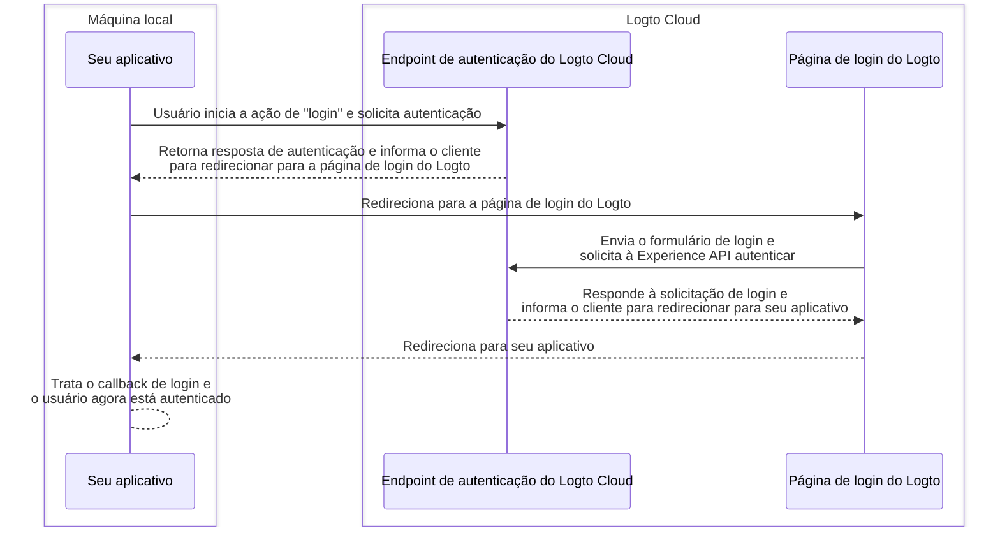
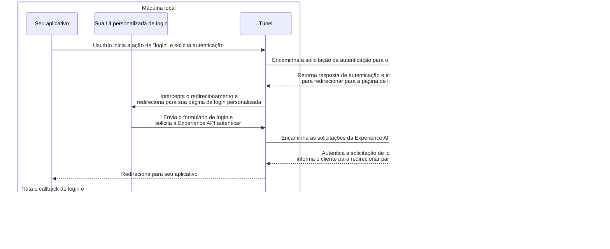

import TabItem from '@theme/TabItem';
import Tabs from '@theme/Tabs';

# Depure e teste sua UI personalizada localmente

Para usuários do Logto Cloud, facilitamos para que você possa "Trazer sua própria UI" para o Logto. Usuários do Cloud agora podem fazer upload de um arquivo zip contendo os ativos da UI personalizada em <CloudLink to="/sign-in-experience/branding">Console > Experiência de login & conta > Branding > Traga sua UI</CloudLink> (Confira a página [Traga sua UI](/customization/bring-your-ui) para mais detalhes.)

No entanto, ao desenvolver essas páginas de UI personalizadas, os usuários querem testar e depurar o código localmente antes de fazer o upload para o Logto Cloud. Este comando CLI ajuda você a configurar um túnel local e conectar as seguintes 3 entidades:
seu endpoint de autenticação do Logto Cloud, seu aplicativo e sua UI personalizada de login.

## Por que eu preciso disso? \{#why-do-i-need-this}

Por padrão, quando você clica no botão "login" em seu aplicativo, você será direcionado para a página de login configurada no endpoint do Logto. Um fluxo de login bem-sucedido pode ser ilustrado da seguinte forma:


```mermaid
sequenceDiagram
    box Máquina local
    participant A as Seu aplicativo
    end
    box Logto Cloud
    participant B as Endpoint de autenticação do Logto Cloud
    participant C as Página de login do Logto
    end
    A ->> B: Usuário inicia a ação de "login" e solicita autenticação
    B -->> A: Retorna resposta de autenticação e informa o cliente<br/>para redirecionar para a página de login do Logto
    A ->> C: Redireciona para a página de login do Logto
    C ->> B: Envia o formulário de login e<br/>solicita à Experience API autenticar
    B -->> C: Responde à solicitação de login e<br/>informa o cliente para redirecionar para seu aplicativo
    C -->> A: Redireciona para seu aplicativo
    A --> A: Trata o callback de login e<br/>o usuário agora está autenticado
```

Mas agora, como você está desenvolvendo sua própria UI personalizada de login, você precisa de uma forma de navegar para as páginas de UI de login personalizadas rodando em sua máquina local.
Isso requer um serviço de túnel local para interceptar as solicitações de saída do seu aplicativo e redirecioná-las para suas páginas de UI de login personalizadas.

Além disso, você precisa interagir com a [Experience API do Logto](https://openapi.logto.io/group/endpoint-experience) para autenticar usuários e gerenciar sessões.
Esse serviço também ajudará a encaminhar essas solicitações da Experience API para o Logto Cloud a fim de evitar problemas de CORS.

O diagrama de sequência abaixo ilustra como um fluxo de "login" bem-sucedido funciona com sua UI personalizada e o serviço de túnel em funcionamento:


```mermaid
sequenceDiagram
    box Máquina local
    participant A as Seu aplicativo
    participant B as Sua UI personalizada de login
    participant C as Túnel
    end
    box Logto Cloud
    participant D as Endpoint de autenticação do Logto Cloud
    participant E as Página de login do Logto
    end
    A ->> C: Usuário inicia a ação de "login" e solicita autenticação
    C ->> D: Encaminha a solicitação de autenticação para o endpoint do Logto Cloud
    D -->> C: Retorna resposta de autenticação e informa o cliente<br/>para redirecionar para a página de login do Logto
    C ->> B: Intercepta o redirecionamento e<br/>redireciona para sua página de login personalizada
    B ->> C: Envia o formulário de login e<br/>solicita à Experience API autenticar
    C ->> D: Encaminha as solicitações da Experience API para o Logto Cloud
    D -->> C: Autentica a solicitação de login e<br/>informa o cliente para redirecionar para seu aplicativo
    C -->> A: Redireciona para seu aplicativo
    A --> A: Trata o callback de login e<br/>o usuário agora está autenticado
```

Com o serviço de túnel em funcionamento, você pode agora desenvolver e testar sua UI personalizada de login localmente, sem precisar fazer upload dos ativos para o Logto Cloud toda vez que fizer uma alteração.

## Instruções \{#instructions}

### Passo 1: Execute o comando \{#step-1-execute-the-command}

Supondo que seu tenant Cloud seja `foobar` e você tenha uma página de login personalizada rodando em seu servidor de desenvolvimento local em `http://localhost:4000`, então você pode executar o comando desta forma:

<Tabs groupId="cmd">

  <TabItem value="cli" label="CLI">

```bash
logto-tunnel -p 9000 --experience-uri http://localhost:4000/ --endpoint https://foobar.logto.app/
```

  </TabItem>
  <TabItem value="npx" label="npx">

```bash
npx @logto/tunnel -p 9000 --experience-uri http://localhost:4000/ --endpoint https://foobar.logto.app/
```

  </TabItem>

</Tabs>

Também funciona se você tiver um domínio personalizado configurado no Logto:

<Tabs groupId="cmd">

  <TabItem value="cli" label="CLI">

```bash
logto-tunnel -p 9000 --experience-uri http://localhost:4000/ --endpoint https://your.custom.domain/
```

  </TabItem>
  <TabItem value="npx" label="npx">

```bash
npx @logto/tunnel -p 9000 --experience-uri http://localhost:4000/ --endpoint https://your.custom.domain/
```

  </TabItem>

</Tabs>

Alternativamente, o comando também suporta ativos html estáticos sem precisar rodar primeiro em um servidor de desenvolvimento. Apenas certifique-se de que há um `index.html` no caminho especificado.

<Tabs groupId="cmd">

  <TabItem value="cli" label="CLI">

```bash
logto-tunnel -p 9000 --experience-path /path/to/your/static/files --endpoint https://foobar.logto.app/
```

  </TabItem>
  <TabItem value="npx" label="npx">

```bash
npx @logto/tunnel -p 9000 --experience-path /path/to/your/static/files --endpoint https://foobar.logto.app/
```

  </TabItem>

</Tabs>

### Passo 2: Atualize o URI do endpoint em seu aplicativo \{#step-2-update-endpoint-uri-in-your-application}

Por fim, execute seu aplicativo e defina o endpoint do Logto para o endereço do serviço de túnel `http://localhost:9000/`.

Vamos tomar um aplicativo React como exemplo:

```tsx title=App.tsx
import { LogtoProvider, LogtoConfig } from '@logto/react';

const config: LogtoConfig = {
  // endpoint: 'https://foobar.logto.app/', // endpoint original do Logto Cloud
  endpoint: 'http://localhost:9000/', // endereço do serviço de túnel
  appId: '<your-application-id>',
};

const App = () => (
  <LogtoProvider config={config}>
    <YourAppContent />
  </LogtoProvider>
);
```

Se você estiver usando login social, também precisará atualizar o URI de redirecionamento nas configurações do seu provedor social para o endereço do serviço de túnel.

```
http://localhost:9000/callback/<connector-id>
```

Se tudo estiver configurado corretamente, ao clicar no botão "login" em seu aplicativo, você deverá ser direcionado para sua página de login personalizada em vez da UI padrão do Logto, juntamente com uma sessão válida (cookies) que permite interagir com a Experience API do Logto.

Bom desenvolvimento!

## Recursos relacionados \{#related-resources}

<Url href="https://blog.logto.io/automate-custom-sign-in-ui-deployment-with-github-actions">
  Automatize o deploy da sua UI personalizada de login com o workflow do GitHub Actions
</Url>
