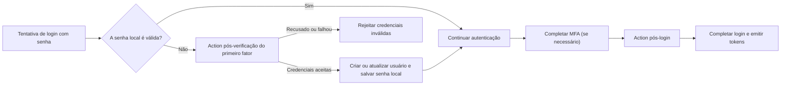

# Actions

As Actions do Logto permitem que você execute JavaScript confiável em pontos específicos do fluxo de autenticação. Uma action é executada de forma síncrona: a solicitação de autenticação aguarda o script, e o resultado do script pode atualizar o usuário ou determinar se o fluxo continua.

As actions são úteis quando a decisão precisa acontecer dentro do fluxo de autenticação. Casos de uso comuns incluem:

- Migrar usuários e senhas de um sistema de identidade legado quando eles fazem login pela primeira vez.
- Atualizar o perfil do usuário ou dados específicos do aplicativo antes que o Logto conclua um login.
- Chamar um serviço externo e aplicar seu resultado ao usuário do Logto.

:::note
As actions estão disponíveis nos planos Enterprise do Logto Cloud.
:::

:::warning
Scripts de action podem afetar a autenticação e modificar dados do usuário. Apenas administradores confiáveis devem ter permissão para visualizar, criar, editar, testar, habilitar ou excluir esses scripts.

Em implantações self-hosted, scripts de action são executados dentro do processo do servidor Logto com seus privilégios. Conceder acesso para editar ou testar scripts é equivalente a conceder execução de código no host do Logto, portanto, o Console de Administração não deve ser compartilhado com usuários não confiáveis. Trate os scripts como código confiável do lado do servidor; o tempo de execução limita o tempo e a memória do script, mas não é uma barreira de segurança para código não confiável.
:::

## Como as Actions se encaixam no login \{#how-actions-fit-into-sign-in}

O Logto atualmente fornece dois tipos de action:



| Tipo de action                                                                          | Quando é executada                                                                                                                             | O que pode fazer                                                                                                                               |
| --------------------------------------------------------------------------------------- | ---------------------------------------------------------------------------------------------------------------------------------------------- | ---------------------------------------------------------------------------------------------------------------------------------------------- |
| [Pós-verificação do primeiro fator](/developers/actions/post-first-factor-verification) | Durante um login por senha, somente após a verificação da senha local do Logto falhar. Não é executada quando a senha local é válida.          | Verificar as credenciais enviadas em um sistema legado, depois criar um novo usuário Logto ou atualizar um usuário existente e migrar a senha. |
| [Pós-login](/developers/actions/post-sign-in)                                           | Após o usuário completar todos os fatores de autenticação, incluindo MFA quando necessário, e antes do Logto concluir o login e emitir tokens. | Atualizar e enriquecer o usuário Logto existente usando o contexto final do login.                                                             |

Ambos os tipos de action são executados apenas para interações `SignIn` na Experience API. A pós-verificação do primeiro fator se aplica apenas ao login por senha; a pós-login é independente do método de autenticação.

## Modelo de script \{#script-model}

Cada tipo de action possui uma configuração e uma função de entrada JavaScript chamada `runAction`:

```js
const runAction = async ({ event, environmentVariables = {} }) => {
  // Inspecione o evento, opcionalmente busque dados externos e retorne
  // um resultado suportado por este tipo de action.
};
```

O payload contém:

- `event`: O evento de autenticação em produção. Sua estrutura depende do tipo de action.
- `environmentVariables`: Os valores de string configurados para esta action. Esses valores são passados pelo payload da função; não estão disponíveis via `process.env`.

O editor fornece informações de tipo, mas o script salvo é executado como JavaScript. O script pode ser assíncrono e pode usar a função `fetch` injetada para chamar APIs HTTPS externas. Não pode importar pacotes ou acessar globais do Node.js como `require` ou `process`.

O resultado suportado é diferente para cada tipo de action; consulte a página de referência correspondente antes de habilitar uma Action.

## Actions e Webhooks \{#actions-and-webhooks}

Actions e [Webhooks](/developers/webhooks) têm propósitos diferentes:

|                                           | Actions                                                     | Webhooks                                                               |
| ----------------------------------------- | ----------------------------------------------------------- | ---------------------------------------------------------------------- |
| Execução                                  | Síncrona e em linha com a autenticação                      | Assíncrona e fora da solicitação de autenticação                       |
| Pode afetar o fluxo de autenticação atual | Sim                                                         | Não                                                                    |
| Pode modificar um usuário pelo resultado  | Sim, usando o patch de usuário suportado                    | Não diretamente; o receptor pode chamar a Management API separadamente |
| Cobertura de eventos                      | Pontos de autenticação selecionados                         | Um amplo conjunto de eventos de interação e alteração de dados         |
| Uso típico                                | Migração de credenciais, enriquecimento de perfil pré-token | Notificações, sincronização downstream, analytics                      |

Mantenha trabalhos assíncronos em Webhooks. Use uma Action apenas quando o Logto precisar do resultado antes que a autenticação possa continuar.

## Próximos passos \{#next-steps}

- [Configurar e testar Actions](/developers/actions/configure-and-test-actions)
- [Migrar usuários no login por senha](/developers/actions/post-first-factor-verification)
- [Enriquecer um usuário após o login](/developers/actions/post-sign-in)
