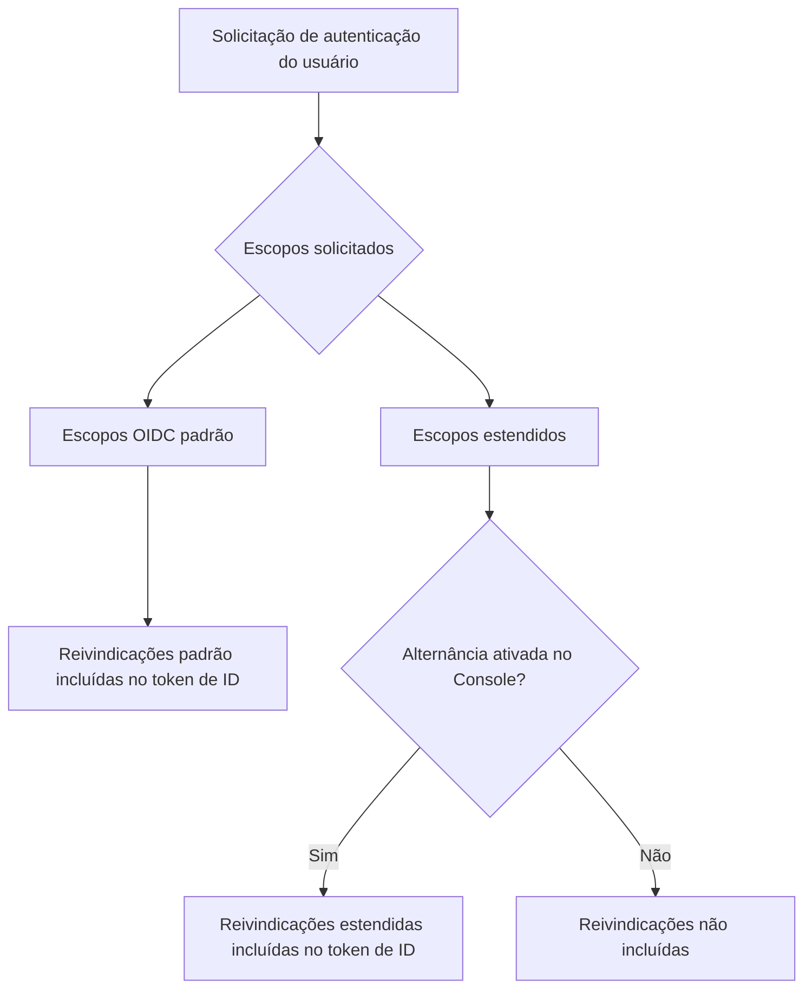

# Token de ID personalizado

## Introdução \{#introduction}

[Token de ID (ID token)](https://auth.wiki/id-token) é um tipo especial de token definido pelo protocolo [OpenID Connect (OIDC)](https://auth.wiki/openid-connect). Ele serve como uma asserção de identidade emitida pelo servidor de autorização (Logto) após um usuário autenticar com sucesso, carregando reivindicações sobre a identidade do usuário autenticado.

Diferente dos [tokens de acesso (Access tokens)](/developers/custom-token-claims), que são usados para acessar recursos protegidos, os tokens de ID são projetados especificamente para transmitir a identidade do usuário autenticado para aplicativos clientes. Eles são [JSON Web Tokens (JWTs)](https://auth.wiki/jwt) que contêm reivindicações sobre o evento de autenticação e o usuário autenticado.

## Como funcionam as reivindicações do token de ID \{#how-id-token-claims-work}

No Logto, as reivindicações do token de ID são divididas em duas categorias:

1. **Reivindicações padrão do OIDC**: Definidas pela especificação OIDC, essas reivindicações são totalmente determinadas pelos escopos solicitados durante a autenticação.
2. **Reivindicações estendidas**: Reivindicações estendidas pelo Logto para carregar informações adicionais de identidade, controladas por um **modelo de dupla condição** (Escopo + Alternância).

## Reivindicações padrão do OIDC \{#standard-oidc-claims}

As reivindicações padrão são completamente regidas pela especificação OIDC. Sua inclusão no token de ID depende unicamente dos escopos que seu aplicativo solicita durante a autenticação. O Logto não oferece nenhuma opção para desabilitar ou excluir seletivamente reivindicações padrão individuais.

A tabela a seguir mostra o mapeamento entre escopos padrão e suas respectivas reivindicações:

| Escopo    | Reivindicações                                                                                                                                                                   |
| --------- | -------------------------------------------------------------------------------------------------------------------------------------------------------------------------------- |
| `openid`  | `sub`                                                                                                                                                                            |
| `profile` | `name`, `family_name`, `given_name`, `middle_name`, `nickname`, `preferred_username`, `profile`, `picture`, `website`, `gender`, `birthdate`, `zoneinfo`, `locale`, `updated_at` |
| `email`   | `email`, `email_verified`                                                                                                                                                        |
| `phone`   | `phone_number`, `phone_number_verified`                                                                                                                                          |
| `address` | `address`                                                                                                                                                                        |

Por exemplo, se seu aplicativo solicitar os escopos `openid profile email`, o token de ID incluirá todas as reivindicações dos escopos `openid`, `profile` e `email`.

## Reivindicações estendidas \{#extended-claims}

Além das reivindicações padrão do OIDC, o Logto estende reivindicações adicionais que carregam informações de identidade específicas do ecossistema Logto. Essas reivindicações estendidas seguem um **modelo de dupla condição** para serem incluídas no token de ID:

1. **Condição de escopo**: O aplicativo deve solicitar o escopo correspondente durante a autenticação.
2. **Alternância no Console**: O administrador deve ativar a inclusão da reivindicação no token de ID através do Logto Console.

Ambas as condições devem ser satisfeitas simultaneamente. O escopo serve como a declaração de acesso na camada de protocolo, enquanto a alternância serve como o controle de exposição na camada de produto — suas responsabilidades são claras e não substituíveis.

### Escopos e reivindicações estendidos disponíveis \{#available-extended-scopes-and-claims}

| Escopo                               | Reivindicações                 | Descrição                                       | Incluído por padrão |
| ------------------------------------ | ------------------------------ | ----------------------------------------------- | ------------------- |
| `custom_data`                        | `custom_data`                  | Dados personalizados armazenados no usuário     |                     |
| `identities`                         | `identities`, `sso_identities` | Identidades sociais e SSO vinculadas do usuário |                     |
| `roles`                              | `roles`                        | Papéis atribuídos ao usuário                    | ✅                  |
| `urn:logto:scope:organizations`      | `organizations`                | IDs das organizações do usuário                 | ✅                  |
| `urn:logto:scope:organizations`      | `organization_data`            | Dados da organização do usuário                 |                     |
| `urn:logto:scope:organization_roles` | `organization_roles`           | Papéis do usuário nas organizações              | ✅                  |

### Configurar no Logto Console \{#configure-in-logto-console}

Para habilitar reivindicações estendidas no token de ID:

1. Navegue até <CloudLink to="/customize-jwt">Console > Custom JWT</CloudLink>.
2. Ative as reivindicações que deseja incluir no token de ID.
3. Certifique-se de que seu aplicativo solicite os escopos correspondentes durante a autenticação.

## Recursos relacionados \{#related-resources}

<Url href="/developers/custom-token-claims">Token de acesso personalizado</Url>

<Url href="https://openid.net/specs/openid-connect-core-1_0.html#IDToken">
  OpenID Connect Core - Token de ID
</Url>
