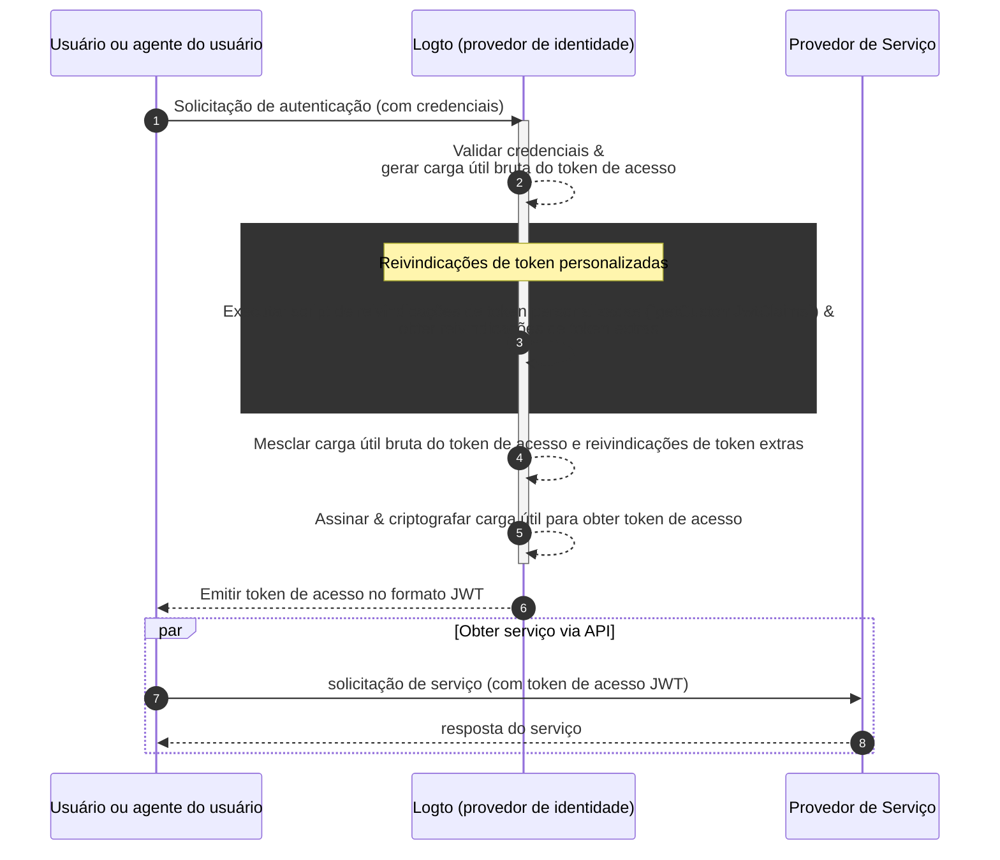

# Reivindicações de token personalizadas

Logto oferece a flexibilidade de adicionar reivindicações personalizadas dentro de tokens de acesso (JWT / Token opaco). Com esse recurso, você pode incluir informações adicionais para sua lógica de negócios, todas transmitidas de forma segura nos tokens e recuperáveis via introspecção no caso de tokens opacos.

## Introdução \{#introduction}

[Tokens de acesso (Access tokens)](https://auth.wiki/access-token) desempenham um papel crítico no processo de autenticação e autorização, carregando as informações de identidade do sujeito e permissões, e são passados entre o [servidor Logto](/concepts/core-service) (servindo como servidor de autenticação ou provedor de identidade, IdP), seu servidor de serviço web (provedor de recursos) e aplicativos clientes (clientes).

[Reivindicações de token (Token claims)](https://auth.wiki/claim) são os pares chave-valor que fornecem informações sobre uma entidade ou o próprio token. As reivindicações podem incluir informações do usuário, tempo de expiração do token, permissões e outros metadados que são relevantes para o processo de autenticação (link para auth.wiki) e autorização (link para auth.wiki).

Existem dois tipos de tokens de acesso no Logto:

- **JSON Web Token:** [JSON Web Token (JWT)](https://auth.wiki/jwt) é um formato popular que codifica reivindicações de uma forma que é segura e legível pelos clientes. Reivindicações comuns como `sub`, `iss`, `aud`, etc., são usadas em conformidade com o protocolo OAuth 2.0 (Veja [este link](https://datatracker.ietf.org/doc/html/rfc7519#section-4) para mais detalhes). Tokens JWT permitem que os consumidores acessem diretamente as reivindicações sem etapas adicionais de validação. No Logto, tokens de acesso são emitidos no formato JWT por padrão quando um cliente inicia solicitações de autorização de recursos ou organizações específicas.
- **Token opaco (Opaque token):** Um [token opaco](http://localhost:3000/concepts/opaque-token) não é autossuficiente e sempre requer uma etapa adicional de validação via o endpoint de [introspecção de token](https://auth.wiki/token-introspection). Apesar de seu formato não transparente, tokens opacos podem ajudar a obter reivindicações e serem transmitidos de forma segura entre as partes. As reivindicações de token são armazenadas de forma segura no servidor Logto e acessadas pelos aplicativos clientes via o endpoint de introspecção de token. Tokens de acesso são emitidos no formato opaco quando nenhum recurso ou organização específico é incluído na solicitação de autorização. Esses tokens são usados principalmente para acessar o endpoint `userinfo` do OIDC e outros propósitos gerais.

Em muitos casos, as reivindicações padrão não são suficientes para atender às necessidades específicas de seus aplicativos, seja você usando JWT ou tokens opacos. Para resolver isso, Logto oferece a flexibilidade de adicionar reivindicações personalizadas dentro dos tokens de acesso. Com esse recurso, você pode incluir informações adicionais para sua lógica de negócios, todas transmitidas de forma segura nos tokens e recuperáveis via introspecção no caso de tokens opacos.

## Como funcionam as reivindicações de token personalizadas? \{#how-do-custom-token-claims-work}

Logto permite que você insira reivindicações personalizadas no `token de acesso` através de uma função de callback `getCustomJwtClaims`. Você pode fornecer sua implementação da função `getCustomJwtClaims` para retornar um objeto de reivindicações personalizadas. O valor de retorno será mesclado com a carga útil original do token e assinado para gerar o token de acesso final.

:::warning
Reivindicações de token internas do Logto NÃO podem ser substituídas ou modificadas. Reivindicações personalizadas serão adicionadas ao token como reivindicações adicionais. Se houver qualquer conflito entre reivindicações personalizadas e as reivindicações internas, essas reivindicações personalizadas serão ignoradas.
:::

## Recursos relacionados \{#related-resources}

<Url href="https://blog.logto.io/glance-on-custom-jwt-access-token-claims">
  Adicione reivindicações personalizadas para tokens de acesso JWT com Logto para impulsionar sua
  autorização
</Url>
