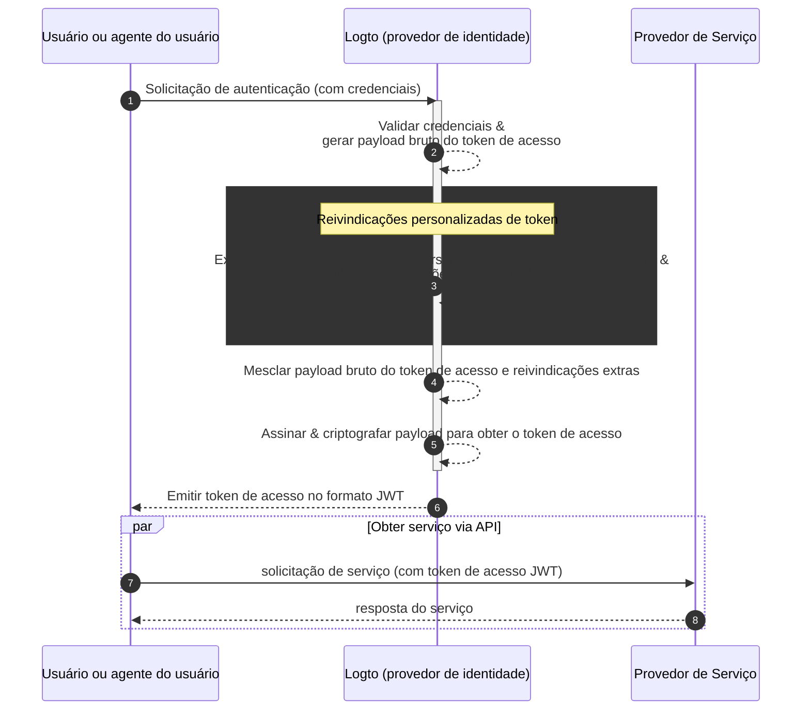

# Reivindicações personalizadas de token

O Logto oferece flexibilidade para adicionar reivindicações personalizadas dentro dos tokens de acesso (JWT / Token opaco). Com esse recurso, você pode incluir informações adicionais para sua lógica de negócio, todas transmitidas com segurança nos tokens e recuperáveis via introspecção no caso de tokens opacos.

## Introdução \{#introduction}

[Tokens de acesso (Access tokens)](https://auth.wiki/access-token) desempenham um papel fundamental no processo de autenticação (Authentication) e autorização (Authorization), carregando as informações de identidade e permissões do sujeito, e são passados entre o [servidor Logto](/concepts/core-service) (atua como servidor de autenticação ou provedor de identidade, IdP), seu servidor de serviço web (provedor de recurso) e aplicativos clientes (clientes).

[Reivindicações de token (Token claims)](https://auth.wiki/claim) são pares chave-valor que fornecem informações sobre uma entidade ou sobre o próprio token. As reivindicações podem incluir informações do usuário, tempo de expiração do token, permissões e outros metadados relevantes para o processo de autenticação (Authentication) e autorização (Authorization).

Existem dois tipos de tokens de acesso no Logto:

- **JSON Web Token:** [JSON Web Token (JWT)](https://auth.wiki/jwt) é um formato popular que codifica reivindicações de forma segura e legível pelos clientes. Reivindicações comuns como `sub`, `iss`, `aud` etc. são usadas em conformidade com o protocolo OAuth 2.0 (Veja [este link](https://datatracker.ietf.org/doc/html/rfc7519#section-4) para mais detalhes). JWTs permitem que consumidores acessem diretamente as reivindicações sem etapas adicionais de validação. No Logto, tokens de acesso são emitidos no formato JWT por padrão quando um cliente inicia solicitações de autorização de recursos ou organizações específicas.
- **Token opaco (Opaque token):** Um [token opaco](http://localhost:3000/concepts/opaque-token) não é autocontido e sempre requer uma etapa adicional de validação via endpoint de [introspecção de token](https://auth.wiki/token-introspection). Apesar do formato não transparente, tokens opacos podem ajudar a obter reivindicações e serem transmitidos com segurança entre as partes. As reivindicações do token são armazenadas com segurança no servidor Logto e acessadas pelos aplicativos clientes via endpoint de introspecção de token. Tokens de acesso são emitidos no formato opaco quando nenhum recurso ou organização específica é incluído na solicitação de autorização. Esses tokens são usados principalmente para acessar o endpoint OIDC `userinfo` e outros propósitos gerais.

Em muitos casos, as reivindicações padrão não são suficientes para atender às necessidades específicas dos seus aplicativos, seja você usando JWT ou tokens opacos. Para resolver isso, o Logto oferece flexibilidade para adicionar reivindicações personalizadas dentro dos tokens de acesso. Com esse recurso, você pode incluir informações adicionais para sua lógica de negócio, todas transmitidas com segurança nos tokens e recuperáveis via introspecção no caso de tokens opacos.

## Como funcionam as reivindicações personalizadas de token? \{#how-do-custom-token-claims-work}

O Logto permite inserir reivindicações personalizadas no `token de acesso (access token)` através de uma função de callback `getCustomJwtClaims`. Você pode fornecer sua implementação da função `getCustomJwtClaims` para retornar um objeto de reivindicações personalizadas. O valor retornado será mesclado com o payload original do token e assinado para gerar o token de acesso final.

:::warning
As reivindicações internas do Logto NÃO podem ser sobrescritas ou modificadas. As reivindicações personalizadas serão adicionadas ao token como reivindicações adicionais. Se alguma reivindicação personalizada conflitar com as reivindicações internas, essas reivindicações personalizadas serão ignoradas.
:::

## Recursos relacionados \{#related-resources}

<Url href="https://blog.logto.io/glance-on-custom-jwt-access-token-claims">
  Adicione reivindicações personalizadas para tokens de acesso JWT com Logto para potencializar sua
  autorização (Authorization)
</Url>
