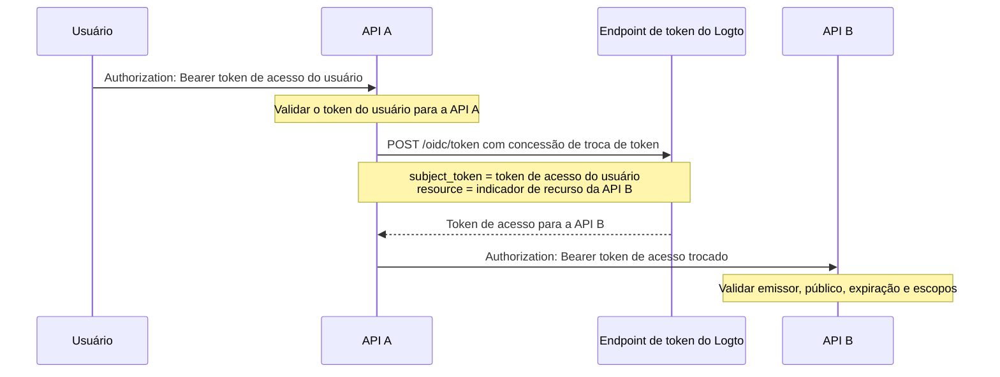

import TokenExchangePrerequisites from './fragments/_token-exchange-prerequisites.mdx';

# Delegação serviço para serviço

Em algumas arquiteturas de API, um serviço backend recebe uma solicitação de um usuário autenticado e precisa chamar outro serviço backend preservando a identidade do usuário.

Por exemplo:

```text
Usuário -> API A -> API B
```

A API B precisa saber duas coisas:

1. O chamador é um serviço confiável, como a API A.
2. A operação está sendo realizada para o usuário original.

Use a concessão de troca de token do Logto para trocar o token de acesso do usuário por um novo token de acesso cujo público é o recurso de API downstream. Isso segue o padrão de troca de token do OAuth 2.0 e evita encaminhar o token original do usuário para serviços downstream.

## Quando usar este fluxo \{#when-to-use-this-flow}

Use a delegação serviço para serviço quando:

- A API A é um serviço backend que pode autenticar-se com segurança no endpoint de token do Logto.
- A API A recebe um token de acesso de usuário emitido pelo Logto.
- A API A precisa chamar a API B em nome do mesmo usuário.
- A API B deve validar um token de acesso com seu próprio recurso de API como público.

Não use este fluxo para acesso puramente máquina para máquina sem um usuário. Nesse caso, use o [fluxo de credenciais do cliente](/quick-starts/m2m). Para cenários de suporte, administração ou agente, onde um usuário atua temporariamente como outro usuário, use [imitação de usuário](/developers/user-impersonation).

## Como funciona \{#how-it-works}



O token de acesso trocado representa o usuário original (`sub`) e está vinculado ao recurso de API downstream (`aud`). A API downstream também pode inspecionar a reivindicação `client_id` para identificar o aplicativo que iniciou a troca.

## Pré-requisitos \{#prerequisites}

1. Crie recursos de API para os serviços envolvidos. Veja [Proteger recursos globais de API](/authorization/global-api-resources).
2. Configure as permissões da API B e atribua-as aos usuários por meio de papéis ou papéis de organização.
3. Use um aplicativo do lado do servidor para a API A, como um app máquina para máquina ou um app web tradicional, para que ele possa autenticar-se com segurança usando um segredo de aplicativo.
4. Habilite a troca de token para o aplicativo da API A.

<TokenExchangePrerequisites />

## Solicitar um token de acesso para a API downstream \{#request-an-access-token-for-the-downstream-api}

Quando a API A precisar chamar a API B, faça uma solicitação de troca de token para o [endpoint de token](/integrate-logto/application-data-structure#token-endpoint) do Logto.

Para aplicativos web tradicionais ou aplicativos máquina para máquina com um segredo de aplicativo, inclua as credenciais no cabeçalho `Authorization`:

```bash
POST /oidc/token HTTP/1.1
Host: tenant.logto.app
Content-Type: application/x-www-form-urlencoded
# highlight-next-line
Authorization: Basic <base64(api-a-app-id:api-a-app-secret)>

grant_type=urn:ietf:params:oauth:grant-type:token-exchange
&subject_token=<user_access_token_received_by_api_a>
&subject_token_type=urn:ietf:params:oauth:token-type:access_token
&resource=https://api-b.example.com
&scope=read:orders
```

Parâmetros:

1. `grant_type`: Use `urn:ietf:params:oauth:grant-type:token-exchange`.
2. `subject_token`: O token de acesso de usuário original emitido pelo Logto recebido pela API A.
3. `subject_token_type`: Use `urn:ietf:params:oauth:token-type:access_token`.
4. `resource`: O indicador de recurso da API B.
5. `scope`: As permissões downstream que a API A está solicitando para esta chamada delegada. O Logto emite apenas os escopos solicitados que estão disponíveis para o usuário original para este recurso de acordo com as configurações de RBAC.

O Logto retorna um token de acesso para a API B:

```json
{
  "access_token": "eyJhbGci...<truncated>",
  "token_type": "Bearer",
  "expires_in": 3600,
  "scope": "read:orders"
}
```

Quando decodificado, o token de acesso inclui reivindicações semelhantes a:

```json
{
  "sub": "user_id",
  "client_id": "api_a_app_id",
  "iss": "https://tenant.logto.app/oidc",
  "aud": "https://api-b.example.com",
  "scope": "read:orders",
  "exp": 1760000000
}
```

Em seguida, a API A chama a API B com o token trocado:

```bash
GET /orders HTTP/1.1
Host: api-b.example.com
Authorization: Bearer <exchanged_access_token>
```

## Validar o token na API B \{#validate-the-token-in-api-b}

A API B deve validar o token trocado como qualquer token de acesso de recurso de API emitido pelo Logto:

1. Verifique a assinatura usando os JWKs do Logto.
2. Verifique o emissor (`iss`).
3. Verifique se o público (`aud`) corresponde ao indicador de recurso da API B.
4. Verifique a expiração (`exp`).
5. Verifique os escopos necessários.
6. Use `sub` como o ID do usuário original.
7. Opcionalmente, verifique `client_id` se apenas serviços upstream específicos puderem realizar chamadas delegadas.

Veja [Validar tokens de acesso na API](/authorization/validate-access-tokens) para orientações de implementação.

## Recursos relacionados \{#related-resources}

<Url href="/authorization/global-api-resources">Proteger recursos globais de API</Url>

<Url href="/authorization/validate-access-tokens">Validar tokens de acesso na API</Url>

<Url href="/developers/user-impersonation">Imitação de usuário</Url>
