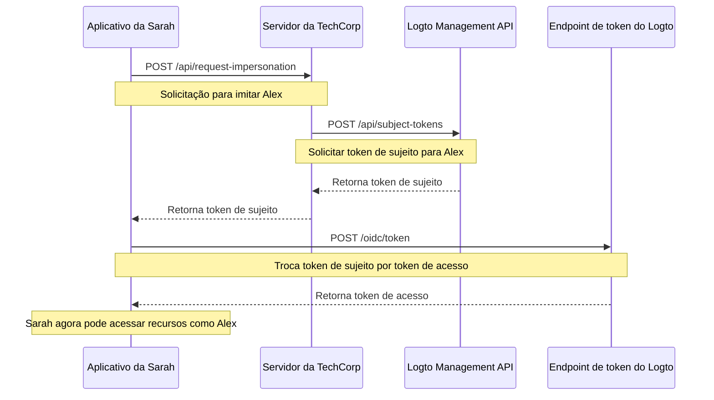

# Imitação de usuário (User impersonation)

Imagine que Sarah, uma engenheira de suporte na TechCorp, recebe um chamado urgente de Alex, um cliente que não consegue acessar um recurso crítico. Para diagnosticar e resolver o problema de forma eficiente, Sarah precisa ver exatamente o que Alex vê no sistema. É aí que o recurso de imitação de usuário do Logto se torna útil.

A imitação de usuário permite que usuários autorizados como Sarah atuem temporariamente em nome de outros usuários como Alex dentro do sistema. Esse recurso poderoso é inestimável para solução de problemas, suporte ao cliente e execução de tarefas administrativas.

## Como funciona? \{#how-it-works}



O processo de imitação envolve três etapas principais:

1. Sarah solicita a imitação através do servidor backend da TechCorp
2. O servidor da TechCorp obtém um token de sujeito da Management API do Logto
3. O aplicativo da Sarah troca esse token de sujeito por um token de acesso

Vamos ver como Sarah pode usar esse recurso para ajudar Alex.

### Etapa 1: Solicitando imitação \{#step-1-requesting-impersonation}

Primeiro, o aplicativo de suporte da Sarah precisa solicitar a imitação ao servidor backend da TechCorp.

**Requisição (aplicativo da Sarah para o servidor da TechCorp)**

```bash
POST /api/request-impersonation HTTP/1.1
Host: api.techcorp.com
Authorization: Bearer <Sarah's_access_token>
Content-Type: application/json

{
  "userId": "alex123",
  "reason": "Investigando problema de acesso ao recurso",
  "ticketId": "TECH-1234"
}
```

Nesta API, o backend deve realizar verificações adequadas de autorização para garantir que Sarah tenha as permissões necessárias para imitar Alex.

### Etapa 2: Obtendo um token de sujeito \{#step-2-obtaining-a-subject-token}

Após validar a solicitação de Sarah, o servidor da TechCorp irá chamar a [Management API](/integrate-logto/interact-with-management-api) do Logto para obter um token de sujeito.

**Requisição (servidor da TechCorp para a Management API do Logto)**

```bash
POST /api/subject-tokens HTTP/1.1
Host: techcorp.logto.app
Authorization: Bearer <TechCorp_m2m_access_token>
Content-Type: application/json

{
  "userId": "alex123",
  "context": {
    "ticketId": "TECH-1234",
    "reason": "Problema de acesso ao recurso",
    "supportEngineerId": "sarah789"
  }
}
```

**Resposta (Logto para o servidor da TechCorp)**

```json
{
  "subjectToken": "sub_7h32jf8sK3j2",
  "expiresIn": 600
}
```

O servidor da TechCorp deve então retornar esse token de sujeito para o aplicativo da Sarah.

**Resposta (servidor da TechCorp para o aplicativo da Sarah)**

```json
{
  "subjectToken": "sub_7h32jf8sK3j2",
  "expiresIn": 600
}
```

### Etapa 3: Trocando o token de sujeito por um token de acesso \{#step-3-exchanging-the-subject-token-for-an-access-token}

Agora, o aplicativo da Sarah troca esse token de sujeito por um token de acesso representando Alex, especificando o recurso onde o token será usado.

**Requisição (aplicativo da Sarah para o endpoint de token do Logto)**

```bash
POST /oidc/token HTTP/1.1
Host: techcorp.logto.app
Content-Type: application/x-www-form-urlencoded

grant_type=urn:ietf:params:oauth:grant-type:token-exchange
&client_id=techcorp_support_app
&scope=resource:read
&subject_token=alx_7h32jf8sK3j2
&subject_token_type=urn:ietf:params:oauth:token-type:access_token
&resource=https://api.techcorp.com/customer-data
```

**Resposta (Logto para o aplicativo da Sarah)**

```json
{
  "access_token": "eyJhbG...<truncated>",
  "issued_token_type": "urn:ietf:params:oauth:token-type:access_token",
  "token_type": "Bearer",
  "expires_in": 3600,
  "scope": "resource:read"
}
```

O `access_token` retornado estará vinculado ao recurso especificado, garantindo que só possa ser usado com a API de dados do cliente da TechCorp.

**Nota**: Para aplicações web tradicionais, inclua `client_id` e `client_secret` no cabeçalho da requisição de token para evitar um erro 401 invalid_client.

Veja um exemplo em Node.js:

```json
Authorization: `Basic ${Buffer.from(`${client_id}:${client_secret}`, 'utf8').toString('base64')}`
```

## Exemplo de uso \{#example-usage}

Veja como Sarah pode usar isso em um aplicativo de suporte Node.js:

```jsx
interface ImpersonationResponse {
  subjectToken: string;
  expiresIn: number;
}

interface TokenExchangeResponse {
  access_token: string;
  issued_token_type: string;
  token_type: string;
  expires_in: number;
  scope: string;
}

async function impersonateUser(
  userId: string,
  clientId: string,
  ticketId: string,
  resource: string
): Promise<string> {
  try {
    // Etapas 1 e 2: Solicita imitação e obtém token de sujeito
    const impersonationResponse = await fetch(
      'https://api.techcorp.com/api/request-impersonation',
      {
        method: 'POST',
        headers: {
          Authorization: "Bearer <Sarah's_access_token>",
          'Content-Type': 'application/json',
        },
        body: JSON.stringify({
          userId,
          reason: 'Investigando problema de acesso ao recurso',
          ticketId,
        }),
      }
    );

    if (!impersonationResponse.ok) {
      throw new Error(`Erro HTTP. Status: ${impersonationResponse.status}`);
    }

    const { subjectToken } = (await impersonationResponse.json()) as ImpersonationResponse;

    // Etapa 3: Troca token de sujeito por token de acesso
    const tokenExchangeBody = new URLSearchParams({
      grant_type: 'urn:ietf:params:oauth:grant-type:token-exchange',
      client_id: clientId,
      scope: 'openid profile resource.read',
      subject_token: subjectToken,
      subject_token_type: 'urn:ietf:params:oauth:token-type:access_token',
      resource: resource,
    });

    const tokenExchangeResponse = await fetch('https://techcorp.logto.app/oidc/token', {
      method: 'POST',
      headers: { 'Content-Type': 'application/x-www-form-urlencoded' },
      body: tokenExchangeBody,
    });

    if (!tokenExchangeResponse.ok) {
      throw new Error(`Erro HTTP! status: ${tokenExchangeResponse.status}`);
    }

    const tokenData = (await tokenExchangeResponse.json()) as TokenExchangeResponse;
    return tokenData.access_token;
  } catch (error) {
    console.error('Falha na imitação:', error);
    throw error;
  }
}

// Sarah usa esta função para imitar Alex
async function performImpersonation(): Promise<void> {
  try {
    const accessToken = await impersonateUser(
      'alex123',
      'techcorp_support_app',
      'TECH-1234',
      'https://api.techcorp.com/customer-data'
    );
    console.log('Token de acesso de imitação para Alex:', accessToken);
  } catch (error) {
    console.error('Falha ao realizar imitação:', error);
  }
}

// Executa a imitação
void performImpersonation()
```

:::note

1. O token de sujeito é de curta duração e para uso único.
2. O token de acesso de imitação não vem com um [token de atualização (Refresh token)](https://auth.wiki/refresh-token). Sarah precisará repetir esse processo se o token expirar antes de resolver o problema de Alex.
3. O servidor backend da TechCorp deve implementar verificações adequadas de autorização para garantir que apenas membros autorizados do suporte, como Sarah, possam solicitar imitação.

:::

## Reivindicação `act` \{#act-claim}

Ao usar o fluxo de troca de token para imitação, o token de acesso emitido pode incluir uma reivindicação adicional `act` (ator). Essa reivindicação representa a identidade da "parte atuante" — no nosso exemplo, Sarah, que está realizando a imitação.

Para incluir a reivindicação `act`, o aplicativo da Sarah precisa fornecer um `actor_token` na solicitação de troca de token. Esse token deve ser um token de acesso válido para Sarah com o escopo `openid`. Veja como incluí-lo na solicitação de troca de token:

```bash
POST /oidc/token HTTP/1.1
Host: techcorp.logto.app
Content-Type: application/x-www-form-urlencoded

grant_type=urn:ietf:params:oauth:grant-type:token-exchange
&client_id=techcorp_support_app
&scope=resource:read
&subject_token=alx_7h32jf8sK3j2
&subject_token_type=urn:ietf:params:oauth:token-type:access_token
&actor_token=sarah_access_token
&actor_token_type=urn:ietf:params:oauth:token-type:access_token
&resource=https://api.techcorp.com/customer-data
```

Se um `actor_token` for fornecido, o token de acesso resultante conterá uma reivindicação `act` assim:

```json
{
  "aud": "https://api.techcorp.com",
  "iss": "https://techcorp.logto.app",
  "exp": 1443904177,
  "sub": "alex123",
  "act": {
    "sub": "sarah789"
  }
}
```

Essa reivindicação `act` indica claramente que Sarah (sarah789) está atuando em nome de Alex (alex123). A reivindicação `act` pode ser útil para auditoria e rastreamento de ações de imitação.

## Personalizando as reivindicações do token \{#customizing-token-claims}

O Logto permite [personalizar as reivindicações do token](/developers/custom-token-claims) para tokens de imitação. Isso pode ser útil para adicionar contexto ou metadados adicionais ao processo de imitação, como o motivo da imitação ou o chamado de suporte associado.

Quando o servidor da TechCorp solicita um token de sujeito à Management API do Logto, ele pode incluir um objeto `context`:

```json
{
  "userId": "alex123",
  "context": {
    "ticketId": "TECH-1234",
    "reason": "Problema de acesso ao recurso",
    "supportEngineerId": "sarah789"
  }
}
```

Esse [contexto](/developers/custom-token-claims/create-script#context-only-available-for-user-access-token) pode então ser usado em uma função `getCustomJwtClaims()` para adicionar reivindicações específicas ao token de acesso final. Veja um exemplo de como isso pode ser implementado:

```tsx
const getCustomJwtClaims = async ({ token, context, environmentVariables }) => {
  if (context.grant?.type === 'urn:ietf:params:oauth:grant-type:token-exchange') {
    const { ticketId, reason, supportEngineerId } = context.grant.subjectTokenContext;
    return {
      impersonation_context: {
        ticket_id: ticketId,
        reason: reason,
        support_engineer: supportEngineerId,
      },
    };
  }
  return {};
};
```

O token de acesso resultante que Sarah recebe pode ser assim:

```json
{
  "sub": "alex123",
  "aud": "https://api.techcorp.com/customer-data",
  "impersonation_context": {
    "ticket_id": "TECH-1234",
    "reason": "Problema de acesso ao recurso",
    "support_engineer": "sarah789"
  }
  // ... outras reivindicações padrão
}
```

Ao personalizar as reivindicações do token de acesso dessa forma, a TechCorp pode incluir informações valiosas sobre o contexto da imitação, facilitando a auditoria e o entendimento das atividades de imitação em seu sistema.

:::note
Tenha cautela ao adicionar reivindicações personalizadas aos seus tokens. Evite incluir informações sensíveis que possam representar riscos de segurança caso o token seja interceptado ou vazado. Os JWTs são assinados, mas não criptografados, portanto as reivindicações são visíveis para qualquer pessoa com acesso ao token.
:::

## Recursos relacionados \{#related-resources}

<Url href="https://blog.logto.io/impersonation">
  O que é imitação em cibersegurança e gerenciamento de identidade? Como agentes de IA podem usá-la?
</Url>
