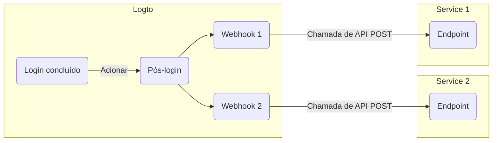

# Webhooks

O [Webhook](https://auth.wiki/webhook) do Logto fornece notificações em tempo real para vários eventos, incluindo alterações em [conta de usuário](/user-management/user-data), [papel](/authorization/role-based-access-control#roles), [permissão](/authorization/role-based-access-control#permissionsscopes), [organização](/organizations/organization-data), [papel da organização](/authorization/organization-template#organization-role), [permissão da organização](/authorization/organization-template#organization-permission) e [interação do usuário](/end-user-flows).

Quando um evento é acionado, o Logto envia uma solicitação HTTP para o Endpoint URL que você fornece, contendo informações detalhadas sobre o evento, como ID do usuário, nome de usuário, email e outros detalhes relevantes (para mais informações sobre os dados incluídos no payload e no cabeçalho, consulte [Solicitação de Webhook](/developers/webhooks/webhooks-request)). Seu aplicativo pode processar essa solicitação e realizar ações personalizadas, como enviar um email ou atualizar dados no banco de dados.

Continuamos adicionando mais eventos com base nas necessidades dos usuários. Se você tiver requisitos específicos para o seu negócio, por favor, nos avise.

## Por que usar Webhook?

Webhooks oferecem comunicação em tempo real entre aplicativos, eliminando a necessidade de polling e permitindo atualizações imediatas de dados. Eles simplificam a integração de aplicativos e a automação de fluxos de trabalho sem código complexo ou APIs proprietárias.

Aqui estão alguns exemplos de casos de uso comuns de Webhook para CIAM:

- **Enviar emails:** Configure um Webhook para enviar um email de boas-vindas a novos usuários após o registro ou notificar administradores quando um usuário fizer login de um novo dispositivo ou local.
- **Enviar notificações:** Configure um Webhook para acionar um assistente virtual com seu sistema CRM para fornecer suporte ao cliente em tempo real quando os usuários se inscreverem.
- **Realizar chamadas adicionais de API**: Configure um Webhook para verificar o acesso do usuário verificando seu domínio de email ou endereço IP e, em seguida, use o Logto Management API para atribuir papéis apropriados com permissões de recursos.
- **Sincronização de dados:** Configure Webhook para manter o aplicativo atualizado sobre alterações, como suspensões ou exclusões de contas de usuário.
- **Gerar relatórios**: Configure um Webhook para receber dados de atividade de login de usuários e aproveite-os para criar relatórios sobre engajamento ou padrões de uso dos usuários.

## Termos

| Item                                                                                                                                                                                                                            | Descrição                                                                                                                                                                                                                            |
| ------------------------------------------------------------------------------------------------------------------------------------------------------------------------------------------------------------------------------- | ------------------------------------------------------------------------------------------------------------------------------------------------------------------------------------------------------------------------------------ |
| Evento                                                                                                                                                                                                                          | Quando uma ação específica é realizada, ela acionará um evento de hook com um tipo específico. Por exemplo, o Logto emitirá um evento de hook PostRegister quando o usuário concluir o processo de inscrição e criar uma nova conta. |
| Hook                                                                                                                                                                                                                            | Uma única ou série de ações que se conectam a um evento específico. A ação pode ser chamar API, executar trechos de código, etc.                                                                                                     |
| Webhook                                                                                                                                                                                                                         | Um subtipo de hook que indica a chamada de uma API com o payload do evento.                                                                                                                                                          |
| Digamos que um desenvolvedor queira enviar uma notificação quando um usuário fizer login via um novo dispositivo, o desenvolvedor pode adicionar um webhook que chama sua API de serviço de segurança para o evento PostSignIn. |

Aqui está um exemplo de habilitação de dois webhooks para o evento `PostSignIn` no Logto:

## Perguntas frequentes

### O Logto suporta webhooks sincronizados?

Embora webhooks sincronizados tornassem o fluxo de login do usuário mais suave, ainda não os suportamos (mas suportaremos no futuro). Portanto, cenários que dependem de webhooks sincronizados atualmente exigem diferentes soluções alternativas. Se você tiver alguma dúvida, não hesite em nos contatar.

### Como lidar com a mudança de permissão do usuário?

Veja o guia [Gerenciar mudança de permissão do usuário](/authorization/role-based-access-control/protect-api-resources-with-rbac/#optional-handle-user-permission-change).

### Como depurar o timeout do webhook?

Para o endpoint que recebe Webhooks, ele deve retornar uma resposta 2xx o mais rápido possível para informar ao Logto que o Webhook foi recebido com sucesso. Como diferentes usuários têm lógicas de processamento muito diferentes para Webhooks, tarefas excessivamente complexas podem levar vários segundos, causando o timeout do Webhook do Logto. A melhor prática é manter sua própria fila de eventos; ao receber o Webhook do Logto, insira o evento na fila e retorne uma resposta 2xx ao Logto. Em seguida, deixe seu próprio trabalhador processar as tarefas na fila passo a passo. Se o trabalhador encontrar um erro, lide com ele em seu próprio servidor.

### Posso obter o endereço IP do cliente dos webhooks `PostSignIn`?

Sim, você pode obter o endereço IP, agentes de usuário, etc., no payload do Webhook. Se você precisar de informações que atualmente não são suportadas, pode criar solicitações de recursos em problemas do GitHub ou nos contatar.

## Recursos relacionados

<Url href="https://blog.logto.io/webhooks-vs-polling">Webhooks vs. polling</Url>
