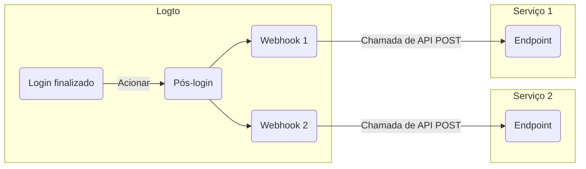

# Webhooks

Os [Webhooks](https://auth.wiki/webhook) do Logto fornecem notificações em tempo real para vários eventos, incluindo alterações em contas de usuários, papéis, permissões, organizações, papéis de organização, permissões de organização e [interações do usuário](/end-user-flows).

Quando um evento é acionado, o Logto envia de forma assíncrona uma solicitação HTTP para a URL do endpoint que você fornecer. A solicitação contém detalhes sobre o evento, como o usuário, aplicativo e contexto da solicitação. Veja [Solicitação de Webhook](/developers/webhooks/webhooks-request) para referência do payload e dos headers.

A entrega do Webhook ocorre fora da solicitação de autenticação e não pode alterar o resultado do fluxo atual. Para código síncrono que deve ser concluído antes que o login continue, use [Ações](/developers/actions).

Continuamos adicionando mais eventos com base nas necessidades dos usuários. Se você tiver requisitos específicos para o seu negócio, por favor, nos avise.

## Por que usar Webhook? \{#why-use-webhook}

Webhooks oferecem comunicação em tempo real entre aplicativos, eliminando a necessidade de polling e permitindo atualizações imediatas de dados. Eles simplificam a integração de aplicativos e a automação de fluxos de trabalho sem código complexo ou APIs proprietárias.

Aqui estão alguns exemplos de casos de uso comuns de Webhook para CIAM:

- **Enviar e-mails:** Configure um Webhook para enviar um e-mail de boas-vindas a novos usuários após o registro ou notificar administradores quando um usuário fizer login de um novo dispositivo ou local.
- **Enviar notificações:** Configure um Webhook para acionar um assistente virtual com seu sistema CRM para fornecer suporte ao cliente em tempo real quando os usuários se cadastrarem.
- **Realizar chamadas adicionais de API**: Configure um Webhook para verificar o acesso do usuário checando seu domínio de e-mail ou endereço IP e, em seguida, use a Management API do Logto para atribuir papéis apropriados com permissões de recurso.
- **Sincronização de dados:** Configure Webhook para manter o aplicativo atualizado sobre alterações como suspensões ou exclusões de contas de usuário.
- **Gerar relatórios**: Configure um Webhook para receber dados de atividade de login de usuários e aproveite-os para criar relatórios sobre engajamento ou padrões de uso dos usuários.

## Termos \{#terms}

| Item              | Descrição                                                                                   |
| ----------------- | ------------------------------------------------------------------------------------------- |
| Evento de Webhook | Um tipo de evento suportado que o Logto pode entregar, como `PostSignIn` ou `User.Created`. |
| Webhook           | Uma configuração que assina um ou mais eventos e envia seus payloads para um endpoint HTTP. |

Por exemplo, para notificar um serviço de segurança após um usuário fazer login, crie um Webhook que assine o evento `PostSignIn`.

Aqui está um exemplo de habilitação de dois Webhooks para o evento `PostSignIn` no Logto:

```mermaid
graph LR
  subgraph Logto
    SF(Login finalizado)
    PS(Pós-login)
    WH2(Webhook 2)
    WH1(Webhook 1)
  end

  subgraph Serviço 2
    E2(Endpoint)
  end

  subgraph Serviço 1
    E1(Endpoint)
  end

  SF -->|Acionar| PS
  PS --> WH1
  PS --> WH2
  WH1 --->|Chamada de API POST| E1
  WH2 --->|Chamada de API POST| E2

```

## Perguntas frequentes \{#faqs}

### Webhooks podem tomar uma decisão de autenticação síncrona? \{#does-logto-support-synced-webhooks}

Não. Webhooks são notificações assíncronas, portanto, sua resposta não pode permitir, bloquear ou modificar o fluxo de autenticação atual.

Use [Ações](/developers/actions) quando o Logto precisar executar código personalizado, chamar uma API externa ou atualizar um usuário antes que o login continue. Como as Ações são síncronas, mantenha suas dependências externas rápidas e confiáveis.

### Como lidar com alteração de permissão de usuário? \{#how-to-deal-with-user-permission-change}

Veja o guia [Gerenciar alteração de permissão de usuário](/authorization/global-api-resources/#optional-handle-user-permission-change).

### Como depurar timeout de webhook? \{#how-to-debug-webhook-timeout}

Para o endpoint que recebe Webhooks, ele deve retornar uma resposta 2xx o mais rápido possível para informar ao Logto que o Webhook foi recebido com sucesso. Como diferentes usuários têm lógicas de processamento muito diferentes para Webhooks, tarefas excessivamente complexas podem levar vários segundos, causando timeout no Webhook do Logto. A melhor prática é manter sua própria fila de eventos; ao receber o Webhook do Logto, insira o evento na fila e retorne uma resposta 2xx ao Logto. Depois, deixe seu próprio worker processar as tarefas da fila passo a passo. Se o worker encontrar um erro, trate-o em seu próprio servidor.

### Posso obter o endereço IP do cliente a partir dos webhooks `PostSignIn`? \{#can-i-get-the-client-ip-address-from-postsignin-webhooks}

Sim, você pode obter endereço IP, user agents, etc. no payload do Webhook. Se precisar de informações que ainda não são suportadas, você pode criar solicitações de recurso no GitHub Issues ou entrar em contato conosco.

## Recursos relacionados \{#related-resources}

<Url href="https://blog.logto.io/webhooks-vs-polling">Webhooks vs. polling</Url>
