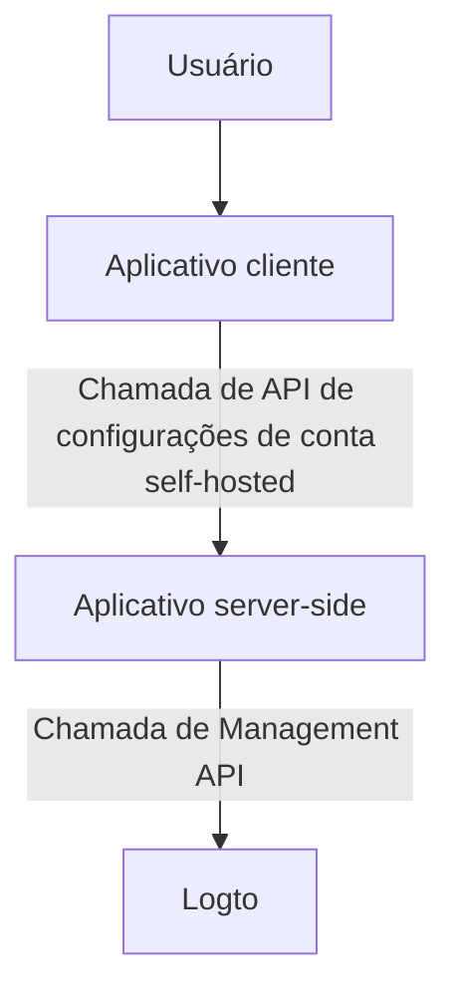
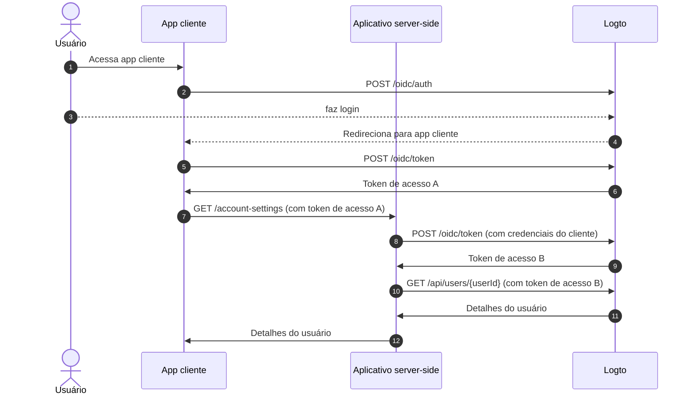
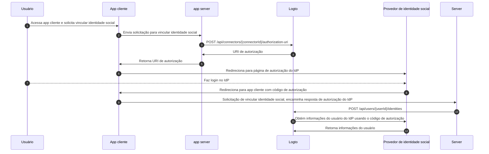

# Configurações de conta via Management API

## Integrações \{#integrations}

O Logto fornece diversas Management API para gerenciar contas de usuários. Você pode usar essas APIs para construir uma página de configurações de conta self-service para os usuários finais.

### Arquitetura \{#architecture}

1. **Usuário**: Usuário final autenticado que precisa acessar e gerenciar suas configurações de conta.
2. **Aplicativo cliente**: Seu aplicativo cliente que exibe a página de configurações de conta para o usuário.
3. **Aplicativo server-side**: Aplicativo server-side que fornece a API de configurações de conta para o cliente. Interage com a Management API do Logto.
4. **Logto**: Logto como serviço de autenticação e autorização. Fornece a Management API para gerenciar contas de usuários.

### Diagrama de sequência \{#sequence-diagram}

1. O usuário acessa o aplicativo cliente.
2. O aplicativo cliente envia a solicitação de autenticação para o Logto e redireciona o usuário para a página de login do Logto.
3. O usuário faz login no Logto.
4. O usuário autenticado é redirecionado de volta ao aplicativo cliente com o código de autorização.
5. O aplicativo cliente solicita o token de acesso ao Logto para acessar a API de configurações de conta self-hosted.
6. O Logto concede o token de acesso ao aplicativo cliente.
7. O aplicativo cliente envia a solicitação de configurações de conta para o aplicativo server-side com o token de acesso do usuário.
8. O aplicativo server-side verifica a identidade e permissão do solicitante a partir do token de acesso do usuário. Em seguida, solicita um token de acesso à Management API do Logto.
9. O Logto concede o token de acesso à Management API para o aplicativo server-side.
10. O aplicativo server-side solicita os dados do usuário ao Logto usando o token de acesso da Management API.
11. O Logto verifica a identidade do servidor e a permissão da Management API e retorna os dados do usuário.
12. O aplicativo server-side processa os dados do usuário com base na permissão do solicitante e retorna os detalhes da conta do usuário para o aplicativo cliente.

### Integrar Management API ao aplicativo server-side \{#integrate-management-api-to-server-side-application}

Consulte a seção [Management API](/integrate-logto/interact-with-management-api/) para saber como integrar as Management APIs com aplicativos server-side.

## APIs de gerenciamento de usuários \{#user-management-apis}

### Esquema de dados do usuário \{#user-data-schema}

Consulte a seção [dados do usuário e dados personalizados](/user-management/user-data/) para saber mais sobre o esquema de usuário no Logto.

### APIs de gerenciamento de perfil e identificadores do usuário \{#user-profile-and-identifiers-management-apis}

O perfil e os identificadores de um usuário são essenciais para o gerenciamento de usuários. Você pode usar as seguintes APIs para gerenciar perfis e identificadores de usuários.

| method | path                                                                                                     | description                                        |
| ------ | -------------------------------------------------------------------------------------------------------- | -------------------------------------------------- |
| GET    | [/api/users/\{userId\}](https://openapi.logto.io/operation/operation-getuser)                            | Obter detalhes do usuário pelo ID.                 |
| PATCH  | [/api/users/\{userId\}](https://openapi.logto.io/operation/operation-updateuser)                         | Atualizar detalhes do usuário.                     |
| PATCH  | [/api/users/\{userId\}/profile](https://openapi.logto.io/operation/operation-updateuserprofile)          | Atualizar campos do perfil do usuário pelo ID.     |
| GET    | [/api/users/\{userId\}/custom-data](https://openapi.logto.io/operation/operation-listusercustomdata)     | Obter dados personalizados do usuário pelo ID.     |
| PATCH  | [/api/users/\{userId\}/custom-data](https://openapi.logto.io/operation/operation-updateusercustomdata)   | Atualizar dados personalizados do usuário pelo ID. |
| PATCH  | [/api/users/\{userId\}/is-suspended](https://openapi.logto.io/operation/operation-updateuserissuspended) | Atualizar status de suspensão do usuário pelo ID.  |

### Verificação de email e número de telefone \{#email-and-phone-number-verification}

No sistema Logto, tanto endereços de email quanto números de telefone podem servir como identificadores de usuário, tornando sua verificação essencial. Para isso, fornecemos um conjunto de APIs de código de verificação para ajudar a verificar o email ou número de telefone fornecido.

:::note
Certifique-se de verificar o email ou número de telefone antes de atualizar o perfil do usuário com um novo email ou número de telefone.
:::

| method | path                                                                                                                             | description                                             |
| ------ | -------------------------------------------------------------------------------------------------------------------------------- | ------------------------------------------------------- |
| POST   | [/api/verifications/verification-code](https://openapi.logto.io/operation/operation-createverificationbyverificationcode)        | Enviar código de verificação de email ou telefone.      |
| POST   | [/api/verifications/verification-code/verify](https://openapi.logto.io/operation/operation-verifyverificationbyverificationcode) | Verificar email ou telefone pelo código de verificação. |

### Gerenciamento de senha do usuário \{#user-password-management}

| method | path                                                                                                     | description                                  |
| ------ | -------------------------------------------------------------------------------------------------------- | -------------------------------------------- |
| POST   | [/api/users/\{userId\}/password/verify](https://openapi.logto.io/operation/operation-verifyuserpassword) | Verificar senha atual do usuário pelo ID.    |
| PATCH  | [/api/users/\{userId\}/password](https://openapi.logto.io/operation/operation-updateuserpassword)        | Atualizar senha do usuário pelo ID.          |
| GET    | [/api/users/\{userId\}/has-password](https://openapi.logto.io/operation/operation-getuserhaspassword)    | Verificar se o usuário possui senha pelo ID. |

:::note
Certifique-se de verificar a senha atual do usuário antes de atualizar a senha do usuário.
:::

### Gerenciamento de identidades sociais do usuário \{#user-social-identities-management}

| method | path                                                                                                                              | description                                                                                                          |
| ------ | --------------------------------------------------------------------------------------------------------------------------------- | -------------------------------------------------------------------------------------------------------------------- |
| GET    | [/api/users/\{userId\}](https://openapi.logto.io/operation/operation-getuser)                                                     | Obter detalhes do usuário pelo ID. As identidades sociais podem ser encontradas no campo `identities`.               |
| POST   | [/api/users/\{userId\}/identities](https://openapi.logto.io/operation/operation-createuseridentity)                               | Vincular uma identidade social autenticada ao usuário pelo ID.                                                       |
| DELETE | [/api/users/\{userId\}/identities](https://openapi.logto.io/operation/operation-deleteuseridentity)                               | Desvincular uma identidade social do usuário pelo ID.                                                                |
| PUT    | [/api/users/\{userId\}/identities](https://openapi.logto.io/operation/operation-replaceuseridentity)                              | Atualizar diretamente uma identidade social vinculada ao usuário pelo ID.                                            |
| POST   | [/api/connectors/\{connectorId\}/authorization-uri](https://openapi.logto.io/operation/operation-createconnectorauthorizationuri) | Obter a URI de autorização para um provedor de identidade social. Use esta URI para iniciar uma nova conexão social. |

1. O usuário acessa o aplicativo cliente e solicita vincular uma identidade social.
2. O aplicativo cliente envia uma solicitação ao servidor para vincular uma identidade social.
3. O servidor envia uma solicitação ao Logto para obter a URI de autorização do provedor de identidade social. Você precisa fornecer seu próprio parâmetro `state` e `redirect_uri` na solicitação. Certifique-se de registrar o `redirect_uri` no provedor de identidade social.
4. O Logto retorna a URI de autorização para o servidor.
5. O servidor retorna a URI de autorização para o aplicativo cliente.
6. O aplicativo cliente redireciona o usuário para a URI de autorização do IdP.
7. O usuário faz login no IdP.
8. O IdP redireciona o usuário de volta ao aplicativo cliente usando o `redirect_uri` com o código de autorização.
9. O aplicativo cliente valida o `state` e encaminha a resposta de autorização do IdP para o servidor.
10. O servidor envia uma solicitação ao Logto para vincular a identidade social ao usuário.
11. O Logto obtém as informações do usuário do IdP usando o código de autorização.
12. O IdP retorna as informações do usuário ao Logto e o Logto vincula a identidade social ao usuário.

:::note
Há algumas limitações a considerar ao vincular novas identidades sociais a um usuário:

- A Management API não possui contexto de sessão, qualquer conector social que exija uma sessão ativa para manter o estado da autenticação social com segurança não pode ser vinculado via Management API. Conectores não suportados incluem apple, OIDC padrão e conector OAuth 2.0 padrão.
- Pelo mesmo motivo, o Logto não pode verificar o parâmetro `state` na resposta de autorização. Certifique-se de armazenar o parâmetro `state` em seu app cliente e validá-lo quando a resposta de autorização for recebida.
- Você precisa registrar o `redirect_uri` no provedor de identidade social com antecedência. Caso contrário, o IdP social não redirecionará o usuário de volta ao seu app cliente. Seu IdP social deve aceitar mais de um callback `redirect_uri`, um para login do usuário, outro para sua própria página de vinculação de perfil.

:::

### Gerenciamento de identidades corporativas do usuário \{#user-enterprise-identities-management}

| method | path                                                                                                    | description                                                                                                                                                                                  |
| ------ | ------------------------------------------------------------------------------------------------------- | -------------------------------------------------------------------------------------------------------------------------------------------------------------------------------------------- |
| GET    | [/api/users/\{userId\}?includeSsoIdentities=true](https://openapi.logto.io/operation/operation-getuser) | Obter detalhes do usuário pelo ID. As identidades corporativas podem ser encontradas no campo `ssoIdentities`. Adicione o parâmetro de consulta `includeSsoIdentities=true` para incluí-las. |

Atualmente, a Management API não suporta vincular ou desvincular identidades corporativas a um usuário. Você só pode exibir as identidades corporativas vinculadas a um usuário.

### Token de acesso pessoal \{#personal-access-token}

| method | path                                                                                                                                 | description                                           |
| ------ | ------------------------------------------------------------------------------------------------------------------------------------ | ----------------------------------------------------- |
| GET    | [/api/users/\{userId\}/personal-access-tokens](https://openapi.logto.io/operation/operation-listuserpersonalaccesstokens)            | Obter todos os tokens de acesso pessoal do usuário.   |
| POST   | [/api/users/\{userId\}/personal-access-tokens](https://openapi.logto.io/operation/operation-createuserpersonalaccesstoken)           | Adicionar um novo token de acesso pessoal ao usuário. |
| DELETE | [/api/users/\{userId\}/personal-access-tokens/\{name\}](https://openapi.logto.io/operation/operation-deleteuserpersonalaccesstoken)  | Excluir um token do usuário pelo nome.                |
| PATCH  | [/api/users/\{userId\s}/personal-access-tokens/\{name\}](https://openapi.logto.io/operation/operation-updateuserpersonalaccesstoken) | Atualizar um token do usuário pelo nome.              |

Tokens de acesso pessoal fornecem uma maneira segura para os usuários concederem [token de acesso (Access token)](https://auth.wiki/access-token) sem usar suas credenciais e login interativo. Saiba mais sobre [como usar tokens de acesso pessoal](/user-management/personal-access-token).

### Gerenciamento de configurações de MFA do usuário \{#user-mfa-settings-management}

| method | path                                                                                                                                 | description                                            |
| ------ | ------------------------------------------------------------------------------------------------------------------------------------ | ------------------------------------------------------ |
| GET    | [/api/users/\{userId\}/mfa-verifications](https://openapi.logto.io/operation/operation-listusermfaverifications)                     | Obter configurações de MFA do usuário pelo ID.         |
| POST   | [/api/users/\{userId\}/mfa-verifications](https://openapi.logto.io/operation/operation-createusermfaverification)                    | Configurar uma verificação MFA para o usuário pelo ID. |
| DELETE | [/api/users/\{userId\}/mfa-verifications/\{verificationId\}](https://openapi.logto.io/operation/operation-deleteusermfaverification) | Excluir uma verificação MFA do usuário pelo ID.        |

### Exclusão de conta do usuário \{#user-account-deletion}

| method | path                                                                             | description                 |
| ------ | -------------------------------------------------------------------------------- | --------------------------- |
| DELETE | [/api/users/\{userId\}](https://openapi.logto.io/operation/operation-deleteuser) | Excluir um usuário pelo ID. |
