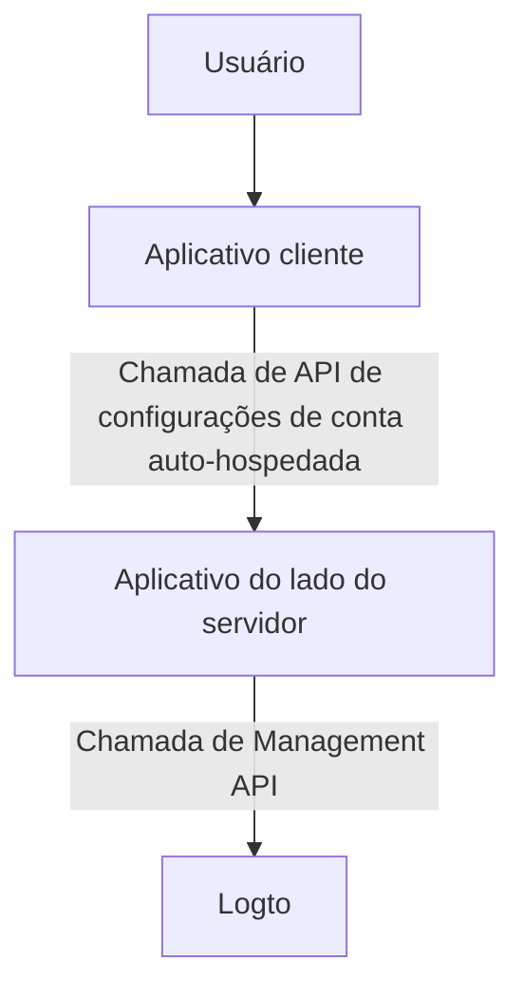
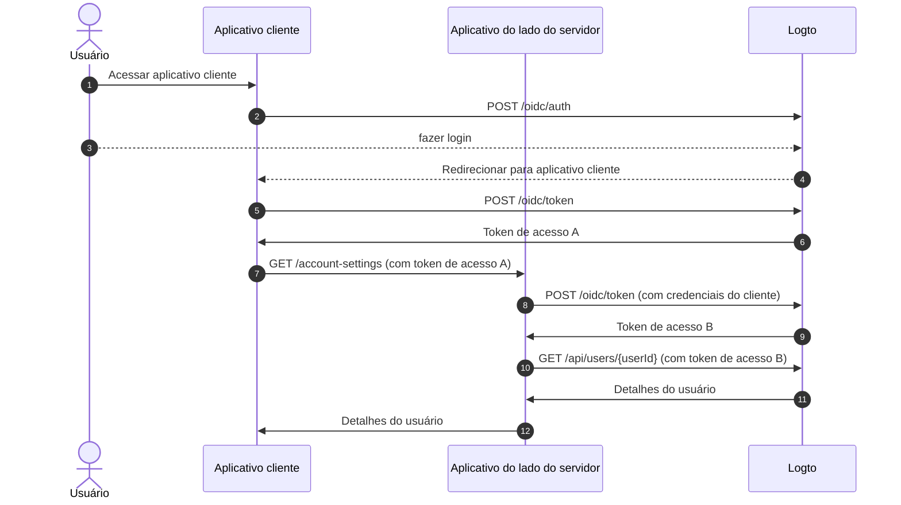
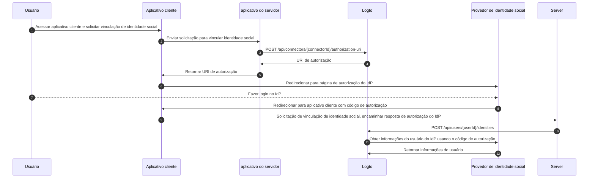

# Configurações de conta pela Management API

## Integrações

Logto fornece várias Management API para gerenciar contas de usuário. Você pode usar essas APIs para construir uma página de configurações de conta de autoatendimento para usuários finais.

### Arquitetura

1. **Usuário**: Usuário final autenticado que precisa acessar e gerenciar suas configurações de conta.
2. **Aplicativo cliente**: Seu aplicativo cliente que serve a página de configurações de conta para o usuário.
3. **Aplicativo do lado do servidor**: Aplicativo do lado do servidor que fornece a API de configurações de conta para o cliente. Interage com a Management API do Logto.
4. **Logto**: Logto como o serviço de autenticação e autorização. Fornece a Management API para gerenciar contas de usuário.

### Diagrama de sequência

1. O usuário acessa o aplicativo cliente.
2. O aplicativo cliente envia a solicitação de autenticação para o Logto e redireciona o usuário para a página de login do Logto.
3. O usuário faz login no Logto.
4. O usuário autenticado é redirecionado de volta para o aplicativo cliente com o código de autorização.
5. O aplicativo cliente solicita o token de acesso do Logto para o acesso à API de configurações de conta auto-hospedada.
6. Logto concede o token de acesso ao aplicativo cliente.
7. O aplicativo cliente envia a solicitação de configurações de conta para o aplicativo do lado do servidor com o token de acesso do usuário.
8. O aplicativo do lado do servidor verifica a identidade e permissão do solicitante a partir do token de acesso do usuário. Em seguida, solicita um token de acesso da Management API do Logto.
9. Logto concede o token de acesso da Management API ao aplicativo do lado do servidor.
10. O aplicativo do lado do servidor solicita os dados do usuário do Logto usando o token de acesso da Management API.
11. Logto verifica a identidade do servidor e a permissão da Management API e retorna os dados do usuário.
12. O aplicativo do lado do servidor processa os dados do usuário com base na permissão do solicitante e retorna os detalhes da conta do usuário para o aplicativo cliente.

### Integrar Management API ao aplicativo do lado do servidor

Confira a seção [Management API](/integrate-logto/interact-with-management-api/) para aprender como integrar as Management APIs com aplicativos do lado do servidor.

## APIs de Gerenciamento de Usuários

### Esquema de dados do usuário

Confira a seção [dados do usuário e dados personalizados](/user-management/user-data/) para saber mais sobre o esquema de usuário no Logto.

### APIs de Gerenciamento de perfil e identificadores do usuário

O perfil e os identificadores de um usuário são essenciais para o gerenciamento de usuários. Você pode usar as seguintes APIs para gerenciar perfis e identificadores de usuários.

| método | caminho                                                                                                  | descrição                                                    |
| ------ | -------------------------------------------------------------------------------------------------------- | ------------------------------------------------------------ |
| GET    | [/api/users/\{userId\}](https://openapi.logto.io/operation/operation-getuser)                            | Obter detalhes do usuário por ID do usuário.                 |
| PATCH  | [/api/users/\{userId\}](https://openapi.logto.io/operation/operation-updateuser)                         | Atualizar detalhes do usuário.                               |
| PATCH  | [/api/users/\{userId\}/profile](https://openapi.logto.io/operation/operation-updateuserprofile)          | Atualizar campos do perfil do usuário por ID do usuário.     |
| GET    | [/api/users/\{userId\}/custom-data](https://openapi.logto.io/operation/operation-listusercustomdata)     | Obter dados personalizados do usuário por ID do usuário.     |
| PATCH  | [/api/users/\{userId\}/custom-data](https://openapi.logto.io/operation/operation-updateusercustomdata)   | Atualizar dados personalizados do usuário por ID do usuário. |
| PATCH  | [/api/users/\{userId\}/is-suspended](https://openapi.logto.io/operation/operation-updateuserissuspended) | Atualizar status de suspensão do usuário por ID do usuário.  |

### Verificação de email e número de telefone

No sistema Logto, tanto endereços de email quanto números de telefone podem servir como identificadores de usuário, tornando sua verificação essencial. Para suportar isso, fornecemos um conjunto de APIs de código de verificação para ajudar a verificar o email ou número de telefone fornecido.

:::note
Certifique-se de verificar o email ou número de telefone antes de atualizar o perfil do usuário com um novo email ou número de telefone.
:::

| método | caminho                                                                                                            | descrição                                                        |
| ------ | ------------------------------------------------------------------------------------------------------------------ | ---------------------------------------------------------------- |
| POST   | [/api/verification/verification-codes](https://openapi.logto.io/operation/operation-createverificationcode)        | Enviar código de verificação de email ou número de telefone.     |
| POST   | [/api/verification/verification-codes/verify](https://openapi.logto.io/operation/operation-verifyverificationcode) | Verificar email ou número de telefone por código de verificação. |

### Gerenciamento de senha do usuário

| método | caminho                                                                                                  | descrição                                               |
| ------ | -------------------------------------------------------------------------------------------------------- | ------------------------------------------------------- |
| POST   | [/api/users/\{userId\}/password/verify](https://openapi.logto.io/operation/operation-verifyuserpassword) | Verificar senha atual do usuário por ID do usuário.     |
| PATCH  | [/api/users/\{userId\}/password](https://openapi.logto.io/operation/operation-updateuserpassword)        | Atualizar senha do usuário por ID do usuário.           |
| GET    | [/api/users/\{userId\}/has-password](https://openapi.logto.io/operation/operation-getuserhaspassword)    | Verificar se o usuário tem uma senha por ID do usuário. |

:::note
Certifique-se de verificar a senha atual do usuário antes de atualizar a senha do usuário.
:::

### Gerenciamento de identidades sociais do usuário

| método | caminho                                                                                                                           | descrição                                                                                                                          |
| ------ | --------------------------------------------------------------------------------------------------------------------------------- | ---------------------------------------------------------------------------------------------------------------------------------- |
| GET    | [/api/users/\{userId\}](https://openapi.logto.io/operation/operation-getuser)                                                     | Obter detalhes do usuário por ID do usuário. As identidades sociais podem ser encontradas no campo `identities`.                   |
| POST   | [/api/users/\{userId\}/identities](https://openapi.logto.io/operation/operation-createuseridentity)                               | Vincular uma identidade social autenticada ao usuário por ID do usuário.                                                           |
| DELETE | [/api/users/\{userId\}/identities](https://openapi.logto.io/operation/operation-deleteuseridentity)                               | Desvincular uma identidade social do usuário por ID do usuário.                                                                    |
| PUT    | [/api/users/\{userId\}/identities](https://openapi.logto.io/operation/operation-replaceuseridentity)                              | Atualizar diretamente uma identidade social vinculada ao usuário por ID do usuário.                                                |
| POST   | [/api/connectors/\{connectorId\}/authorization-uri](https://openapi.logto.io/operation/operation-createconnectorauthorizationuri) | Obter o URI de autorização para um provedor de identidade social. Use este URI para iniciar uma nova conexão de identidade social. |

1. O usuário acessa o aplicativo cliente e solicita vincular uma identidade social.
2. O aplicativo cliente envia uma solicitação ao servidor para vincular uma identidade social.
3. O servidor envia uma solicitação ao Logto para obter o URI de autorização para o provedor de identidade social. Você precisa fornecer seu próprio parâmetro `state` e `redirect_uri` na solicitação. Certifique-se de registrar o `redirect_uri` no provedor de identidade social.
4. Logto retorna o URI de autorização para o servidor.
5. O servidor retorna o URI de autorização para o aplicativo cliente.
6. O aplicativo cliente redireciona o usuário para o URI de autorização do IdP.
7. O usuário faz login no IdP.
8. O IdP redireciona o usuário de volta para o aplicativo cliente usando o `redirect_uri` com o código de autorização.
9. O aplicativo cliente valida o `state` e encaminha a resposta de autorização do IdP para o servidor.
10. O servidor envia uma solicitação ao Logto para vincular a identidade social ao usuário.
11. Logto obtém as informações do usuário do IdP usando o código de autorização.
12. O IdP retorna as informações do usuário para o Logto e o Logto vincula a identidade social ao usuário.

:::note
Existem algumas limitações a serem consideradas ao vincular novas identidades sociais a um usuário:

- A Management API não possui nenhum contexto de sessão, qualquer conector social que exija uma sessão ativa para manter com segurança o estado de autenticação social não pode ser vinculado via Management API. Conectores não suportados incluem apple, OIDC padrão e conector OAuth 2.0 padrão.
- Pelo mesmo motivo, o Logto não pode verificar o parâmetro `state` na resposta de autorização. Certifique-se de armazenar o parâmetro `state` no seu aplicativo cliente e validá-lo quando a resposta de autorização for recebida.
- Você precisa registrar o `redirect_uri` no provedor de identidade social com antecedência. Caso contrário, o IdP social não redirecionará o usuário de volta para o seu aplicativo cliente. Seu IdP social deve aceitar mais de um `redirect_uri` de retorno, um para login do usuário, outro para sua própria página de vinculação de perfil.

:::

### Gerenciamento de identidades empresariais do usuário

| método | caminho                                                                                                 | descrição                                                                                                                                                                                                                           |
| ------ | ------------------------------------------------------------------------------------------------------- | ----------------------------------------------------------------------------------------------------------------------------------------------------------------------------------------------------------------------------------- |
| GET    | [/api/users/\{userId\}?includeSsoIdentities=true](https://openapi.logto.io/operation/operation-getuser) | Obter detalhes do usuário por ID do usuário. As identidades empresariais podem ser encontradas no campo `ssoIdentities`. Adicione o parâmetro de consulta `includeSsoIdentities=true` à API de detalhes do usuário para incluí-las. |

Atualmente, a Management API não suporta vincular ou desvincular identidades empresariais a um usuário. Você só pode exibir as identidades empresariais vinculadas a um usuário.

### Gerenciamento de configurações de MFA do usuário

| método | caminho                                                                                                                              | descrição                                                       |
| ------ | ------------------------------------------------------------------------------------------------------------------------------------ | --------------------------------------------------------------- |
| GET    | [/api/users/\{userId\}/mfa-verifications](https://openapi.logto.io/operation/operation-listusermfaverifications)                     | Obter configurações de MFA do usuário por ID do usuário.        |
| POST   | [/api/users/\{userId\}/mfa-verifications](https://openapi.logto.io/operation/operation-createusermfaverification)                    | Configurar uma verificação de MFA do usuário por ID do usuário. |
| DELETE | [/api/users/\{userId\}/mfa-verifications/\{verificationId\}](https://openapi.logto.io/operation/operation-deleteusermfaverification) | Excluir uma verificação de MFA do usuário por ID.               |

### Exclusão de conta de usuário

| método | caminho                                                                          | descrição                             |
| ------ | -------------------------------------------------------------------------------- | ------------------------------------- |
| DELETE | [/api/users/\{userId\}](https://openapi.logto.io/operation/operation-deleteuser) | Excluir um usuário por ID do usuário. |
