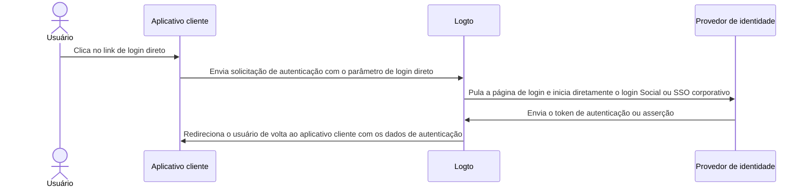

# Login direto

O login direto é um [parâmetro de autenticação](/end-user-flows/authentication-parameters) específico do Logto que permite iniciar o login social ou SSO corporativo diretamente, ignorando a página universal padrão de login do Logto.

Esse recurso é especialmente útil se você possui uma página de login personalizada ou um ponto de entrada de login do IdP incorporado em seu site (Veja casos de uso). Ao usar o login direto, você pode redirecionar os usuários diretamente para a página de login do IdP.



## Login social \{#social-sign-in}

Passe o parâmetro `direct_sign_in` com o valor `social:<idp-name>` para iniciar diretamente o processo de login social.

### Onde encontrar o nome do IdP do conector \{#where-to-find-the-connector-idp-name}

1. Navegue até <CloudLink to="/connectors/social">Console > Conectores > Conectores sociais</CloudLink>
2. Clique no [conector social](/connectors/social-connectors) que deseja usar.
3. Localize o nome do provedor de identidade no topo da página de configurações do conector.


### Exemplo \{#example}

Monte sua própria URL de solicitação de autenticação com o parâmetro `direct_sign_in`:

```sh
curl --location \
  --request GET 'https://[tenant-id].logto.app/oidc/auth?client_id=1234567890&...&direct_sign_in=social:google'
```

Nos SDKs Logto compatíveis, você pode definir o parâmetro `directSignIn` ao chamar o método `signIn`:

```javascript
const authResult = await logto.signIn({
  redirectUri: 'https://your-app.com/callback',
  directSignIn: 'social:google',
});
```

## SSO corporativo (Enterprise SSO) \{#enterprise-sso}

Passe o parâmetro `direct_sign_in` com o valor `sso:<connector-id>` para iniciar diretamente o processo de login SSO corporativo.

### Onde encontrar o ID do conector SSO corporativo \{#where-to-find-the-enterprise-sso-connector-id}

1. Navegue até <CloudLink to="/enterprise-sso">Console > SSO corporativo</CloudLink>
2. Clique no [conector corporativo](/connectors/enterprise-connectors) que deseja usar.
3. Localize o ID do conector no topo da página de configurações do conector.


### Exemplo \{#example-1}

Monte sua própria URL de solicitação de autenticação com o parâmetro `direct_sign_in`:

```sh
curl --location \
  --request GET 'https://[tenant-id].logto.app/oidc/auth?client_id=1234567890&...&direct_sign_in=sso:1234567890'
```

Nos SDKs Logto compatíveis, você pode definir o parâmetro `directSignIn` ao chamar o método `signIn`:

```javascript
logtoClient.signIn({
  redirectUri: 'https://your-app.com/callback',
  directSignIn: 'sso:1234567890',
});
```

## Retorno para a página de login \{#fallback-to-the-sign-in-page}

Se o processo de login direto falhar, por exemplo, se o conector não for encontrado ou estiver desabilitado, o usuário será redirecionado para a página padrão de login.

:::note
Estamos adicionando gradualmente o suporte ao parâmetro direct_sign_in em todos os SDKs Logto. Se você não o encontrar em seu SDK, por favor, abra uma issue ou entre em contato conosco.
:::

## Perguntas frequentes \{#faqs}

<details>
  <summary>

### O login direto é o mesmo que autenticação por API? \{#is-direct-sign-in-the-same-as-api-authentication}

</summary>

Não, o login direto é um parâmetro de fluxo do usuário que permite pular a página padrão de login do Logto e redirecionar os usuários diretamente para a página de login do provedor social ou SSO corporativo. Diferente da autenticação baseada em API, o usuário ainda precisa ser redirecionado primeiro para o endpoint de autenticação do Logto para iniciar o processo de login.

</details>
