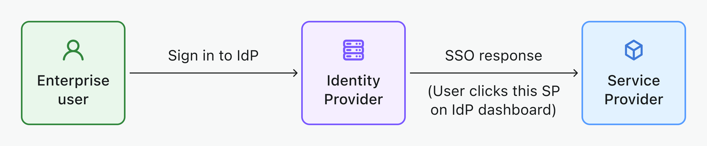

# SSO corporativo (Enterprise SSO)

[Autenticação única (SSO)](https://auth.wiki/single-sign-on) permite que os usuários façam login em vários aplicativos com um único conjunto de credenciais. Isso simplifica o processo de autenticação para usuários corporativos, especialmente para as plataformas SaaS da força de trabalho de hoje.

Logto aprimora a experiência de SSO fornecendo uma ampla gama de conectores de SSO corporativo que você pode configurar e integrar facilmente com seus aplicativos, por exemplo, [Google Workspace](/integrations/google-workspace), [Microsoft Azure AD](/integrations/entra-id-saml), [Okta](/integrations/okta) e mais.

## Componentes principais do SSO corporativo \{#key-components-of-enterprise-sso}

- **Provedor de identidade (IdP)**: Um serviço que verifica identidades de usuários e gerencia suas credenciais de login. Após confirmar a identidade de um usuário, o IdP gera tokens de autenticação ou declarações e permite que o usuário acesse vários aplicativos ou serviços sem precisar fazer login novamente. Essencialmente, é o sistema de referência para gerenciar identidades e permissões de funcionários em sua empresa. Exemplos: Okta, Azure AD, Google Workspace, LastPass, OneLogin, Ping Identity, Cyberark, etc. [Saiba mais sobre IdP](https://auth.wiki/identity-provider).
- **Provedor de serviço (SP)**: Um sistema ou aplicativo que requer autenticação de usuário e depende do Provedor de Identidade (IdP) para autenticação. O SP recebe tokens de autenticação ou declarações do IdP, concedendo acesso aos seus recursos sem exigir credenciais de login separadas. Exemplos: Slack, Shopify, Dropbox, Figma, Notion, etc... e seu serviço. [Saiba mais sobre SP](https://auth.wiki/service-provider).
- **Identidade corporativa**: Normalmente identificada pelo uso de um domínio de email da empresa para login. Esta conta de email corporativa pertence finalmente à empresa.

## Fluxo de trabalho de SSO suportado \{#supported-sso-workflow}

- [**SSO iniciado pelo IdP**](/end-user-flows/enterprise-sso/idp-initiated-sso): No SSO iniciado pelo IdP, o Provedor de Identidade (IdP) controla principalmente o processo de autenticação única. Este processo começa quando um usuário faz login na plataforma do IdP, como um portal da empresa ou um painel de identidade centralizado. Uma vez autenticado, o IdP gera um token de autenticação ou declaração, que é então usado para conceder ao usuário acesso a vários serviços ou aplicativos conectados (SPs) sem exigir logins adicionais.
  
- [**SSO iniciado pelo SP**](/end-user-flows/enterprise-sso/sp-initiated-sso): No SSO iniciado pelo SP, o Provedor de Serviço (SP) assume a liderança na iniciação e gerenciamento do processo de autenticação única, frequentemente preferido em cenários B2B. Este cenário ocorre quando um usuário tenta acessar um serviço ou aplicativo específico (o SP) e é redirecionado para seu IdP para autenticação. Após o login bem-sucedido no IdP, um token de autenticação é enviado de volta ao SP, concedendo acesso ao usuário. Logto suporta SSO iniciado pelo SP para seus serviços B2B.
  

## Protocolos de SSO suportados \{#supported-sso-protocols}

- [**SAML**](/integrations/saml-sso): [Security Assertion Markup Language (SAML)](https://auth.wiki/saml) é um padrão aberto baseado em XML para troca de dados de autenticação e autorização entre um IdP e SP. Este protocolo é particularmente apto para lidar com requisitos de segurança complexos em nível empresarial.
- [**OIDC**](/integrations/oidc-sso): [OpenID Connect (OIDC)](https://auth.wiki/openid-connect) é uma camada de identidade simples construída sobre o protocolo OAuth 2.0. Ele emprega JSON / REST para comunicação, tornando-o mais leve e melhor adaptado para arquiteturas de aplicativos modernos, incluindo aplicativos móveis e de página única (SPAs).

## Perguntas frequentes \{#faqs}

  

### Como adicionar botões de conector de SSO e fazer login diretamente com o provedor de SSO no meu site? \{#how-to-add-sso-connector-buttons-and-directly-sign-in-with-sso-provider-on-my-website}

Logto permite que você adicione botões de login social ao seu site e inicie o processo de login SSO diretamente sem mostrar o formulário de login padrão. Confira nosso guia de [Login direto](/end-user-flows/authentication-parameters/direct-sign-in/) para instruções detalhadas.

## Recursos relacionados \{#related-resources}

<Url href="https://www.youtube.com/watch?v=-mD8Sfab7sI&t=12s"> Experiência de SSO corporativo</Url>

<Url href="https://blog.logto.io/idp-vs-sp-initiated-sso">
  SSO iniciado pelo IdP vs SSO iniciado pelo SP
</Url>

<Url href="https://blog.logto.io/enterprise-sso">
  SSO corporativo: O que é, como funciona e por que é importante
</Url>

<Url href="https://blog.logto.io/single-sign-on">A arte da autenticação única</Url>
