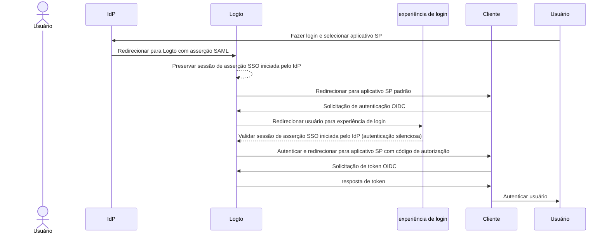
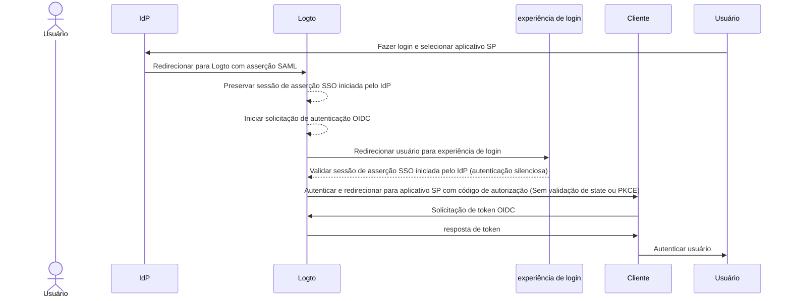

import Availability from '@components/Availability';

<Availability cloud="comingSoon" oss={false} />

# SSO iniciado pelo IdP (somente SAML)

O SSO iniciado pelo IdP é um processo de autenticação única em que o Provedor de Identidade (IdP) controla principalmente o fluxo de autenticação. Esse processo começa quando um usuário faz login na plataforma do IdP, como um portal corporativo ou um painel de identidade centralizado. Uma vez autenticado, o IdP gera uma asserção SAML e direciona o usuário ao Provedor de Serviço (SP) para acessar o aplicativo ou serviço.


## Riscos e considerações \{#risks-and-considerations}

O SSO iniciado pelo IdP pode introduzir várias vulnerabilidades de segurança das quais as organizações devem estar cientes. Como o processo de autenticação é iniciado pelo IdP sem uma solicitação direta do usuário, ele pode ser suscetível a vários ataques, incluindo [Cross-Site Request Forgery](https://blog.logto.io/csrf) (CSRF).

Essa falta de autenticação iniciada pelo usuário pode levar a acessos não autorizados se as proteções adequadas não estiverem implementadas. Além disso, a dependência de um único ponto de autenticação aumenta o risco de uma violação de segurança, pois comprometer o IdP pode expor todos os aplicativos conectados.

Portanto, é altamente recomendado utilizar o SSO iniciado pelo SP, que oferece um fluxo de autenticação mais seguro e controlado, garantindo que os usuários solicitem explicitamente o acesso aos serviços.

## Conectar SSO iniciado pelo IdP com aplicativos OIDC do Logto \{#connect-idp-initiated-sso-with-logto-oidc-applications}

O Logto, como um provedor OpenID Connect (OIDC), não suporta SSO iniciado pelo IdP. No entanto, você pode configurar o Logto como um SP para suportar SSO iniciado pelo IdP com seu IdP corporativo usando SAML. Essa configuração permite que você aproveite as capacidades de autenticação do Logto enquanto mantém o controle do IdP sobre o fluxo de autenticação.

:::note
Por padrão, esse recurso não está habilitado no Logto. Se você precisar do SSO iniciado pelo IdP habilitado para seu tenant, entre em contato com nossa [equipe de suporte](https://logto.io/contact?src=docs.sso).
:::

### Pré-requisitos \{#prerequisites}

Antes de configurar o SSO iniciado pelo IdP, você precisa criar primeiro um conector SAML. Navegue até <CloudLink to="/enterprise-sso">Console > SSO corporativo (Enterprise SSO)</CloudLink> e siga o guia passo a passo para configurar um conector [SAML](/integrations/saml-sso/) com seu IdP.

Depois que o conector SAML estiver configurado, você pode habilitar o método de login SSO na seção <CloudLink to="/sign-in-experience/sign-up-and-sign-in">Login & conta > Cadastro e login</CloudLink> e testar o fluxo de SSO iniciado pelo SP para garantir que a configuração está correta. Certifique-se de que o SSO iniciado pelo SP está funcionando conforme esperado antes de prosseguir com o SSO iniciado pelo IdP.

### Habilitar SSO iniciado pelo IdP \{#enable-idp-initiated-sso}

Depois que o recurso de SSO iniciado pelo IdP estiver habilitado para seu tenant, você verá uma aba extra na página de configurações do seu conector SAML, chamada **SSO iniciado pelo IdP**. Ative a opção **SSO iniciado pelo IdP** para ativar o recurso para o conector.

### Selecionar o aplicativo SP \{#select-the-sp-application}

Diferente do SSO iniciado pelo SP, onde o fluxo de autenticação começa pelo SP, o SSO iniciado pelo IdP requer um aplicativo SP do lado do cliente para redirecionar os usuários após o processo de autenticação. Você pode selecionar o aplicativo SP na lista de aplicativos registrados no dropdown **Aplicativo padrão (Default application)**.

Apenas aplicativos do tipo **Aplicativo Web Tradicional (Traditional Web App)** e **Aplicativo de Página Única (Single Page App)** são suportados para SSO iniciado pelo IdP. Certifique-se de selecionar o tipo de aplicativo apropriado para seu caso de uso.

:::note
No lado do seu IdP, deixe o parâmetro `RelayState` como **VAZIO** para que o fluxo de SSO iniciado pelo IdP funcione corretamente. O Logto irá gerenciar o redirecionamento com base no aplicativo SP padrão selecionado.
:::

## Configurar o fluxo de autenticação iniciado pelo IdP \{#configure-idp-initiated-authentication-flow}

Para conectar o SSO SAML iniciado pelo IdP com OIDC, o Logto oferece duas opções de configuração para lidar com a solicitação de autenticação.

### Opção A: Redirecionar para o aplicativo SP padrão (Recomendado) \{#option-a-redirect-to-the-default-sp-application-recommended}

Quando o IdP inicia o fluxo SSO e envia a asserção SAML para o Logto, uma sessão de asserção SSO iniciada pelo IdP será criada. O Logto irá redirecionar o usuário para o aplicativo SP padrão para iniciar uma solicitação de autenticação OIDC padrão no lado do cliente.


```mermaid
sequenceDiagram
    actor User as Usuário
    participant IdP as IdP
    participant Logto as Logto
    participant Experience as experiência de login
    participant SP as Cliente

    Usuário->>IdP: Fazer login e selecionar aplicativo SP
    IdP->>Logto: Redirecionar para Logto com asserção SAML
    Logto-->>Logto: Preservar sessão de asserção SSO iniciada pelo IdP
    Logto->>SP: Redirecionar para aplicativo SP padrão
    SP->>Logto: Solicitação de autenticação OIDC
    Logto->>Experience: Redirecionar usuário para experiência de login
    Experience-->>Logto: Validar sessão de asserção SSO iniciada pelo IdP (autenticação silenciosa)
    Logto->>SP: Autenticar e redirecionar para aplicativo SP com código de autorização
    SP->>Logto: Solicitação de token OIDC
    Logto->>SP: resposta de token
    SP->>Usuário: Autenticar usuário
```

Para configurar essa opção, selecione o cartão **Redirecionar para o cliente para autenticação iniciada pelo SP** na aba **SSO iniciado pelo IdP** das configurações do conector SAML.


1. Forneça uma **URL de redirecionamento do cliente (Client redirect URL)** para redirecionar o usuário ao aplicativo SP padrão após o fluxo de SSO iniciado pelo IdP. O Logto irá redirecionar o usuário para essa URL com o parâmetro de consulta `?ssoConnectorId={connectorId}` anexado à URL. O aplicativo cliente deve lidar com o redirecionamento e iniciar a solicitação de autenticação OIDC. (Recomendamos usar uma rota ou página dedicada em seu aplicativo cliente para lidar com a solicitação de autenticação SSO iniciada pelo IdP.)

2. Lide com a solicitação de autenticação OIDC no lado do cliente usando o parâmetro de consulta `ssoConnectorId` para identificar o conector SAML que iniciou o fluxo de autenticação SSO iniciado pelo IdP.

3. Passe o parâmetro de autenticação [login direto (direct sign-in)](/end-user-flows/authentication-parameters/direct-sign-in/) na solicitação de login para o Logto para completar o fluxo de autenticação SSO.

```typescript
// Exemplo React
import { Prompt, useLogto } from '@logto/react';
import { useEffect } from 'react';
import { useNavigate, useSearchParams } from 'react-router-dom';

const SsoDirectSignIn = () => {
  const { signIn } = useLogto();
  const [searchParams] = useSearchParams();

  useEffect(() => {
    const ssoConnectorId = searchParams.get('ssoConnectorId');
    if (ssoConnectorId) {
      void signIn({
        redirectUri,
        prompt: Prompt.Login,
        directSignIn: {
          method: 'sso',
          target: ssoConnectorId,
        },
      });
    }
  }, [searchParams, signIn]);
};
```

- `redirectUri`: O `redirect_uri` para redirecionar o usuário após a conclusão do fluxo de autenticação OIDC.
- `prompt=login`: Força o usuário a fazer login usando a identidade do SSO iniciado pelo IdP.
- `directSignIn=sso:{connectorId}`: Especifica o método de login direto como `sso` e o ID do conector SAML de destino. Esse parâmetro irá acionar o fluxo de autenticação SSO diretamente sem exibir a página de login. O usuário será autenticado automaticamente usando a sessão de asserção SSO iniciada pelo IdP preservada, se o ID do conector corresponder e a sessão for válida.

Esse método garante que o fluxo de autenticação seja seguro e siga o protocolo OIDC padrão, mantendo o controle do IdP sobre o processo de autenticação. O aplicativo cliente pode aproveitar a sessão de asserção SSO iniciada pelo IdP para autenticar o usuário sem etapas adicionais de login, mantendo o fluxo de autenticação seguro e controlado. O aplicativo cliente ainda pode validar os parâmetros `state` e `PKCE` para garantir que a solicitação de autenticação seja segura.

:::note
Esse método está disponível para aplicativos do tipo **Aplicativo Web Tradicional (Traditional Web App)** e **Aplicativo de Página Única (Single Page App)**. E é recomendado para todos os casos de uso.
:::

### Opção B: Autenticar o usuário diretamente com SSO iniciado pelo IdP \{#option-b-directly-authenticate-the-user-with-idp-initiated-sso}

Em determinadas circunstâncias, o SP pode não conseguir lidar com o callback do SSO iniciado pelo IdP e iniciar a solicitação de autenticação OIDC. Nesse caso, o Logto oferece uma opção alternativa para autenticar diretamente o usuário com a sessão de asserção SSO iniciada pelo IdP.

Essa opção é considerada menos segura e não é recomendada. O fluxo de autenticação ignora o protocolo OIDC padrão. Como a solicitação de autenticação é iniciada pelo IdP, o aplicativo cliente pode não conseguir validar a solicitação de autenticação de forma segura. Por exemplo, o aplicativo cliente não pode validar os parâmetros `state` e `PKCE` para garantir que a solicitação de autenticação seja segura.

:::warning
Esse método não está disponível para aplicativos do tipo **Aplicativo de Página Única (Single Page App)**, pois requer que o aplicativo cliente lide com a solicitação de autenticação de forma segura usando o parâmetro `PKCE`. Se você precisar implementar SSO iniciado pelo IdP para um aplicativo SPA, utilize a opção acima.
:::


```mermaid
  sequenceDiagram

  actor User as Usuário
  participant IdP as IdP
  participant Logto as Logto
  participant Experience as experiência de login
  participant SP as Cliente

  Usuário->>IdP: Fazer login e selecionar aplicativo SP
  IdP->>Logto: Redirecionar para Logto com asserção SAML
  Logto-->>Logto: Preservar sessão de asserção SSO iniciada pelo IdP
  Logto-->>Logto: Iniciar solicitação de autenticação OIDC
  Logto->>Experience: Redirecionar usuário para experiência de login
  Experience-->>Logto: Validar sessão de asserção SSO iniciada pelo IdP (autenticação silenciosa)
  Logto->>SP: Autenticar e redirecionar para aplicativo SP com código de autorização (Sem validação de state ou PKCE)
  SP->>Logto: Solicitação de token OIDC
  Logto->>SP: resposta de token
  SP->>Usuário: Autenticar usuário
```

Para configurar essa opção, selecione a opção **Login direto usando SSO iniciado pelo IdP (Directly sign-in using IdP-initiated SSO)** na aba **SSO iniciado pelo IdP** das configurações do conector SAML.


1. Selecione o **URI de redirecionamento pós-login (Post sign-in redirect URI)** para redirecionar o usuário de volta ao aplicativo cliente após a autenticação bem-sucedida. Essa URL será usada como o `redirect_uri` na solicitação de autenticação OIDC. O URI deve ser um dos URIs de redirecionamento permitidos registrados no aplicativo cliente.

   :::note
   É altamente recomendado usar um **URI de redirecionamento** dedicado para SSO iniciado pelo IdP. Dado que a solicitação de autenticação é não solicitada, o aplicativo cliente deve gerenciar a resposta de forma independente, separada do fluxo de autenticação padrão iniciado pelo SP.
   :::

2. Personalize os parâmetros da solicitação de autorização, se necessário, usando o editor json **Parâmetros de autenticação adicionais (Additional authentication parameters)** (seguindo o tipo `Map<string,string>`).

   Exemplo: Por padrão, o Logto solicita apenas os escopos `openid` e `profile`. Você pode adicionar escopos ou parâmetros adicionais à solicitação de autenticação.

   ```json
   {
     "scope": "email offline_access"
   }
   ```

   - adicionar escopo adicional `email` para solicitar o endereço de e-mail do usuário.
   - adicionar escopo `offline_access` para solicitar o token de atualização (refresh token).

   Também recomendamos fornecer um parâmetro `state` personalizado para validar a resposta de autenticação de forma segura.

   ```json
   {
     "state": "valor-personalizado-state"
   }
   ```

   O aplicativo cliente deve validar o parâmetro `state` na resposta do código de autorização para garantir que a solicitação de autenticação seja válida.
