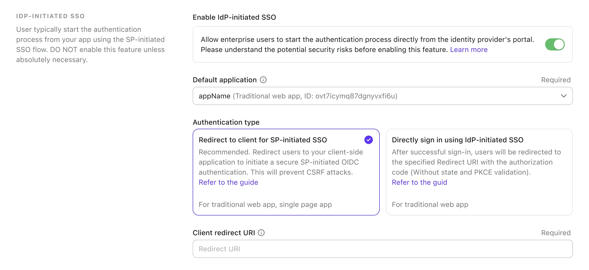

import Availability from '@components/Availability';

<Availability cloud="comingSoon" oss={false} />

# IdP-initiated SSO (somente SAML)

IdP-initiated SSO é um processo de autenticação única onde o Provedor de Identidade (IdP) controla principalmente o fluxo de autenticação. Este processo começa quando um usuário faz login na plataforma do IdP, como um portal da empresa ou um painel de identidade centralizado. Uma vez autenticado, o IdP gera uma asserção SAML e direciona o usuário para o Provedor de Serviço (SP) para acessar o aplicativo ou serviço.


## Riscos e considerações

IdP-initiated SSO pode introduzir várias vulnerabilidades de segurança que as organizações devem estar cientes. Como o processo de autenticação é iniciado pelo IdP sem uma solicitação direta do usuário, ele pode ser suscetível a vários ataques, incluindo [Cross-Site Request Forgery](https://blog.logto.io/csrf) (CSRF).

Essa falta de autenticação iniciada pelo usuário pode levar a acessos não autorizados se as proteções adequadas não estiverem em vigor. Além disso, a dependência de um único ponto de autenticação aumenta o risco de uma violação de segurança, pois comprometer o IdP pode expor todos os aplicativos conectados.

Portanto, é altamente recomendável usar SP-initiated SSO, que fornece um fluxo de autenticação mais seguro e controlado, garantindo que os usuários solicitem explicitamente acesso aos serviços.

## Conectar IdP-initiated SSO com aplicativos Logto OIDC

Logto como um provedor OpenID Connect (OIDC) não suporta IdP-initiated SSO. No entanto, você pode configurar o Logto como um SP para suportar IdP-initiated SSO com seu IdP corporativo usando SAML. Essa configuração permite que você aproveite as capacidades de autenticação do Logto enquanto mantém o controle do IdP sobre o fluxo de autenticação.

:::note
Por padrão, esse recurso não está habilitado no Logto. Se você precisar que o IdP-initiated SSO seja habilitado para seu locatário, entre em contato com nossa [equipe de suporte](https://logto.io/contact?src=docs.sso).
:::

### Pré-requisitos

Antes de configurar o IdP-initiated SSO, você precisa criar um conector SAML primeiro. Navegue até o <CloudLink to="/enterprise-sso">Console > Enterprise SSO</CloudLink> e siga o guia passo a passo para configurar um conector [SAML](/integrations/saml-sso/) com seu IdP.

Uma vez que o conector SAML esteja configurado, você pode habilitar o método de login SSO na seção <CloudLink to="/sign-in-experience">Experiência de login</CloudLink> e testar o fluxo SP-initiated SSO para garantir que a configuração esteja correta. Certifique-se de que o SP-initiated SSO esteja funcionando conforme o esperado antes de prosseguir com o IdP-initiated SSO.

### Habilitar IdP-initiated SSO

Uma vez que o recurso IdP-initiated SSO esteja habilitado para seu locatário, você deverá ver uma aba extra na página de configurações do seu conector SAML, chamada **IdP-initiated SSO**. Habilite a opção **IdP-initiated SSO** para ativar o recurso para o conector.

### Selecionar o aplicativo SP

Ao contrário do SP-initiated SSO, onde o fluxo de autenticação começa no SP, o IdP-initiated SSO requer um aplicativo SP do lado do cliente para redirecionar os usuários após o processo de autenticação. Você pode selecionar o aplicativo SP da lista de aplicativos registrados no dropdown **Aplicativo padrão**.

Apenas aplicativos **Traditional Web App** e **Single Page App** são suportados para IdP-initiated SSO. Certifique-se de selecionar o tipo de aplicativo apropriado com base no seu caso de uso.

:::note
No lado do seu IdP, deixe o parâmetro `RelayState` como **VAZIO** para que o fluxo IdP-initiated SSO funcione corretamente. O Logto irá lidar com o redirecionamento com base no aplicativo SP padrão selecionado.
:::

## Configurar o fluxo de autenticação IdP-initiated

Para conectar o IdP-initiated SAML SSO com OIDC, o Logto fornece duas opções de configuração para lidar com a solicitação de autenticação.

### Opção A: Redirecionar para o aplicativo SP padrão (Recomendado)

Quando o IdP inicia o fluxo SSO e envia a asserção SAML para o Logto, uma sessão de asserção SSO iniciada pelo IdP será criada. O Logto redirecionará o usuário para o aplicativo SP padrão para iniciar uma solicitação de autenticação OIDC padrão no lado do cliente.


Para configurar esta opção, selecione o cartão **Redirecionar para cliente para autenticação SP-initiated** na aba **IdP-initiated SSO** das configurações do conector SAML.



1. Forneça uma **URL de redirecionamento do cliente** para redirecionar o usuário para o aplicativo SP padrão após o fluxo IdP-initiated SSO. O Logto redirecionará o usuário para esta URL com o parâmetro de consulta `?ssoConnectorId={connectorId}` anexado à URL. O aplicativo cliente deve lidar com o redirecionamento e iniciar a solicitação de autenticação OIDC. (Recomendamos usar uma rota ou página dedicada em seu aplicativo cliente para lidar com a solicitação de autenticação IdP-initiated SSO.)

2. Lide com a solicitação de autenticação OIDC no lado do cliente usando o parâmetro de consulta `ssoConnectorId` para identificar o conector SAML que iniciou o fluxo de autenticação IdP-initiated SSO.

3. Passe o parâmetro de autenticação [login direto](/end-user-flows/authentication-parameters/direct-sign-in/) na solicitação de login para o Logto para completar o fluxo de autenticação SSO.

```typescript
// Exemplo React
import { Prompt, useLogto } from '@logto/react';
import { useEffect } from 'react';
import { useNavigate, useSearchParams } from 'react-router-dom';

const SsoDirectSignIn = () => {
  const { signIn } = useLogto();
  const [searchParams] = useSearchParams();

  useEffect(() => {
    const ssoConnectorId = searchParams.get('ssoConnectorId');
    if (ssoConnectorId) {
      void signIn({
        redirectUri,
        prompt: Prompt.Login,
        directSignIn: {
          method: 'sso',
          target: ssoConnectorId,
        },
      });
    }
  }, [searchParams, signIn]);
};
```

- `redirectUri`: O `redirect_uri` para redirecionar o usuário após o fluxo de autenticação OIDC ser concluído.
- `prompt=login`: Força o usuário a fazer login usando a identidade IdP-initiated SSO.
- `directSignIn=sso:{connectorId}`: Especifica o método de login direto como `sso` e o ID do conector SAML de destino. Este parâmetro acionará o fluxo de autenticação SSO diretamente sem mostrar a página de login. O usuário será autenticado automaticamente usando a sessão de asserção SSO iniciada pelo IdP preservada se o ID do conector corresponder e a sessão for válida.

Este método garante que o fluxo de autenticação seja seguro e siga o protocolo OIDC padrão, enquanto mantém o controle do IdP sobre o processo de autenticação. O aplicativo cliente pode aproveitar a sessão de asserção SSO iniciada pelo IdP para autenticar o usuário sem etapas adicionais de login, mantendo o fluxo de autenticação seguro e controlado. O aplicativo cliente ainda pode validar os parâmetros `state` e `PKCE` para garantir que a solicitação de autenticação seja segura.

:::note
Este método está disponível para aplicativos **Traditional Web App** e **Single Page App**. E é recomendado para todos os casos de uso.
:::

### Opção B: Autenticar diretamente o usuário com IdP-initiated SSO

Em certas circunstâncias, o SP pode não ser capaz de lidar com o callback IdP-initiated SSO e iniciar a solicitação de autenticação OIDC. Nesse caso, o Logto fornece uma opção alternativa para autenticar diretamente o usuário com a sessão de asserção SSO iniciada pelo IdP.

Esta opção é considerada menos segura e não é recomendada. O fluxo de autenticação ignora o protocolo OIDC padrão. Como a solicitação de autenticação é iniciada pelo IdP, o aplicativo cliente pode não ser capaz de validar a solicitação de autenticação de forma segura. Por exemplo, o aplicativo cliente não pode validar os parâmetros `state` e `PKCE` para garantir que a solicitação de autenticação seja segura.

:::warning
Este método não está disponível para aplicativos **Single Page App**, pois requer que o aplicativo cliente lide com a solicitação de autenticação de forma segura usando o parâmetro `PKCE`. Se você precisar implementar IdP-initiated SSO para um aplicativo SPA, use a opção acima.
:::


Para configurar esta opção, selecione a opção **Login direto usando IdP-initiated SSO** na aba **IdP-initiated SSO** das configurações do conector SAML.


1. Selecione o **URI de redirecionamento pós-login** para redirecionar o usuário de volta ao aplicativo cliente após a autenticação bem-sucedida. Esta URL será usada como o `redirect_uri` na solicitação de autenticação OIDC. O URI deve ser um dos URIs de redirecionamento permitidos registrados no aplicativo cliente.

   :::note
   É altamente recomendável usar um **URI de redirecionamento** dedicado para IdP-initiated SSO. Dado que a solicitação de autenticação é não solicitada, o aplicativo cliente deve gerenciar a resposta de forma independente, separada do fluxo de autenticação padrão SP-initiated.
   :::

2. Personalize os parâmetros da solicitação de autorização, se necessário, usando o editor json **Parâmetros de autenticação adicionais** (seguindo o tipo `Map<string,string>`).

   Por exemplo, por padrão, o Logto solicita apenas os escopos `openid` e `profile`. Você pode adicionar escopos ou parâmetros adicionais à solicitação de autenticação.

   ```json
   {
     "scope": "email offline_access"
   }
   ```

   - adicionar escopo adicional `email` para solicitar o endereço de email do usuário.
   - adicionar escopo `offline_access` para solicitar o token de atualização.

   Também recomendamos que você forneça um parâmetro `state` personalizado para validar a resposta de autenticação de forma segura.

   ```json
   {
     "state": "custom-state-value"
   }
   ```

   O aplicativo cliente deve validar o parâmetro `state` na resposta do código de autorização para garantir que a solicitação de autenticação seja válida.
