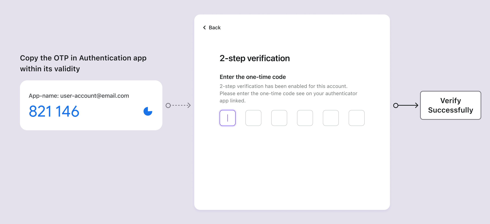

# OTP de aplicativo autenticador

## Conceitos

O aplicativo autenticador, também referido como Token de Software, é um dos métodos de MFA mais amplamente adotados. Ele gera senhas temporárias de uso único (OTP) para aumentar a segurança da autenticação de serviços online. Ao contrário dos tokens de hardware físicos, os tokens de software são geralmente aplicativos ou plugins que os usuários instalam em seus dispositivos, seja um smartphone ou um navegador de computador. Os tokens de software podem operar localmente em um único dispositivo ou sincronizar em vários dispositivos, dependendo das capacidades do autenticador e das configurações individuais do usuário.

Exemplos populares de tokens de software incluem Google Authenticator, Microsoft Authenticator, Duo, 1Password, Authy, entre outros.

## Fluxos de autenticação

**Fluxos de Configuração**

1. **Código QR ou Chave Secreta**: Os usuários recebem um código QR ou uma chave secreta do seu serviço.
2. **Adicionar conta**: Usando seu aplicativo autenticador, os usuários escaneiam o código QR ou inserem manualmente a chave secreta para adicionar sua conta.
3. **Senha dinâmica de uso único**: O aplicativo autenticador exibe um código de seis dígitos que é atualizado a cada 1-2 minutos para a conta adicionada.
4. **Completar configuração de MFA**: Os usuários inserem este código dentro de sua validade na página de configuração de MFA, completando a configuração do OTP de aplicativo autenticador para MFA.

**Fluxos de Verificação**

1. **Tentativa de login**: Durante o login, os usuários são solicitados a realizar MFA.
2. **Recuperar OTP**: Abrir seu aplicativo autenticador para recuperar o OTP para a respectiva conta.
3. **Inserir OTP**: Os usuários inserem o OTP exibido no aplicativo dentro de sua validade na página de verificação em duas etapas.
4. **Autenticação (Authentication)**: O sistema verifica o OTP, concedendo acesso após validação bem-sucedida.

