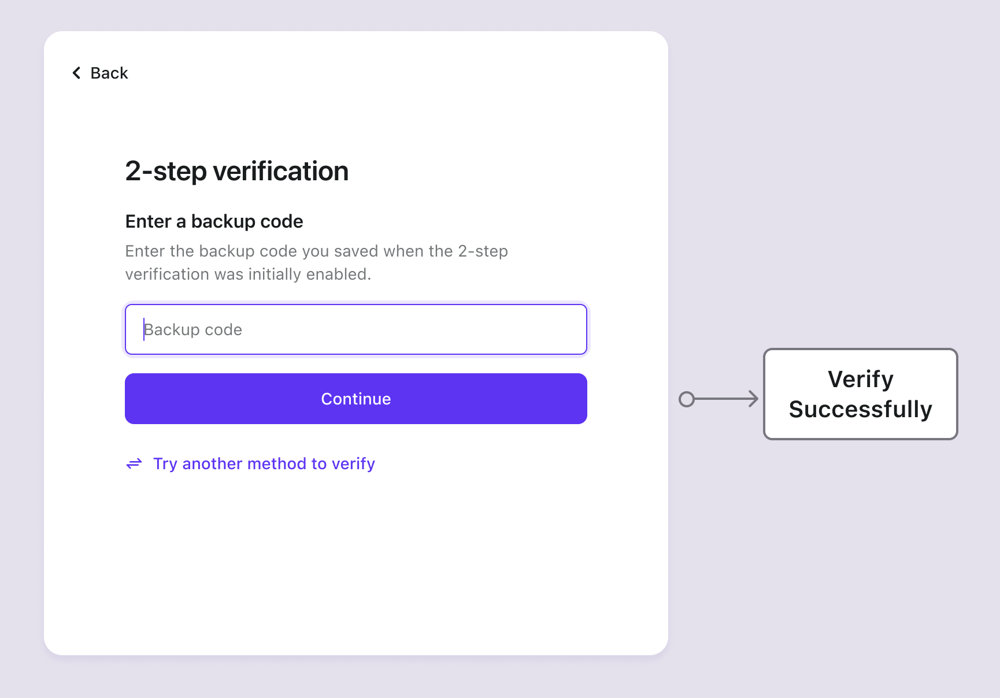

# Códigos de backup

## Conceitos

Códigos de backup, também conhecidos como Código de recuperação, são códigos de uso único para MFA, atuando como um backup caso os fatores de autenticação primários do usuário (por exemplo, aplicativo autenticador ou token de hardware) não estejam disponíveis.

Perdê-los pode levar a desafios na recuperação da conta. Portanto, é recomendado configurar um fator primário adicional antes de habilitar os Códigos de Backup, dando-lhes prioridade.

O Logto gera automaticamente 10 Códigos de Backup para os usuários assim que eles configuram um fator adicional. Cada código é de uso único. Recomenda-se que os usuários regenerem um novo conjunto de códigos nas Configurações da Conta do Usuário (acessível através da [Management API](/integrate-logto/interact-with-management-api/)) antes de usar todos os códigos existentes.

## Fluxos de autenticação

- **Fluxos de configuração**

- **Fluxo de verificação**

