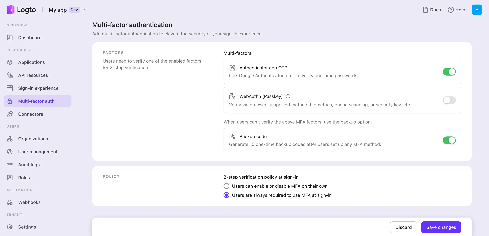

# Configurar MFA

## Configurar configurações de MFA no Logto \{#configure-mfa-settings-in-logto}

Siga estas etapas para habilitar MFAs no fluxo de login dos usuários no Logto:

1. Navegue para: <CloudLink to="/mfa">Console > Autenticação multifatorial (MFA)</CloudLink>.
2. Habilite os fatores de verificação suportados para seus usuários.
   1. Fatores primários:
      - [OTP de aplicativo autenticador](/end-user-flows/mfa/authenticator-app-otp): O método mais comum e amplamente aceito. Use uma senha única baseada em tempo (TOTP) gerada por um aplicativo autenticador como Google Authenticator ou Authy.
      - [Passkeys (WebAuthn)](/end-user-flows/mfa/webauthn): Uma opção de alta segurança adequada para produtos web que suportam biometria de dispositivos ou chaves de segurança, etc., garantindo proteção robusta.
   2. Fatores de backup:
      - [Códigos de backup](/end-user-flows/mfa/backup-codes): Isso serve como uma opção de backup quando os usuários não conseguem verificar nenhum dos fatores primários mencionados acima. Habilitar esta opção reduz o atrito para o acesso bem-sucedido dos usuários.
3. Selecione as configurações de política de MFA para os usuários:
   - **MFA controlado pelo usuário**: Os usuários podem pular o processo de configuração de MFA durante o fluxo de inscrição. Eles podem optar por configurar o MFA mais tarde através da sua página de configurações de conta de autoatendimento ou da página de configurações de conta hospedada pelo Logto (em breve). [Saiba mais](/end-user-flows/account-settings/) sobre como implementar uma página de configurações de conta de usuário.
   - **MFA imposto pelo administrador**: Você pode impor o MFA para todos os usuários. Os usuários serão solicitados a configurar o MFA durante o processo de login, o que não pode ser ignorado. Se o usuário não configurar o MFA ou excluir suas configurações de MFA, ele será bloqueado de sua conta até configurar o MFA novamente.

## Fluxo de usuário de MFA \{#mfa-user-flow}

### Fluxo de configuração de MFA \{#mfa-set-up-flow}

Uma vez que o MFA está habilitado, os usuários serão solicitados a configurar o MFA durante o processo de login e inscrição. Os usuários podem optar por pular este processo de configuração se e somente se a política de "MFA controlado pelo usuário" estiver habilitada.

1. **Visitar página de login ou inscrição**: O usuário navega para a página de login ou inscrição.
2. **Concluir login ou inscrição**: O usuário conclui o processo de verificação de identidade dentro do fluxo de login ou inscrição.
3. **Configurar fator primário de MFA**: O usuário é solicitado a configurar seu fator primário de MFA (OTP de aplicativo autenticador ou WebAuthn). Se múltiplos fatores primários estiverem habilitados, eles podem escolher sua opção preferida. Se a política de "MFA controlado pelo usuário" estiver habilitada, eles também podem pular esta etapa selecionando o botão "Pular".
4. **Configurar fator de backup de MFA**: Se **Códigos de backup** estiverem habilitados, o usuário é solicitado a configurar códigos de backup após configurar com sucesso seu fator de autenticação primário. Códigos de backup gerados automaticamente serão exibidos para o usuário, que pode baixá-los e armazená-los com segurança. O usuário deve confirmar manualmente os códigos de backup para concluir o processo de configuração de MFA.

### Fluxo de verificação de MFA \{#mfa-verification-flow}

Usuários que configuraram o MFA serão solicitados a verificar sua identidade usando seus fatores de MFA configurados durante o login. O fator de verificação dependerá da configuração de MFA no Logto e das configurações do usuário.

- Se um usuário configurou apenas um fator, ele o verificará diretamente.
- Se um usuário configurou múltiplos fatores como 2FA, ele precisará escolher um para verificar.
- Se todos os fatores primários habilitados não estiverem disponíveis para o usuário, e o código de backup estiver habilitado, ele poderá usar o código de backup único para verificar sua identidade.

