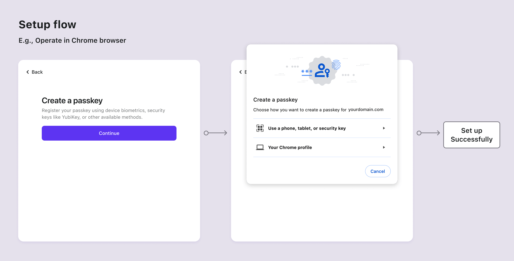

# Passkeys (WebAuthn)

[Passkey](https://auth.wiki/passkey) oferece uma alternativa mais segura e amigável aos usuários em comparação com senhas tradicionais. Ao usar criptografia de chave pública, o passkey melhora a segurança ao vincular o dispositivo do usuário, o domínio do serviço e o ID do usuário, efetivamente combatendo ataques de phishing e senhas. Compatível com vários dispositivos ou navegadores, permite que os usuários utilizem biometria e recursos de segurança de hardware para uma autenticação conveniente. [WebAuthn](https://auth.wiki/webauthn) fornece a API para permitir que sites implementem passkey.

O Logto agora suporta passkey (Webauthn) para Autenticação Multifatorial (MFA). O recurso de login com passkey estará disponível em breve. Fique atento para atualizações.

## Conceitos {#concepts}

Os clientes sempre conhecem Passkeys em vez de WebAuthn, então qual é a relação entre eles e como usá-los? Vamos explorar esses conceitos:

- **Passkeys**: Um passkey é uma credencial baseada em FIDO, resistente a phishing, para substituir senhas. Ele utiliza criptografia de chave pública assimétrica para maior segurança. Pode ser tokens de hardware ou chaves de segurança, como dispositivos USB ou Bluetooth. Como "Passkeys" é o método de autenticação exibido para os usuários, deve ser usado dentro do cliente do seu produto.
- **WebAuthn**: É uma API JavaScript desenvolvida pela W3C e FIDO Alliance, que capacita a autenticação de aplicativos web com os padrões FIDO2. Passkeys é um dos métodos de autenticação que o WebAuthn suporta. No Logto Console, nos referimos profissionalmente a essa integração como "WebAuthn".

WebAuthn fornece diversos autenticadores para os usuários escolherem, disponíveis em dois tipos para uso local e na nuvem:

- **Autenticador de plataforma (Autenticador interno)**: Está vinculado a um único e específico sistema operacional de dispositivo, como um computador, laptop, telefone ou tablet, com o qual o usuário faz login. Funciona exclusivamente no dispositivo para autorização usando métodos como biometria ou um código de acesso do dispositivo, portanto, é uma maneira rápida de autenticar. Por exemplo, iCloud Keychain verificado por Touch ID, Face ID ou código de acesso do dispositivo no macOS ou iOS; Windows Hello verificado por reconhecimento facial, impressão digital ou PIN amigável.
- **Autenticador itinerante (Autenticador externo, Autenticador multiplataforma)**: É um dispositivo ou aplicativo de software separado e portátil, como uma chave de segurança de hardware ou um smartphone. Deve conectar o dispositivo usando USB ou manter NFC ou Bluetooth ativado. O autenticador itinerante não é limitado a um único dispositivo ou navegador, proporcionando maior flexibilidade.

Para se aprofundar nos princípios e processos do WebAuthn, você pode consultar nossos posts no blog: [WebAuthn and Passkeys 101](https://blog.logto.io/web-authn-and-passkey-101/) e [Things you should know before integrating WebAuthn](https://blog.logto.io/webauthn-base-knowledge/).

## Atenção às limitações {#pay-attention-to-limitations}

É essencial estar ciente de algumas limitações ao implementar o WebAuthn:

1. **Limitação de plataforma e navegador**: É importante notar que o Logto atualmente não oferece suporte ao WebAuthn para aplicativos nativos. Além disso, a disponibilidade de autenticadores WebAuthn depende das capacidades do navegador e do dispositivo ([Verifique a lista](https://caniuse.com/?search=webauthn)). Portanto, o WebAuthn nem sempre é a única opção para implementar Autenticação Multifatorial (MFA), caso contrário, você pode controlar quais navegadores e dispositivos podem acessar seu produto.
2. **Limitação de domínio**: Alterar o domínio pode dificultar a verificação do usuário através de suas contas WebAuthn existentes. Passkeys estão vinculados ao domínio específico da página web atual e não podem ser usados em diferentes domínios.
3. **Limitação de dispositivo**: Perder o dispositivo pode resultar na perda de acesso às suas contas, especialmente para aqueles que dependem de Autenticadores de Plataforma "Este dispositivo". Para melhorar o acesso à autenticação, é aconselhável fornecer aos usuários mais de um fator de autenticação.

## Fluxos de autenticação {#authentication-flows}

A especificação Passkeys exige que os usuários cliquem ativamente no botão na página atual para iniciar o componente de autenticação. Isso significa que, tanto nos fluxos de configuração quanto de verificação, os usuários devem ser redirecionados para a página de destino para iniciar o WebAuthn.

- **Fluxos de configuração de Passkey**

- **Fluxos de verificação de Passkey**

## Recursos relacionados {#related-resources}

<Url href="https://blog.logto.io/webauthn-base-knowledge">
  Coisas que você deve saber antes de integrar o WebAuthn
</Url>

<Url href="https://blog.logto.io/web-authn-and-passkey-101">
  WebAuthn e Passkey 101
</Url>
