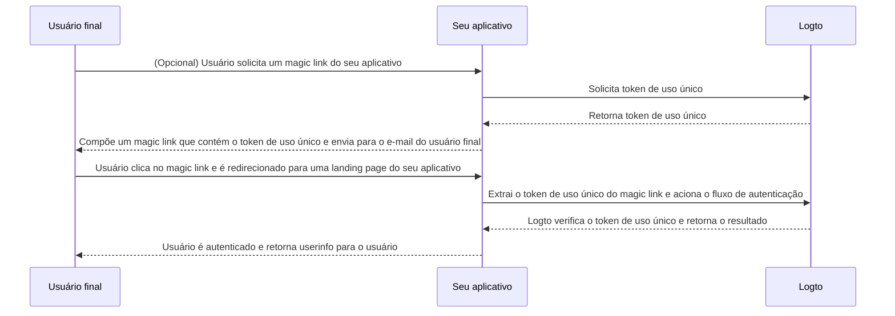

# Magic link (Token de uso único)

Semelhante à senha de uso único (OTP), um token de uso único é outro método de autenticação sem senha que pode ser usado para verificar a identidade de um usuário.
O token é válido por um período limitado de tempo e está associado a um endereço de e-mail do usuário final.

Às vezes, você pode querer convidar novos usuários para seu aplicativo / organização sem exigir que eles criem uma conta primeiro.
Ou você pode esquecer sua senha e querer fazer login / redefinir sua senha rapidamente verificando sua identidade por e-mail.
Nesses casos, o aplicativo pode enviar um "magic link" para seu e-mail. E você será autenticado imediatamente ao clicar no link.

Os desenvolvedores de aplicativos podem usar o token de uso único para compor um magic link e enviá-lo para o endereço de e-mail do usuário final.

## Casos de uso \{#use-cases}

O Logto suporta os seguintes cenários com magic links:

- **Registro apenas por convite**: Para ferramentas internas ou produtos de IA em fase de testes, você pode desabilitar o registro público e convidar usuários específicos via magic links.
- **Convite de membros da organização**: Para produtos SaaS, use magic links para convidar novos membros a ingressar em uma organização, facilitando o processo de onboarding.
- **Login / Cadastro**: Envie um magic link para login ou cadastro sem senha via e-mail.

Por exemplo, quando você desabilitou o registro público, pode enviar um magic link com um token de uso único (ex.: `https://yourapp.com/landing-page?token=YHwbXSXxQfL02IoxFqr1hGvkB13uTqcd&email=user@example.com`) para o e-mail do usuário para convidá-lo a concluir a criação da conta. Você pode personalizar o template do e-mail no seu próprio serviço de envio de e-mails, como:


Atualmente não suportado:

- Redefinição de senha com magic link.
- Uso de número de telefone ou nome de usuário como identificador.

## Fluxo do token de uso único \{#one-time-token-flow}

Aqui está o diagrama de sequência do fluxo de autenticação usando token de uso único:



## Guia de implementação \{#implementation-guide}

O Logto oferece um conjunto de Management APIs e Experience APIs para facilitar a implementação do seu magic link.

Antes de começar, certifique-se de ter uma instância Logto pronta e ter estabelecido a conexão Máquina para Máquina entre o servidor do seu aplicativo
e o endpoint Logto (necessário para as Management APIs). Saiba mais sobre a [Logto Management API](/integrate-logto/interact-with-management-api).

### Passo 1: Solicitar token de uso único \{#step-1-request-one-time-token}

Use a Logto Management API para criar um token de uso único.

```bash
POST /api/one-time-tokens
```

Exemplo de payload do corpo da requisição:

```json
{
  "email": "user@example.com",
  // Opcional. Padrão é 600 (10 minutos).
  "expiresIn": 3600,
  // Opcional. O usuário será provisionado para as organizações especificadas após a verificação bem-sucedida.
  "context": {
    "jitOrganizationIds": ["abcdefgh1234"]
  }
}
```

### Passo 2: Compor seu magic link \{#step-2-compose-your-magic-link}

Depois de obter o token de uso único, você pode compor um magic link e enviá-lo para o endereço de e-mail do usuário final.
O magic link deve conter pelo menos o token e o e-mail do usuário como parâmetros, e deve direcionar para uma landing page em seu próprio aplicativo.
Ex.: `https://yourapp.com/landing-page`.

Aqui está um exemplo simples de como o magic link pode ser:

```
https://yourapp.com/landing-page?token=YHwbXSXxQfL02IoxFqr1hGvkB13uTqcd&email=user@example.com
```

:::note

Os nomes dos parâmetros no magic link podem ser totalmente personalizados.
Você pode adicionar informações adicionais ao magic link conforme as necessidades do seu aplicativo,
bem como codificar todos os parâmetros da URL.

:::

### Passo 3: Acionar o fluxo de autenticação via Logto SDK \{#step-3-trigger-the-authentication-flow-via-logto-sdk}

Depois que o usuário final clicar no magic link e for direcionado ao seu aplicativo, você pode extrair os parâmetros `token` e `email` da URL e então chamar a função `signIn()` do Logto SDK para acionar o fluxo de autenticação.

```typescript title="TokenLandingPage.tsx"
// Exemplo em React
import { useLogto } from '@logto/react';
import { useEffect } from 'react';
import { useSearchParams } from 'react-router-dom';

const TokenLandingPage = () => {
  const { signIn } = useLogto();
  const [searchParams] = useSearchParams();

  useEffect(() => {
    // Extrai o token e o e-mail do magic link
    const oneTimeToken = searchParams.get('token');
    const email = searchParams.get('email');

    // Supondo que este seja seu redirect URI de login
    const redirectUri = 'https://yourapp.com/callback';

    if (oneTimeToken && email) {
      signIn({
        redirectUri,
        clearTokens: false, // Opcional. Veja o aviso abaixo
        extraParams: {
          'one_time_token': oneTimeToken,
          'login_hint': email,
        },
      });
    }
  }, [searchParams, signIn]);

  return <>Aguarde...</>;
};
```

:::warning

Se um usuário já estiver autenticado, ao chamar a função `signIn()` do SDK, todos os tokens em cache (Token de ID (ID token), Token de acesso (Access token) e Token de atualização (Refresh token)) serão automaticamente limpos do armazenamento do cliente,
o que resulta na perda do status de autenticação do usuário atual.

Portanto, você deve especificar um parâmetro adicional de login `clearTokens: false` para evitar a limpeza dos tokens existentes.
Se isso for especificado, você também precisará limpar manualmente os tokens na página de callback do login.

Ignore isso se seus magic links não forem destinados a usuários já autenticados.

:::

### Passo 4: (Opcional) Limpar tokens em cache na página de callback do login \{#step-4-clear-cached-tokens-in-sign-in-callback-page}

Se você especificar `clearTokens: false` na função de login, será necessário limpar manualmente os tokens na página de callback do login.

```typescript title="Callback.tsx"
// Exemplo em React
import { useHandleSignInCallback, useLogto } from '@logto/react';
import { useEffect } from 'react';

const Callback = () => {
  const { clearAllTokens } = useLogto();

  useEffect(() => {
    void clearAllTokens();
  }, [clearAllTokens]);

  useHandleSignInCallback(() => {
    // Navegue para sua página inicial
  });

  return <>Aguarde...</>;
};
```

## Perguntas frequentes \{#faqs}

<details>

<summary>

### Posso usar o magic link para convidar novos usuários para minhas organizações? \{#can-i-use-the-magic-link-to-invite-new-users-to-my-organizations}

</summary>

Sim, você pode usar o magic link para convidar novos usuários para seu aplicativo, bem como para organizações.
Se quiser convidar novos usuários para sua organização, basta especificar o `jitOrganizationIds` no corpo da requisição.

O usuário ingressará automaticamente nas organizações após a verificação bem-sucedida, e os papéis padrão da organização serão atribuídos.
Confira a seção "Provisionamento Just-in-Time" na página de detalhes da sua organização e configure os papéis padrão para suas organizações.

</details>

<details>

<summary>

### Posso atribuir papéis específicos aos usuários usando o magic link? \{#can-i-assign-users-to-specific-roles-using-the-magic-link}

</summary>

O fluxo de autenticação do magic link não suporta a atribuição de papéis aos usuários. Mas você sempre pode usar os [Webhooks](/developers/webhooks) e a [Management API](/user-management/manage-users#manage-roles-of-users) para atualizar os papéis do usuário após o registro.

</details>

<details>

<summary>

### O token de uso único expira? \{#does-the-one-time-token-expire}

</summary>

Sim, o token de uso único irá expirar após o tempo especificado em `expiresIn` (em segundos). O tempo padrão de expiração é de 10 minutos.

</details>

<details>

<summary>

### Se eu desabilitar o registro de usuários em "Experiência de login", ainda posso usar magic link para convidar usuários? \{#if-i-disable-user-registration-in-sign-in-experience-can-i-still-use-magic-link-to-invite-users}

</summary>

Sim, você ainda pode usar magic link para convidar usuários mesmo que desative o registro de usuários em "Experiência de login".

</details>

<details>

<summary>

### O que acontece se um usuário já autenticado clicar em outro magic link? \{#what-will-happen-if-a-user-already-signed-in-and-then-click-another-magic-link}

</summary>

Há vários cenários possíveis:

1. O usuário já está autenticado e clica em um magic link associado à conta do usuário atual. Nesse caso, o Logto ainda irá verificar o token de uso único e provisionar o usuário para as organizações especificadas, se necessário.
2. O usuário já está autenticado e clica em um magic link associado a uma conta diferente. Nesse caso, o Logto solicitará ao usuário que continue como a nova conta ou volte ao aplicativo com a conta atual.
   1. Se o usuário optar por continuar como a nova conta, o Logto fará a troca para a nova conta após a verificação bem-sucedida do token.
   2. Se o usuário optar por permanecer na conta atual, o Logto não verificará o token e retornará ao aplicativo com a conta atual.
3. Se seu prompt de login estiver definido como "login" ou contiver "login", o Logto fará automaticamente o login na conta associada ao token de uso único sem solicitar a troca. Isso ocorre porque o prompt "login" indica uma intenção explícita de autenticação, que tem precedência sobre a sessão atual.

</details>
